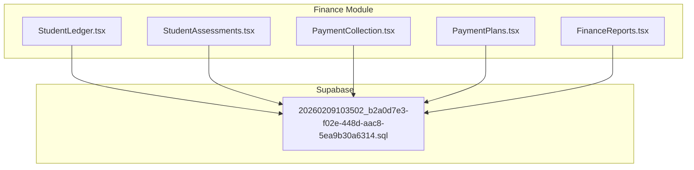
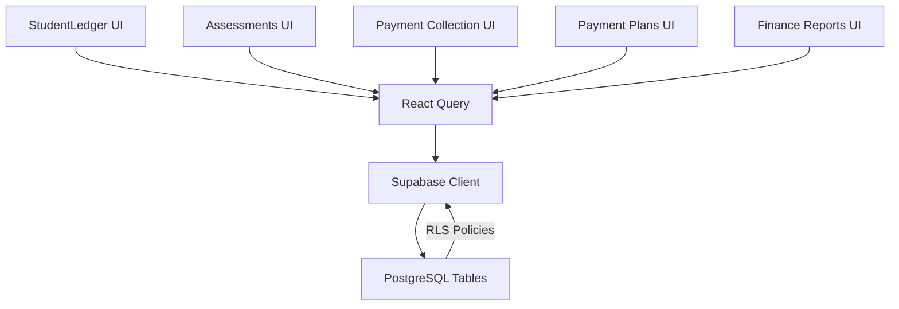
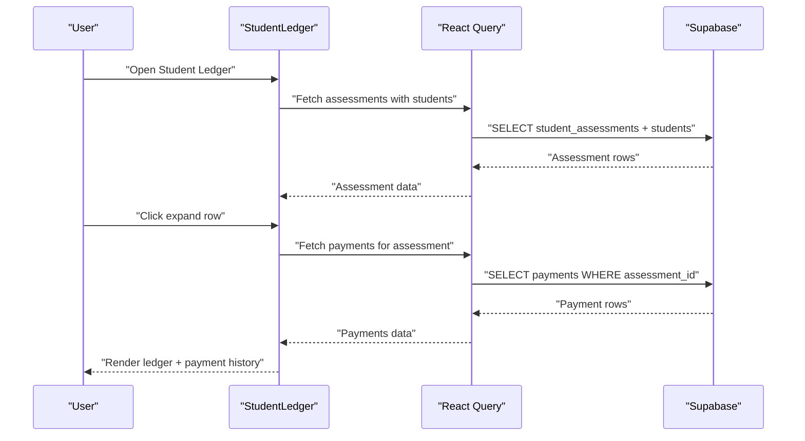
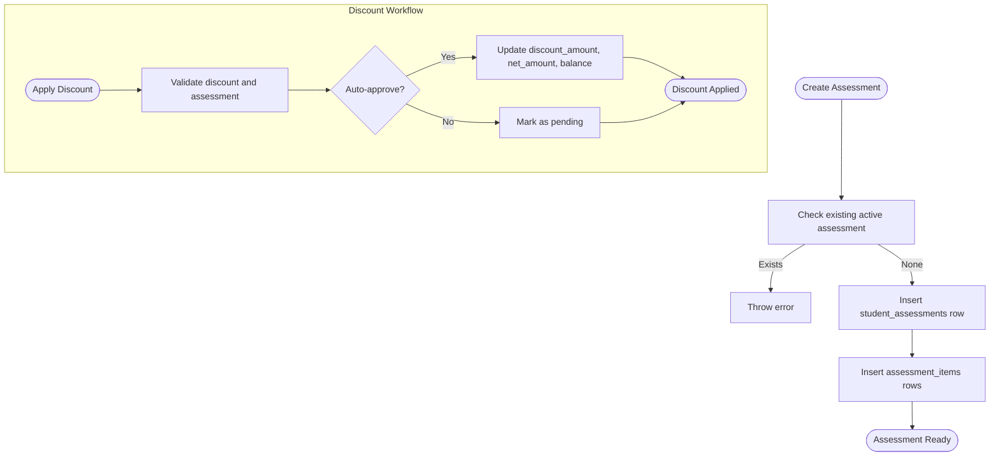
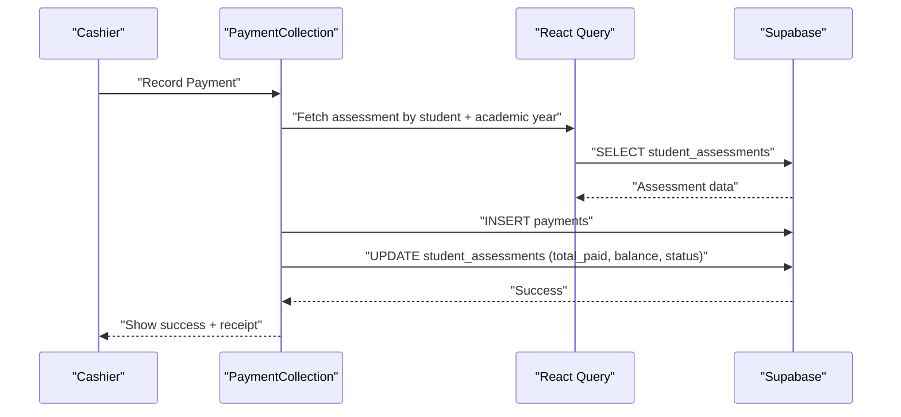
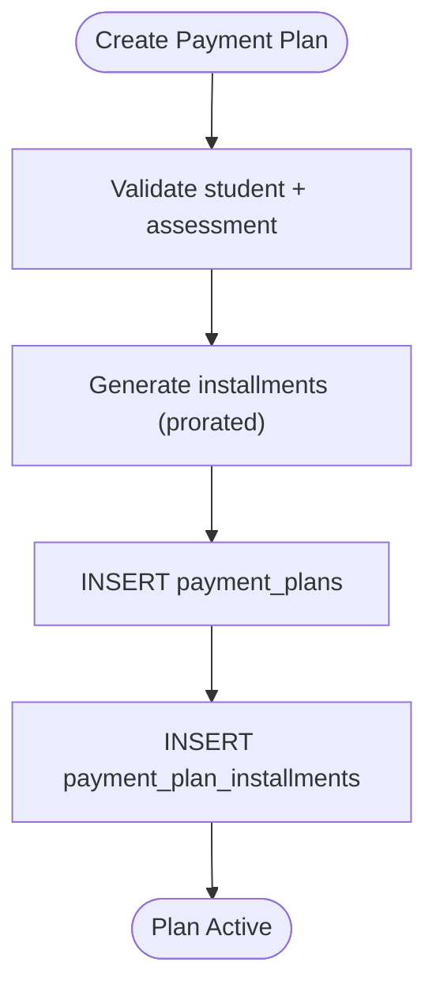
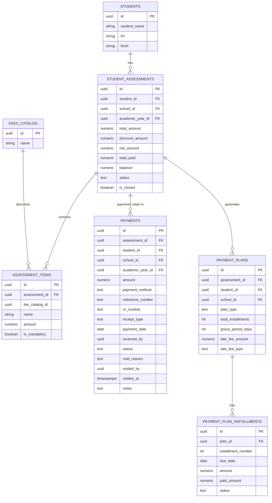

# Student Ledger Management

<cite>
**Referenced Files in This Document**
- [StudentLedger.tsx](file://src/components/finance/StudentLedger.tsx)
- [StudentAssessments.tsx](file://src/components/finance/StudentAssessments.tsx)
- [PaymentCollection.tsx](file://src/components/finance/PaymentCollection.tsx)
- [PaymentPlans.tsx](file://src/components/finance/PaymentPlans.tsx)
- [FinanceReports.tsx](file://src/components/finance/FinanceReports.tsx)
- [20260209103502_b2a0d7e3-f02e-448d-aac8-5ea9b30a6314.sql](file://supabase/migrations/20260209103502_b2a0d7e3-f02e-448d-aac8-5ea9b30a6314.sql)
</cite>

## Table of Contents
1. [Introduction](#introduction)
2. [Project Structure](#project-structure)
3. [Core Components](#core-components)
4. [Architecture Overview](#architecture-overview)
5. [Detailed Component Analysis](#detailed-component-analysis)
6. [Dependency Analysis](#dependency-analysis)
7. [Performance Considerations](#performance-considerations)
8. [Troubleshooting Guide](#troubleshooting-guide)
9. [Conclusion](#conclusion)

## Introduction
This document explains the student ledger management system in the st.francis-portal application. It covers how individual student financial records are maintained, how transactions are tracked, and how balances are calculated and updated. It also documents ledger entry creation, adjustments, discount application, payment collection, installment plans, and financial reporting. The goal is to provide both technical depth for developers and practical understanding for finance staff.

## Project Structure
The student ledger system is implemented primarily in the Finance module under `src/components/finance`. It integrates with Supabase for data persistence and uses React Query for efficient data fetching and caching. The database schema is defined in Supabase migrations.

**Diagram sources**
- [StudentLedger.tsx](file://src/components/finance/StudentLedger.tsx#L1-L193)
- [StudentAssessments.tsx](file://src/components/finance/StudentAssessments.tsx#L1-L450)
- [PaymentCollection.tsx](file://src/components/finance/PaymentCollection.tsx#L1-L854)
- [PaymentPlans.tsx](file://src/components/finance/PaymentPlans.tsx#L1-L444)
- [FinanceReports.tsx](file://src/components/finance/FinanceReports.tsx#L1-L322)
- [20260209103502_b2a0d7e3-f02e-448d-aac8-5ea9b30a6314.sql](file://supabase/migrations/20260209103502_b2a0d7e3-f02e-448d-aac8-5ea9b30a6314.sql#L104-L160)

**Section sources**
- [StudentLedger.tsx](file://src/components/finance/StudentLedger.tsx#L1-L193)
- [StudentAssessments.tsx](file://src/components/finance/StudentAssessments.tsx#L1-L450)
- [PaymentCollection.tsx](file://src/components/finance/PaymentCollection.tsx#L1-L854)
- [PaymentPlans.tsx](file://src/components/finance/PaymentPlans.tsx#L1-L444)
- [FinanceReports.tsx](file://src/components/finance/FinanceReports.tsx#L1-L322)
- [20260209103502_b2a0d7e3-f02e-448d-aac8-5ea9b30a6314.sql](file://supabase/migrations/20260209103502_b2a0d7e3-f02e-448d-aac8-5ea9b30a6314.sql#L104-L160)

## Core Components
- Student Ledger: Displays aggregated student accounts with balances and expands to show payment history.
- Student Assessments: Creates fee assessments per student and manages discounts.
- Payment Collection: Records cash and bank payments, generates receipts, and handles edits/deletes.
- Payment Plans: Creates structured installment plans with due dates and late fees.
- Finance Reports: Provides analytics and charts for collections, outstanding balances, and trends.

**Section sources**
- [StudentLedger.tsx](file://src/components/finance/StudentLedger.tsx#L90-L193)
- [StudentAssessments.tsx](file://src/components/finance/StudentAssessments.tsx#L26-L450)
- [PaymentCollection.tsx](file://src/components/finance/PaymentCollection.tsx#L133-L854)
- [PaymentPlans.tsx](file://src/components/finance/PaymentPlans.tsx#L48-L444)
- [FinanceReports.tsx](file://src/components/finance/FinanceReports.tsx#L15-L322)

## Architecture Overview
The system follows a layered architecture:
- UI Layer: Finance components render views and forms.
- Data Access Layer: Supabase client queries and mutations.
- Business Logic: Mutations orchestrate multi-table updates (assessments, payments, plans).
- Security: Row-level security policies restrict access by role and ownership.

**Diagram sources**
- [StudentLedger.tsx](file://src/components/finance/StudentLedger.tsx#L16-L113)
- [StudentAssessments.tsx](file://src/components/finance/StudentAssessments.tsx#L50-L171)
- [PaymentCollection.tsx](file://src/components/finance/PaymentCollection.tsx#L234-L465)
- [PaymentPlans.tsx](file://src/components/finance/PaymentPlans.tsx#L151-L192)
- [FinanceReports.tsx](file://src/components/finance/FinanceReports.tsx#L26-L122)
- [20260209103502_b2a0d7e3-f02e-448d-aac8-5ea9b30a6314.sql](file://supabase/migrations/20260209103502_b2a0d7e3-f02e-448d-aac8-5ea9b30a6314.sql#L104-L160)

## Detailed Component Analysis

### Student Ledger
The Student Ledger displays a summary of each student’s financial position and allows expanding rows to view payment history.

Key behaviors:
- Loads student assessments joined with student details.
- Filters by name/LRN via local filtering.
- Supports row expansion to lazy-load payment history for a given assessment.
- Shows computed fields: total charges, discounts, total paid, balance, and status.

**Diagram sources**
- [StudentLedger.tsx](file://src/components/finance/StudentLedger.tsx#L96-L127)
- [StudentLedger.tsx](file://src/components/finance/StudentLedger.tsx#L16-L88)

**Section sources**
- [StudentLedger.tsx](file://src/components/finance/StudentLedger.tsx#L90-L193)

### Student Assessments
Creates fee assessments linked to fee templates and manages discounts.

Key behaviors:
- Validates no active assessment exists for the same student and academic year.
- Inserts assessment header and child items from the selected template.
- Applies discounts with auto-approval or pending approval depending on discount settings.
- Updates assessment totals and status after discount application.

**Diagram sources**
- [StudentAssessments.tsx](file://src/components/finance/StudentAssessments.tsx#L123-L171)
- [StudentAssessments.tsx](file://src/components/finance/StudentAssessments.tsx#L173-L220)

**Section sources**
- [StudentAssessments.tsx](file://src/components/finance/StudentAssessments.tsx#L26-L450)

### Payment Collection
Records payments, generates receipts, and supports editing/deleting payments while preserving audit trails.

Key behaviors:
- Generates official receipt numbers based on finance settings.
- Updates assessment totals and status upon payment recording.
- Edits void the original payment and re-record with corrections.
- Deletes void the payment and reverses amounts from the assessment.
- Prints receipts with current balance and total paid context.

**Diagram sources**
- [PaymentCollection.tsx](file://src/components/finance/PaymentCollection.tsx#L234-L291)
- [PaymentCollection.tsx](file://src/components/finance/PaymentCollection.tsx#L53-L131)

**Section sources**
- [PaymentCollection.tsx](file://src/components/finance/PaymentCollection.tsx#L133-L854)

### Payment Plans
Creates structured installment plans with configurable plan types, grace periods, and late fees.

Key behaviors:
- Generates installments with proration to ensure total equals remaining balance.
- Stores plan metadata and individual installments.
- Allows viewing plan details and statuses.

**Diagram sources**
- [PaymentPlans.tsx](file://src/components/finance/PaymentPlans.tsx#L151-L192)
- [PaymentPlans.tsx](file://src/components/finance/PaymentPlans.tsx#L24-L46)

**Section sources**
- [PaymentPlans.tsx](file://src/components/finance/PaymentPlans.tsx#L48-L444)

### Finance Reports
Provides financial analytics including collections, outstanding balances, and trends.

Key behaviors:
- Aggregates data from payments and assessments.
- Computes summary metrics and builds charts for:
  - Daily collections trend
  - Cumulative collections
  - Collections by payment method
  - Assessment status distribution
  - Collections vs assessed by grade level
  - Payment status distribution

**Section sources**
- [FinanceReports.tsx](file://src/components/finance/FinanceReports.tsx#L15-L322)

## Dependency Analysis
The components depend on Supabase tables and RLS policies. The core tables involved in ledger management are:

**Diagram sources**
- [20260209103502_b2a0d7e3-f02e-448d-aac8-5ea9b30a6314.sql](file://supabase/migrations/20260209103502_b2a0d7e3-f02e-448d-aac8-5ea9b30a6314.sql#L104-L160)

**Section sources**
- [20260209103502_b2a0d7e3-f02e-448d-aac8-5ea9b30a6314.sql](file://supabase/migrations/20260209103502_b2a0d7e3-f02e-448d-aac8-5ea9b30a6314.sql#L104-L160)

## Performance Considerations
- Use of React Query with targeted query keys ensures efficient caching and avoids redundant network requests.
- Local filtering in components like Student Ledger reduces server load for small datasets.
- Lazy loading of payment history prevents heavy queries until needed.
- Batched queries in reports reduce round-trips to the database.

## Troubleshooting Guide
Common issues and resolutions:
- Duplicate active assessment: Creation fails if a student already has an active assessment for the current academic year. Resolve by closing the existing assessment or selecting a different year.
- Payment edits/deletes require finance/admin privileges: Ensure the user has the appropriate role; otherwise, operations will fail.
- Non-cash payments require reference numbers: Validation enforces reference numbers for non-cash methods.
- Receipt generation depends on current assessment data: If school/year IDs are missing, balance calculations may be incomplete.

**Section sources**
- [StudentAssessments.tsx](file://src/components/finance/StudentAssessments.tsx#L129-L133)
- [PaymentCollection.tsx](file://src/components/finance/PaymentCollection.tsx#L240-L242)
- [PaymentCollection.tsx](file://src/components/finance/PaymentCollection.tsx#L306-L317)
- [PaymentCollection.tsx](file://src/components/finance/PaymentCollection.tsx#L53-L82)

## Conclusion
The student ledger management system provides a robust foundation for tracking student financial records, managing assessments and discounts, collecting payments, and generating financial reports. Its modular design, strong RLS policies, and clear workflows support both operational efficiency and compliance.