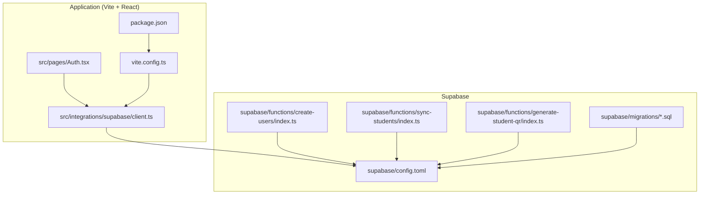
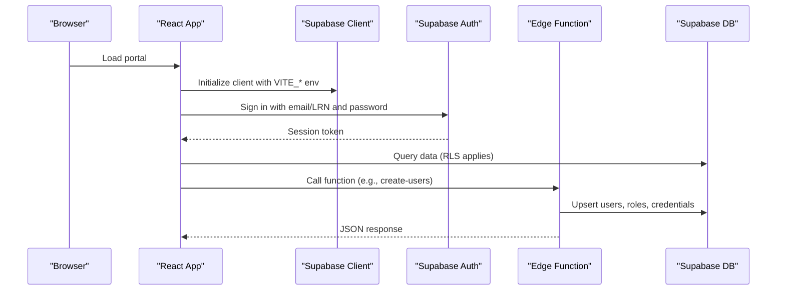
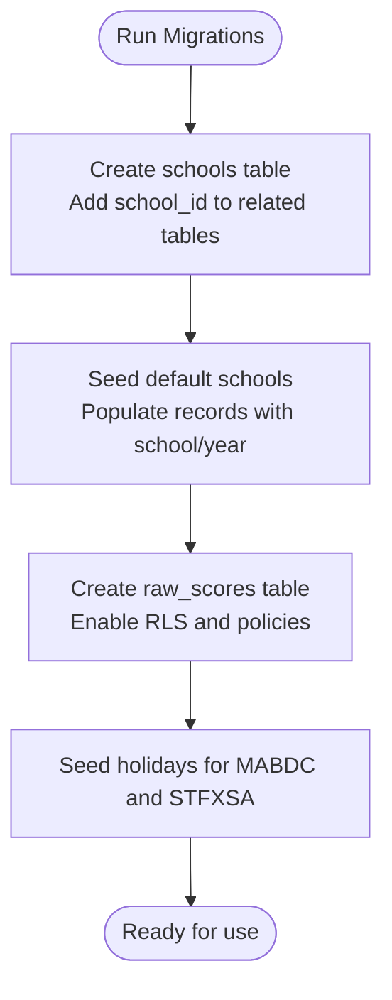
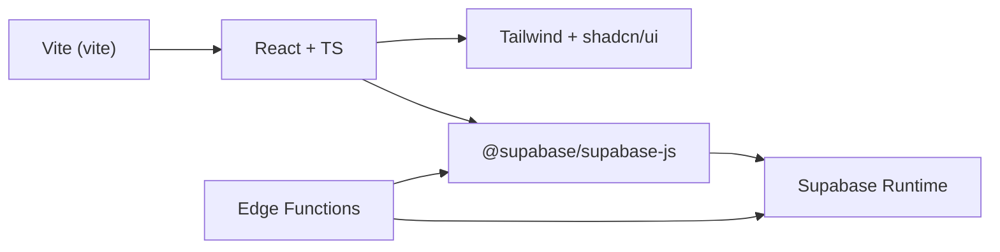

# Getting Started

<cite>
**Referenced Files in This Document**
- [README.md](file://README.md)
- [package.json](file://package.json)
- [.env.example](file://.env.example)
- [vite.config.ts](file://vite.config.ts)
- [supabase/config.toml](file://supabase/config.toml)
- [supabase/functions/create-users/index.ts](file://supabase/functions/create-users/index.ts)
- [supabase/functions/sync-students/index.ts](file://supabase/functions/sync-students/index.ts)
- [supabase/functions/generate-student-qr/index.ts](file://supabase/functions/generate-student-qr/index.ts)
- [supabase/migrations/20260205040000_school_year_segregation.sql](file://supabase/migrations/20260205040000_school_year_segregation.sql)
- [supabase/migrations/20260205000000_seed_holidays.sql](file://supabase/migrations/20260205000000_seed_holidays.sql)
- [supabase/migrations/20260205025900_create_raw_scores.sql](file://supabase/migrations/20260205025900_create_raw_scores.sql)
- [src/integrations/supabase/client.ts](file://src/integrations/supabase/client.ts)
- [src/pages/Auth.tsx](file://src/pages/Auth.tsx)
- [tailwind.config.ts](file://tailwind.config.ts)
- [components.json](file://components.json)
</cite>

## Table of Contents
1. [Introduction](#introduction)
2. [Project Structure](#project-structure)
3. [Core Components](#core-components)
4. [Architecture Overview](#architecture-overview)
5. [Detailed Component Analysis](#detailed-component-analysis)
6. [Dependency Analysis](#dependency-analysis)
7. [Performance Considerations](#performance-considerations)
8. [Troubleshooting Guide](#troubleshooting-guide)
9. [Conclusion](#conclusion)
10. [Appendices](#appendices)

## Introduction
Welcome to the St. Francis Portal. This guide helps you install, configure, and run the application locally, integrate with Supabase, and prepare for deployment on Lovable. It covers prerequisites, environment setup, development server startup, build configuration, deployment options, and troubleshooting.

## Project Structure
The project is a Vite + React + TypeScript application with Supabase for authentication and data, and a set of Edge Functions under Supabase for specialized tasks. The Supabase project is configured separately and includes migrations for database initialization and edge functions for user and data synchronization.

**Diagram sources**
- [src/integrations/supabase/client.ts](file://src/integrations/supabase/client.ts#L1-L17)
- [src/pages/Auth.tsx](file://src/pages/Auth.tsx#L1-L243)
- [vite.config.ts](file://vite.config.ts#L1-L87)
- [package.json](file://package.json#L1-L106)
- [supabase/config.toml](file://supabase/config.toml#L1-L1)
- [supabase/functions/create-users/index.ts](file://supabase/functions/create-users/index.ts#L1-L545)
- [supabase/functions/sync-students/index.ts](file://supabase/functions/sync-students/index.ts#L1-L167)
- [supabase/functions/generate-student-qr/index.ts](file://supabase/functions/generate-student-qr/index.ts#L1-L100)
- [supabase/migrations/20260205040000_school_year_segregation.sql](file://supabase/migrations/20260205040000_school_year_segregation.sql#L1-L264)

**Section sources**
- [README.md](file://README.md#L1-L76)
- [package.json](file://package.json#L1-L106)
- [vite.config.ts](file://vite.config.ts#L1-L87)
- [supabase/config.toml](file://supabase/config.toml#L1-L1)

## Core Components
- Application build and dev server: Vite with React and TypeScript, configured for local development and PWA support.
- Supabase integration: Client initialized with Vite environment variables for Supabase project keys.
- Edge Functions: User provisioning, student sync, and QR generation.
- Database migrations: School segregation, raw scores, and holiday seeds.

**Section sources**
- [package.json](file://package.json#L6-L11)
- [vite.config.ts](file://vite.config.ts#L7-L86)
- [src/integrations/supabase/client.ts](file://src/integrations/supabase/client.ts#L1-L17)
- [supabase/functions/create-users/index.ts](file://supabase/functions/create-users/index.ts#L1-L545)
- [supabase/functions/sync-students/index.ts](file://supabase/functions/sync-students/index.ts#L1-L167)
- [supabase/functions/generate-student-qr/index.ts](file://supabase/functions/generate-student-qr/index.ts#L1-L100)
- [supabase/migrations/20260205040000_school_year_segregation.sql](file://supabase/migrations/20260205040000_school_year_segregation.sql#L1-L264)
- [supabase/migrations/20260205000000_seed_holidays.sql](file://supabase/migrations/20260205000000_seed_holidays.sql#L1-L37)
- [supabase/migrations/20260205025900_create_raw_scores.sql](file://supabase/migrations/20260205025900_create_raw_scores.sql#L1-L48)

## Architecture Overview
The portal runs in a browser environment and communicates with Supabase for authentication and data. Edge Functions provide backend capabilities for user provisioning, student synchronization, and QR generation. The Supabase project is configured independently and includes database migrations to establish the schema and initial data.

**Diagram sources**
- [src/integrations/supabase/client.ts](file://src/integrations/supabase/client.ts#L1-L17)
- [src/pages/Auth.tsx](file://src/pages/Auth.tsx#L53-L100)
- [supabase/functions/create-users/index.ts](file://supabase/functions/create-users/index.ts#L57-L156)
- [supabase/migrations/20260205040000_school_year_segregation.sql](file://supabase/migrations/20260205040000_school_year_segregation.sql#L76-L171)

## Detailed Component Analysis

### Prerequisites and Installation
- Node.js and npm are required. Use a Node version manager if needed.
- Clone the repository and install dependencies.
- Start the development server.

Step-by-step:
1. Clone the repository using the project’s Git URL.
2. Change into the project directory.
3. Install dependencies.
4. Start the development server.

Notes:
- The repository supports working locally or via GitHub Codespaces.
- Lovable provides an integrated editing environment and deployment pipeline.

**Section sources**
- [README.md](file://README.md#L23-L53)
- [README.md](file://README.md#L65-L76)

### Environment Configuration (.env.example)
- Copy the provided example to a local environment file and fill in your Supabase project credentials.
- The application reads Vite environment variables for Supabase configuration.
- Vite defines fallback values when environment variables are missing, aiding local development.

What to configure:
- Supabase project ID
- Supabase publishable key
- Supabase URL

**Section sources**
- [.env.example](file://.env.example#L1-L9)
- [vite.config.ts](file://vite.config.ts#L12-L19)

### Initial Setup Procedures
- Supabase project configuration is defined in a separate configuration file.
- Database schema and initial data are applied via migrations.
- Edge Functions are deployed alongside the Supabase project.

Key setup steps:
- Configure Supabase project settings.
- Run migrations to initialize schema and seed data.
- Deploy Edge Functions for user provisioning, student sync, and QR generation.

**Section sources**
- [supabase/config.toml](file://supabase/config.toml#L1-L1)
- [supabase/migrations/20260205040000_school_year_segregation.sql](file://supabase/migrations/20260205040000_school_year_segregation.sql#L1-L264)
- [supabase/migrations/20260205000000_seed_holidays.sql](file://supabase/migrations/20260205000000_seed_holidays.sql#L1-L37)
- [supabase/migrations/20260205025900_create_raw_scores.sql](file://supabase/migrations/20260205025900_create_raw_scores.sql#L1-L48)
- [supabase/functions/create-users/index.ts](file://supabase/functions/create-users/index.ts#L1-L545)
- [supabase/functions/sync-students/index.ts](file://supabase/functions/sync-students/index.ts#L1-L167)
- [supabase/functions/generate-student-qr/index.ts](file://supabase/functions/generate-student-qr/index.ts#L1-L100)

### Development Server Startup
- The development server runs on a specific host and port.
- PWA plugin is enabled with caching strategies for performance.

Local development highlights:
- Host binding and port selection for the dev server.
- PWA manifest and caching rules.
- Aliasing for imports.

**Section sources**
- [vite.config.ts](file://vite.config.ts#L8-L11)
- [vite.config.ts](file://vite.config.ts#L20-L79)
- [vite.config.ts](file://vite.config.ts#L80-L86)

### Build Configuration
- Build scripts are defined in the project configuration.
- Preview script is available for local testing of the production build.

Build commands:
- Development: starts the dev server
- Production build: creates optimized bundles
- Preview: serves the production build locally

**Section sources**
- [package.json](file://package.json#L6-L11)

### Deployment Options
- Deploy via Lovable with a single click.
- Custom domains can be connected through project settings.

Deployment notes:
- Publishing is managed through the Lovable interface.
- Custom domain setup is documented in Lovable’s documentation.

**Section sources**
- [README.md](file://README.md#L65-L76)

### Lovable Platform Integration
- The project is designed to be edited and deployed on Lovable.
- Changes made via Lovable are committed automatically.
- The repository includes a Lovable plan definition.

Integration specifics:
- Project URL and editing modes are described in the repository.
- Lovable plan is present in the repository for orchestration.

**Section sources**
- [README.md](file://README.md#L1-L24)
- [.lovable/plan.md](file://.lovable/plan.md)

### Alternative Development Environments (GitHub Codespaces)
- You can use GitHub Codespaces to develop directly in the cloud.
- Launch a new Codespace from the repository and edit files directly.

**Section sources**
- [README.md](file://README.md#L47-L53)

### Initial Database Setup
- The Supabase project includes migrations to set up the schema and seed initial data.
- Migrations include:
  - School segregation and academic year setup
  - Raw scores table for grading
  - Holidays seeding for multiple schools

**Diagram sources**
- [supabase/migrations/20260205040000_school_year_segregation.sql](file://supabase/migrations/20260205040000_school_year_segregation.sql#L1-L264)
- [supabase/migrations/20260205025900_create_raw_scores.sql](file://supabase/migrations/20260205025900_create_raw_scores.sql#L1-L48)
- [supabase/migrations/20260205000000_seed_holidays.sql](file://supabase/migrations/20260205000000_seed_holidays.sql#L1-L37)

**Section sources**
- [supabase/migrations/20260205040000_school_year_segregation.sql](file://supabase/migrations/20260205040000_school_year_segregation.sql#L1-L264)
- [supabase/migrations/20260205025900_create_raw_scores.sql](file://supabase/migrations/20260205025900_create_raw_scores.sql#L1-L48)
- [supabase/migrations/20260205000000_seed_holidays.sql](file://supabase/migrations/20260205000000_seed_holidays.sql#L1-L37)

### Edge Function Configuration
- Edge Functions are located under the Supabase functions directory.
- Example functions include user creation, student synchronization, and QR generation.
- These functions require Supabase service role keys and enforce API key validation where applicable.

Key functions:
- User provisioning and management
- Student sync with rate limiting and API key validation
- QR generation for student accounts

**Section sources**
- [supabase/functions/create-users/index.ts](file://supabase/functions/create-users/index.ts#L1-L545)
- [supabase/functions/sync-students/index.ts](file://supabase/functions/sync-students/index.ts#L1-L167)
- [supabase/functions/generate-student-qr/index.ts](file://supabase/functions/generate-student-qr/index.ts#L1-L100)

### First-Time User Account Creation
- The application authenticates using either email or LRN.
- Authentication flow logs attempts and enforces basic lockout on repeated failures.
- Supabase client is initialized with Vite environment variables.

Authentication flow:
- Accept LRN or email input.
- Normalize LRN to an email pattern for authentication.
- Submit credentials to Supabase Auth.
- Log audit events for successful or failed attempts.

**Section sources**
- [src/pages/Auth.tsx](file://src/pages/Auth.tsx#L53-L100)
- [src/integrations/supabase/client.ts](file://src/integrations/supabase/client.ts#L1-L17)

## Dependency Analysis
The application depends on Vite for bundling, React for UI, and Supabase for authentication and data. Tailwind CSS and shadcn/ui are used for styling. Edge Functions depend on Supabase runtime and environment variables.

**Diagram sources**
- [package.json](file://package.json#L6-L11)
- [package.json](file://package.json#L13-L84)
- [tailwind.config.ts](file://tailwind.config.ts#L1-L125)
- [components.json](file://components.json#L1-L21)
- [src/integrations/supabase/client.ts](file://src/integrations/supabase/client.ts#L1-L17)

**Section sources**
- [package.json](file://package.json#L13-L84)
- [tailwind.config.ts](file://tailwind.config.ts#L1-L125)
- [components.json](file://components.json#L1-L21)
- [src/integrations/supabase/client.ts](file://src/integrations/supabase/client.ts#L1-L17)

## Performance Considerations
- PWA caching strategies are configured to improve offline readiness and reduce network usage.
- Network-first and cache-first strategies target Supabase APIs and images respectively.
- Image caching is configured with extended retention.

Recommendations:
- Monitor cache sizes and adjust limits as needed.
- Keep environment variables configured to avoid fallbacks in production.

**Section sources**
- [vite.config.ts](file://vite.config.ts#L47-L77)

## Troubleshooting Guide
Common setup issues and resolutions:
- Missing environment variables
  - Ensure the environment file is present and contains valid Supabase credentials.
  - Confirm Vite environment variables are loaded at runtime.
- Supabase connectivity
  - Verify the Supabase URL and keys.
  - Check that the Supabase project is reachable and migrations have been applied.
- Edge Function errors
  - Confirm service role keys and API keys are set in the Supabase project.
  - Review function logs for detailed error messages.
- Authentication failures
  - Validate that user accounts exist and passwords are correct.
  - Check audit logs for failed attempts and lockout behavior.

**Section sources**
- [.env.example](file://.env.example#L1-L9)
- [vite.config.ts](file://vite.config.ts#L12-L19)
- [supabase/functions/create-users/index.ts](file://supabase/functions/create-users/index.ts#L62-L126)
- [supabase/functions/sync-students/index.ts](file://supabase/functions/sync-students/index.ts#L75-L91)
- [src/pages/Auth.tsx](file://src/pages/Auth.tsx#L79-L99)

## Conclusion
You now have the essentials to install, configure, and run the St. Francis Portal locally, connect it to Supabase, and deploy it via Lovable. Use the Edge Functions for user and data operations, rely on migrations for database setup, and follow the troubleshooting tips for common issues.

## Appendices

### Appendix A: Environment Variables Reference
- VITE_SUPABASE_PROJECT_ID: Supabase project identifier
- VITE_SUPABASE_PUBLISHABLE_KEY: Supabase publishable key
- VITE_SUPABASE_URL: Supabase project URL

These variables are consumed by the Supabase client and can be overridden by environment-specific values.

**Section sources**
- [.env.example](file://.env.example#L1-L9)
- [src/integrations/supabase/client.ts](file://src/integrations/supabase/client.ts#L5-L6)