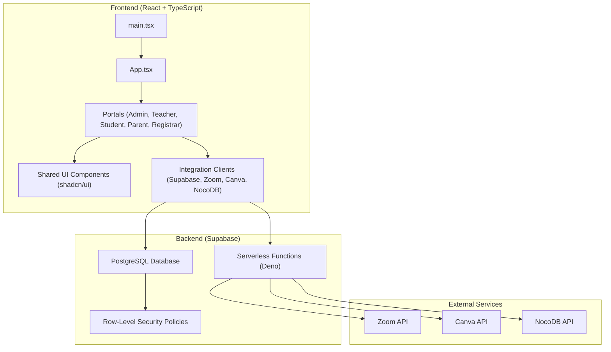
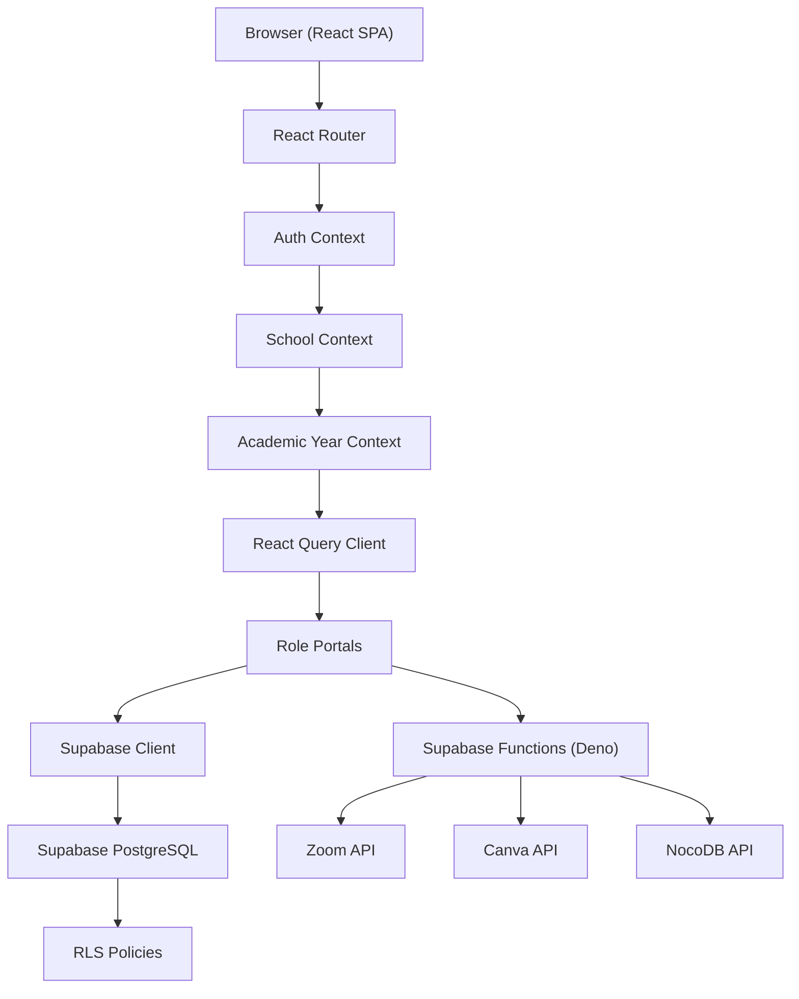
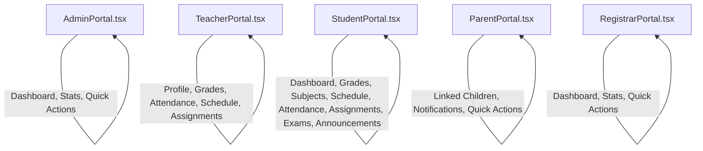
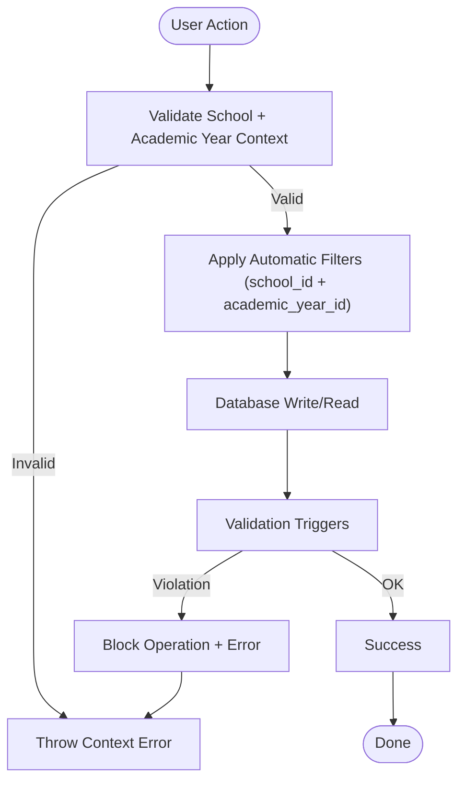
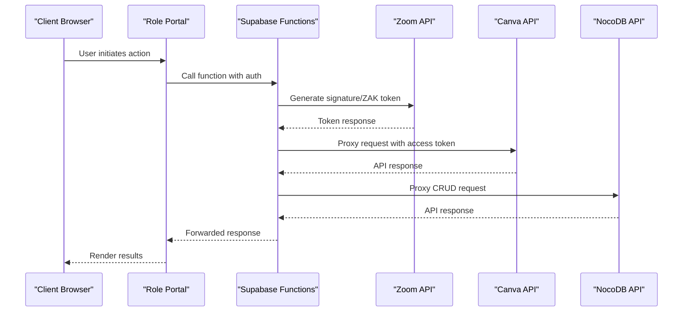
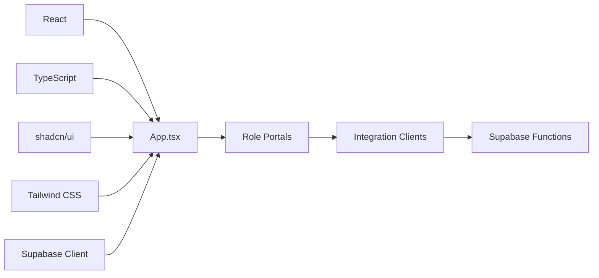

# Project Overview

<cite>
**Referenced Files in This Document**
- [README.md](file://README.md)
- [package.json](file://package.json)
- [src/App.tsx](file://src/App.tsx)
- [src/main.tsx](file://src/main.tsx)
- [docs/SCHOOL_SEGREGATION.md](file://docs/SCHOOL_SEGREGATION.md)
- [src/components/portals/index.ts](file://src/components/portals/index.ts)
- [src/components/portals/AdminPortal.tsx](file://src/components/portals/AdminPortal.tsx)
- [src/components/portals/TeacherPortal.tsx](file://src/components/portals/TeacherPortal.tsx)
- [src/components/portals/StudentPortal.tsx](file://src/components/portals/StudentPortal.tsx)
- [src/components/portals/ParentPortal.tsx](file://src/components/portals/ParentPortal.tsx)
- [src/components/portals/RegistrarPortal.tsx](file://src/components/portals/RegistrarPortal.tsx)
- [supabase/functions/canva-api/index.ts](file://supabase/functions/canva-api/index.ts)
- [supabase/functions/nocodb-proxy/index.ts](file://supabase/functions/nocodb-proxy/index.ts)
- [supabase/functions/zoom-auth/index.ts](file://supabase/functions/zoom-auth/index.ts)
- [src/integrations/supabase/types.ts](file://src/integrations/supabase/types.ts)
</cite>

## Table of Contents
1. [Introduction](#introduction)
2. [Project Structure](#project-structure)
3. [Core Components](#core-components)
4. [Architecture Overview](#architecture-overview)
5. [Detailed Component Analysis](#detailed-component-analysis)
6. [Dependency Analysis](#dependency-analysis)
7. [Performance Considerations](#performance-considerations)
8. [Troubleshooting Guide](#troubleshooting-guide)
9. [Conclusion](#conclusion)

## Introduction
St. Francis Portal is a multi-role educational management system designed to serve St. Francis Xavier School and St. Francis Xavier Smart Academy. It centralizes student lifecycle management, academic tracking, financial transactions, and institutional communications into a unified platform. The system emphasizes data segregation across schools and academic years, robust integration with external services (Zoom, Canva, NocoDB), and a modern, responsive UI powered by React, TypeScript, Supabase, shadcn/ui, and Tailwind CSS.

Mission:
- Deliver a secure, scalable, and intuitive digital ecosystem for administrators, teachers, students, parents, and finance staff.
- Automate administrative workflows while ensuring compliance with institutional standards and data privacy.

Target Users:
- Administrators: Manage users, permissions, school settings, and system-wide operations.
- Teachers: Track attendance, manage grades, assignments, and schedules.
- Students: Access personal dashboards, grades, schedules, announcements, and resources.
- Parents: Monitor children’s academic progress, attendance, and communicate with educators.
- Finance Staff: Oversee fee templates, payments, discounts, scholarships, and year-end closures.

Key Value Propositions:
- Multi-school and multi-academic-year data segregation for strict isolation and auditability.
- Integrated communication and collaboration tools (messaging, announcements, calendar).
- Seamless external integrations (Zoom meetings, Canva designs, NocoDB data).
- Role-based portals tailored to each stakeholder group with personalized dashboards.

## Project Structure
The project follows a feature-based frontend architecture with a Supabase backend and serverless functions for external integrations. The frontend is organized around portals for each role, shared UI components, and integration utilities. The Supabase directory hosts database migrations, row-level security, and serverless functions.

**Diagram sources**
- [src/App.tsx](file://src/App.tsx#L39-L84)
- [src/main.tsx](file://src/main.tsx#L1-L20)
- [src/components/portals/index.ts](file://src/components/portals/index.ts#L1-L6)
- [supabase/functions/canva-api/index.ts](file://supabase/functions/canva-api/index.ts#L1-L161)
- [supabase/functions/nocodb-proxy/index.ts](file://supabase/functions/nocodb-proxy/index.ts#L1-L72)
- [supabase/functions/zoom-auth/index.ts](file://supabase/functions/zoom-auth/index.ts#L1-L120)

**Section sources**
- [README.md](file://README.md#L55-L64)
- [package.json](file://package.json#L13-L84)
- [src/App.tsx](file://src/App.tsx#L39-L84)
- [src/main.tsx](file://src/main.tsx#L1-L20)

## Core Components
- Role-based Portals: Dedicated dashboards for administrators, teachers, students, parents, and registrars, each tailored to their workflows and responsibilities.
- Data Segregation Layer: Enforces isolation by school and academic year at database and application levels to prevent cross-contamination.
- Integration Layer: Serverless functions proxy external services (Zoom, Canva, NocoDB) with secure authentication and token management.
- Shared UI and Hooks: Reusable components and hooks for forms, charts, tables, and data fetching to maintain consistency and reduce duplication.
- Authentication and Context Providers: Centralized providers for authentication, school context, academic year context, and theme management.

**Section sources**
- [src/components/portals/AdminPortal.tsx](file://src/components/portals/AdminPortal.tsx#L1-L112)
- [src/components/portals/TeacherPortal.tsx](file://src/components/portals/TeacherPortal.tsx#L1-L250)
- [src/components/portals/StudentPortal.tsx](file://src/components/portals/StudentPortal.tsx#L1-L604)
- [src/components/portals/ParentPortal.tsx](file://src/components/portals/ParentPortal.tsx#L1-L195)
- [src/components/portals/RegistrarPortal.tsx](file://src/components/portals/RegistrarPortal.tsx#L1-L91)
- [docs/SCHOOL_SEGREGATION.md](file://docs/SCHOOL_SEGREGATION.md#L1-L260)
- [supabase/functions/canva-api/index.ts](file://supabase/functions/canva-api/index.ts#L1-L161)
- [supabase/functions/nocodb-proxy/index.ts](file://supabase/functions/nocodb-proxy/index.ts#L1-L72)
- [supabase/functions/zoom-auth/index.ts](file://supabase/functions/zoom-auth/index.ts#L1-L120)

## Architecture Overview
The system employs a client-server model with a React SPA front end and a Supabase backend. Supabase provides real-time database, authentication, storage, and serverless functions. The serverless functions act as secure proxies to external APIs (Zoom, Canva, NocoDB), handling OAuth flows, token refresh, and request forwarding. Data segregation is enforced through composite indexes, validation triggers, and application-level helpers.

**Diagram sources**
- [src/App.tsx](file://src/App.tsx#L39-L84)
- [src/main.tsx](file://src/main.tsx#L1-L20)
- [supabase/functions/zoom-auth/index.ts](file://supabase/functions/zoom-auth/index.ts#L1-L120)
- [supabase/functions/canva-api/index.ts](file://supabase/functions/canva-api/index.ts#L1-L161)
- [supabase/functions/nocodb-proxy/index.ts](file://supabase/functions/nocodb-proxy/index.ts#L1-L72)

## Detailed Component Analysis

### Role Portals
Each portal provides a focused interface aligned with the user’s responsibilities:
- Admin Portal: Overview cards, quick actions, calendar, and student overview.
- Teacher Portal: Dashboard with stats, quick actions, schedule, and management modules for grades, attendance, and assignments.
- Student Portal: Personal dashboard, grades, subjects, schedule, attendance, assignments, exams, and announcements.
- Parent Portal: Linked children overview, notifications, and quick access to grades, attendance, messaging, and fees.
- Registrar Portal: Administrative overview similar to Admin Portal with enrollment-related statistics.

**Diagram sources**
- [src/components/portals/AdminPortal.tsx](file://src/components/portals/AdminPortal.tsx#L1-L112)
- [src/components/portals/TeacherPortal.tsx](file://src/components/portals/TeacherPortal.tsx#L1-L250)
- [src/components/portals/StudentPortal.tsx](file://src/components/portals/StudentPortal.tsx#L1-L604)
- [src/components/portals/ParentPortal.tsx](file://src/components/portals/ParentPortal.tsx#L1-L195)
- [src/components/portals/RegistrarPortal.tsx](file://src/components/portals/RegistrarPortal.tsx#L1-L91)

**Section sources**
- [src/components/portals/AdminPortal.tsx](file://src/components/portals/AdminPortal.tsx#L1-L112)
- [src/components/portals/TeacherPortal.tsx](file://src/components/portals/TeacherPortal.tsx#L1-L250)
- [src/components/portals/StudentPortal.tsx](file://src/components/portals/StudentPortal.tsx#L1-L604)
- [src/components/portals/ParentPortal.tsx](file://src/components/portals/ParentPortal.tsx#L1-L195)
- [src/components/portals/RegistrarPortal.tsx](file://src/components/portals/RegistrarPortal.tsx#L1-L91)

### Data Segregation System
The system enforces strict separation of data across schools and academic years through:
- Database-level composite indexes and validation triggers to prevent cross-contamination.
- Application-level query builders and context validation to ensure automatic filtering and runtime checks.
- Comprehensive verification scripts and migration procedures to maintain integrity during upgrades.

**Diagram sources**
- [docs/SCHOOL_SEGREGATION.md](file://docs/SCHOOL_SEGREGATION.md#L32-L62)
- [docs/SCHOOL_SEGREGATION.md](file://docs/SCHOOL_SEGREGATION.md#L108-L121)

**Section sources**
- [docs/SCHOOL_SEGREGATION.md](file://docs/SCHOOL_SEGREGATION.md#L1-L260)

### External Integrations
The system integrates with Zoom, Canva, and NocoDB via secure serverless functions:
- Zoom: Generates meeting signatures and ZAK tokens for seamless classroom sessions.
- Canva: Proxies requests to Canva API with automatic token refresh and validation.
- NocoDB: Proxies CRUD operations with proper authentication and error handling.

**Diagram sources**
- [supabase/functions/zoom-auth/index.ts](file://supabase/functions/zoom-auth/index.ts#L81-L119)
- [supabase/functions/canva-api/index.ts](file://supabase/functions/canva-api/index.ts#L73-L160)
- [supabase/functions/nocodb-proxy/index.ts](file://supabase/functions/nocodb-proxy/index.ts#L9-L71)

**Section sources**
- [supabase/functions/zoom-auth/index.ts](file://supabase/functions/zoom-auth/index.ts#L1-L120)
- [supabase/functions/canva-api/index.ts](file://supabase/functions/canva-api/index.ts#L1-L161)
- [supabase/functions/nocodb-proxy/index.ts](file://supabase/functions/nocodb-proxy/index.ts#L1-L72)

### Technology Stack and Approach
- Frontend: React with TypeScript, routing via React Router, state management via React Query, and UI components from shadcn/ui styled with Tailwind CSS.
- Backend: Supabase for database, authentication, storage, and serverless functions.
- Integrations: Deno-based serverless functions for secure proxying to external services.
- Architecture: Client-driven with centralized Supabase backend and modular, reusable components.

**Section sources**
- [README.md](file://README.md#L55-L64)
- [package.json](file://package.json#L13-L84)
- [src/App.tsx](file://src/App.tsx#L39-L84)

## Dependency Analysis
The frontend depends on React, TypeScript, shadcn/ui, and Tailwind CSS for UI and styling. Supabase provides the core backend services, while serverless functions encapsulate external integrations. The portals depend on shared UI components and integration clients.

**Diagram sources**
- [package.json](file://package.json#L13-L84)
- [src/App.tsx](file://src/App.tsx#L39-L84)

**Section sources**
- [package.json](file://package.json#L13-L84)
- [src/App.tsx](file://src/App.tsx#L39-L84)

## Performance Considerations
- Use composite indexes and validation triggers to optimize query performance and enforce data integrity.
- Prefer application-level query builders to avoid manual filtering and reduce risk of cross-school/year queries.
- Implement caching and stale times via React Query to minimize redundant network calls.
- Leverage serverless functions for offloading heavy tasks and maintaining low-latency responses.

## Troubleshooting Guide
Common issues and resolutions:
- School context errors: Ensure the school and academic year are selected and validated before performing database operations.
- Data segregation violations: Verify that academic year belongs to the correct school; triggers will block mismatched inserts/updates.
- External integration failures: Check function logs for authentication errors, token expiration, or malformed requests; reconfigure environment variables if needed.
- PWA updates: Confirm service worker registration and prompt handling for updates.

**Section sources**
- [docs/SCHOOL_SEGREGATION.md](file://docs/SCHOOL_SEGREGATION.md#L225-L260)
- [supabase/functions/canva-api/index.ts](file://supabase/functions/canva-api/index.ts#L151-L160)
- [supabase/functions/nocodb-proxy/index.ts](file://supabase/functions/nocodb-proxy/index.ts#L67-L71)
- [supabase/functions/zoom-auth/index.ts](file://supabase/functions/zoom-auth/index.ts#L112-L119)
- [src/main.tsx](file://src/main.tsx#L6-L17)

## Conclusion
St. Francis Portal delivers a comprehensive, secure, and extensible educational management solution tailored to the needs of administrators, teachers, students, parents, and finance staff. Its multi-school and multi-year data segregation, integrated role portals, and robust external service integrations position it as a scalable foundation for modern school operations.