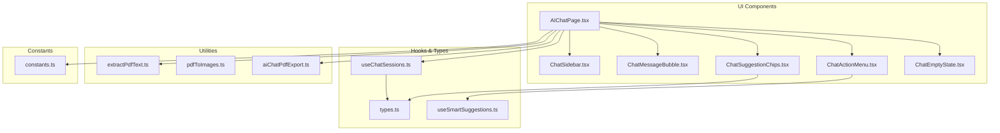
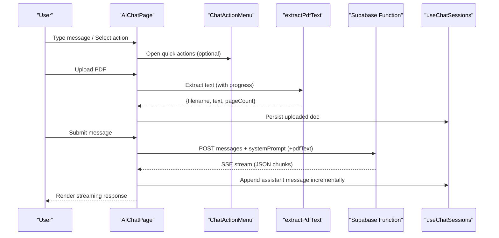
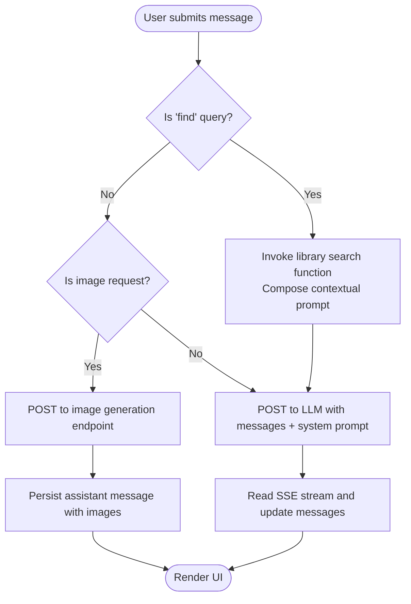
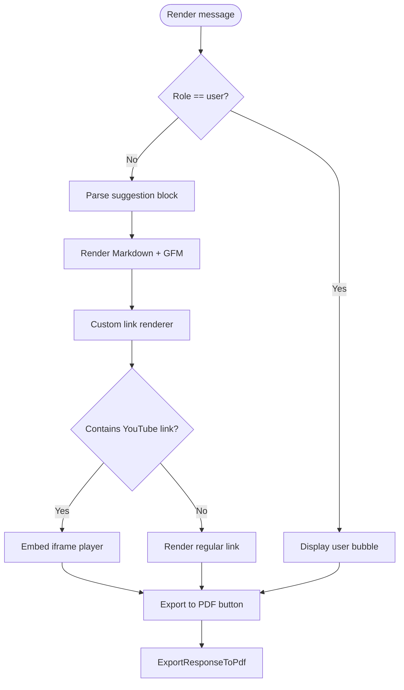
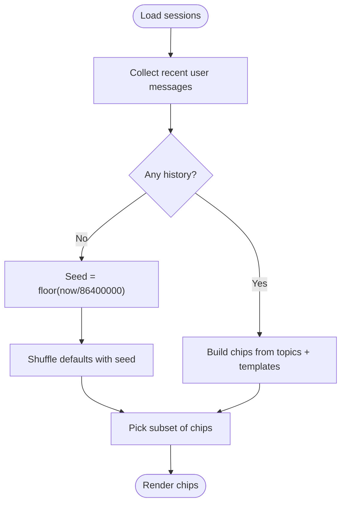
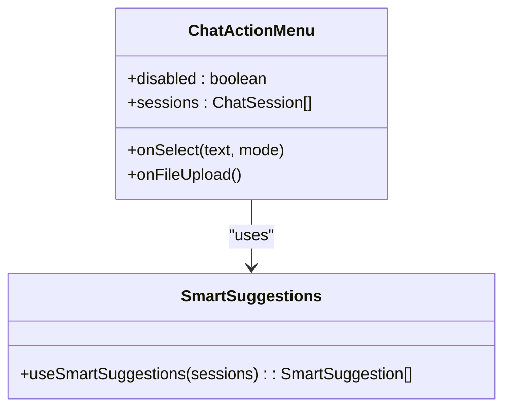
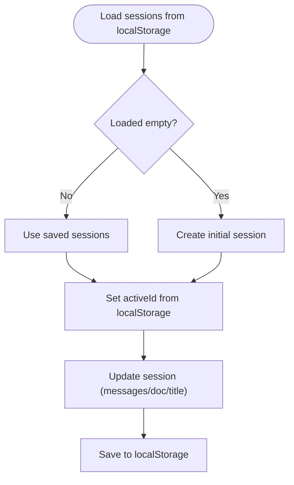
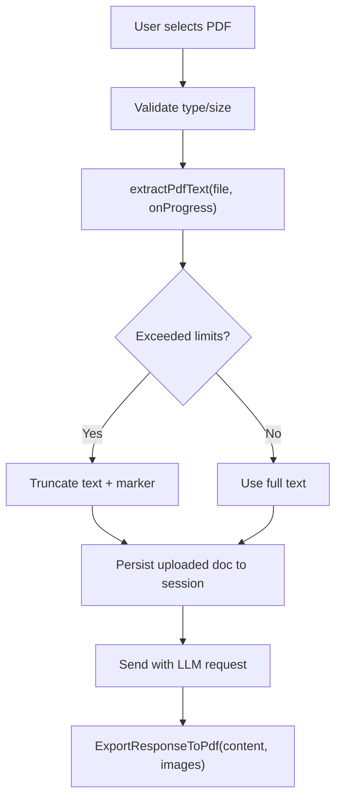
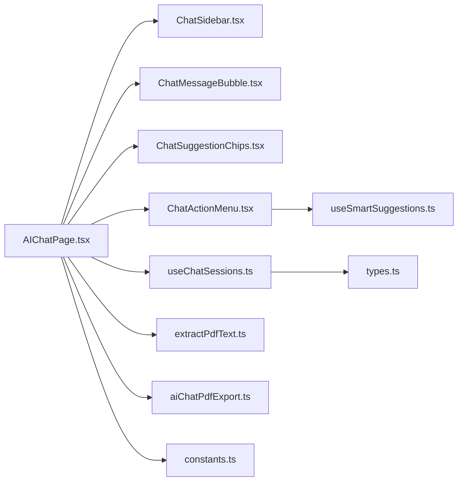

# AI Chat Interface

<cite>
**Referenced Files in This Document**
- [AIChatPage.tsx](file://src/components/aichat/AIChatPage.tsx)
- [ChatMessageBubble.tsx](file://src/components/aichat/ChatMessageBubble.tsx)
- [ChatSuggestionChips.tsx](file://src/components/aichat/ChatSuggestionChips.tsx)
- [ChatSidebar.tsx](file://src/components/aichat/ChatSidebar.tsx)
- [ChatActionMenu.tsx](file://src/components/aichat/ChatActionMenu.tsx)
- [ChatEmptyState.tsx](file://src/components/aichat/ChatEmptyState.tsx)
- [useSmartSuggestions.ts](file://src/components/aichat/useSmartSuggestions.ts)
- [types.ts](file://src/components/aichat/types.ts)
- [constants.ts](file://src/components/aichat/constants.ts)
- [useChatSessions.ts](file://src/hooks/useChatSessions.ts)
- [extractPdfText.ts](file://src/utils/extractPdfText.ts)
- [pdfToImages.ts](file://src/utils/pdfToImages.ts)
- [aiChatPdfExport.ts](file://src/utils/aiChatPdfExport.ts)
</cite>

## Table of Contents
1. [Introduction](#introduction)
2. [Project Structure](#project-structure)
3. [Core Components](#core-components)
4. [Architecture Overview](#architecture-overview)
5. [Detailed Component Analysis](#detailed-component-analysis)
6. [Dependency Analysis](#dependency-analysis)
7. [Performance Considerations](#performance-considerations)
8. [Troubleshooting Guide](#troubleshooting-guide)
9. [Conclusion](#conclusion)
10. [Appendices](#appendices)

## Introduction
This document describes the AI chat interface system, focusing on the chat UI, LLM integration, session and conversation persistence, smart suggestions, context handling, response generation, PDF attachment processing, document analysis, chat history management, user preferences, and conversation threading. It also covers integration with external AI services, rate limiting considerations, and error handling strategies.

## Project Structure
The AI chat system is organized around a main page component that orchestrates UI elements, session management, and LLM interactions. Supporting utilities handle PDF extraction, image conversion, and PDF export. Hooks manage local storage-backed chat sessions.

**Diagram sources**
- [AIChatPage.tsx](file://src/components/aichat/AIChatPage.tsx#L1-L427)
- [ChatSidebar.tsx](file://src/components/aichat/ChatSidebar.tsx#L1-L51)
- [ChatMessageBubble.tsx](file://src/components/aichat/ChatMessageBubble.tsx#L1-L138)
- [ChatSuggestionChips.tsx](file://src/components/aichat/ChatSuggestionChips.tsx#L1-L126)
- [ChatActionMenu.tsx](file://src/components/aichat/ChatActionMenu.tsx#L1-L373)
- [ChatEmptyState.tsx](file://src/components/aichat/ChatEmptyState.tsx#L1-L35)
- [useChatSessions.ts](file://src/hooks/useChatSessions.ts#L1-L132)
- [types.ts](file://src/components/aichat/types.ts#L1-L27)
- [useSmartSuggestions.ts](file://src/components/aichat/useSmartSuggestions.ts#L1-L98)
- [extractPdfText.ts](file://src/utils/extractPdfText.ts#L1-L59)
- [pdfToImages.ts](file://src/utils/pdfToImages.ts#L1-L117)
- [aiChatPdfExport.ts](file://src/utils/aiChatPdfExport.ts#L1-L482)
- [constants.ts](file://src/components/aichat/constants.ts#L1-L218)

**Section sources**
- [AIChatPage.tsx](file://src/components/aichat/AIChatPage.tsx#L1-L427)
- [useChatSessions.ts](file://src/hooks/useChatSessions.ts#L1-L132)

## Core Components
- AIChatPage: Central orchestration for chat UI, input handling, streaming responses, PDF upload, and action menu integration.
- ChatSidebar: Conversation list and controls for creating/deleting sessions.
- ChatMessageBubble: Renders user/assistant messages, Markdown, suggestions, images, and PDF export.
- ChatSuggestionChips: Quick-start suggestions derived from chat history.
- ChatActionMenu: Comprehensive action palette with smart suggestions and search/filter.
- useChatSessions: Local storage-backed session lifecycle and persistence.
- PDF utilities: Text extraction, page-to-image conversion, and PDF export.
- Constants: LLM endpoint URLs, system prompt, and request triggers.

**Section sources**
- [AIChatPage.tsx](file://src/components/aichat/AIChatPage.tsx#L1-L427)
- [ChatSidebar.tsx](file://src/components/aichat/ChatSidebar.tsx#L1-L51)
- [ChatMessageBubble.tsx](file://src/components/aichat/ChatMessageBubble.tsx#L1-L138)
- [ChatSuggestionChips.tsx](file://src/components/aichat/ChatSuggestionChips.tsx#L1-L126)
- [ChatActionMenu.tsx](file://src/components/aichat/ChatActionMenu.tsx#L1-L373)
- [useChatSessions.ts](file://src/hooks/useChatSessions.ts#L1-L132)
- [extractPdfText.ts](file://src/utils/extractPdfText.ts#L1-L59)
- [pdfToImages.ts](file://src/utils/pdfToImages.ts#L1-L117)
- [aiChatPdfExport.ts](file://src/utils/aiChatPdfExport.ts#L1-L482)
- [constants.ts](file://src/components/aichat/constants.ts#L1-L218)

## Architecture Overview
The chat UI integrates with Supabase Edge Functions for LLM and image generation. PDFs can be uploaded and processed client-side to extract text and optionally images. Responses are streamed from the server and rendered progressively. Sessions are persisted locally with metadata and messages.

**Diagram sources**
- [AIChatPage.tsx](file://src/components/aichat/AIChatPage.tsx#L68-L270)
- [ChatActionMenu.tsx](file://src/components/aichat/ChatActionMenu.tsx#L32-L373)
- [extractPdfText.ts](file://src/utils/extractPdfText.ts#L21-L58)
- [useChatSessions.ts](file://src/hooks/useChatSessions.ts#L80-L92)
- [constants.ts](file://src/components/aichat/constants.ts#L1-L3)

## Detailed Component Analysis

### AIChatPage: Chat Orchestrator
Responsibilities:
- Manages input, loading states, and abort controller for cancellations.
- Handles PDF uploads, extraction progress, and persists uploaded document to active session.
- Routes messages to either library search, image generation, or text chat.
- Streams LLM responses via SSE and updates messages incrementally.
- Integrates suggestion toggling and clears current session.

Key flows:
- PDF upload and extraction: validates file type/size, extracts text with progress, persists to session.
- Text chat: constructs messages array, sends to LLM endpoint, parses SSE stream, updates messages.
- Find request: invokes Supabase function for library search, composes contextual prompt, and delegates to text chat.
- Image generation: posts to image generation endpoint and appends assistant message with images.

**Diagram sources**
- [AIChatPage.tsx](file://src/components/aichat/AIChatPage.tsx#L122-L270)
- [constants.ts](file://src/components/aichat/constants.ts#L206-L217)

**Section sources**
- [AIChatPage.tsx](file://src/components/aichat/AIChatPage.tsx#L1-L427)
- [constants.ts](file://src/components/aichat/constants.ts#L1-L218)

### ChatMessageBubble: Rendering and Interactions
Responsibilities:
- Renders user/assistant messages with distinct styles.
- Parses and displays contextual suggestions appended by the LLM.
- Supports Markdown rendering with GitHub Flavored Markdown and custom link handling.
- Embeds YouTube videos when detected in links.
- Provides “Save as PDF” export with optional embedded images.

**Diagram sources**
- [ChatMessageBubble.tsx](file://src/components/aichat/ChatMessageBubble.tsx#L15-L137)
- [aiChatPdfExport.ts](file://src/utils/aiChatPdfExport.ts#L145-L481)

**Section sources**
- [ChatMessageBubble.tsx](file://src/components/aichat/ChatMessageBubble.tsx#L1-L138)
- [aiChatPdfExport.ts](file://src/utils/aiChatPdfExport.ts#L1-L482)

### ChatSuggestionChips: Quick-Start Suggestions
Responsibilities:
- Generates chips based on recent user messages or defaults rotated by day.
- Applies seeded shuffling to maintain stability during a session.
- Produces varied templates to encourage deeper engagement.

**Diagram sources**
- [ChatSuggestionChips.tsx](file://src/components/aichat/ChatSuggestionChips.tsx#L70-L108)

**Section sources**
- [ChatSuggestionChips.tsx](file://src/components/aichat/ChatSuggestionChips.tsx#L1-L126)

### ChatActionMenu: Action Palette and Smart Suggestions
Responsibilities:
- Presents categorized actions (Search, Create, Analyze, School Tools, etc.).
- Implements live search across categories.
- Provides smart suggestions derived from session history and time-of-day.
- Emits prefilled prompts to the composer.

**Diagram sources**
- [ChatActionMenu.tsx](file://src/components/aichat/ChatActionMenu.tsx#L32-L373)
- [useSmartSuggestions.ts](file://src/components/aichat/useSmartSuggestions.ts#L75-L97)

**Section sources**
- [ChatActionMenu.tsx](file://src/components/aichat/ChatActionMenu.tsx#L1-L373)
- [useSmartSuggestions.ts](file://src/components/aichat/useSmartSuggestions.ts#L1-L98)

### ChatSidebar: Conversation Navigation
Responsibilities:
- Lists chat sessions with titles and selection.
- Provides “New Chat” creation and per-session deletion.
- Highlights active session.

**Section sources**
- [ChatSidebar.tsx](file://src/components/aichat/ChatSidebar.tsx#L1-L51)

### ChatEmptyState: Onboarding Placeholder
Responsibilities:
- Welcomes users and highlights capabilities.
- Displays capability badges.

**Section sources**
- [ChatEmptyState.tsx](file://src/components/aichat/ChatEmptyState.tsx#L1-L35)

### Session Management and Persistence
Responsibilities:
- Maintains an array of sessions with messages, uploaded document, timestamps, and derived titles.
- Persists sessions and active session ID to local storage.
- Derives titles from first user message.
- Supports create, delete, clear, and update operations.

**Diagram sources**
- [useChatSessions.ts](file://src/hooks/useChatSessions.ts#L50-L131)

**Section sources**
- [useChatSessions.ts](file://src/hooks/useChatSessions.ts#L1-L132)
- [types.ts](file://src/components/aichat/types.ts#L1-L27)

### PDF Attachment Processing and Document Analysis
Capabilities:
- Client-side PDF text extraction with progress reporting and character/page limits.
- Optional conversion of pages to images for previews.
- Export of chat responses to PDF with rich formatting, embedded images, and table of contents.

**Diagram sources**
- [AIChatPage.tsx](file://src/components/aichat/AIChatPage.tsx#L68-L92)
- [extractPdfText.ts](file://src/utils/extractPdfText.ts#L21-L58)
- [pdfToImages.ts](file://src/utils/pdfToImages.ts#L70-L94)
- [aiChatPdfExport.ts](file://src/utils/aiChatPdfExport.ts#L145-L481)

**Section sources**
- [extractPdfText.ts](file://src/utils/extractPdfText.ts#L1-L59)
- [pdfToImages.ts](file://src/utils/pdfToImages.ts#L1-L117)
- [aiChatPdfExport.ts](file://src/utils/aiChatPdfExport.ts#L1-L482)

### Smart Suggestions System
Mechanics:
- Time-of-day influences suggestions (morning/afternoon/evening).
- Extracts topics from recent messages and applies templates.
- Randomly augments with curated “Explore” suggestions.
- Returns a stable set of 5 suggestions.

**Section sources**
- [useSmartSuggestions.ts](file://src/components/aichat/useSmartSuggestions.ts#L1-L98)
- [ChatActionMenu.tsx](file://src/components/aichat/ChatActionMenu.tsx#L35-L36)

### Context Handling and Response Generation Workflows
- System prompt defines roles, grounding rules, response format, readability, domains, capabilities, and special instructions.
- When a PDF is present, the extracted text is included with the request.
- Streaming responses are parsed from SSE data lines and appended to the message list.

**Section sources**
- [constants.ts](file://src/components/aichat/constants.ts#L4-L197)
- [AIChatPage.tsx](file://src/components/aichat/AIChatPage.tsx#L165-L244)

## Dependency Analysis
High-level dependencies among core components:

**Diagram sources**
- [AIChatPage.tsx](file://src/components/aichat/AIChatPage.tsx#L1-L427)
- [ChatSidebar.tsx](file://src/components/aichat/ChatSidebar.tsx#L1-L51)
- [ChatMessageBubble.tsx](file://src/components/aichat/ChatMessageBubble.tsx#L1-L138)
- [ChatSuggestionChips.tsx](file://src/components/aichat/ChatSuggestionChips.tsx#L1-L126)
- [ChatActionMenu.tsx](file://src/components/aichat/ChatActionMenu.tsx#L1-L373)
- [useChatSessions.ts](file://src/hooks/useChatSessions.ts#L1-L132)
- [extractPdfText.ts](file://src/utils/extractPdfText.ts#L1-L59)
- [aiChatPdfExport.ts](file://src/utils/aiChatPdfExport.ts#L1-L482)
- [useSmartSuggestions.ts](file://src/components/aichat/useSmartSuggestions.ts#L1-L98)
- [types.ts](file://src/components/aichat/types.ts#L1-L27)
- [constants.ts](file://src/components/aichat/constants.ts#L1-L218)

**Section sources**
- [AIChatPage.tsx](file://src/components/aichat/AIChatPage.tsx#L1-L427)
- [ChatActionMenu.tsx](file://src/components/aichat/ChatActionMenu.tsx#L1-L373)
- [useChatSessions.ts](file://src/hooks/useChatSessions.ts#L1-L132)

## Performance Considerations
- Streaming responses: Incremental updates reduce perceived latency and memory overhead.
- PDF extraction limits: Cap on pages and characters prevents excessive memory usage.
- Local storage persistence: Efficient batching of writes and selective updates minimize I/O.
- Image embedding: Only base64 images are embedded; large images increase PDF size.
- UI responsiveness: Debouncing and controlled re-renders via memoization and stable references.

[No sources needed since this section provides general guidance]

## Troubleshooting Guide
Common issues and mitigations:
- PDF upload errors: Validate file type and size; confirm extraction progress updates; ensure worker initialization succeeds.
- LLM response failures: Check network connectivity, endpoint availability, and error payload parsing; handle abort gracefully.
- Streaming interruptions: Verify SSE parsing loop and buffer handling; ensure abort controller is reset on session switches.
- Session persistence: Confirm local storage availability and JSON serialization; handle migration scenarios.
- Export failures: Validate PDF generation pipeline and file size thresholds; log warnings for oversized exports.

**Section sources**
- [AIChatPage.tsx](file://src/components/aichat/AIChatPage.tsx#L68-L92)
- [AIChatPage.tsx](file://src/components/aichat/AIChatPage.tsx#L165-L244)
- [extractPdfText.ts](file://src/utils/extractPdfText.ts#L21-L58)
- [aiChatPdfExport.ts](file://src/utils/aiChatPdfExport.ts#L466-L481)

## Conclusion
The AI chat interface integrates a responsive UI with robust session management, intelligent suggestions, and powerful document processing. It streams LLM responses, supports contextual PDF analysis, and enables high-quality PDF exports. The modular design and clear separation of concerns facilitate maintainability and extensibility.

[No sources needed since this section summarizes without analyzing specific files]

## Appendices

### API and Endpoint Definitions
- Chat endpoint: Notebook chat function invoked via Supabase Functions.
- Image generation endpoint: Separate function for generating images from prompts.
- Library search: Supabase Edge Function invoked from the UI for finding books.

**Section sources**
- [constants.ts](file://src/components/aichat/constants.ts#L1-L3)
- [AIChatPage.tsx](file://src/components/aichat/AIChatPage.tsx#L122-L163)

### Rate Limiting and Error Handling Strategies
- Rate limiting: Implemented at the Supabase Functions layer; clients should handle retries with exponential backoff and user feedback.
- Error handling: UI surfaces user-friendly messages for network errors, invalid responses, and timeouts; abort signals cancel in-flight requests.

**Section sources**
- [AIChatPage.tsx](file://src/components/aichat/AIChatPage.tsx#L182-L193)
- [AIChatPage.tsx](file://src/components/aichat/AIChatPage.tsx#L239-L243)