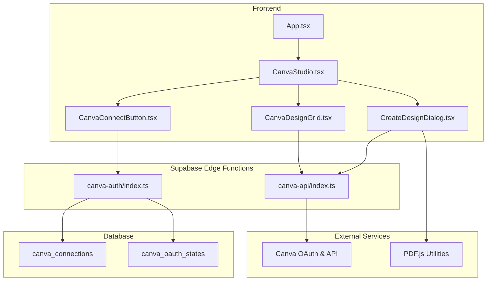
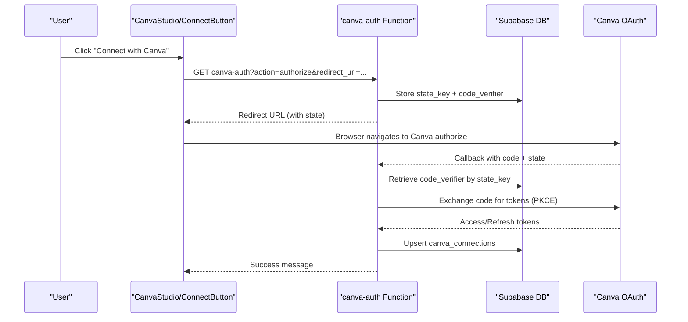
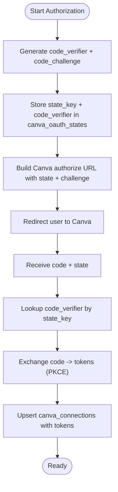
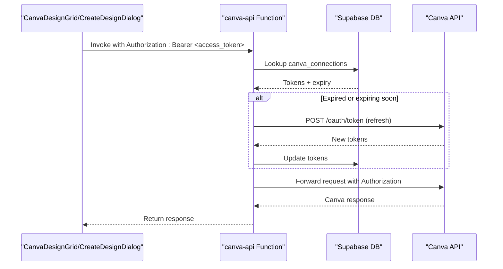
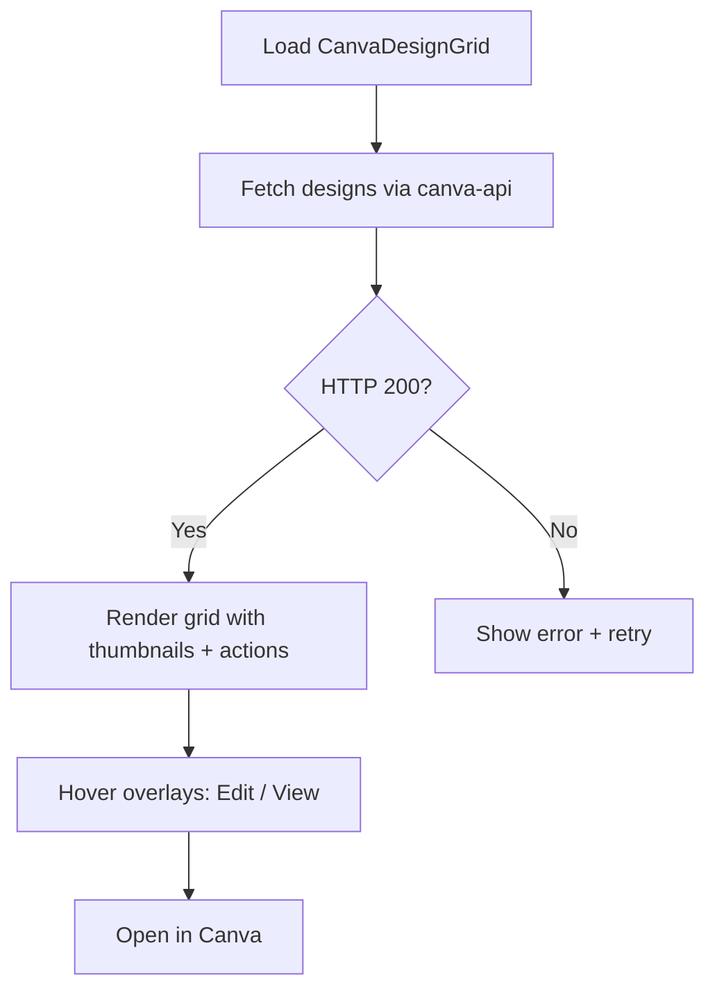
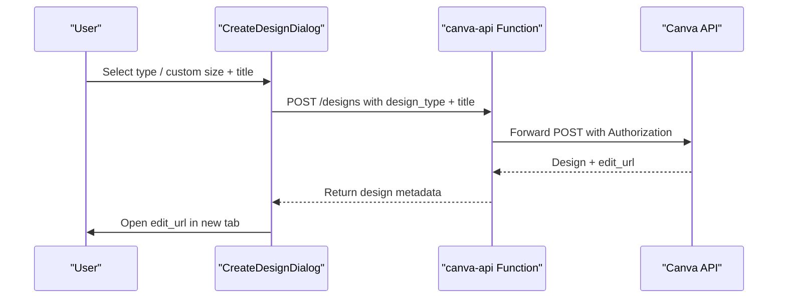
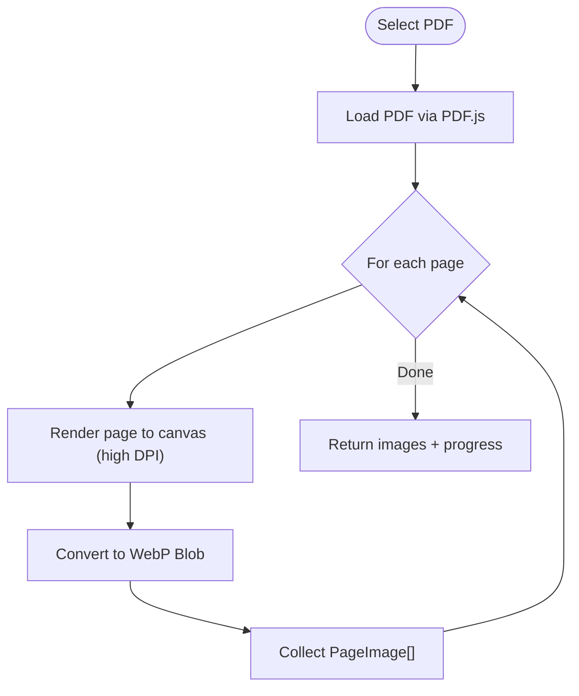
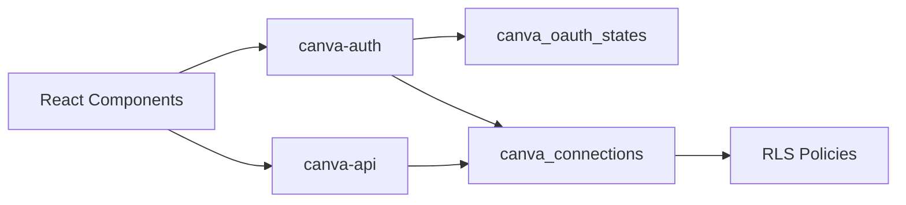
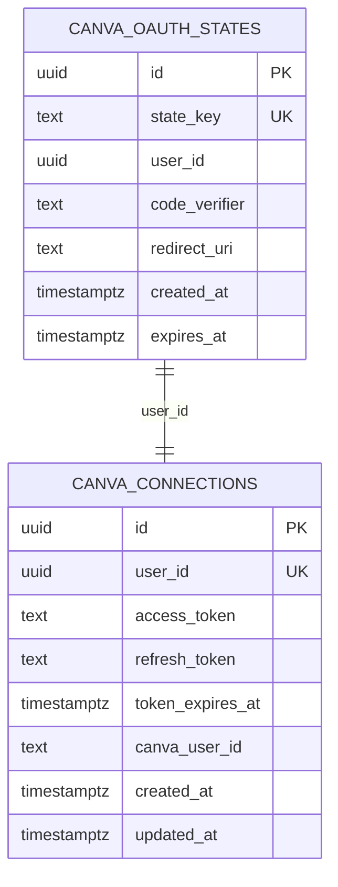

# Design Collaboration Tools

<cite>
**Referenced Files in This Document**
- [CanvaConnectButton.tsx](file://src/components/canva/CanvaConnectButton.tsx)
- [CanvaStudio.tsx](file://src/components/canva/CanvaStudio.tsx)
- [CanvaDesignGrid.tsx](file://src/components/canva/CanvaDesignGrid.tsx)
- [CreateDesignDialog.tsx](file://src/components/canva/CreateDesignDialog.tsx)
- [index.ts (canva-auth)](file://supabase/functions/canva-auth/index.ts)
- [index.ts (canva-api)](file://supabase/functions/canva-api/index.ts)
- [20260205201205_b21fa2e1-664f-4a7e-a181-62d40fa90375.sql](file://supabase/migrations/20260205201205_b21fa2e1-664f-4a7e-a181-62d40fa90375.sql)
- [20260205202544_ed9e158e-1cb5-4d45-951e-ef0001dc7cef.sql](file://supabase/migrations/20260205202544_ed9e158e-1cb5-4d45-951e-ef0001dc7cef.sql)
- [App.tsx](file://src/App.tsx)
- [pdfToImages.ts](file://src/utils/pdfToImages.ts)
- [usePdfToImages.ts](file://src/hooks/usePdfToImages.ts)
</cite>

## Table of Contents
1. [Introduction](#introduction)
2. [Project Structure](#project-structure)
3. [Core Components](#core-components)
4. [Architecture Overview](#architecture-overview)
5. [Detailed Component Analysis](#detailed-component-analysis)
6. [Dependency Analysis](#dependency-analysis)
7. [Performance Considerations](#performance-considerations)
8. [Troubleshooting Guide](#troubleshooting-guide)
9. [Conclusion](#conclusion)
10. [Appendices](#appendices)

## Introduction
This document explains the design collaboration tools centered on Canva integration and design creation workflows. It covers the end-to-end flow from connecting a Canva account via OAuth to creating and managing designs, proxying requests to the Canva API, and integrating with local PDF processing utilities for image extraction. It also outlines the design grid system, template browsing, and practical guidance for asset management, quality standards, and export formats.

## Project Structure
The design collaboration features are implemented as React components under the canva folder and backed by Supabase Edge Functions and database migrations. The frontend components integrate with Supabase client libraries to invoke serverless functions that handle OAuth and API proxying. PDF processing utilities support converting PDFs to images for previews and downstream workflows.

**Diagram sources**
- [CanvaStudio.tsx](file://src/components/canva/CanvaStudio.tsx#L1-L199)
- [CanvaConnectButton.tsx](file://src/components/canva/CanvaConnectButton.tsx#L1-L65)
- [CanvaDesignGrid.tsx](file://src/components/canva/CanvaDesignGrid.tsx#L1-L195)
- [CreateDesignDialog.tsx](file://src/components/canva/CreateDesignDialog.tsx#L1-L228)
- [index.ts (canva-auth)](file://supabase/functions/canva-auth/index.ts#L1-L336)
- [index.ts (canva-api)](file://supabase/functions/canva-api/index.ts#L1-L161)
- [20260205201205_b21fa2e1-664f-4a7e-a181-62d40fa90375.sql](file://supabase/migrations/20260205201205_b21fa2e1-664f-4a7e-a181-62d40fa90375.sql#L1-L42)
- [20260205202544_ed9e158e-1cb5-4d45-951e-ef0001dc7cef.sql](file://supabase/migrations/20260205202544_ed9e158e-1cb5-4d45-951e-ef0001dc7cef.sql#L1-L22)
- [App.tsx](file://src/App.tsx#L1-L86)

**Section sources**
- [CanvaStudio.tsx](file://src/components/canva/CanvaStudio.tsx#L1-L199)
- [CanvaConnectButton.tsx](file://src/components/canva/CanvaConnectButton.tsx#L1-L65)
- [CanvaDesignGrid.tsx](file://src/components/canva/CanvaDesignGrid.tsx#L1-L195)
- [CreateDesignDialog.tsx](file://src/components/canva/CreateDesignDialog.tsx#L1-L228)
- [index.ts (canva-auth)](file://supabase/functions/canva-auth/index.ts#L1-L336)
- [index.ts (canva-api)](file://supabase/functions/canva-api/index.ts#L1-L161)
- [20260205201205_b21fa2e1-664f-4a7e-a181-62d40fa90375.sql](file://supabase/migrations/20260205201205_b21fa2e1-664f-4a7e-a181-62d40fa90375.sql#L1-L42)
- [20260205202544_ed9e158e-1cb5-4d45-951e-ef0001dc7cef.sql](file://supabase/migrations/20260205202544_ed9e158e-1cb5-4d45-951e-ef0001dc7cef.sql#L1-L22)
- [App.tsx](file://src/App.tsx#L1-L86)

## Core Components
- CanvaStudio: Orchestrates the Canva experience, including connection status checks, disconnection, and tabs for designs and templates.
- CanvaConnectButton: Initiates the OAuth authorization flow by invoking the canva-auth function with a redirect URI.
- CanvaDesignGrid: Fetches and displays designs from the Canva API via the canva-api function, with loading, error, and empty states.
- CreateDesignDialog: Allows users to create new designs with predefined sizes or custom dimensions, then opens the design in Canva.

**Section sources**
- [CanvaStudio.tsx](file://src/components/canva/CanvaStudio.tsx#L1-L199)
- [CanvaConnectButton.tsx](file://src/components/canva/CanvaConnectButton.tsx#L1-L65)
- [CanvaDesignGrid.tsx](file://src/components/canva/CanvaDesignGrid.tsx#L1-L195)
- [CreateDesignDialog.tsx](file://src/components/canva/CreateDesignDialog.tsx#L1-L228)

## Architecture Overview
The system uses Supabase Edge Functions to mediate OAuth and API calls to Canva. The frontend authenticates via Supabase, then invokes functions to:
- Authorize with Canva using PKCE and store the code verifier securely.
- Refresh access tokens automatically when nearing expiration.
- Proxy requests to the Canva REST API with proper headers and forwarding of query parameters.

**Diagram sources**
- [CanvaConnectButton.tsx](file://src/components/canva/CanvaConnectButton.tsx#L14-L42)
- [index.ts (canva-auth)](file://supabase/functions/canva-auth/index.ts#L71-L122)
- [index.ts (canva-auth)](file://supabase/functions/canva-auth/index.ts#L124-L225)
- [20260205201205_b21fa2e1-664f-4a7e-a181-62d40fa90375.sql](file://supabase/migrations/20260205201205_b21fa2e1-664f-4a7e-a181-62d40fa90375.sql#L1-L12)
- [20260205202544_ed9e158e-1cb5-4d45-951e-ef0001dc7cef.sql](file://supabase/migrations/20260205202544_ed9e158e-1cb5-4d45-951e-ef0001dc7cef.sql#L1-L10)

## Detailed Component Analysis

### Canva Authentication Flow (OAuth with PKCE)
- Generates a secure code verifier and challenge.
- Stores the code verifier server-side in canva_oauth_states with a short expiry.
- Builds an authorization URL with scopes for design read/write and profile access.
- On callback, exchanges the authorization code for tokens using PKCE.
- Upserts tokens into canva_connections and optionally fetches the Canva user ID.

**Diagram sources**
- [index.ts (canva-auth)](file://supabase/functions/canva-auth/index.ts#L82-L122)
- [index.ts (canva-auth)](file://supabase/functions/canva-auth/index.ts#L124-L225)
- [20260205202544_ed9e158e-1cb5-4d45-951e-ef0001dc7cef.sql](file://supabase/migrations/20260205202544_ed9e158e-1cb5-4d45-951e-ef0001dc7cef.sql#L1-L10)
- [20260205201205_b21fa2e1-664f-4a7e-a181-62d40fa90375.sql](file://supabase/migrations/20260205201205_b21fa2e1-664f-4a7e-a181-62d40fa90375.sql#L1-L12)

**Section sources**
- [CanvaConnectButton.tsx](file://src/components/canva/CanvaConnectButton.tsx#L14-L42)
- [index.ts (canva-auth)](file://supabase/functions/canva-auth/index.ts#L71-L225)
- [20260205202544_ed9e158e-1cb5-4d45-951e-ef0001dc7cef.sql](file://supabase/migrations/20260205202544_ed9e158e-1cb5-4d45-951e-ef0001dc7cef.sql#L1-L22)
- [20260205201205_b21fa2e1-664f-4a7e-a181-62d40fa90375.sql](file://supabase/migrations/20260205201205_b21fa2e1-664f-4a7e-a181-62d40fa90375.sql#L1-L42)

### Canva API Proxy
- Validates the incoming Bearer token against Supabase.
- Retrieves a valid access token for the user, refreshing if needed (with a 5-minute buffer).
- Proxies requests to Canva’s REST API, forwarding headers and query parameters.
- Returns the Canva response to the client.

**Diagram sources**
- [index.ts (canva-api)](file://supabase/functions/canva-api/index.ts#L16-L71)
- [index.ts (canva-api)](file://supabase/functions/canva-api/index.ts#L73-L161)
- [20260205201205_b21fa2e1-664f-4a7e-a181-62d40fa90375.sql](file://supabase/migrations/20260205201205_b21fa2e1-664f-4a7e-a181-62d40fa90375.sql#L1-L12)

**Section sources**
- [CanvaDesignGrid.tsx](file://src/components/canva/CanvaDesignGrid.tsx#L35-L68)
- [CreateDesignDialog.tsx](file://src/components/canva/CreateDesignDialog.tsx#L67-L114)
- [index.ts (canva-api)](file://supabase/functions/canva-api/index.ts#L73-L161)

### Design Grid System and Template Management
- Design grid displays thumbnails, edit/view URLs, and last-updated dates.
- Empty state encourages creating designs in Canva.
- Templates tab links to Canva’s template categories for discovery.

**Diagram sources**
- [CanvaDesignGrid.tsx](file://src/components/canva/CanvaDesignGrid.tsx#L30-L195)

**Section sources**
- [CanvaDesignGrid.tsx](file://src/components/canva/CanvaDesignGrid.tsx#L1-L195)
- [CanvaStudio.tsx](file://src/components/canva/CanvaStudio.tsx#L166-L195)

### Design Creation Workflow
- Users choose a preset size or define custom dimensions.
- The system posts to the Canva designs endpoint via the proxy.
- On success, the design edit URL is opened in a new tab.

**Diagram sources**
- [CreateDesignDialog.tsx](file://src/components/canva/CreateDesignDialog.tsx#L36-L114)
- [index.ts (canva-api)](file://supabase/functions/canva-api/index.ts#L107-L139)

**Section sources**
- [CreateDesignDialog.tsx](file://src/components/canva/CreateDesignDialog.tsx#L1-L228)
- [index.ts (canva-api)](file://supabase/functions/canva-api/index.ts#L107-L139)

### PDF Conversion Capabilities
While not part of the Canva integration, the portal includes utilities to convert PDFs to images for previews and analysis:
- Extract all pages as WebP blobs with progress callbacks.
- Render the first page for quick preview and AI analysis.

**Diagram sources**
- [pdfToImages.ts](file://src/utils/pdfToImages.ts#L70-L94)
- [usePdfToImages.ts](file://src/hooks/usePdfToImages.ts#L50-L92)

**Section sources**
- [pdfToImages.ts](file://src/utils/pdfToImages.ts#L1-L99)
- [usePdfToImages.ts](file://src/hooks/usePdfToImages.ts#L44-L96)

## Dependency Analysis
- Frontend components depend on Supabase client libraries to invoke Edge Functions.
- canva-auth depends on Supabase for secure storage of OAuth state and tokens.
- canva-api depends on canva_connections to validate and refresh tokens.
- Database tables enforce row-level security and restrict access to user-specific records.

**Diagram sources**
- [index.ts (canva-auth)](file://supabase/functions/canva-auth/index.ts#L1-L336)
- [index.ts (canva-api)](file://supabase/functions/canva-api/index.ts#L1-L161)
- [20260205201205_b21fa2e1-664f-4a7e-a181-62d40fa90375.sql](file://supabase/migrations/20260205201205_b21fa2e1-664f-4a7e-a181-62d40fa90375.sql#L1-L42)
- [20260205202544_ed9e158e-1cb5-4d45-951e-ef0001dc7cef.sql](file://supabase/migrations/20260205202544_ed9e158e-1cb5-4d45-951e-ef0001dc7cef.sql#L1-L22)

**Section sources**
- [index.ts (canva-auth)](file://supabase/functions/canva-auth/index.ts#L1-L336)
- [index.ts (canva-api)](file://supabase/functions/canva-api/index.ts#L1-L161)
- [20260205201205_b21fa2e1-664f-4a7e-a181-62d40fa90375.sql](file://supabase/migrations/20260205201205_b21fa2e1-664f-4a7e-a181-62d40fa90375.sql#L1-L42)
- [20260205202544_ed9e158e-1cb5-4d45-951e-ef0001dc7cef.sql](file://supabase/migrations/20260205202544_ed9e158e-1cb5-4d45-951e-ef0001dc7cef.sql#L1-L22)

## Performance Considerations
- Token refresh is triggered proactively when nearing expiration to minimize latency.
- Image extraction uses a high DPI canvas for crisp previews; consider limiting maxPages for very large PDFs.
- Grid rendering uses skeleton loaders to improve perceived performance while fetching designs.

## Troubleshooting Guide
Common issues and resolutions:
- Not configured: If Canva credentials are missing, the authorization step returns a configuration error. Set the required environment variables for the canva-auth function.
- Authentication required: Both canva-auth and canva-api require a valid Bearer token; ensure the user is logged in.
- Token expired: The proxy automatically refreshes tokens; if refresh fails, prompt the user to reconnect.
- Write permissions: Creating designs requires write scope; if a 403 occurs, instruct the user to disconnect and reconnect to grant appropriate scopes.
- OAuth state expired: The state is single-use and expires quickly; retry the authorization flow.

**Section sources**
- [index.ts (canva-auth)](file://supabase/functions/canva-auth/index.ts#L51-L53)
- [index.ts (canva-auth)](file://supabase/functions/canva-auth/index.ts#L140-L150)
- [index.ts (canva-api)](file://supabase/functions/canva-api/index.ts#L23-L25)
- [index.ts (canva-api)](file://supabase/functions/canva-api/index.ts#L48-L52)
- [CreateDesignDialog.tsx](file://src/components/canva/CreateDesignDialog.tsx#L86-L93)

## Conclusion
The design collaboration tools provide a secure, scalable pathway to connect with Canva, browse and create designs, and integrate with local PDF processing utilities. The OAuth flow follows industry best practices with PKCE, and the API proxy ensures robust token management and request forwarding. The modular component architecture supports easy extension for additional features like version control and collaborative editing.

## Appendices

### Data Model Overview

**Diagram sources**
- [20260205202544_ed9e158e-1cb5-4d45-951e-ef0001dc7cef.sql](file://supabase/migrations/20260205202544_ed9e158e-1cb5-4d45-951e-ef0001dc7cef.sql#L1-L22)
- [20260205201205_b21fa2e1-664f-4a7e-a181-62d40fa90375.sql](file://supabase/migrations/20260205201205_b21fa2e1-664f-4a7e-a181-62d40fa90375.sql#L1-L42)

### Export Formats and Quality Standards
- Export formats supported by Canva: PDF, PNG, and video. The design grid and creation dialogs link users to Canva where they can export designs in these formats.
- Quality standards: Use high-resolution canvases (e.g., 1920x1080) for print and web; maintain aspect ratios consistent with intended output; include sufficient margins for bleed when exporting to print formats.