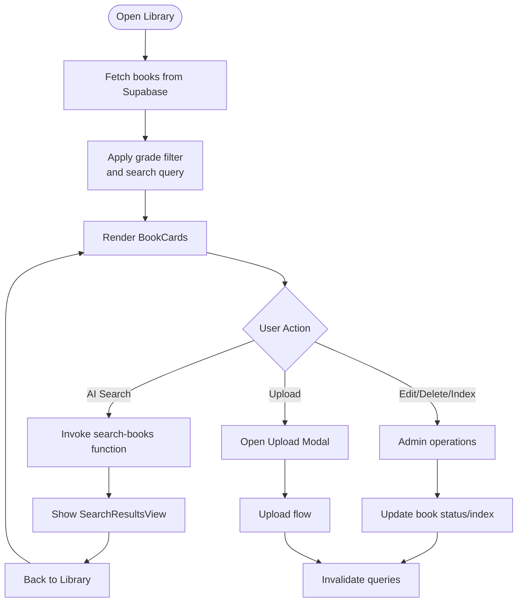

# Digital Library System

<cite>
**Referenced Files in This Document**
- [LibraryPage.tsx](file://src/components/library/LibraryPage.tsx)
- [BookCard.tsx](file://src/components/library/BookCard.tsx)
- [BookUploadModal.tsx](file://src/components/library/BookUploadModal.tsx)
- [BookUploadItem.tsx](file://src/components/library/BookUploadItem.tsx)
- [FlipbookViewer.tsx](file://src/components/library/FlipbookViewer.tsx)
- [SearchResultsView.tsx](file://src/components/library/SearchResultsView.tsx)
- [useBookSearch.ts](file://src/hooks/useBookSearch.ts)
- [useBookIndexing.ts](file://src/hooks/useBookIndexing.ts)
- [usePdfToImages.ts](file://src/hooks/usePdfToImages.ts)
- [useAnnotations.ts](file://src/hooks/useAnnotations.ts)
- [usePageDetection.ts](file://src/hooks/usePageDetection.ts)
</cite>

## Table of Contents
1. [Introduction](#introduction)
2. [Project Structure](#project-structure)
3. [Core Components](#core-components)
4. [Architecture Overview](#architecture-overview)
5. [Detailed Component Analysis](#detailed-component-analysis)
6. [Dependency Analysis](#dependency-analysis)
7. [Performance Considerations](#performance-considerations)
8. [Troubleshooting Guide](#troubleshooting-guide)
9. [Conclusion](#conclusion)

## Introduction
This document describes the digital library system, focusing on book management, indexing, OCR processing, content analysis, the flipbook viewer, annotation and bookmarking features, search with advanced filtering, and upload workflows. It synthesizes frontend components and hooks with backend Supabase integration and serverless functions to deliver a modern, interactive library experience.

## Project Structure
The library feature is primarily implemented under src/components/library and src/hooks, with Supabase integration in src/integrations/supabase and serverless functions under supabase/functions. The main entry is the Library page, which orchestrates search, indexing, uploads, and the flipbook viewer.

**Diagram sources**
- [LibraryPage.tsx](file://src/components/library/LibraryPage.tsx#L88-L580)
- [BookCard.tsx](file://src/components/library/BookCard.tsx#L47-L297)
- [BookUploadModal.tsx](file://src/components/library/BookUploadModal.tsx#L36-L361)
- [BookUploadItem.tsx](file://src/components/library/BookUploadItem.tsx#L52-L250)
- [FlipbookViewer.tsx](file://src/components/library/FlipbookViewer.tsx#L38-L1141)
- [SearchResultsView.tsx](file://src/components/library/SearchResultsView.tsx#L35-L266)
- [useBookSearch.ts](file://src/hooks/useBookSearch.ts#L30-L98)
- [useBookIndexing.ts](file://src/hooks/useBookIndexing.ts#L13-L113)
- [usePdfToImages.ts](file://src/hooks/usePdfToImages.ts#L102-L236)
- [useAnnotations.ts](file://src/hooks/useAnnotations.ts#L47-L584)
- [usePageDetection.ts](file://src/hooks/usePageDetection.ts#L17-L194)

**Section sources**
- [LibraryPage.tsx](file://src/components/library/LibraryPage.tsx#L88-L580)
- [BookCard.tsx](file://src/components/library/BookCard.tsx#L47-L297)
- [BookUploadModal.tsx](file://src/components/library/BookUploadModal.tsx#L36-L361)
- [BookUploadItem.tsx](file://src/components/library/BookUploadItem.tsx#L52-L250)
- [FlipbookViewer.tsx](file://src/components/library/FlipbookViewer.tsx#L38-L1141)
- [SearchResultsView.tsx](file://src/components/library/SearchResultsView.tsx#L35-L266)
- [useBookSearch.ts](file://src/hooks/useBookSearch.ts#L30-L98)
- [useBookIndexing.ts](file://src/hooks/useBookIndexing.ts#L13-L113)
- [usePdfToImages.ts](file://src/hooks/usePdfToImages.ts#L102-L236)
- [useAnnotations.ts](file://src/hooks/useAnnotations.ts#L47-L584)
- [usePageDetection.ts](file://src/hooks/usePageDetection.ts#L17-L194)

## Core Components
- LibraryPage: Central hub for browsing, filtering, searching, uploading, and managing books. Integrates with Supabase for data and serverless functions for AI search and indexing.
- BookCard: Renders individual book tiles with status badges, actions, and AI indexing indicators.
- BookUploadModal and BookUploadItem: Handles multi-file PDF selection, AI cover analysis, metadata editing, browser-side PDF rendering, and batch uploads.
- FlipbookViewer: Interactive viewer with two-page spreads, zoom, fullscreen, page detection, annotations, stickers, and bookmarks.
- SearchResultsView: Presents AI-powered search results with collapsible matches, highlighting, and quick navigation.
- Hooks: useBookSearch, useBookIndexing, usePdfToImages, useAnnotations, usePageDetection.

**Section sources**
- [LibraryPage.tsx](file://src/components/library/LibraryPage.tsx#L88-L580)
- [BookCard.tsx](file://src/components/library/BookCard.tsx#L47-L297)
- [BookUploadModal.tsx](file://src/components/library/BookUploadModal.tsx#L36-L361)
- [BookUploadItem.tsx](file://src/components/library/BookUploadItem.tsx#L52-L250)
- [FlipbookViewer.tsx](file://src/components/library/FlipbookViewer.tsx#L38-L1141)
- [SearchResultsView.tsx](file://src/components/library/SearchResultsView.tsx#L35-L266)
- [useBookSearch.ts](file://src/hooks/useBookSearch.ts#L30-L98)
- [useBookIndexing.ts](file://src/hooks/useBookIndexing.ts#L13-L113)
- [usePdfToImages.ts](file://src/hooks/usePdfToImages.ts#L102-L236)
- [useAnnotations.ts](file://src/hooks/useAnnotations.ts#L47-L584)
- [usePageDetection.ts](file://src/hooks/usePageDetection.ts#L17-L194)

## Architecture Overview
The system integrates React components with Supabase for storage, database, and serverless functions. Key flows:
- Upload pipeline: PDFs rendered in-browser to WebP images, thumbnails, and page records stored; cover preview generated via AI.
- Indexing pipeline: Serverless function triggers OCR/indexing; status tracked via React Query.
- Search pipeline: Serverless function performs vector/text search across indexed content; results shown in a dedicated view.
- Viewer pipeline: Pages fetched from storage, page numbers auto-detected, annotations persisted per-user per-page.

**Diagram sources**
- [LibraryPage.tsx](file://src/components/library/LibraryPage.tsx#L88-L580)
- [BookUploadModal.tsx](file://src/components/library/BookUploadModal.tsx#L36-L361)
- [BookUploadItem.tsx](file://src/components/library/BookUploadItem.tsx#L52-L250)
- [usePdfToImages.ts](file://src/hooks/usePdfToImages.ts#L102-L236)

**Section sources**
- [LibraryPage.tsx](file://src/components/library/LibraryPage.tsx#L88-L580)
- [BookUploadModal.tsx](file://src/components/library/BookUploadModal.tsx#L36-L361)
- [BookUploadItem.tsx](file://src/components/library/BookUploadItem.tsx#L52-L250)
- [usePdfToImages.ts](file://src/hooks/usePdfToImages.ts#L102-L236)

## Detailed Component Analysis

### LibraryPage: Book Catalog, Filtering, and Management
- Responsibilities:
  - Fetch and filter books by grade level and search query.
  - Toggle visibility of inactive books for admins.
  - Trigger AI search and manage search results view.
  - Manage book lifecycle: activate/deactivate, delete, start indexing.
  - Deep-link to a specific book/page.
- Key behaviors:
  - Student role auto-applies grade filter based on parsed level.
  - Admin/Registrar can edit, delete, and index books.
  - Uses Supabase for data and serverless functions for AI search and indexing.

**Diagram sources**
- [LibraryPage.tsx](file://src/components/library/LibraryPage.tsx#L88-L580)
- [useBookSearch.ts](file://src/hooks/useBookSearch.ts#L30-L98)
- [useBookIndexing.ts](file://src/hooks/useBookIndexing.ts#L13-L113)

**Section sources**
- [LibraryPage.tsx](file://src/components/library/LibraryPage.tsx#L88-L580)
- [useBookSearch.ts](file://src/hooks/useBookSearch.ts#L30-L98)
- [useBookIndexing.ts](file://src/hooks/useBookIndexing.ts#L13-L113)

### BookCard: Visual Representation and Actions
- Displays cover, page count, grade, and AI indexing status.
- Shows overlays for processing/error/inactive states.
- Provides dropdown actions for editing, activation toggle, indexing, and deletion.

**Section sources**
- [BookCard.tsx](file://src/components/library/BookCard.tsx#L47-L297)

### BookUploadModal and BookUploadItem: Upload Pipeline
- Features:
  - Drag-and-drop or file picker for PDFs.
  - AI cover analysis to auto-fill title, subject, grade.
  - Browser-side PDF rendering to high-res and thumbnail WebP images.
  - Batch upload with progress tracking.
  - Automatic AI indexing initiation after upload.
- Data persistence:
  - Creates book record, stores source PDF, sets cover URL, inserts page records.

**Diagram sources**
- [BookUploadModal.tsx](file://src/components/library/BookUploadModal.tsx#L36-L361)
- [BookUploadItem.tsx](file://src/components/library/BookUploadItem.tsx#L52-L250)
- [usePdfToImages.ts](file://src/hooks/usePdfToImages.ts#L102-L236)

**Section sources**
- [BookUploadModal.tsx](file://src/components/library/BookUploadModal.tsx#L36-L361)
- [BookUploadItem.tsx](file://src/components/library/BookUploadItem.tsx#L52-L250)
- [usePdfToImages.ts](file://src/hooks/usePdfToImages.ts#L102-L236)

### FlipbookViewer: Viewer, Thumbnails, Annotations, and Page Detection
- Viewer features:
  - Two-page spreads on desktop, single-page on mobile.
  - Zoom, fullscreen, keyboard navigation, and page thumbnails.
  - Page flip animation with spine and crease effects.
- Annotations and bookmarks:
  - Drawing tools (pencil, highlighter, shapes), eraser, stickers (emoji/icon).
  - Per-user, per-page persistence with undo/redo/history.
- Page detection:
  - Auto-detects cover, blank, and numbered pages via serverless function.
  - Displays detected numbers and hides non-content pages in thumbnails.

**Diagram sources**
- [FlipbookViewer.tsx](file://src/components/library/FlipbookViewer.tsx#L38-L1141)
- [useAnnotations.ts](file://src/hooks/useAnnotations.ts#L47-L584)
- [usePageDetection.ts](file://src/hooks/usePageDetection.ts#L17-L194)

**Section sources**
- [FlipbookViewer.tsx](file://src/components/library/FlipbookViewer.tsx#L38-L1141)
- [useAnnotations.ts](file://src/hooks/useAnnotations.ts#L47-L584)
- [usePageDetection.ts](file://src/hooks/usePageDetection.ts#L17-L194)

### SearchResultsView: Advanced Filtering and Ranking
- Presents AI search results grouped by book with collapsible matches.
- Highlights search terms and shows topics, chapter titles, and relevance.
- Supports quick open to a specific page in the viewer.

**Section sources**
- [SearchResultsView.tsx](file://src/components/library/SearchResultsView.tsx#L35-L266)
- [useBookSearch.ts](file://src/hooks/useBookSearch.ts#L30-L98)

### Indexing and Content Analysis
- Indexing:
  - Starts via serverless function; tracks progress and status per book.
  - Supports reindexing by clearing existing index entries and resetting status.
- Content analysis:
  - AI cover analysis to infer title, subject, and grade level.
  - Page number detection via serverless function with confidence and type classification.

**Section sources**
- [useBookIndexing.ts](file://src/hooks/useBookIndexing.ts#L13-L113)
- [BookUploadItem.tsx](file://src/components/library/BookUploadItem.tsx#L52-L250)
- [usePageDetection.ts](file://src/hooks/usePageDetection.ts#L17-L194)

## Dependency Analysis
- Component dependencies:
  - LibraryPage depends on BookCard, BookUploadModal, SearchResultsView, useBookSearch, useBookIndexing.
  - BookUploadModal depends on BookUploadItem and usePdfToImages.
  - FlipbookViewer depends on useAnnotations and usePageDetection.
- External dependencies:
  - Supabase client for database and storage.
  - Serverless functions for AI search, OCR indexing, page number detection, and cover analysis.

**Diagram sources**
- [LibraryPage.tsx](file://src/components/library/LibraryPage.tsx#L88-L580)
- [BookUploadModal.tsx](file://src/components/library/BookUploadModal.tsx#L36-L361)
- [FlipbookViewer.tsx](file://src/components/library/FlipbookViewer.tsx#L38-L1141)
- [useBookSearch.ts](file://src/hooks/useBookSearch.ts#L30-L98)
- [useBookIndexing.ts](file://src/hooks/useBookIndexing.ts#L13-L113)
- [usePdfToImages.ts](file://src/hooks/usePdfToImages.ts#L102-L236)
- [useAnnotations.ts](file://src/hooks/useAnnotations.ts#L47-L584)
- [usePageDetection.ts](file://src/hooks/usePageDetection.ts#L17-L194)

**Section sources**
- [LibraryPage.tsx](file://src/components/library/LibraryPage.tsx#L88-L580)
- [BookUploadModal.tsx](file://src/components/library/BookUploadModal.tsx#L36-L361)
- [FlipbookViewer.tsx](file://src/components/library/FlipbookViewer.tsx#L38-L1141)
- [useBookSearch.ts](file://src/hooks/useBookSearch.ts#L30-L98)
- [useBookIndexing.ts](file://src/hooks/useBookIndexing.ts#L13-L113)
- [usePdfToImages.ts](file://src/hooks/usePdfToImages.ts#L102-L236)
- [useAnnotations.ts](file://src/hooks/useAnnotations.ts#L47-L584)
- [usePageDetection.ts](file://src/hooks/usePageDetection.ts#L17-L194)

## Performance Considerations
- Rendering:
  - PDFs are processed in batches to balance throughput and memory usage.
  - Images are WebP-encoded for efficient storage and bandwidth.
- Queries:
  - React Query caches book and index statuses with periodic refetch only when indexing is active.
- Viewer:
  - Canvas rendering scales with zoom; annotations are redrawn efficiently on page changes.
- Search:
  - Serverless functions handle heavy lifting; results are paginated and truncated to improve responsiveness.

[No sources needed since this section provides general guidance]

## Troubleshooting Guide
- Upload fails:
  - Verify PDF selection and network connectivity; check error messages in the upload item status.
  - Ensure browser supports required APIs for PDF processing.
- Indexing stuck:
  - Check indexing status and re-run reindexing if needed.
  - Confirm serverless function availability and logs.
- Viewer issues:
  - If annotations do not appear, confirm user is logged in and annotations are synced.
  - For page detection, ensure images are accessible and serverless function is reachable.
- Search yields no results:
  - Confirm books are indexed and content is available.
  - Adjust search terms or filters.

**Section sources**
- [BookUploadItem.tsx](file://src/components/library/BookUploadItem.tsx#L52-L250)
- [useBookIndexing.ts](file://src/hooks/useBookIndexing.ts#L13-L113)
- [useAnnotations.ts](file://src/hooks/useAnnotations.ts#L47-L584)
- [usePageDetection.ts](file://src/hooks/usePageDetection.ts#L17-L194)
- [useBookSearch.ts](file://src/hooks/useBookSearch.ts#L30-L98)

## Conclusion
The digital library system combines robust book management, intelligent indexing, and an immersive reading experience. Its modular architecture leverages Supabase and serverless functions to provide scalable, real-time capabilities for search, OCR, annotations, and media handling. Administrators can efficiently manage content, while users benefit from intuitive browsing, powerful search, and interactive reading tools.