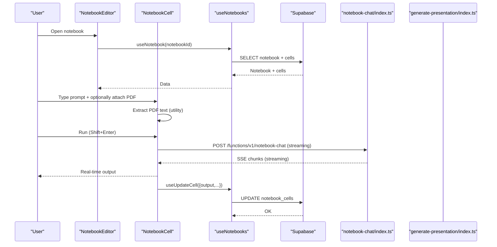
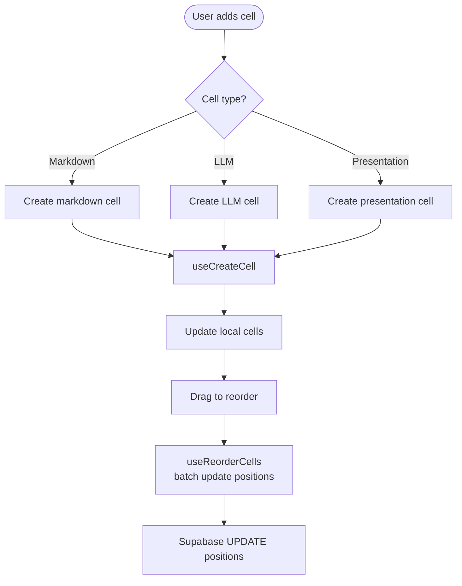
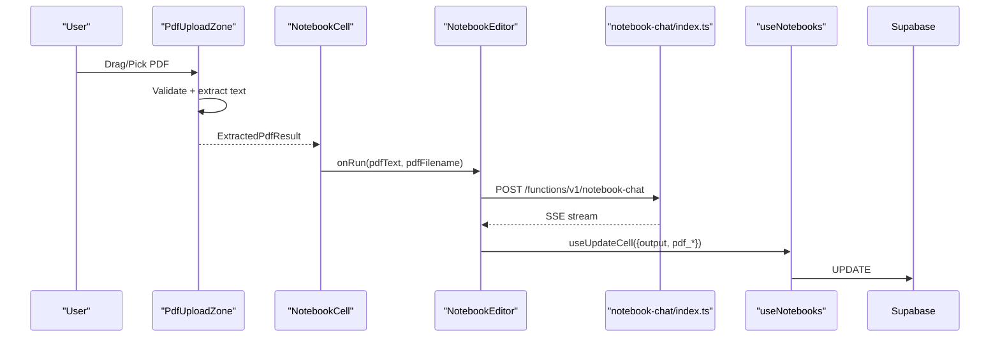
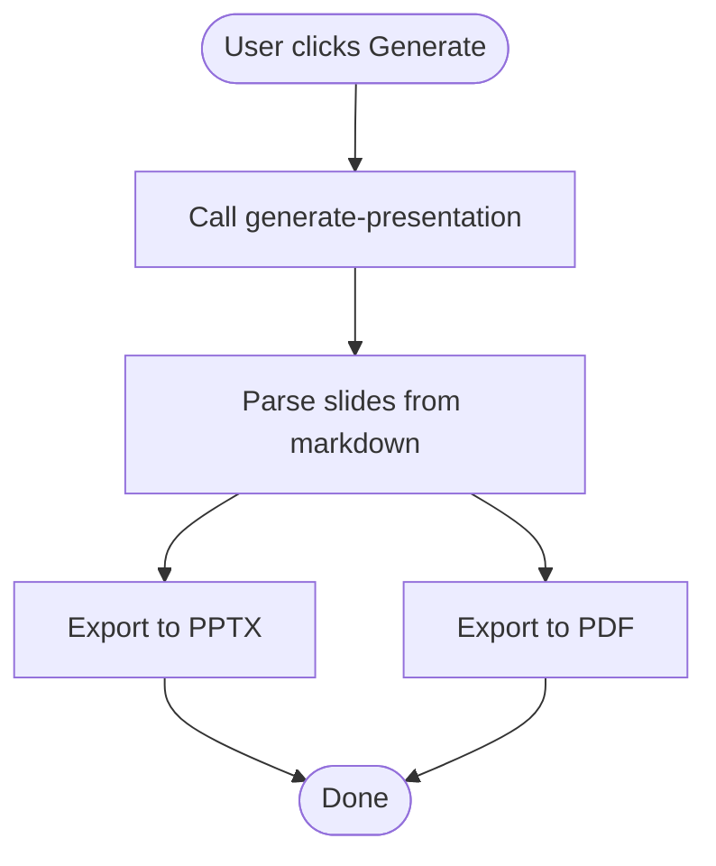
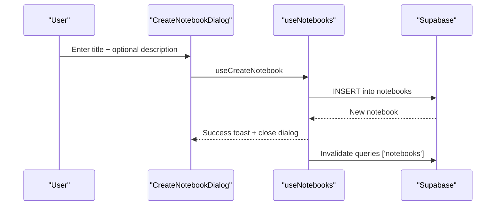
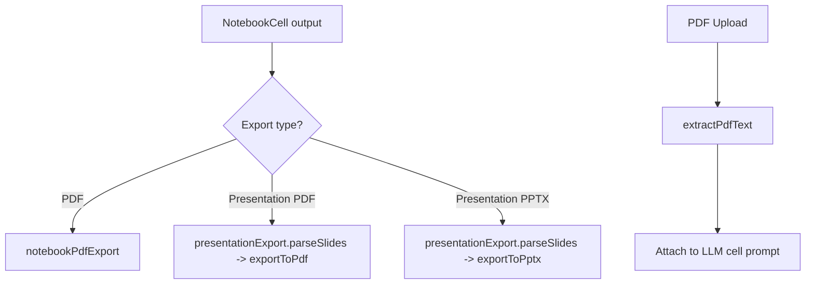
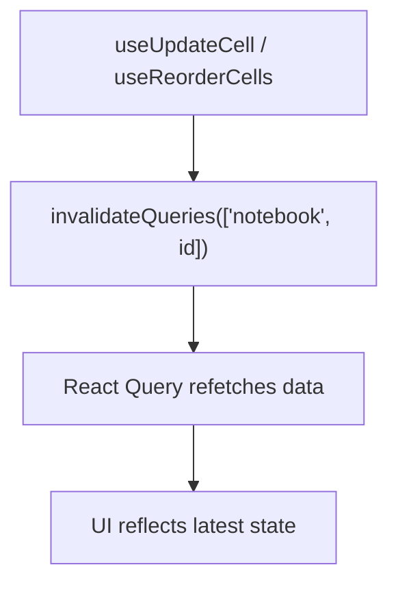
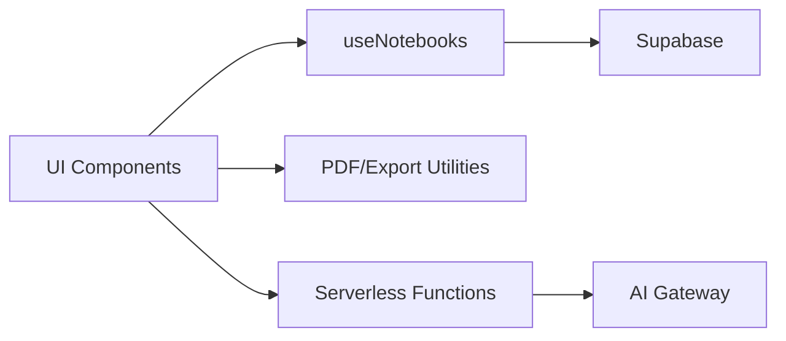

# Document Collaboration System

<cite>
**Referenced Files in This Document**
- [NotebookEditor.tsx](file://src/components/notebook/NotebookEditor.tsx)
- [NotebookCell.tsx](file://src/components/notebook/NotebookCell.tsx)
- [PresentationCell.tsx](file://src/components/notebook/PresentationCell.tsx)
- [PdfUploadZone.tsx](file://src/components/notebook/PdfUploadZone.tsx)
- [CreateNotebookDialog.tsx](file://src/components/notebook/CreateNotebookDialog.tsx)
- [NotebookList.tsx](file://src/components/notebook/NotebookList.tsx)
- [useNotebooks.ts](file://src/hooks/useNotebooks.ts)
- [notebookPdfExport.ts](file://src/utils/notebookPdfExport.ts)
- [presentationExport.ts](file://src/utils/presentationExport.ts)
- [pdfToImages.ts](file://src/utils/pdfToImages.ts)
- [extractPdfText.ts](file://src/utils/extractPdfText.ts)
- [notebook-chat/index.ts](file://supabase/functions/notebook-chat/index.ts)
- [generate-presentation/index.ts](file://supabase/functions/generate-presentation/index.ts)
</cite>

## Table of Contents
1. [Introduction](#introduction)
2. [Project Structure](#project-structure)
3. [Core Components](#core-components)
4. [Architecture Overview](#architecture-overview)
5. [Detailed Component Analysis](#detailed-component-analysis)
6. [Dependency Analysis](#dependency-analysis)
7. [Performance Considerations](#performance-considerations)
8. [Troubleshooting Guide](#troubleshooting-guide)
9. [Conclusion](#conclusion)

## Introduction
This document describes the document collaboration system centered around a notebook interface. It covers the editor and cell-based content management, collaborative editing capabilities, notebook creation and sharing workflows, permissions, presentation mode and exports, PDF processing and document formatting, version control and conflict resolution, and integration with external document services and cloud storage.

## Project Structure
The notebook system is implemented as a React-based UI with TypeScript and integrates with Supabase for data persistence and authentication, and with serverless functions for AI-powered operations. Utilities provide PDF parsing, conversion, and export to PDF and PowerPoint formats.

```mermaid
graph TB
subgraph "UI Layer"
NBEditor["NotebookEditor.tsx"]
NBCell["NotebookCell.tsx"]
PresCell["PresentationCell.tsx"]
PdfZone["PdfUploadZone.tsx"]
CreateDlg["CreateNotebookDialog.tsx"]
List["NotebookList.tsx"]
end
subgraph "Hooks"
Hooks["useNotebooks.ts"]
end
subgraph "Utilities"
PdfTxt["extractPdfText.ts"]
PdfImg["pdfToImages.ts"]
PdfExp["notebookPdfExport.ts"]
PresExp["presentationExport.ts"]
end
subgraph "Backend"
Supabase["Supabase (PostgreSQL)"]
FuncChat["notebook-chat/index.ts"]
FuncPres["generate-presentation/index.ts"]
end
NBEditor --> NBCell
NBEditor --> PresCell
NBCell --> PdfZone
NBCell --> PdfTxt
NBCell --> PdfImg
NBCell --> PdfExp
PresCell --> PresExp
NBEditor --> Hooks
Hooks --> Supabase
NBEditor --> FuncChat
PresCell --> FuncPres
```

**Diagram sources**
- [NotebookEditor.tsx](file://src/components/notebook/NotebookEditor.tsx#L1-L419)
- [NotebookCell.tsx](file://src/components/notebook/NotebookCell.tsx#L1-L299)
- [PresentationCell.tsx](file://src/components/notebook/PresentationCell.tsx#L1-L276)
- [PdfUploadZone.tsx](file://src/components/notebook/PdfUploadZone.tsx#L1-L164)
- [CreateNotebookDialog.tsx](file://src/components/notebook/CreateNotebookDialog.tsx#L1-L98)
- [NotebookList.tsx](file://src/components/notebook/NotebookList.tsx#L1-L159)
- [useNotebooks.ts](file://src/hooks/useNotebooks.ts#L1-L298)
- [extractPdfText.ts](file://src/utils/extractPdfText.ts#L1-L59)
- [pdfToImages.ts](file://src/utils/pdfToImages.ts#L1-L117)
- [notebookPdfExport.ts](file://src/utils/notebookPdfExport.ts#L1-L157)
- [presentationExport.ts](file://src/utils/presentationExport.ts#L1-L636)
- [notebook-chat/index.ts](file://supabase/functions/notebook-chat/index.ts#L1-L233)
- [generate-presentation/index.ts](file://supabase/functions/generate-presentation/index.ts#L1-L352)

**Section sources**
- [NotebookEditor.tsx](file://src/components/notebook/NotebookEditor.tsx#L1-L419)
- [useNotebooks.ts](file://src/hooks/useNotebooks.ts#L1-L298)

## Core Components
- NotebookEditor: Orchestrates notebook-wide actions (title editing, cell management, drag-reorder, LLM and presentation cell execution).
- NotebookCell: Manages markdown and LLM prompt cells, PDF attachment, streaming output rendering, and PDF export.
- PresentationCell: Manages presentation cells with topic, slide count, style selection, generation, and export to PPTX/PDF.
- PdfUploadZone: Handles PDF uploads, validation, extraction progress, and passes extracted text to parent cells.
- CreateNotebookDialog: Dialog to create new notebooks with title and optional description.
- NotebookList: Lists notebooks with quick actions and deletion confirmation.
- useNotebooks: React Query hooks for CRUD operations on notebooks and cells, plus reordering.
- Utilities: PDF text extraction, image conversion, notebook-to-PDF export, and presentation export to PPTX/PDF.

**Section sources**
- [NotebookEditor.tsx](file://src/components/notebook/NotebookEditor.tsx#L1-L419)
- [NotebookCell.tsx](file://src/components/notebook/NotebookCell.tsx#L1-L299)
- [PresentationCell.tsx](file://src/components/notebook/PresentationCell.tsx#L1-L276)
- [PdfUploadZone.tsx](file://src/components/notebook/PdfUploadZone.tsx#L1-L164)
- [CreateNotebookDialog.tsx](file://src/components/notebook/CreateNotebookDialog.tsx#L1-L98)
- [NotebookList.tsx](file://src/components/notebook/NotebookList.tsx#L1-L159)
- [useNotebooks.ts](file://src/hooks/useNotebooks.ts#L1-L298)
- [notebookPdfExport.ts](file://src/utils/notebookPdfExport.ts#L1-L157)
- [presentationExport.ts](file://src/utils/presentationExport.ts#L1-L636)
- [extractPdfText.ts](file://src/utils/extractPdfText.ts#L1-L59)
- [pdfToImages.ts](file://src/utils/pdfToImages.ts#L1-L117)

## Architecture Overview
The system follows a layered architecture:
- UI layer: React components manage user interactions and state.
- Hooks layer: useNotebooks encapsulates Supabase queries/mutations and invalidations.
- Utilities: Provide PDF/text/image processing and export helpers.
- Backend layer: Supabase stores notebooks and cells; serverless functions provide AI chat and presentation generation with streaming.



**Diagram sources**
- [NotebookEditor.tsx](file://src/components/notebook/NotebookEditor.tsx#L120-L222)
- [NotebookCell.tsx](file://src/components/notebook/NotebookCell.tsx#L98-L120)
- [useNotebooks.ts](file://src/hooks/useNotebooks.ts#L230-L251)
- [notebook-chat/index.ts](file://supabase/functions/notebook-chat/index.ts#L22-L233)

**Section sources**
- [NotebookEditor.tsx](file://src/components/notebook/NotebookEditor.tsx#L1-L419)
- [notebook-chat/index.ts](file://supabase/functions/notebook-chat/index.ts#L1-L233)

## Detailed Component Analysis

### Notebook Editor and Cell Management
- Title editing: Two-way binding with debounced auto-save via useUpdateNotebook.
- Cell management: Create, update, delete, and reorder cells; drag-and-drop reordering triggers batch position updates.
- Streaming execution: LLM cells stream responses from notebook-chat function; output is accumulated and saved.
- Presentation cells: Dedicated UI for topic, slide count, style; generates structured markdown slides streamed from generate-presentation function.



**Diagram sources**
- [NotebookEditor.tsx](file://src/components/notebook/NotebookEditor.tsx#L74-L118)
- [useNotebooks.ts](file://src/hooks/useNotebooks.ts#L200-L228)
- [useNotebooks.ts](file://src/hooks/useNotebooks.ts#L276-L297)

**Section sources**
- [NotebookEditor.tsx](file://src/components/notebook/NotebookEditor.tsx#L1-L419)
- [useNotebooks.ts](file://src/hooks/useNotebooks.ts#L1-L298)

### LLM Cell Execution and PDF Integration
- PDF upload zone validates file type/size, extracts text with progress, and passes metadata to the cell.
- Running a cell sends the prompt to notebook-chat with optional PDF context; SSE streams content back to the UI.
- Final output is persisted and displayed; user can export to PDF.



**Diagram sources**
- [PdfUploadZone.tsx](file://src/components/notebook/PdfUploadZone.tsx#L22-L50)
- [NotebookCell.tsx](file://src/components/notebook/NotebookCell.tsx#L106-L120)
- [NotebookEditor.tsx](file://src/components/notebook/NotebookEditor.tsx#L120-L222)
- [notebook-chat/index.ts](file://supabase/functions/notebook-chat/index.ts#L68-L162)
- [useNotebooks.ts](file://src/hooks/useNotebooks.ts#L230-L251)

**Section sources**
- [PdfUploadZone.tsx](file://src/components/notebook/PdfUploadZone.tsx#L1-L164)
- [NotebookCell.tsx](file://src/components/notebook/NotebookCell.tsx#L1-L299)
- [NotebookEditor.tsx](file://src/components/notebook/NotebookEditor.tsx#L1-L419)
- [notebook-chat/index.ts](file://supabase/functions/notebook-chat/index.ts#L1-L233)
- [extractPdfText.ts](file://src/utils/extractPdfText.ts#L1-L59)

### Presentation Mode and Export
- PresentationCell allows selecting topic, slide count, and style; generates structured markdown slides via generate-presentation function.
- Export options: PPTX (using pptxgenjs) and PDF (using jspdf) with style themes and slide parsing.



**Diagram sources**
- [PresentationCell.tsx](file://src/components/notebook/PresentationCell.tsx#L87-L90)
- [generate-presentation/index.ts](file://supabase/functions/generate-presentation/index.ts#L153-L352)
- [presentationExport.ts](file://src/utils/presentationExport.ts#L91-L149)
- [presentationExport.ts](file://src/utils/presentationExport.ts#L256-L434)
- [presentationExport.ts](file://src/utils/presentationExport.ts#L439-L635)

**Section sources**
- [PresentationCell.tsx](file://src/components/notebook/PresentationCell.tsx#L1-L276)
- [presentationExport.ts](file://src/utils/presentationExport.ts#L1-L636)
- [generate-presentation/index.ts](file://supabase/functions/generate-presentation/index.ts#L1-L352)

### Notebook Creation, Sharing, and Permissions
- Creation: CreateNotebookDialog submits title and optional description; useCreateNotebook inserts into Supabase and invalidates queries.
- Listing and selection: NotebookList displays notebooks with actions; deletion guarded by confirmation.
- Permissions: Supabase row-level security and auth ensure only the owning user can access notebooks; serverless functions verify session before processing.



**Diagram sources**
- [CreateNotebookDialog.tsx](file://src/components/notebook/CreateNotebookDialog.tsx#L28-L40)
- [useNotebooks.ts](file://src/hooks/useNotebooks.ts#L119-L147)
- [NotebookList.tsx](file://src/components/notebook/NotebookList.tsx#L35-L40)

**Section sources**
- [CreateNotebookDialog.tsx](file://src/components/notebook/CreateNotebookDialog.tsx#L1-L98)
- [NotebookList.tsx](file://src/components/notebook/NotebookList.tsx#L1-L159)
- [useNotebooks.ts](file://src/hooks/useNotebooks.ts#L1-L298)

### PDF Export System and Image Processing
- Notebook output to PDF: notebookPdfExport renders markdown-like content with headings, lists, code, and page numbers.
- Presentation to PDF/PPTX: presentationExport parses slides and applies style themes.
- PDF text extraction: extractPdfText reads up to a capped number of pages and characters; supports progress reporting.
- PDF to images: pdfToImages converts pages to WebP blobs with configurable scaling and progress.



**Diagram sources**
- [notebookPdfExport.ts](file://src/utils/notebookPdfExport.ts#L9-L157)
- [presentationExport.ts](file://src/utils/presentationExport.ts#L91-L149)
- [presentationExport.ts](file://src/utils/presentationExport.ts#L439-L635)
- [extractPdfText.ts](file://src/utils/extractPdfText.ts#L21-L58)
- [pdfToImages.ts](file://src/utils/pdfToImages.ts#L70-L94)

**Section sources**
- [notebookPdfExport.ts](file://src/utils/notebookPdfExport.ts#L1-L157)
- [presentationExport.ts](file://src/utils/presentationExport.ts#L1-L636)
- [extractPdfText.ts](file://src/utils/extractPdfText.ts#L1-L59)
- [pdfToImages.ts](file://src/utils/pdfToImages.ts#L1-L117)

### Version Control, Conflict Resolution, and Audit Trails
- Versioning: Each notebook and cell has created_at and updated_at timestamps; Supabase tracks changes via mutations.
- Conflict resolution: useNotebooks invalidates queries after mutations to ensure UI reflects latest server state; optimistic updates are followed by refetches.
- Audit trails: Application logs capture AI gateway errors and unauthorized access attempts; Supabase real-time can be extended for event streaming.



**Diagram sources**
- [useNotebooks.ts](file://src/hooks/useNotebooks.ts#L166-L173)
- [useNotebooks.ts](file://src/hooks/useNotebooks.ts#L247-L251)
- [useNotebooks.ts](file://src/hooks/useNotebooks.ts#L293-L296)

**Section sources**
- [useNotebooks.ts](file://src/hooks/useNotebooks.ts#L1-L298)

### Integration with External Services and Cloud Storage
- AI services: notebook-chat and generate-presentation functions stream responses from an external AI gateway; authentication verified via Supabase session.
- PDF processing: pdfjs workers bundled locally to avoid CDN/CORS issues; extraction and conversion operate in-browser.
- Cloud storage: Not implemented in the referenced code; integration would require adding storage adapters and updating PDF utilities to support remote URLs.

**Section sources**
- [notebook-chat/index.ts](file://supabase/functions/notebook-chat/index.ts#L28-L63)
- [generate-presentation/index.ts](file://supabase/functions/generate-presentation/index.ts#L158-L175)
- [extractPdfText.ts](file://src/utils/extractPdfText.ts#L1-L59)
- [pdfToImages.ts](file://src/utils/pdfToImages.ts#L1-L117)

## Dependency Analysis
- UI depends on hooks for data fetching and mutations; hooks depend on Supabase client and React Query.
- AI functions depend on Supabase auth verification and external AI gateway; they stream responses back to the UI.
- Utilities are self-contained and used by UI components for PDF/text/image operations.



**Diagram sources**
- [useNotebooks.ts](file://src/hooks/useNotebooks.ts#L1-L298)
- [notebook-chat/index.ts](file://supabase/functions/notebook-chat/index.ts#L1-L233)
- [generate-presentation/index.ts](file://supabase/functions/generate-presentation/index.ts#L1-L352)

**Section sources**
- [useNotebooks.ts](file://src/hooks/useNotebooks.ts#L1-L298)

## Performance Considerations
- Debouncing: Title and cell content saves use debounced values to reduce network calls.
- Streaming: LLM and presentation generation stream responses to keep UI responsive.
- PDF extraction limits: Max pages and character limits prevent memory pressure; progress feedback improves UX.
- Image conversion: High-resolution rendering scaled for quality; consider lazy loading and cancellation for large PDFs.

[No sources needed since this section provides general guidance]

## Troubleshooting Guide
- Authentication errors: notebook-chat verifies user session; ensure Supabase auth is initialized and tokens are present.
- Rate limits/exhausted credits: AI gateway returns explicit 429/402 responses; surface user-friendly messages.
- PDF extraction failures: Validate file type/size; confirm worker initialization and progress callbacks.
- Export failures: Verify parsed slides exist before exporting; handle missing output gracefully.

**Section sources**
- [notebook-chat/index.ts](file://supabase/functions/notebook-chat/index.ts#L55-L63)
- [notebook-chat/index.ts](file://supabase/functions/notebook-chat/index.ts#L140-L162)
- [PdfUploadZone.tsx](file://src/components/notebook/PdfUploadZone.tsx#L22-L50)
- [PresentationCell.tsx](file://src/components/notebook/PresentationCell.tsx#L92-L128)

## Conclusion
The document collaboration system provides a robust, extensible foundation for notebook-based authoring with AI-assisted content creation, presentation generation, and export capabilities. Its modular design enables incremental enhancements for sharing, permissions, and cloud storage integration while maintaining strong separation of concerns between UI, data, and AI services.