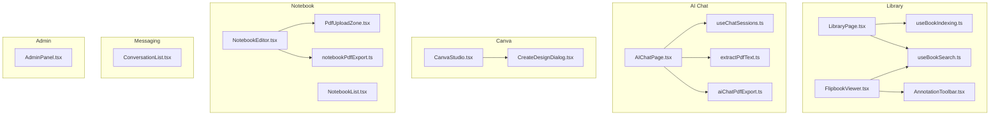
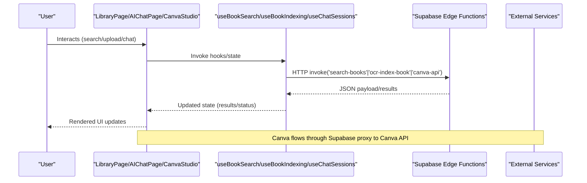
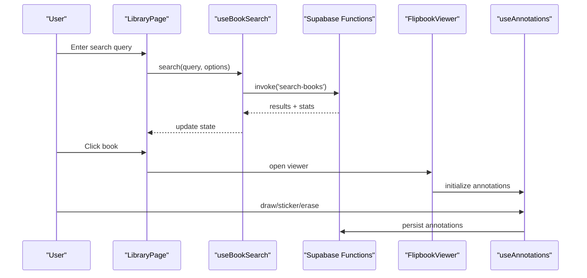
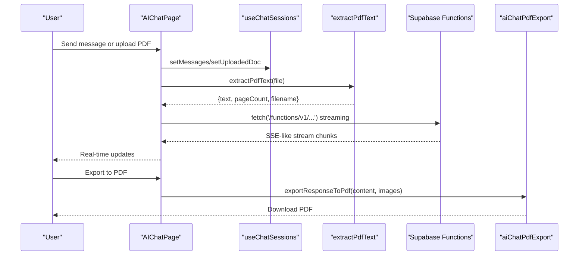
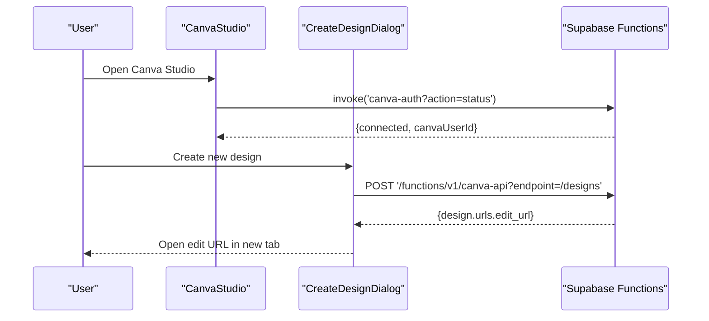
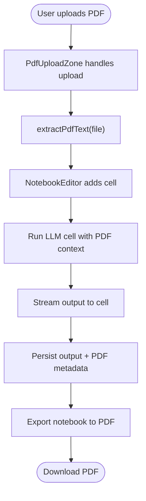
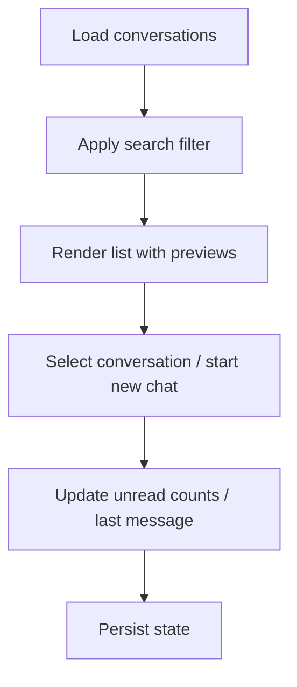
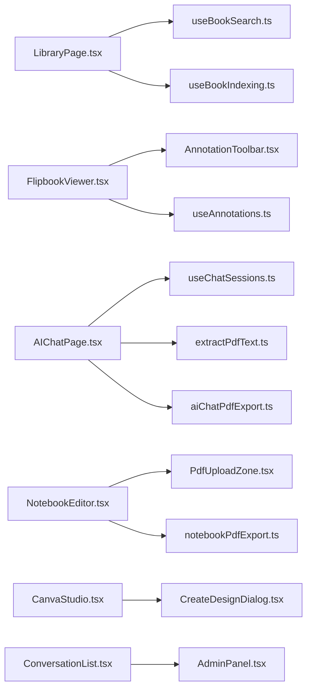

# Resource Management

<cite>
**Referenced Files in This Document**
- [LibraryPage.tsx](file://src/components/library/LibraryPage.tsx)
- [useBookSearch.ts](file://src/hooks/useBookSearch.ts)
- [useBookIndexing.ts](file://src/hooks/useBookIndexing.ts)
- [FlipbookViewer.tsx](file://src/components/library/FlipbookViewer.tsx)
- [AnnotationToolbar.tsx](file://src/components/library/AnnotationToolbar.tsx)
- [useAnnotations.ts](file://src/hooks/useAnnotations.ts)
- [AIChatPage.tsx](file://src/components/aichat/AIChatPage.tsx)
- [useChatSessions.ts](file://src/hooks/useChatSessions.ts)
- [CanvaStudio.tsx](file://src/components/canva/CanvaStudio.tsx)
- [CreateDesignDialog.tsx](file://src/components/canva/CreateDesignDialog.tsx)
- [NotebookEditor.tsx](file://src/components/notebook/NotebookEditor.tsx)
- [PdfUploadZone.tsx](file://src/components/notebook/PdfUploadZone.tsx)
- [NotebookList.tsx](file://src/components/notebook/NotebookList.tsx)
- [extractPdfText.ts](file://src/utils/extractPdfText.ts)
- [aiChatPdfExport.ts](file://src/utils/aiChatPdfExport.ts)
- [notebookPdfExport.ts](file://src/utils/notebookPdfExport.ts)
- [ConversationList.tsx](file://src/components/messaging/ConversationList.tsx)
- [AdminPanel.tsx](file://src/components/admin/AdminPanel.tsx)
</cite>

## Table of Contents
1. [Introduction](#introduction)
2. [Project Structure](#project-structure)
3. [Core Components](#core-components)
4. [Architecture Overview](#architecture-overview)
5. [Detailed Component Analysis](#detailed-component-analysis)
6. [Dependency Analysis](#dependency-analysis)
7. [Performance Considerations](#performance-considerations)
8. [Troubleshooting Guide](#troubleshooting-guide)
9. [Conclusion](#conclusion)

## Introduction
This document describes the resource management system covering:
- Digital library: book browsing, indexing, annotation, and search
- AI-powered chat: conversation management, PDF processing, and exports
- Design collaboration: Canva integration and design creation workflows
- Notebook management: structured AI notebooks with PDF ingestion and export
- Messaging and collaboration: conversation lists and moderation-ready infrastructure
- Administrative controls for content moderation and system health

The goal is to explain how resources are ingested, curated, annotated, searched, and shared across the platform, with a focus on user workflows and backend integrations.

## Project Structure
The system is organized around feature-focused components and shared hooks/utilities:
- Library: LibraryPage, FlipbookViewer, AnnotationToolbar, useBookSearch, useBookIndexing
- AI Chat: AIChatPage, useChatSessions, PDF extraction and export utilities
- Canva: CanvaStudio, CreateDesignDialog
- Notebook: NotebookEditor, PdfUploadZone, NotebookList, export utilities
- Messaging: ConversationList
- Admin: AdminPanel

**Diagram sources**
- [LibraryPage.tsx](file://src/components/library/LibraryPage.tsx#L1-L580)
- [FlipbookViewer.tsx](file://src/components/library/FlipbookViewer.tsx#L1-L1141)
- [AnnotationToolbar.tsx](file://src/components/library/AnnotationToolbar.tsx#L1-L267)
- [useBookSearch.ts](file://src/hooks/useBookSearch.ts#L1-L98)
- [useBookIndexing.ts](file://src/hooks/useBookIndexing.ts#L1-L113)
- [AIChatPage.tsx](file://src/components/aichat/AIChatPage.tsx#L1-L427)
- [useChatSessions.ts](file://src/hooks/useChatSessions.ts#L1-L132)
- [extractPdfText.ts](file://src/utils/extractPdfText.ts#L1-L59)
- [aiChatPdfExport.ts](file://src/utils/aiChatPdfExport.ts#L1-L482)
- [CanvaStudio.tsx](file://src/components/canva/CanvaStudio.tsx#L1-L199)
- [CreateDesignDialog.tsx](file://src/components/canva/CreateDesignDialog.tsx#L1-L228)
- [NotebookEditor.tsx](file://src/components/notebook/NotebookEditor.tsx#L1-L419)
- [PdfUploadZone.tsx](file://src/components/notebook/PdfUploadZone.tsx#L1-L164)
- [NotebookList.tsx](file://src/components/notebook/NotebookList.tsx#L1-L159)
- [notebookPdfExport.ts](file://src/utils/notebookPdfExport.ts#L1-L157)
- [ConversationList.tsx](file://src/components/messaging/ConversationList.tsx#L1-L147)
- [AdminPanel.tsx](file://src/components/admin/AdminPanel.tsx#L1-L229)

**Section sources**
- [LibraryPage.tsx](file://src/components/library/LibraryPage.tsx#L1-L580)
- [AIChatPage.tsx](file://src/components/aichat/AIChatPage.tsx#L1-L427)
- [CanvaStudio.tsx](file://src/components/canva/CanvaStudio.tsx#L1-L199)
- [NotebookEditor.tsx](file://src/components/notebook/NotebookEditor.tsx#L1-L419)
- [ConversationList.tsx](file://src/components/messaging/ConversationList.tsx#L1-L147)
- [AdminPanel.tsx](file://src/components/admin/AdminPanel.tsx#L1-L229)

## Core Components
- Digital Library
  - LibraryPage orchestrates search, filtering, indexing, and viewer integration
  - FlipbookViewer renders pages with annotation overlay and toolbar
  - AnnotationToolbar provides drawing, stickers, and view controls
  - useBookSearch and useBookIndexing encapsulate AI search and OCR indexing
- AI Chat
  - AIChatPage manages conversation lifecycle, PDF ingestion, and streaming responses
  - useChatSessions persists chats locally and synchronizes active session
  - extractPdfText extracts text from PDFs; aiChatPdfExport generates formatted PDFs
- Design Collaboration
  - CanvaStudio integrates with Canva via Supabase Edge Functions
  - CreateDesignDialog scaffolds new designs with size presets or custom dimensions
- Notebook Management
  - NotebookEditor supports markdown, LLM prompts, and presentation cells with PDF context
  - PdfUploadZone handles drag-and-drop PDF extraction
  - notebookPdfExport produces printable notebooks
- Messaging and Collaboration
  - ConversationList displays chats, unread indicators, and online presence
- Administration
  - AdminPanel centralizes system controls and data quality dashboards

**Section sources**
- [LibraryPage.tsx](file://src/components/library/LibraryPage.tsx#L1-L580)
- [FlipbookViewer.tsx](file://src/components/library/FlipbookViewer.tsx#L1-L1141)
- [AnnotationToolbar.tsx](file://src/components/library/AnnotationToolbar.tsx#L1-L267)
- [useBookSearch.ts](file://src/hooks/useBookSearch.ts#L1-L98)
- [useBookIndexing.ts](file://src/hooks/useBookIndexing.ts#L1-L113)
- [AIChatPage.tsx](file://src/components/aichat/AIChatPage.tsx#L1-L427)
- [useChatSessions.ts](file://src/hooks/useChatSessions.ts#L1-L132)
- [extractPdfText.ts](file://src/utils/extractPdfText.ts#L1-L59)
- [aiChatPdfExport.ts](file://src/utils/aiChatPdfExport.ts#L1-L482)
- [CanvaStudio.tsx](file://src/components/canva/CanvaStudio.tsx#L1-L199)
- [CreateDesignDialog.tsx](file://src/components/canva/CreateDesignDialog.tsx#L1-L228)
- [NotebookEditor.tsx](file://src/components/notebook/NotebookEditor.tsx#L1-L419)
- [PdfUploadZone.tsx](file://src/components/notebook/PdfUploadZone.tsx#L1-L164)
- [notebookPdfExport.ts](file://src/utils/notebookPdfExport.ts#L1-L157)
- [ConversationList.tsx](file://src/components/messaging/ConversationList.tsx#L1-L147)
- [AdminPanel.tsx](file://src/components/admin/AdminPanel.tsx#L1-L229)

## Architecture Overview
The system integrates frontend components with Supabase Edge Functions for AI and external services:
- Library search and indexing call Supabase functions
- Chat streams responses and can attach PDF context
- Canva integration proxies requests through Supabase
- Notebooks support PDF ingestion and export

**Diagram sources**
- [LibraryPage.tsx](file://src/components/library/LibraryPage.tsx#L122-L191)
- [useBookSearch.ts](file://src/hooks/useBookSearch.ts#L36-L81)
- [useBookIndexing.ts](file://src/hooks/useBookIndexing.ts#L58-L86)
- [AIChatPage.tsx](file://src/components/aichat/AIChatPage.tsx#L122-L163)
- [CanvaStudio.tsx](file://src/components/canva/CanvaStudio.tsx#L25-L39)

## Detailed Component Analysis

### Digital Library: Book Indexing, Annotation, and Search
- LibraryPage
  - Provides search, grade filtering, and admin controls
  - Integrates with useBookSearch and useBookIndexing
  - Delegates viewing to FlipbookViewer
- useBookSearch
  - Invokes Supabase function to search indexed books
  - Returns paginated matches with snippets and metadata
- useBookIndexing
  - Starts OCR indexing for books and tracks progress
  - Exposes status for UI feedback
- FlipbookViewer
  - Renders pages with zoom, fullscreen, and two-page spreads
  - Integrates annotation overlay and toolbar
  - Uses page detection to annotate page numbers
- AnnotationToolbar and useAnnotations
  - Drawing tools, highlighter, shapes, eraser, stickers
  - Persistent annotations per user per page with undo/redo/history
  - Supports emoji and icon stickers with caching

**Diagram sources**
- [LibraryPage.tsx](file://src/components/library/LibraryPage.tsx#L282-L301)
- [useBookSearch.ts](file://src/hooks/useBookSearch.ts#L36-L81)
- [FlipbookViewer.tsx](file://src/components/library/FlipbookViewer.tsx#L68-L101)
- [useAnnotations.ts](file://src/hooks/useAnnotations.ts#L120-L158)

**Section sources**
- [LibraryPage.tsx](file://src/components/library/LibraryPage.tsx#L1-L580)
- [useBookSearch.ts](file://src/hooks/useBookSearch.ts#L1-L98)
- [useBookIndexing.ts](file://src/hooks/useBookIndexing.ts#L1-L113)
- [FlipbookViewer.tsx](file://src/components/library/FlipbookViewer.tsx#L1-L1141)
- [AnnotationToolbar.tsx](file://src/components/library/AnnotationToolbar.tsx#L1-L267)
- [useAnnotations.ts](file://src/hooks/useAnnotations.ts#L1-L584)

### AI Chat: Conversation Management and PDF Processing
- AIChatPage
  - Manages messages, uploads PDFs, and invokes AI endpoints
  - Streams responses and supports stopping generation
  - Integrates library search results into chat context
- useChatSessions
  - Persists sessions and active session in local storage
  - Derives titles from first user message
- PDF Processing
  - extractPdfText extracts up to a capped number of pages and characters
  - aiChatPdfExport converts chat responses to PDF with formatting and embedded images

**Diagram sources**
- [AIChatPage.tsx](file://src/components/aichat/AIChatPage.tsx#L68-L92)
- [AIChatPage.tsx](file://src/components/aichat/AIChatPage.tsx#L165-L244)
- [useChatSessions.ts](file://src/hooks/useChatSessions.ts#L74-L88)
- [extractPdfText.ts](file://src/utils/extractPdfText.ts#L21-L58)
- [aiChatPdfExport.ts](file://src/utils/aiChatPdfExport.ts#L145-L482)

**Section sources**
- [AIChatPage.tsx](file://src/components/aichat/AIChatPage.tsx#L1-L427)
- [useChatSessions.ts](file://src/hooks/useChatSessions.ts#L1-L132)
- [extractPdfText.ts](file://src/utils/extractPdfText.ts#L1-L59)
- [aiChatPdfExport.ts](file://src/utils/aiChatPdfExport.ts#L1-L482)

### Design Collaboration: Canva Integration and Creation Workflows
- CanvaStudio
  - Checks connection status and offers disconnect
  - Tabs for designs and templates; opens template categories in Canva
- CreateDesignDialog
  - Presets for common design sizes or custom dimensions
  - Creates designs via Supabase proxy and opens edit URL

**Diagram sources**
- [CanvaStudio.tsx](file://src/components/canva/CanvaStudio.tsx#L25-L58)
- [CreateDesignDialog.tsx](file://src/components/canva/CreateDesignDialog.tsx#L67-L114)

**Section sources**
- [CanvaStudio.tsx](file://src/components/canva/CanvaStudio.tsx#L1-L199)
- [CreateDesignDialog.tsx](file://src/components/canva/CreateDesignDialog.tsx#L1-L228)

### Notebook Management: Structured AI Notebooks and PDF Export
- NotebookEditor
  - Supports markdown, LLM prompt, and presentation cells
  - Runs LLM cells with optional PDF context; streams output
  - Saves outputs and PDF metadata per cell
- PdfUploadZone
  - Drag-and-drop PDF upload with progress and extraction
- notebookPdfExport
  - Generates printable PDFs from notebook content

**Diagram sources**
- [NotebookEditor.tsx](file://src/components/notebook/NotebookEditor.tsx#L120-L222)
- [PdfUploadZone.tsx](file://src/components/notebook/PdfUploadZone.tsx#L22-L50)
- [notebookPdfExport.ts](file://src/utils/notebookPdfExport.ts#L9-L157)

**Section sources**
- [NotebookEditor.tsx](file://src/components/notebook/NotebookEditor.tsx#L1-L419)
- [PdfUploadZone.tsx](file://src/components/notebook/PdfUploadZone.tsx#L1-L164)
- [notebookPdfExport.ts](file://src/utils/notebookPdfExport.ts#L1-L157)

### Messaging and Collaboration: Conversations and Moderation
- ConversationList
  - Displays conversations with previews, unread counts, and online status
  - Supports search and new chat creation
- Moderation-ready infrastructure
  - AdminPanel provides user, permissions, logs, and system controls
  - Supports data refresh and destructive actions with confirmation

**Diagram sources**
- [ConversationList.tsx](file://src/components/messaging/ConversationList.tsx#L42-L141)
- [AdminPanel.tsx](file://src/components/admin/AdminPanel.tsx#L22-L46)

**Section sources**
- [ConversationList.tsx](file://src/components/messaging/ConversationList.tsx#L1-L147)
- [AdminPanel.tsx](file://src/components/admin/AdminPanel.tsx#L1-L229)

## Dependency Analysis
- UI components depend on shared hooks for state and persistence
- Supabase Edge Functions mediate external AI/search/indexing and third-party integrations
- Utilities encapsulate cross-cutting concerns (PDF extraction, exports)

**Diagram sources**
- [LibraryPage.tsx](file://src/components/library/LibraryPage.tsx#L1-L580)
- [useBookSearch.ts](file://src/hooks/useBookSearch.ts#L1-L98)
- [useBookIndexing.ts](file://src/hooks/useBookIndexing.ts#L1-L113)
- [FlipbookViewer.tsx](file://src/components/library/FlipbookViewer.tsx#L1-L1141)
- [AnnotationToolbar.tsx](file://src/components/library/AnnotationToolbar.tsx#L1-L267)
- [useAnnotations.ts](file://src/hooks/useAnnotations.ts#L1-L584)
- [AIChatPage.tsx](file://src/components/aichat/AIChatPage.tsx#L1-L427)
- [useChatSessions.ts](file://src/hooks/useChatSessions.ts#L1-L132)
- [extractPdfText.ts](file://src/utils/extractPdfText.ts#L1-L59)
- [aiChatPdfExport.ts](file://src/utils/aiChatPdfExport.ts#L1-L482)
- [NotebookEditor.tsx](file://src/components/notebook/NotebookEditor.tsx#L1-L419)
- [PdfUploadZone.tsx](file://src/components/notebook/PdfUploadZone.tsx#L1-L164)
- [notebookPdfExport.ts](file://src/utils/notebookPdfExport.ts#L1-L157)
- [CanvaStudio.tsx](file://src/components/canva/CanvaStudio.tsx#L1-L199)
- [CreateDesignDialog.tsx](file://src/components/canva/CreateDesignDialog.tsx#L1-L228)
- [ConversationList.tsx](file://src/components/messaging/ConversationList.tsx#L1-L147)
- [AdminPanel.tsx](file://src/components/admin/AdminPanel.tsx#L1-L229)

**Section sources**
- [LibraryPage.tsx](file://src/components/library/LibraryPage.tsx#L1-L580)
- [AIChatPage.tsx](file://src/components/aichat/AIChatPage.tsx#L1-L427)
- [NotebookEditor.tsx](file://src/components/notebook/NotebookEditor.tsx#L1-L419)
- [CanvaStudio.tsx](file://src/components/canva/CanvaStudio.tsx#L1-L199)
- [ConversationList.tsx](file://src/components/messaging/ConversationList.tsx#L1-L147)
- [AdminPanel.tsx](file://src/components/admin/AdminPanel.tsx#L1-L229)

## Performance Considerations
- Library search and indexing
  - useBookSearch limits results and validates query length to prevent overload
  - useBookIndexing refetches statuses periodically while indexing is ongoing
- PDF extraction
  - extractPdfText caps pages and characters to manage memory and latency
- Streaming responses
  - AIChatPage streams deltas to keep UI responsive
- Canvas rendering
  - useAnnotations caches sticker images and renders efficiently per page/zoom

[No sources needed since this section provides general guidance]

## Troubleshooting Guide
- Library search fails
  - Verify Supabase function invocation and network connectivity
  - Check query length and filters applied
- Indexing stuck
  - Monitor index status via useBookIndexing; reindex if needed
- Annotations not saving
  - Ensure user is authenticated; review DB insert/delete errors
- Chat PDF export issues
  - Confirm images are data URLs; check PDF size limits
- Canva creation errors
  - Validate write permissions; retry connect/disconnect flow
- Conversation list empty
  - Confirm active user and network; clear filters and refresh

**Section sources**
- [useBookSearch.ts](file://src/hooks/useBookSearch.ts#L36-L81)
- [useBookIndexing.ts](file://src/hooks/useBookIndexing.ts#L58-L86)
- [useAnnotations.ts](file://src/hooks/useAnnotations.ts#L120-L158)
- [aiChatPdfExport.ts](file://src/utils/aiChatPdfExport.ts#L467-L471)
- [CreateDesignDialog.tsx](file://src/components/canva/CreateDesignDialog.tsx#L86-L93)
- [ConversationList.tsx](file://src/components/messaging/ConversationList.tsx#L70-L86)

## Conclusion
The resource management system combines a searchable digital library, AI-powered chat with PDF processing, integrated design workflows via Canva, and structured notebook authoring. Shared hooks and utilities ensure consistent UX and performance, while Supabase functions provide scalable backend capabilities for search, indexing, and integrations. Administrative tools support moderation and system maintenance, enabling a robust ecosystem for learning and collaboration.