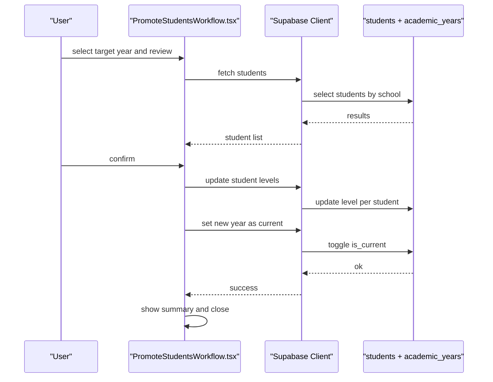

# Academic Records & History

<cite>
**Referenced Files in This Document**
- [AcademicHistoryTab.tsx](file://src/components/students/AcademicHistoryTab.tsx)
- [AnecdotalBehaviorTab.tsx](file://src/components/students/AnecdotalBehaviorTab.tsx)
- [StudentSubjectsManager.tsx](file://src/components/students/StudentSubjectsManager.tsx)
- [SubjectManagement.tsx](file://src/components/curriculum/SubjectManagement.tsx)
- [GradesManagement.tsx](file://src/components/grades/GradesManagement.tsx)
- [EnrollmentManagement.tsx](file://src/components/curriculum/EnrollmentManagement.tsx)
- [PromoteStudentsWorkflow.tsx](file://src/components/curriculum/PromoteStudentsWorkflow.tsx)
- [gradeComputation.ts](file://src/utils/gradeComputation.ts)
- [student.ts](file://src/types/student.ts)
- [20260205040000_school_year_segregation.sql](file://supabase/migrations/20260205040000_school_year_segregation.sql)
- [20260205041000_school_segregation_enhancements.sql](file://supabase/migrations/20260205041000_school_segregation_enhancements.sql)
- [20260205025900_create_raw_scores.sql](file://supabase/migrations/20260205025900_create_raw_scores.sql)
</cite>

## Table of Contents
1. [Introduction](#introduction)
2. [Project Structure](#project-structure)
3. [Core Components](#core-components)
4. [Architecture Overview](#architecture-overview)
5. [Detailed Component Analysis](#detailed-component-analysis)
6. [Dependency Analysis](#dependency-analysis)
7. [Performance Considerations](#performance-considerations)
8. [Troubleshooting Guide](#troubleshooting-guide)
9. [Conclusion](#conclusion)

## Introduction
This document explains the academic record management system, focusing on:
- Academic history tab interface for viewing historical grades and academic background
- Anecdotal behavior tracking for documenting student incidents and behavioral events
- Student subjects management for enrollment and status tracking
- Subject enrollment system and grade tracking workflows
- Academic progression features including promotion and year-end closing
- Integration with curriculum management and grade computation systems
- Examples of academic record updates, behavior documentation, and subject assignment workflows
- Data validation, audit trails, and historical record keeping

## Project Structure
The academic records and history features are implemented as React components integrated with Supabase for data persistence and a dedicated grade computation utility for DepEd-compliant grade handling. Database segregation is enforced via Supabase Row Level Security (RLS) policies and migration-driven schema enhancements.

**Diagram sources**
- [AcademicHistoryTab.tsx](file://src/components/students/AcademicHistoryTab.tsx#L1-L193)
- [AnecdotalBehaviorTab.tsx](file://src/components/students/AnecdotalBehaviorTab.tsx#L1-L316)
- [StudentSubjectsManager.tsx](file://src/components/students/StudentSubjectsManager.tsx#L1-L347)
- [SubjectManagement.tsx](file://src/components/curriculum/SubjectManagement.tsx#L1-L474)
- [GradesManagement.tsx](file://src/components/grades/GradesManagement.tsx#L1-L800)
- [EnrollmentManagement.tsx](file://src/components/curriculum/EnrollmentManagement.tsx#L1-L451)
- [PromoteStudentsWorkflow.tsx](file://src/components/curriculum/PromoteStudentsWorkflow.tsx#L1-L377)
- [gradeComputation.ts](file://src/utils/gradeComputation.ts#L1-L343)
- [student.ts](file://src/types/student.ts#L1-L82)

**Section sources**
- [AcademicHistoryTab.tsx](file://src/components/students/AcademicHistoryTab.tsx#L1-L193)
- [AnecdotalBehaviorTab.tsx](file://src/components/students/AnecdotalBehaviorTab.tsx#L1-L316)
- [StudentSubjectsManager.tsx](file://src/components/students/StudentSubjectsManager.tsx#L1-L347)
- [SubjectManagement.tsx](file://src/components/curriculum/SubjectManagement.tsx#L1-L474)
- [GradesManagement.tsx](file://src/components/grades/GradesManagement.tsx#L1-L800)
- [EnrollmentManagement.tsx](file://src/components/curriculum/EnrollmentManagement.tsx#L1-L451)
- [PromoteStudentsWorkflow.tsx](file://src/components/curriculum/PromoteStudentsWorkflow.tsx#L1-L377)
- [gradeComputation.ts](file://src/utils/gradeComputation.ts#L1-L343)
- [student.ts](file://src/types/student.ts#L1-L82)

## Core Components
- Academic History Tab: Displays academic background, enrollment history, and historical grade records with quarter and final grades.
- Anecdotal Behavior Tab: Manages behavior incidents with categories, statuses, and action documentation.
- Student Subjects Manager: Handles subject enrollment, status updates, and unenrollment for a selected academic year.
- Subject Management: Maintains the course catalog, grade-level availability, and subject activity.
- Grades Management: Provides grade entry, bulk operations, CSV import/export, and status transitions (draft, submitted, approved, finalized).
- Enrollment Management: Auto-enrolls students by grade level and displays enrollment statistics.
- Promote Students Workflow: Promotes students to the next grade, handles retention and graduation, and activates the new academic year.

**Section sources**
- [AcademicHistoryTab.tsx](file://src/components/students/AcademicHistoryTab.tsx#L38-L192)
- [AnecdotalBehaviorTab.tsx](file://src/components/students/AnecdotalBehaviorTab.tsx#L62-L315)
- [StudentSubjectsManager.tsx](file://src/components/students/StudentSubjectsManager.tsx#L67-L346)
- [SubjectManagement.tsx](file://src/components/curriculum/SubjectManagement.tsx#L46-L473)
- [GradesManagement.tsx](file://src/components/grades/GradesManagement.tsx#L123-L800)
- [EnrollmentManagement.tsx](file://src/components/curriculum/EnrollmentManagement.tsx#L35-L450)
- [PromoteStudentsWorkflow.tsx](file://src/components/curriculum/PromoteStudentsWorkflow.tsx#L61-L376)

## Architecture Overview
The system integrates UI components with Supabase for real-time data synchronization and RLS for tenant isolation across schools and academic years. Grade computations follow DepEd standards and are surfaced in both raw score storage and computed grade records.

**Diagram sources**
- [AcademicHistoryTab.tsx](file://src/components/students/AcademicHistoryTab.tsx#L38-L192)
- [AnecdotalBehaviorTab.tsx](file://src/components/students/AnecdotalBehaviorTab.tsx#L62-L315)
- [StudentSubjectsManager.tsx](file://src/components/students/StudentSubjectsManager.tsx#L67-L346)
- [SubjectManagement.tsx](file://src/components/curriculum/SubjectManagement.tsx#L46-L473)
- [GradesManagement.tsx](file://src/components/grades/GradesManagement.tsx#L123-L800)
- [EnrollmentManagement.tsx](file://src/components/curriculum/EnrollmentManagement.tsx#L35-L450)
- [PromoteStudentsWorkflow.tsx](file://src/components/curriculum/PromoteStudentsWorkflow.tsx#L61-L376)
- [gradeComputation.ts](file://src/utils/gradeComputation.ts#L1-L343)
- [student.ts](file://src/types/student.ts#L1-L82)
- [20260205040000_school_year_segregation.sql](file://supabase/migrations/20260205040000_school_year_segregation.sql#L76-L171)
- [20260205025900_create_raw_scores.sql](file://supabase/migrations/20260205025900_create_raw_scores.sql#L1-L48)

## Detailed Component Analysis

### Academic History Tab
Displays academic background, enrollment history, and historical grade records. It queries student_grades joined with subjects and academic_years, orders by creation date, and renders a responsive grades table with quarter and final grades.

**Diagram sources**
- [AcademicHistoryTab.tsx](file://src/components/students/AcademicHistoryTab.tsx#L41-L73)

**Section sources**
- [AcademicHistoryTab.tsx](file://src/components/students/AcademicHistoryTab.tsx#L38-L192)

### Anecdotal Behavior Tracking
Manages behavior incidents with categories, statuses, and action documentation. Supports create, update, delete, and modal-based editing with validation and toast feedback.

**Diagram sources**
- [AnecdotalBehaviorTab.tsx](file://src/components/students/AnecdotalBehaviorTab.tsx#L114-L151)

**Section sources**
- [AnecdotalBehaviorTab.tsx](file://src/components/students/AnecdotalBehaviorTab.tsx#L62-L315)

### Student Subjects Management
Handles subject enrollment for a selected academic year, filtering available subjects by grade level, and supports status updates and removal.

**Diagram sources**
- [StudentSubjectsManager.tsx](file://src/components/students/StudentSubjectsManager.tsx#L80-L186)

**Section sources**
- [StudentSubjectsManager.tsx](file://src/components/students/StudentSubjectsManager.tsx#L67-L346)

### Subject Management (Curriculum)
Maintains the course catalog, grade-level availability, and subject activity. Includes search, filters, and batch operations.

**Diagram sources**
- [SubjectManagement.tsx](file://src/components/curriculum/SubjectManagement.tsx#L59-L210)

**Section sources**
- [SubjectManagement.tsx](file://src/components/curriculum/SubjectManagement.tsx#L46-L473)

### Grades Management and Computation
Provides grade entry, bulk operations, CSV import/export, and status transitions. Uses gradeComputation utilities for DepEd-compliant grade handling.

**Diagram sources**
- [GradesManagement.tsx](file://src/components/grades/GradesManagement.tsx#L182-L246)
- [gradeComputation.ts](file://src/utils/gradeComputation.ts#L196-L227)

**Section sources**
- [GradesManagement.tsx](file://src/components/grades/GradesManagement.tsx#L123-L800)
- [gradeComputation.ts](file://src/utils/gradeComputation.ts#L1-L343)

### Enrollment Management
Auto-enrolls students to grade-level subjects for the selected academic year and displays enrollment statistics with expandable details.

**Diagram sources**
- [EnrollmentManagement.tsx](file://src/components/curriculum/EnrollmentManagement.tsx#L202-L258)

**Section sources**
- [EnrollmentManagement.tsx](file://src/components/curriculum/EnrollmentManagement.tsx#L35-L450)

### Academic Progression (Promote Students)
Promotes students to the next grade level, handles retention and graduation, and activates the new academic year.

**Diagram sources**
- [PromoteStudentsWorkflow.tsx](file://src/components/curriculum/PromoteStudentsWorkflow.tsx#L119-L174)

**Section sources**
- [PromoteStudentsWorkflow.tsx](file://src/components/curriculum/PromoteStudentsWorkflow.tsx#L61-L376)

## Dependency Analysis
The system relies on Supabase for data access and RLS, with database segregation enforced by migrations. Grade computation is encapsulated in a utility module.

**Diagram sources**
- [AcademicHistoryTab.tsx](file://src/components/students/AcademicHistoryTab.tsx#L1-L10)
- [AnecdotalBehaviorTab.tsx](file://src/components/students/AnecdotalBehaviorTab.tsx#L1-L20)
- [StudentSubjectsManager.tsx](file://src/components/students/StudentSubjectsManager.tsx#L1-L39)
- [SubjectManagement.tsx](file://src/components/curriculum/SubjectManagement.tsx#L1-L16)
- [GradesManagement.tsx](file://src/components/grades/GradesManagement.tsx#L1-L64)
- [EnrollmentManagement.tsx](file://src/components/curriculum/EnrollmentManagement.tsx#L1-L13)
- [PromoteStudentsWorkflow.tsx](file://src/components/curriculum/PromoteStudentsWorkflow.tsx#L1-L29)
- [gradeComputation.ts](file://src/utils/gradeComputation.ts#L1-L7)
- [student.ts](file://src/types/student.ts#L1-L8)
- [20260205040000_school_year_segregation.sql](file://supabase/migrations/20260205040000_school_year_segregation.sql#L76-L171)
- [20260205025900_create_raw_scores.sql](file://supabase/migrations/20260205025900_create_raw_scores.sql#L1-L48)

**Section sources**
- [20260205040000_school_year_segregation.sql](file://supabase/migrations/20260205040000_school_year_segregation.sql#L1-L264)
- [20260205041000_school_segregation_enhancements.sql](file://supabase/migrations/20260205041000_school_segregation_enhancements.sql#L1-L403)
- [20260205025900_create_raw_scores.sql](file://supabase/migrations/20260205025900_create_raw_scores.sql#L1-L48)

## Performance Considerations
- Database indexing: Composite indexes on students and raw_scores for school and academic year improve query performance.
- Real-time subscriptions: Supabase Realtime is enabled for relevant tables to keep UI synchronized.
- Pagination and virtualization: Large tables (grades, enrollments) use virtualized rendering and pagination to maintain responsiveness.
- Batch operations: Bulk grade entry and auto-enrollment minimize round trips and reduce UI latency.
- RLS overhead: Policies ensure data segregation but add minimal overhead; cache frequently accessed metadata (e.g., subjects, academic years).

[No sources needed since this section provides general guidance]

## Troubleshooting Guide
Common issues and resolutions:
- Data segregation violations: Ensure academic year belongs to the same school as the record; errors are raised by the validation function.
- Access denied: Verify user-school access roles and RLS policies; only authorized users can view or modify records.
- Duplicate enrollments: Prevent duplicate student-subject-academic-year combinations during auto-enrollment.
- Grade conflicts: Use CSV import validation to prevent mismatched student/subject/level combinations.
- Audit trail visibility: Admins can view access logs and export tracking; ensure appropriate permissions are granted.

**Section sources**
- [20260205040000_school_year_segregation.sql](file://supabase/migrations/20260205040000_school_year_segregation.sql#L206-L253)
- [20260205041000_school_segregation_enhancements.sql](file://supabase/migrations/20260205041000_school_segregation_enhancements.sql#L130-L240)

## Conclusion
The academic records and history system provides a comprehensive, secure, and scalable solution for managing student academic data. It integrates curriculum management, grade computation, and progression workflows while enforcing data segregation and auditability. The modular component architecture enables maintainability and extensibility for future enhancements.