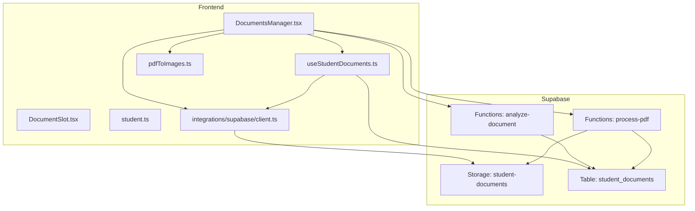
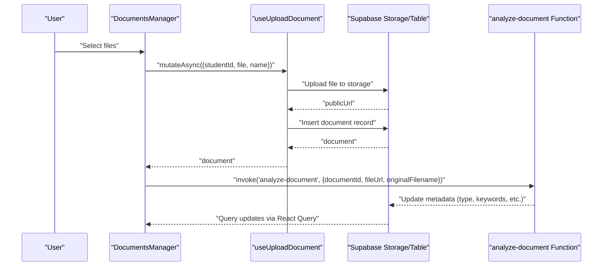
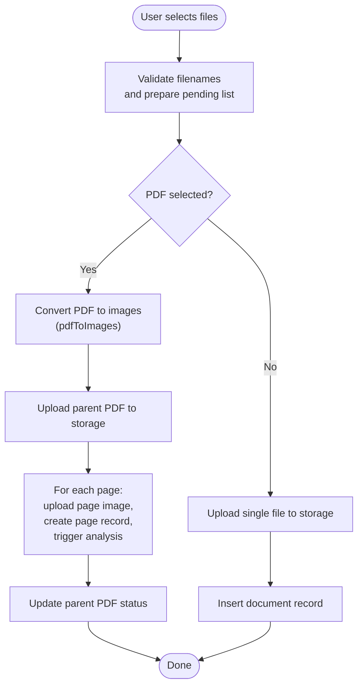
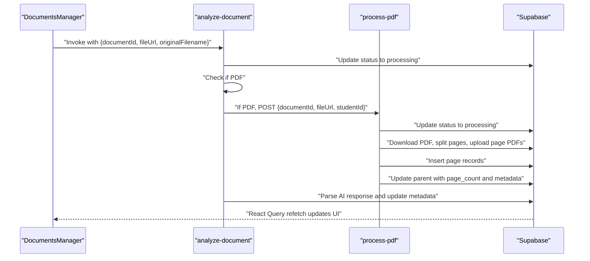
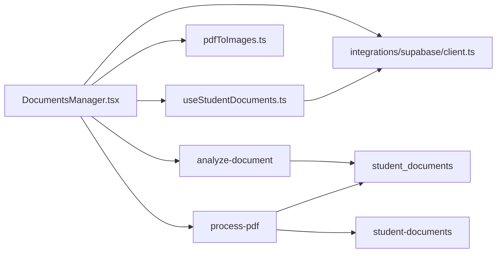

# Document Storage & Management

<cite>
**Referenced Files in This Document**
- [DocumentsManager.tsx](file://src/components/students/DocumentsManager.tsx)
- [DocumentSlot.tsx](file://src/components/students/DocumentSlot.tsx)
- [useStudentDocuments.ts](file://src/hooks/useStudentDocuments.ts)
- [student.ts](file://src/types/student.ts)
- [client.ts](file://src/integrations/supabase/client.ts)
- [index.ts](file://supabase/functions/analyze-document/index.ts)
- [index.ts](file://supabase/functions/process-pdf/index.ts)
- [pdfToImages.ts](file://src/utils/pdfToImages.ts)
</cite>

## Table of Contents
1. [Introduction](#introduction)
2. [Project Structure](#project-structure)
3. [Core Components](#core-components)
4. [Architecture Overview](#architecture-overview)
5. [Detailed Component Analysis](#detailed-component-analysis)
6. [Dependency Analysis](#dependency-analysis)
7. [Performance Considerations](#performance-considerations)
8. [Troubleshooting Guide](#troubleshooting-guide)
9. [Conclusion](#conclusion)
10. [Appendices](#appendices)

## Introduction
This document describes the student document storage and management system. It covers the document manager interface, upload and validation workflows, storage organization, the document slot system, metadata handling, cloud storage integration, document retrieval, access control, and security considerations for sensitive student data. It also explains how the system integrates with AI-powered analysis and PDF processing.

## Project Structure
The document management feature spans React components, TypeScript types, TanStack Query hooks, Supabase integration, and serverless functions for AI analysis and PDF processing.

**Diagram sources**
- [DocumentsManager.tsx](file://src/components/students/DocumentsManager.tsx#L89-L106)
- [DocumentSlot.tsx](file://src/components/students/DocumentSlot.tsx#L28-L35)
- [useStudentDocuments.ts](file://src/hooks/useStudentDocuments.ts#L5-L20)
- [student.ts](file://src/types/student.ts#L34-L44)
- [client.ts](file://src/integrations/supabase/client.ts)
- [index.ts](file://supabase/functions/analyze-document/index.ts#L19-L33)
- [index.ts](file://supabase/functions/process-pdf/index.ts#L16-L29)

**Section sources**
- [DocumentsManager.tsx](file://src/components/students/DocumentsManager.tsx#L89-L106)
- [DocumentSlot.tsx](file://src/components/students/DocumentSlot.tsx#L28-L35)
- [useStudentDocuments.ts](file://src/hooks/useStudentDocuments.ts#L5-L20)
- [student.ts](file://src/types/student.ts#L34-L44)
- [client.ts](file://src/integrations/supabase/client.ts)

## Core Components
- DocumentsManager: Full-featured document gallery, upload modal, viewer, deletion, search, and AI analysis triggers.
- DocumentSlot: Slot-based upload widget for predefined document categories.
- useStudentDocuments: TanStack Query hooks for fetching, uploading, deleting, and managing documents.
- Types: Shared TypeScript interfaces for student and document entities.
- Supabase client: Integration for storage and database operations.
- Serverless functions: analyze-document (AI analysis) and process-pdf (PDF splitting and page indexing).

**Section sources**
- [DocumentsManager.tsx](file://src/components/students/DocumentsManager.tsx#L89-L106)
- [DocumentSlot.tsx](file://src/components/students/DocumentSlot.tsx#L28-L35)
- [useStudentDocuments.ts](file://src/hooks/useStudentDocuments.ts#L22-L92)
- [student.ts](file://src/types/student.ts#L34-L44)
- [client.ts](file://src/integrations/supabase/client.ts)

## Architecture Overview
The system separates concerns across UI, data fetching/mutations, cloud storage, and AI processing:
- UI components orchestrate uploads, previews, and deletions.
- Hooks encapsulate Supabase operations and cache invalidation.
- Supabase storage holds files; the database tracks metadata and relationships.
- Serverless functions perform AI analysis and PDF page extraction.

**Diagram sources**
- [DocumentsManager.tsx](file://src/components/students/DocumentsManager.tsx#L236-L355)
- [useStudentDocuments.ts](file://src/hooks/useStudentDocuments.ts#L22-L92)
- [index.ts](file://supabase/functions/analyze-document/index.ts#L19-L33)

## Detailed Component Analysis

### DocumentsManager Component
Responsibilities:
- Accepts multiple file uploads via drag-and-drop or file input.
- Validates filenames and groups pending uploads.
- Converts PDFs to images, uploads page images, and creates page records linked to the parent PDF.
- Triggers AI analysis for uploaded documents and displays AI metadata.
- Provides a viewer for images and PDFs with page navigation.
- Supports deletion and search.

Key behaviors:
- Drag-and-drop overlay toggles during drag events.
- Pending files are validated before upload; empty names prevent submission.
- PDFs are converted to images using a utility and uploaded as page images; parent PDF record is updated with page count and status.
- AI analysis is invoked per document; status indicators reflect processing states.
- Viewer supports page thumbnails and navigation for multi-page PDFs.

**Diagram sources**
- [DocumentsManager.tsx](file://src/components/students/DocumentsManager.tsx#L236-L355)
- [pdfToImages.ts](file://src/utils/pdfToImages.ts)

**Section sources**
- [DocumentsManager.tsx](file://src/components/students/DocumentsManager.tsx#L151-L197)
- [DocumentsManager.tsx](file://src/components/students/DocumentsManager.tsx#L236-L355)
- [DocumentsManager.tsx](file://src/components/students/DocumentsManager.tsx#L756-L979)

### DocumentSlot Component
Responsibilities:
- Provides a slot-based upload area for predefined document types.
- Handles drag-and-drop and click-to-select.
- Displays upload status and allows viewing or removal.

Key behaviors:
- Uses a fixed label set for slot types.
- Calls parent callbacks for upload and delete.
- Shows visual feedback for drag state and upload completion.

**Section sources**
- [DocumentSlot.tsx](file://src/components/students/DocumentSlot.tsx#L28-L69)
- [DocumentSlot.tsx](file://src/components/students/DocumentSlot.tsx#L71-L188)

### useStudentDocuments Hooks
Responsibilities:
- Fetch documents for a student.
- Upload a document to storage and insert a record.
- Upload a parent PDF and track page count.
- Delete a document by removing the file and record.

Implementation highlights:
- Upload path generation uses student ID and timestamped filenames.
- Next slot number is computed from existing documents.
- Deletion removes the file from storage and the database record.
- Query keys enable cache invalidation after mutations.

**Section sources**
- [useStudentDocuments.ts](file://src/hooks/useStudentDocuments.ts#L5-L20)
- [useStudentDocuments.ts](file://src/hooks/useStudentDocuments.ts#L22-L92)
- [useStudentDocuments.ts](file://src/hooks/useStudentDocuments.ts#L94-L157)
- [useStudentDocuments.ts](file://src/hooks/useStudentDocuments.ts#L159-L192)

### Types
Defines the shape of student and document entities used across components and hooks.

**Section sources**
- [student.ts](file://src/types/student.ts#L34-L44)

### Supabase Integration
- Storage bucket: student-documents for document files.
- Table: student_documents for metadata, relationships, and AI analysis fields.
- Client: initialized integration for Supabase operations.

**Section sources**
- [useStudentDocuments.ts](file://src/hooks/useStudentDocuments.ts#L43-L86)
- [client.ts](file://src/integrations/supabase/client.ts)

### AI Analysis and PDF Processing Functions
- analyze-document:
  - Updates document status to processing.
  - For PDFs, delegates to process-pdf function.
  - For images, downloads the file, sends to Lovable AI Gateway, parses JSON, and updates metadata and filename.
  - Handles rate limits and credit errors.

- process-pdf:
  - Updates document status to processing.
  - Downloads PDF, extracts page count, splits into single-page PDFs, uploads to storage, and creates page records.
  - Updates parent document with page count and metadata.

**Diagram sources**
- [index.ts](file://supabase/functions/analyze-document/index.ts#L54-L84)
- [index.ts](file://supabase/functions/process-pdf/index.ts#L43-L50)
- [index.ts](file://supabase/functions/process-pdf/index.ts#L155-L167)

**Section sources**
- [index.ts](file://supabase/functions/analyze-document/index.ts#L19-L33)
- [index.ts](file://supabase/functions/analyze-document/index.ts#L86-L91)
- [index.ts](file://supabase/functions/analyze-document/index.ts#L132-L151)
- [index.ts](file://supabase/functions/analyze-document/index.ts#L256-L268)
- [index.ts](file://supabase/functions/process-pdf/index.ts#L16-L29)
- [index.ts](file://supabase/functions/process-pdf/index.ts#L43-L50)
- [index.ts](file://supabase/functions/process-pdf/index.ts#L155-L167)

## Dependency Analysis
- DocumentsManager depends on:
  - useStudentDocuments hooks for data and mutations.
  - Supabase client for storage and database operations.
  - pdfToImages utility for PDF conversion.
  - analyze-document and process-pdf functions for AI analysis and PDF processing.
- useStudentDocuments depends on:
  - Supabase client for storage and table operations.
  - React Query for caching and invalidation.
- Functions depend on:
  - Supabase service role for database writes.
  - External AI gateway for document analysis.

**Diagram sources**
- [DocumentsManager.tsx](file://src/components/students/DocumentsManager.tsx#L89-L106)
- [useStudentDocuments.ts](file://src/hooks/useStudentDocuments.ts#L22-L92)
- [index.ts](file://supabase/functions/analyze-document/index.ts#L45-L48)
- [index.ts](file://supabase/functions/process-pdf/index.ts#L39-L41)

**Section sources**
- [DocumentsManager.tsx](file://src/components/students/DocumentsManager.tsx#L89-L106)
- [useStudentDocuments.ts](file://src/hooks/useStudentDocuments.ts#L22-L92)

## Performance Considerations
- PDF conversion and page uploads:
  - Converting many pages can be resource-intensive. Consider limiting concurrent page uploads and batching updates.
  - Use progress indicators to inform users during conversion.
- AI analysis:
  - Rate limits and credits are handled by the analyze-document function. Implement retry logic and user notifications for transient failures.
- Caching:
  - React Query caches queries keyed by student ID. Invalidate appropriately after mutations to keep UI in sync.
- Storage:
  - Use efficient file naming and consider compression where appropriate.

[No sources needed since this section provides general guidance]

## Troubleshooting Guide
Common issues and resolutions:
- Upload fails with missing parameters:
  - Verify that studentId, file, and documentName are provided before invoking upload.
- PDF conversion errors:
  - Ensure the file is a valid PDF and that the conversion utility completes successfully.
- AI analysis errors:
  - Check AI gateway credentials and quotas. The function handles rate limits and credit exhaustion with specific responses.
- Deletion issues:
  - Confirm that the file URL path matches the storage bucket and that the record deletion succeeds.

**Section sources**
- [useStudentDocuments.ts](file://src/hooks/useStudentDocuments.ts#L159-L192)
- [index.ts](file://supabase/functions/analyze-document/index.ts#L35-L43)
- [index.ts](file://supabase/functions/analyze-document/index.ts#L187-L211)

## Conclusion
The document storage and management system provides a robust, AI-enhanced solution for handling student documents. It supports flexible uploads, intelligent categorization and metadata extraction, organized viewing, and secure cloud storage. The separation of concerns across UI, hooks, Supabase, and serverless functions ensures scalability and maintainability.

[No sources needed since this section summarizes without analyzing specific files]

## Appendices

### Document Slot System
- Slots represent predefined document categories (e.g., Birth Certificate, Report Card).
- Each slot can hold one document at a time.
- Visual feedback indicates whether a slot is filled or empty.

**Section sources**
- [DocumentSlot.tsx](file://src/components/students/DocumentSlot.tsx#L19-L26)
- [DocumentSlot.tsx](file://src/components/students/DocumentSlot.tsx#L123-L135)

### File Validation and Metadata Handling
- Accepted file types: PDF, JPG, JPEG, PNG, DOC, DOCX.
- Filename sanitization: Extensions are stripped for display; original extensions are preserved in uploads.
- Metadata fields:
  - Document name, type, URL, slot number, timestamps.
  - AI analysis fields: extracted text, detected type, summary, keywords, detected language, confidence score, analysis status.
  - PDF-specific fields: page count, page images, parent document ID, page number.

**Section sources**
- [DocumentsManager.tsx](file://src/components/students/DocumentsManager.tsx#L535-L538)
- [DocumentsManager.tsx](file://src/components/students/DocumentsManager.tsx#L69-L83)
- [student.ts](file://src/types/student.ts#L34-L44)
- [index.ts](file://supabase/functions/analyze-document/index.ts#L9-L17)

### Cloud Storage Organization
- Bucket: student-documents.
- Path pattern: {studentId}/{timestamp}-{filename}.
- Public URLs are generated for direct access.

**Section sources**
- [useStudentDocuments.ts](file://src/hooks/useStudentDocuments.ts#L43-L56)
- [useStudentDocuments.ts](file://src/hooks/useStudentDocuments.ts#L109-L121)

### Document Retrieval and Access Control
- Retrieval:
  - Documents are fetched by student ID and ordered by creation time.
  - Viewer opens public URLs for preview or download.
- Access control:
  - Supabase storage and database rows are scoped to student ID.
  - Serverless functions operate under service role with controlled access to resources.

**Section sources**
- [useStudentDocuments.ts](file://src/hooks/useStudentDocuments.ts#L6-L19)
- [DocumentsManager.tsx](file://src/components/students/DocumentsManager.tsx#L772-L781)

### Examples of Workflows

#### Upload Workflow
- Drag-and-drop or select files.
- Enter document names for each file.
- Confirm upload; the system:
  - Uploads to storage.
  - Inserts a record with computed slot number.
  - Triggers AI analysis for non-PDFs.
  - For PDFs, converts pages, uploads page images, and creates page records.

**Section sources**
- [DocumentsManager.tsx](file://src/components/students/DocumentsManager.tsx#L151-L197)
- [DocumentsManager.tsx](file://src/components/students/DocumentsManager.tsx#L236-L355)
- [useStudentDocuments.ts](file://src/hooks/useStudentDocuments.ts#L22-L92)

#### Validation Rules
- Non-empty document names are required before upload.
- Accepted file types are restricted to a predefined set.
- PDFs are processed separately to split into pages and trigger page-level analysis.

**Section sources**
- [DocumentsManager.tsx](file://src/components/students/DocumentsManager.tsx#L236-L241)
- [DocumentsManager.tsx](file://src/components/students/DocumentsManager.tsx#L535-L538)
- [DocumentsManager.tsx](file://src/components/students/DocumentsManager.tsx#L252-L314)

#### Management Operations
- Viewing: Click a document to open the viewer; navigate PDF pages if applicable.
- Deleting: Confirm deletion to remove the file and record.
- Searching: Filter by name, extracted text, summary, keywords, or detected type.

**Section sources**
- [DocumentsManager.tsx](file://src/components/students/DocumentsManager.tsx#L557-L649)
- [DocumentsManager.tsx](file://src/components/students/DocumentsManager.tsx#L756-L979)
- [DocumentsManager.tsx](file://src/components/students/DocumentsManager.tsx#L138-L149)
- [DocumentsManager.tsx](file://src/components/students/DocumentsManager.tsx#L357-L372)

### Security Considerations for Sensitive Student Data
- Principle of least privilege:
  - Serverless functions use the Supabase service role; restrict permissions to necessary operations.
- Data isolation:
  - All storage and database operations are scoped to the student ID.
- Secure access:
  - Public URLs are used for preview; ensure policies restrict access to authorized users.
- Audit and monitoring:
  - Track access logs and function invocations for compliance.

[No sources needed since this section provides general guidance]