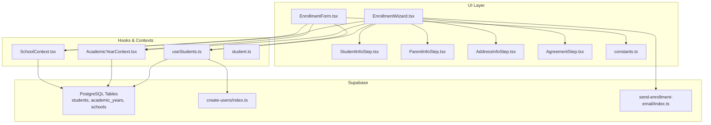
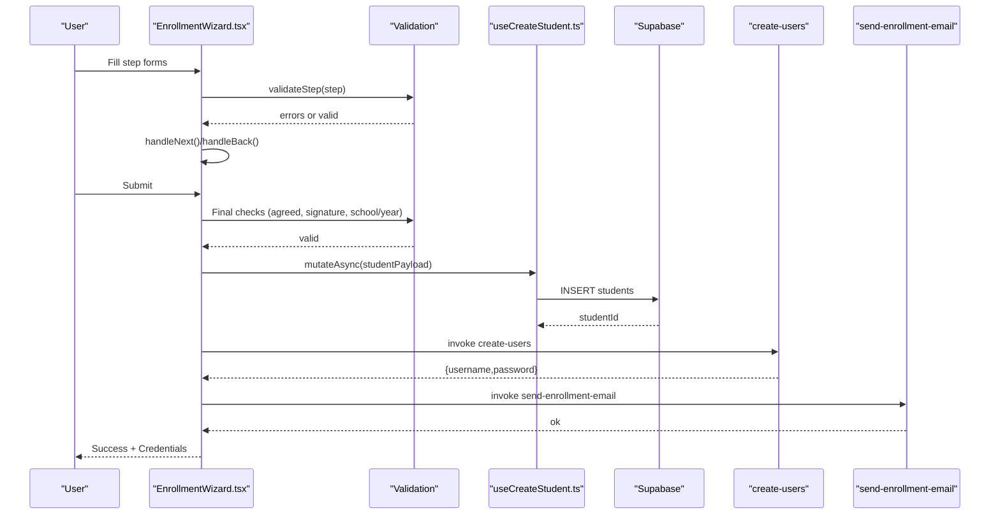
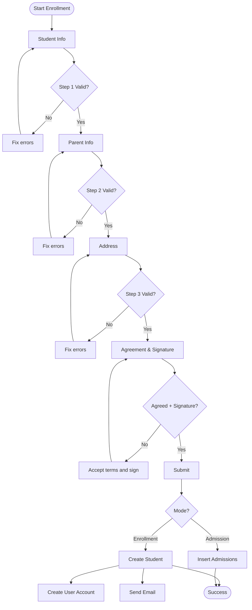
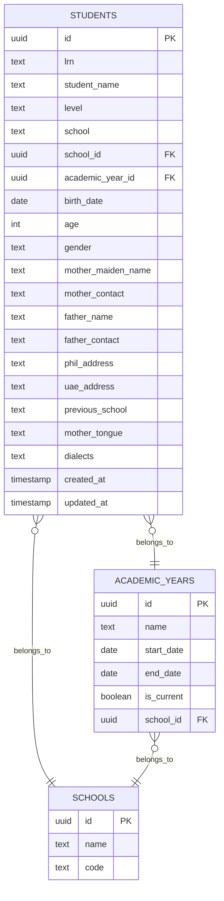
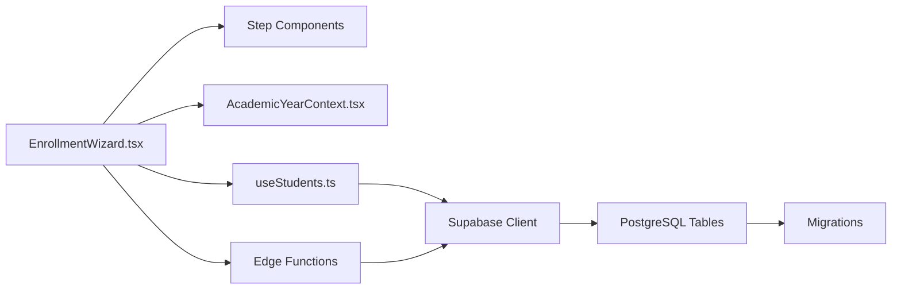

# Student Enrollment Process

<cite>
**Referenced Files in This Document**
- [EnrollmentWizard.tsx](file://src/components/enrollment/EnrollmentWizard.tsx)
- [EnrollmentForm.tsx](file://src/components/enrollment/EnrollmentForm.tsx)
- [StudentInfoStep.tsx](file://src/components/enrollment/steps/StudentInfoStep.tsx)
- [ParentInfoStep.tsx](file://src/components/enrollment/steps/ParentInfoStep.tsx)
- [AddressInfoStep.tsx](file://src/components/enrollment/steps/AddressInfoStep.tsx)
- [AgreementStep.tsx](file://src/components/enrollment/steps/AgreementStep.tsx)
- [constants.ts](file://src/components/enrollment/constants.ts)
- [useStudents.ts](file://src/hooks/useStudents.ts)
- [AcademicYearContext.tsx](file://src/contexts/AcademicYearContext.tsx)
- [SchoolContext.tsx](file://src/contexts/SchoolContext.tsx)
- [student.ts](file://src/types/student.ts)
- [20260205040000_school_year_segregation.sql](file://supabase/migrations/20260205040000_school_year_segregation.sql)
- [20260205041000_school_segregation_enhancements.sql](file://supabase/migrations/20260205041000_school_segregation_enhancements.sql)
- [create-users/index.ts](file://supabase/functions/create-users/index.ts)
- [send-enrollment-email/index.ts](file://supabase/functions/send-enrollment-email/index.ts)
- [AdmissionsPage.tsx](file://src/components/admissions/AdmissionsPage.tsx)
</cite>

## Table of Contents
1. [Introduction](#introduction)
2. [Project Structure](#project-structure)
3. [Core Components](#core-components)
4. [Architecture Overview](#architecture-overview)
5. [Detailed Component Analysis](#detailed-component-analysis)
6. [Dependency Analysis](#dependency-analysis)
7. [Performance Considerations](#performance-considerations)
8. [Troubleshooting Guide](#troubleshooting-guide)
9. [Conclusion](#conclusion)

## Introduction
This document explains the student enrollment system end-to-end, focusing on the multi-step enrollment wizard and the alternative single-form submission path. It covers step navigation, validation rules, data persistence, integration with Supabase, and the relationship with academic year tracking. It also documents the admission mode workflow and how it differs from direct enrollment.

## Project Structure
The enrollment system is implemented as a wizard-driven UI with reusable step components and a supporting constants module. Data operations leverage React Query hooks and Supabase integration. Academic year and school selection are managed via dedicated contexts. Database segregation across schools and academic years is enforced by Supabase policies and triggers.

**Diagram sources**
- [EnrollmentWizard.tsx](file://src/components/enrollment/EnrollmentWizard.tsx#L1-L509)
- [EnrollmentForm.tsx](file://src/components/enrollment/EnrollmentForm.tsx#L1-L782)
- [StudentInfoStep.tsx](file://src/components/enrollment/steps/StudentInfoStep.tsx#L1-L160)
- [ParentInfoStep.tsx](file://src/components/enrollment/steps/ParentInfoStep.tsx#L1-L83)
- [AddressInfoStep.tsx](file://src/components/enrollment/steps/AddressInfoStep.tsx#L1-L64)
- [AgreementStep.tsx](file://src/components/enrollment/steps/AgreementStep.tsx#L1-L83)
- [constants.ts](file://src/components/enrollment/constants.ts#L1-L20)
- [useStudents.ts](file://src/hooks/useStudents.ts#L1-L144)
- [AcademicYearContext.tsx](file://src/contexts/AcademicYearContext.tsx#L1-L116)
- [SchoolContext.tsx](file://src/contexts/SchoolContext.tsx#L1-L79)
- [student.ts](file://src/types/student.ts#L1-L82)
- [create-users/index.ts](file://supabase/functions/create-users/index.ts#L347-L376)
- [send-enrollment-email/index.ts](file://supabase/functions/send-enrollment-email/index.ts#L1-L200)

**Section sources**
- [EnrollmentWizard.tsx](file://src/components/enrollment/EnrollmentWizard.tsx#L1-L509)
- [EnrollmentForm.tsx](file://src/components/enrollment/EnrollmentForm.tsx#L1-L782)
- [constants.ts](file://src/components/enrollment/constants.ts#L1-L20)
- [useStudents.ts](file://src/hooks/useStudents.ts#L1-L144)
- [AcademicYearContext.tsx](file://src/contexts/AcademicYearContext.tsx#L1-L116)
- [SchoolContext.tsx](file://src/contexts/SchoolContext.tsx#L1-L79)
- [student.ts](file://src/types/student.ts#L1-L82)

## Core Components
- EnrollmentWizard: Multi-step wizard with four steps (Student Info, Parent Info, Address, Agreement). Handles validation per step, navigation, and submission. Supports two modes: enrollment (direct student creation) and admission (application submission).
- EnrollmentForm: Single-form alternative with inline validation and a confirmation dialog before submission.
- Step Components: Reusable step components for student info, parent/guardian info, address, and agreement/signature.
- Validation and Constants: Centralized constants for grade levels, school years, and genders; validation helpers for both wizard and form.
- Data Hooks: useCreateStudent integrates with Supabase to create student records and invalidate queries.
- Contexts: AcademicYearContext manages academic year selection and ensures segregation; SchoolContext provides school metadata.
- Types: Strongly typed interfaces for student data and form payloads.

**Section sources**
- [EnrollmentWizard.tsx](file://src/components/enrollment/EnrollmentWizard.tsx#L1-L509)
- [EnrollmentForm.tsx](file://src/components/enrollment/EnrollmentForm.tsx#L1-L782)
- [StudentInfoStep.tsx](file://src/components/enrollment/steps/StudentInfoStep.tsx#L1-L160)
- [ParentInfoStep.tsx](file://src/components/enrollment/steps/ParentInfoStep.tsx#L1-L83)
- [AddressInfoStep.tsx](file://src/components/enrollment/steps/AddressInfoStep.tsx#L1-L64)
- [AgreementStep.tsx](file://src/components/enrollment/steps/AgreementStep.tsx#L1-L83)
- [constants.ts](file://src/components/enrollment/constants.ts#L1-L20)
- [useStudents.ts](file://src/hooks/useStudents.ts#L43-L73)
- [AcademicYearContext.tsx](file://src/contexts/AcademicYearContext.tsx#L25-L107)
- [SchoolContext.tsx](file://src/contexts/SchoolContext.tsx#L51-L79)
- [student.ts](file://src/types/student.ts#L1-L82)

## Architecture Overview
The enrollment workflow integrates UI components, validation, and backend services:

- UI: Wizard and form collect data and enforce step-wise validation.
- Validation: Per-step validation in the wizard; comprehensive validation in the form.
- Submission: useCreateStudent inserts student records; optional admission mode writes to admissions.
- Accounts: Supabase Edge Function creates user accounts for enrolled students.
- Notifications: Supabase Edge Function sends enrollment confirmation emails.
- Persistence: Students are stored with school_id and academic_year_id for segregation.
- Academic Year: Selected year is enforced via context and validated before submission.

**Diagram sources**
- [EnrollmentWizard.tsx](file://src/components/enrollment/EnrollmentWizard.tsx#L76-L316)
- [useStudents.ts](file://src/hooks/useStudents.ts#L43-L73)
- [create-users/index.ts](file://supabase/functions/create-users/index.ts#L347-L376)
- [send-enrollment-email/index.ts](file://supabase/functions/send-enrollment-email/index.ts#L1-L200)

**Section sources**
- [EnrollmentWizard.tsx](file://src/components/enrollment/EnrollmentWizard.tsx#L76-L316)
- [useStudents.ts](file://src/hooks/useStudents.ts#L43-L73)
- [AcademicYearContext.tsx](file://src/contexts/AcademicYearContext.tsx#L25-L107)
- [20260205040000_school_year_segregation.sql](file://supabase/migrations/20260205040000_school_year_segregation.sql#L76-L171)

## Detailed Component Analysis

### EnrollmentWizard
- Purpose: Multi-step wizard with progress indicators and step-specific validation.
- Steps:
  - Student Info: Name, LRN (12 digits except Kinder), level, school year, birth date, gender, mother tongue, dialects.
  - Parent Info: Mother’s maiden name, mother’s contact, father’s name, father’s contact.
  - Address: Philippine address and optional previous school.
  - Agreement: Terms acceptance and signature capture.
- Navigation: Next/Back buttons with direction tracking; animated transitions.
- Validation:
  - Step 1: Name, LRN (12 digits), level, birth date, gender required; LRN optional for Kinder.
  - Step 2: Parents’ names and contacts required.
  - Step 3: Philippine address required.
  - Final: Agreement accepted and signature present; pre-submit guards check school and academic year.
- Submission:
  - Enrollment mode: Deduplicate LRN, create student, optionally generate QR code, invoke account creation function, send email, show success.
  - Admission mode: Insert into admissions table with status pending and audit log.

**Diagram sources**
- [EnrollmentWizard.tsx](file://src/components/enrollment/EnrollmentWizard.tsx#L76-L316)
- [StudentInfoStep.tsx](file://src/components/enrollment/steps/StudentInfoStep.tsx#L17-L159)
- [ParentInfoStep.tsx](file://src/components/enrollment/steps/ParentInfoStep.tsx#L13-L82)
- [AddressInfoStep.tsx](file://src/components/enrollment/steps/AddressInfoStep.tsx#L14-L63)
- [AgreementStep.tsx](file://src/components/enrollment/steps/AgreementStep.tsx#L17-L82)

**Section sources**
- [EnrollmentWizard.tsx](file://src/components/enrollment/EnrollmentWizard.tsx#L21-L26)
- [EnrollmentWizard.tsx](file://src/components/enrollment/EnrollmentWizard.tsx#L76-L140)
- [EnrollmentWizard.tsx](file://src/components/enrollment/EnrollmentWizard.tsx#L146-L316)

### EnrollmentForm
- Purpose: Single-page form with inline validation and a confirmation dialog.
- Validation:
  - Name: Required, minimum length.
  - LRN: Required for non-Kinder levels; must be 12 digits.
  - Level, birth date, gender: Required.
  - Parent contacts: Required and validated for phone number format.
  - Philippine address: Required.
- Submission:
  - Pre-submit checks for school and academic year.
  - LRN duplicate check against students table.
  - Creates student via useCreateStudent.
  - Invokes create-users function to provision credentials.
  - Shows success with printed confirmation.

**Section sources**
- [EnrollmentForm.tsx](file://src/components/enrollment/EnrollmentForm.tsx#L113-L168)
- [EnrollmentForm.tsx](file://src/components/enrollment/EnrollmentForm.tsx#L191-L290)

### Step Components
- StudentInfoStep: Collects personal and demographic data with conditional LRN requirement for Kinder.
- ParentInfoStep: Collects parent/guardian contact details.
- AddressInfoStep: Collects Philippine address and previous school.
- AgreementStep: Presents terms and captures signature via canvas.

**Section sources**
- [StudentInfoStep.tsx](file://src/components/enrollment/steps/StudentInfoStep.tsx#L17-L159)
- [ParentInfoStep.tsx](file://src/components/enrollment/steps/ParentInfoStep.tsx#L13-L82)
- [AddressInfoStep.tsx](file://src/components/enrollment/steps/AddressInfoStep.tsx#L14-L63)
- [AgreementStep.tsx](file://src/components/enrollment/steps/AgreementStep.tsx#L17-L82)

### Data Persistence and Academic Year Integration
- useCreateStudent enriches payload with school_id if missing and inserts into students.
- Academic year enforcement: Both wizard and form require selectedYearId from AcademicYearContext before submission.
- Database segregation: migrations add school_id and academic_year_id to students and enforce validation via triggers and policies.

**Diagram sources**
- [student.ts](file://src/types/student.ts#L1-L32)
- [20260205040000_school_year_segregation.sql](file://supabase/migrations/20260205040000_school_year_segregation.sql#L76-L171)
- [AcademicYearContext.tsx](file://src/contexts/AcademicYearContext.tsx#L25-L107)

**Section sources**
- [useStudents.ts](file://src/hooks/useStudents.ts#L43-L73)
- [AcademicYearContext.tsx](file://src/contexts/AcademicYearContext.tsx#L25-L107)
- [20260205040000_school_year_segregation.sql](file://supabase/migrations/20260205040000_school_year_segregation.sql#L76-L171)

### Admission Mode Workflow
- The wizard supports mode="admission", which inserts records into the admissions table instead of students.
- The admissions page opens the wizard in admission mode and refreshes the admissions list upon completion.

**Section sources**
- [EnrollmentWizard.tsx](file://src/components/enrollment/EnrollmentWizard.tsx#L174-L211)
- [AdmissionsPage.tsx](file://src/components/admissions/AdmissionsPage.tsx#L306-L323)

## Dependency Analysis
- UI depends on:
  - Step components for modular data collection.
  - Constants for controlled lists (levels, years, genders).
  - Contexts for school and academic year selection.
- Data hooks depend on:
  - Supabase client for CRUD operations.
  - Edge functions for user provisioning and notifications.
- Database depends on:
  - Migrations enforcing school and academic year segregation.
  - Row-level security policies ensuring data isolation.

**Diagram sources**
- [EnrollmentWizard.tsx](file://src/components/enrollment/EnrollmentWizard.tsx#L1-L509)
- [useStudents.ts](file://src/hooks/useStudents.ts#L1-L144)
- [AcademicYearContext.tsx](file://src/contexts/AcademicYearContext.tsx#L1-L116)
- [20260205040000_school_year_segregation.sql](file://supabase/migrations/20260205040000_school_year_segregation.sql#L1-L264)

**Section sources**
- [EnrollmentWizard.tsx](file://src/components/enrollment/EnrollmentWizard.tsx#L1-L509)
- [useStudents.ts](file://src/hooks/useStudents.ts#L1-L144)
- [AcademicYearContext.tsx](file://src/contexts/AcademicYearContext.tsx#L1-L116)
- [20260205040000_school_year_segregation.sql](file://supabase/migrations/20260205040000_school_year_segregation.sql#L1-L264)

## Performance Considerations
- Use React Query caching and invalidation to avoid redundant queries after enrollment.
- Debounce or batch validation updates to reduce re-renders during typing.
- Lazy-load signature canvas to minimize initial bundle size.
- Use server-side pagination for large datasets (not currently used in enrollment).
- Keep migration indexes minimal and targeted to avoid write overhead.

## Troubleshooting Guide
- Validation errors:
  - Ensure required fields are filled and formatted correctly (phone numbers, LRN).
  - For Kinder levels, LRN is optional; remove LRN validation when level is Kinder.
- Submission failures:
  - Verify selected academic year and school are valid before submitting.
  - Check for duplicate LRN in the same school.
  - Confirm Edge Functions are reachable and functioning.
- Credential creation:
  - If account creation fails, the system still enrolls the student but displays a warning; retry or check auth service.
- Email delivery:
  - If email fails, check function logs and recipient contact format.

**Section sources**
- [EnrollmentWizard.tsx](file://src/components/enrollment/EnrollmentWizard.tsx#L157-L166)
- [EnrollmentWizard.tsx](file://src/components/enrollment/EnrollmentWizard.tsx#L214-L237)
- [create-users/index.ts](file://supabase/functions/create-users/index.ts#L347-L376)

## Conclusion
The enrollment system provides two complementary paths: a guided wizard and a streamlined form. Robust validation, academic year and school segregation, and integrated account/email provisioning deliver a reliable onboarding experience. The modular step components and centralized contexts support maintainability and extensibility.