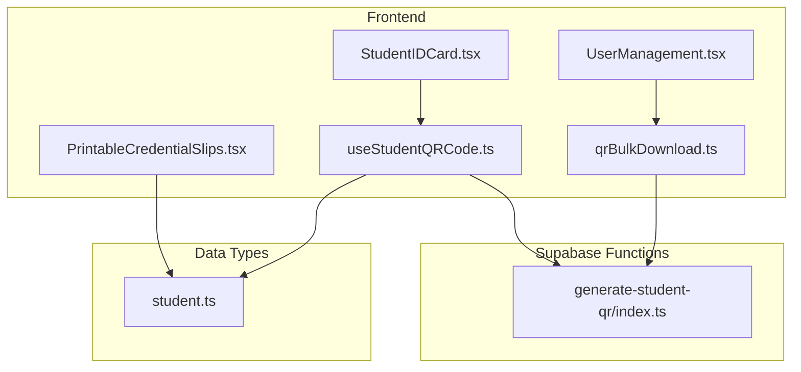
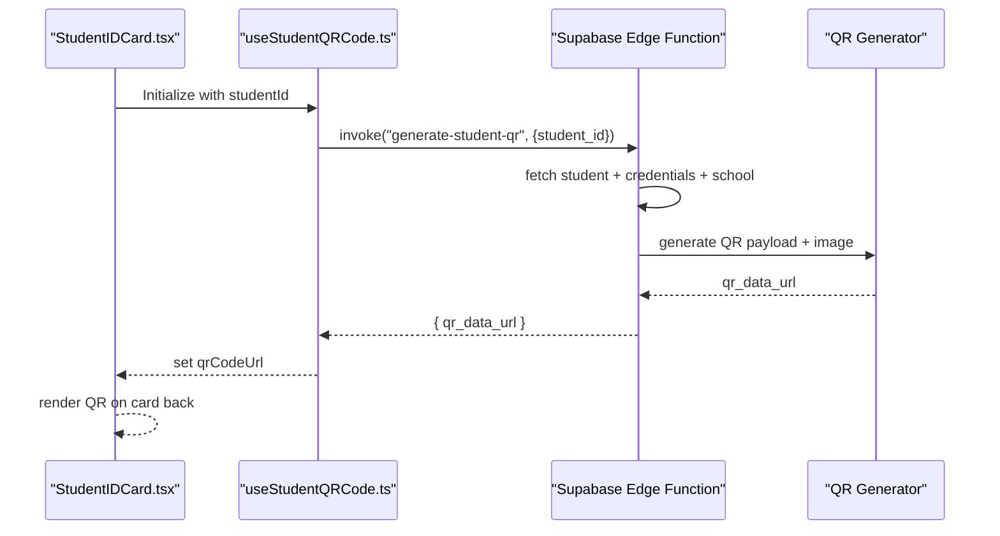
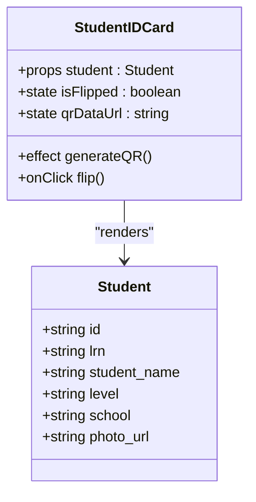
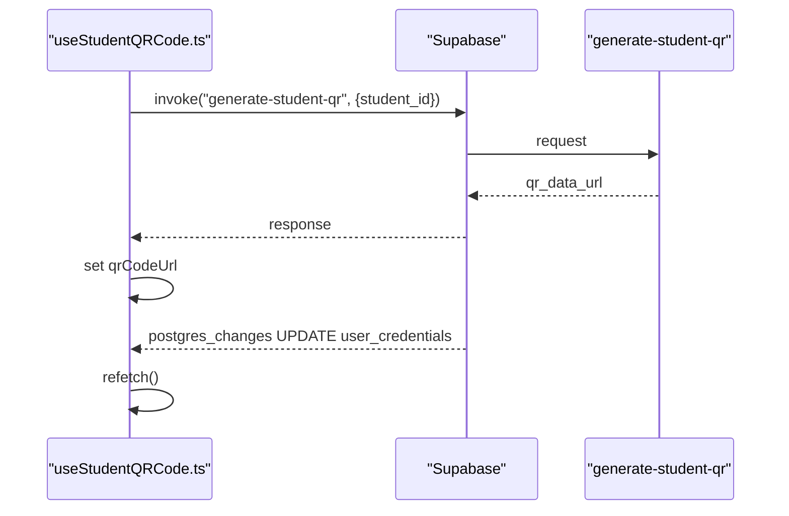
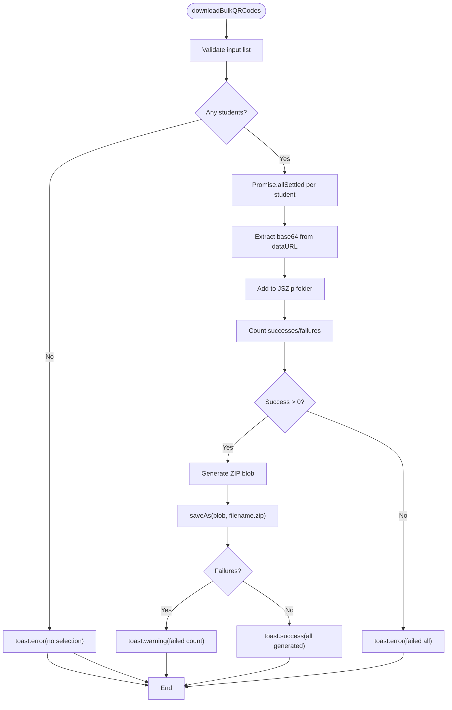
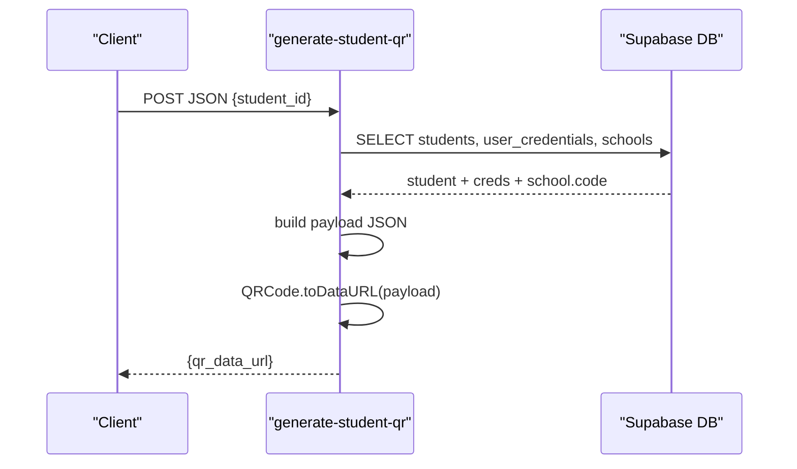
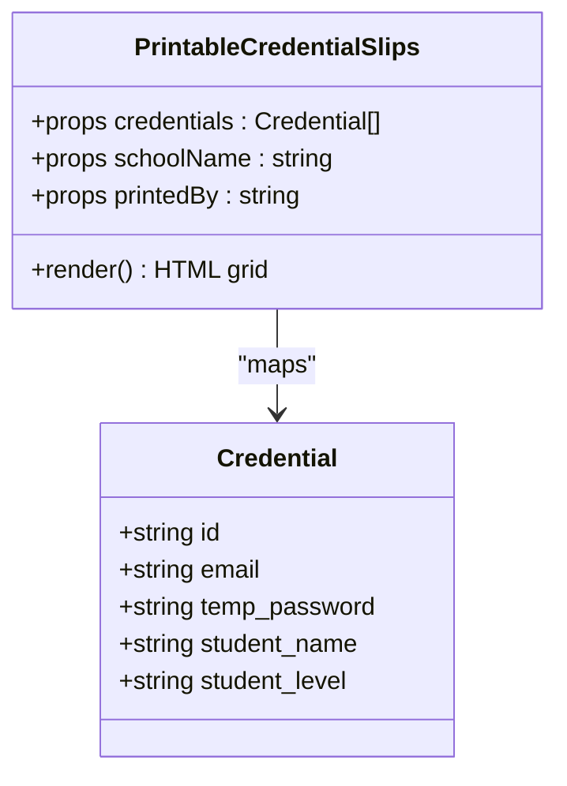
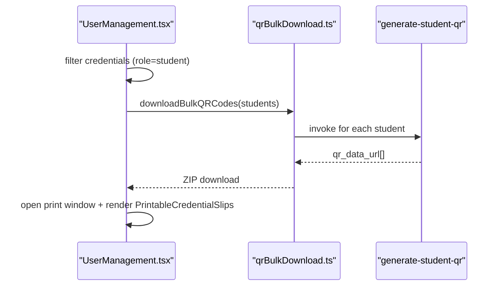
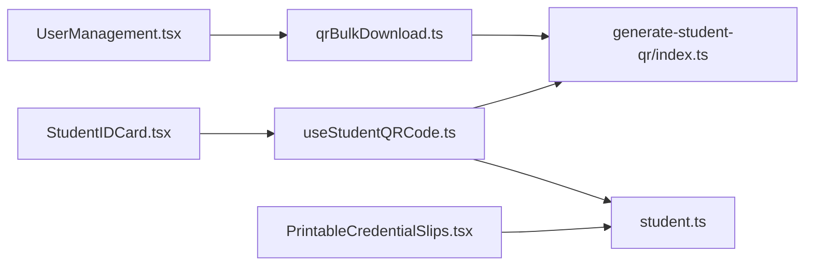

# Student ID Cards & Credentials

<cite>
**Referenced Files in This Document**
- [StudentIDCard.tsx](file://src/components/students/StudentIDCard.tsx)
- [useStudentQRCode.ts](file://src/hooks/useStudentQRCode.ts)
- [qrBulkDownload.ts](file://src/utils/qrBulkDownload.ts)
- [generate-student-qr/index.ts](file://supabase/functions/generate-student-qr/index.ts)
- [PrintableCredentialSlips.tsx](file://src/components/admin/PrintableCredentialSlips.tsx)
- [UserManagement.tsx](file://src/components/admin/UserManagement.tsx)
- [student.ts](file://src/types/student.ts)
- [Auth.tsx](file://src/pages/Auth.tsx)
</cite>

## Table of Contents
1. [Introduction](#introduction)
2. [Project Structure](#project-structure)
3. [Core Components](#core-components)
4. [Architecture Overview](#architecture-overview)
5. [Detailed Component Analysis](#detailed-component-analysis)
6. [Dependency Analysis](#dependency-analysis)
7. [Performance Considerations](#performance-considerations)
8. [Troubleshooting Guide](#troubleshooting-guide)
9. [Security Considerations](#security-considerations)
10. [Examples & How-To Guides](#examples--how-to-guides)
11. [Conclusion](#conclusion)

## Introduction
This document explains the student ID card and credential system, focusing on:
- ID card generation and interactive flip experience
- QR code creation and bulk download workflows
- Credential formatting and printable slip generation
- Print optimization and barcode-like QR representation
- Integration with QR generation utilities and Supabase functions
- Batch operations and customization examples
- Security considerations for credential distribution and authentication integration

## Project Structure
The system spans frontend components, hooks, utilities, and serverless functions:
- Frontend components render student ID cards and printable credential slips
- Hooks orchestrate QR retrieval and real-time updates
- Utilities support bulk QR generation and packaging
- Supabase Edge Functions generate QR codes server-side
- Authentication integrates with credential-based login

**Diagram sources**
- [StudentIDCard.tsx](file://src/components/students/StudentIDCard.tsx#L1-L217)
- [useStudentQRCode.ts](file://src/hooks/useStudentQRCode.ts#L1-L60)
- [qrBulkDownload.ts](file://src/utils/qrBulkDownload.ts#L1-L65)
- [generate-student-qr/index.ts](file://supabase/functions/generate-student-qr/index.ts#L1-L100)
- [PrintableCredentialSlips.tsx](file://src/components/admin/PrintableCredentialSlips.tsx#L1-L184)
- [UserManagement.tsx](file://src/components/admin/UserManagement.tsx#L1-L200)
- [student.ts](file://src/types/student.ts#L1-L82)

**Section sources**
- [StudentIDCard.tsx](file://src/components/students/StudentIDCard.tsx#L1-L217)
- [useStudentQRCode.ts](file://src/hooks/useStudentQRCode.ts#L1-L60)
- [qrBulkDownload.ts](file://src/utils/qrBulkDownload.ts#L1-L65)
- [generate-student-qr/index.ts](file://supabase/functions/generate-student-qr/index.ts#L1-L100)
- [PrintableCredentialSlips.tsx](file://src/components/admin/PrintableCredentialSlips.tsx#L1-L184)
- [UserManagement.tsx](file://src/components/admin/UserManagement.tsx#L1-L200)
- [student.ts](file://src/types/student.ts#L1-L82)

## Core Components
- Student ID Card renderer with front/back QR details and flip animation
- Hook for fetching and subscribing to QR code updates
- Utility for bulk QR generation and ZIP packaging
- Supabase Edge Function for QR generation from student data
- Printable credential slips optimized for A4 printouts
- Admin panel actions for printing and bulk QR downloads

**Section sources**
- [StudentIDCard.tsx](file://src/components/students/StudentIDCard.tsx#L18-L217)
- [useStudentQRCode.ts](file://src/hooks/useStudentQRCode.ts#L4-L59)
- [qrBulkDownload.ts](file://src/utils/qrBulkDownload.ts#L11-L64)
- [generate-student-qr/index.ts](file://supabase/functions/generate-student-qr/index.ts#L15-L99)
- [PrintableCredentialSlips.tsx](file://src/components/admin/PrintableCredentialSlips.tsx#L17-L181)
- [UserManagement.tsx](file://src/components/admin/UserManagement.tsx#L129-L154)

## Architecture Overview
The system generates QR codes server-side using Supabase Edge Functions, caches and subscribes to updates on the client, and supports batch operations for efficient distribution.

**Diagram sources**
- [StudentIDCard.tsx](file://src/components/students/StudentIDCard.tsx#L22-L43)
- [useStudentQRCode.ts](file://src/hooks/useStudentQRCode.ts#L9-L26)
- [generate-student-qr/index.ts](file://supabase/functions/generate-student-qr/index.ts#L15-L99)

## Detailed Component Analysis

### Student ID Card Component
- Renders a front/back 3D-flip card with gradient styling and glossy effects
- Generates QR code client-side using the LRN for quick verification
- Displays student photo, name, LRN, level, and session
- Back face shows QR code and verification details

**Diagram sources**
- [StudentIDCard.tsx](file://src/components/students/StudentIDCard.tsx#L18-L217)
- [student.ts](file://src/types/student.ts#L1-L32)

**Section sources**
- [StudentIDCard.tsx](file://src/components/students/StudentIDCard.tsx#L22-L198)
- [student.ts](file://src/types/student.ts#L1-L32)

### QR Code Hook and Real-Time Updates
- Invokes the Supabase Edge Function to generate QR data URLs
- Subscribes to database changes on user credentials to refresh QR automatically
- Manages loading and error states

**Diagram sources**
- [useStudentQRCode.ts](file://src/hooks/useStudentQRCode.ts#L9-L56)
- [generate-student-qr/index.ts](file://supabase/functions/generate-student-qr/index.ts#L14-L26)

**Section sources**
- [useStudentQRCode.ts](file://src/hooks/useStudentQRCode.ts#L4-L59)

### Bulk QR Download Utility
- Accepts a list of student IDs and names
- Calls the Edge Function for each student concurrently
- Packages successful QR images into a downloadable ZIP archive
- Provides user feedback via toast notifications

**Diagram sources**
- [qrBulkDownload.ts](file://src/utils/qrBulkDownload.ts#L11-L64)

**Section sources**
- [qrBulkDownload.ts](file://src/utils/qrBulkDownload.ts#L11-L64)

### Supabase Edge Function: QR Generation
- Validates request and fetches student, credentials, and school code
- Builds a QR payload combining LRN, temporary password, and school code
- Renders QR image and returns a data URL with cache-control headers

**Diagram sources**
- [generate-student-qr/index.ts](file://supabase/functions/generate-student-qr/index.ts#L15-L99)

**Section sources**
- [generate-student-qr/index.ts](file://supabase/functions/generate-student-qr/index.ts#L15-L99)

### Printable Credential Slips
- Formats student login credentials into a print-friendly grid
- Uses A4 print styles with cut lines and audit metadata
- Supports customization of school name and printed-by information

**Diagram sources**
- [PrintableCredentialSlips.tsx](file://src/components/admin/PrintableCredentialSlips.tsx#L17-L181)

**Section sources**
- [PrintableCredentialSlips.tsx](file://src/components/admin/PrintableCredentialSlips.tsx#L17-L181)

### Admin Panel Integration
- Filters and selects student credentials for batch operations
- Initiates bulk QR download and prints credential slips
- Opens a dedicated print window with embedded styles

**Diagram sources**
- [UserManagement.tsx](file://src/components/admin/UserManagement.tsx#L129-L154)
- [qrBulkDownload.ts](file://src/utils/qrBulkDownload.ts#L11-L64)
- [generate-student-qr/index.ts](file://supabase/functions/generate-student-qr/index.ts#L14-L26)

**Section sources**
- [UserManagement.tsx](file://src/components/admin/UserManagement.tsx#L129-L154)

## Dependency Analysis
- Frontend components depend on:
  - Student type definitions
  - Supabase client for function invocation
  - QR libraries for client-side generation and server-side rendering
- Backend depends on:
  - Supabase for student, credentials, and school data
  - QR generator for image output

**Diagram sources**
- [StudentIDCard.tsx](file://src/components/students/StudentIDCard.tsx#L1-L217)
- [useStudentQRCode.ts](file://src/hooks/useStudentQRCode.ts#L1-L60)
- [UserManagement.tsx](file://src/components/admin/UserManagement.tsx#L1-L200)
- [qrBulkDownload.ts](file://src/utils/qrBulkDownload.ts#L1-L65)
- [generate-student-qr/index.ts](file://supabase/functions/generate-student-qr/index.ts#L1-L100)
- [PrintableCredentialSlips.tsx](file://src/components/admin/PrintableCredentialSlips.tsx#L1-L184)
- [student.ts](file://src/types/student.ts#L1-L82)

**Section sources**
- [student.ts](file://src/types/student.ts#L1-L82)

## Performance Considerations
- Client-side QR generation for immediate preview reduces latency for single cards
- Server-side generation ensures consistent quality and avoids client resource constraints
- Bulk operations use concurrent requests with aggregated feedback to minimize total wait time
- Print styles optimize for A4 and reduce bandwidth by avoiding unnecessary DOM elements during print

[No sources needed since this section provides general guidance]

## Troubleshooting Guide
- QR generation errors:
  - Verify student_id is present and valid
  - Confirm credentials exist for the student; otherwise, QR payload will include empty password
  - Inspect function logs for database errors or missing records
- Bulk download failures:
  - Ensure at least one student is selected
  - Check network connectivity and function availability
  - Review toast messages for partial success vs. failure counts
- Real-time updates:
  - Confirm database change subscriptions are active and channel names match expectations
  - Validate that updates to user credentials trigger re-generation

**Section sources**
- [useStudentQRCode.ts](file://src/hooks/useStudentQRCode.ts#L19-L25)
- [qrBulkDownload.ts](file://src/utils/qrBulkDownload.ts#L41-L44)
- [generate-student-qr/index.ts](file://supabase/functions/generate-student-qr/index.ts#L18-L45)

## Security Considerations
- Temporary passwords are included in QR payloads; treat QRs as sensitive and restrict distribution
- Use secure transport (TLS) and avoid sharing QRs publicly
- Enforce access controls on administrative actions that generate or print credentials
- Monitor authentication logs and consider lockout policies for repeated failed attempts
- Keep credential lifecycles short and require password changes upon first login

**Section sources**
- [generate-student-qr/index.ts](file://supabase/functions/generate-student-qr/index.ts#L65-L70)
- [Auth.tsx](file://src/pages/Auth.tsx#L79-L99)

## Examples & How-To Guides

### Customize ID Card Appearance
- Modify gradient colors, borders, and typography in the card component
- Adjust QR size and margins for different print resolutions
- Replace placeholder icons with branded assets

**Section sources**
- [StudentIDCard.tsx](file://src/components/students/StudentIDCard.tsx#L58-L123)

### Generate a Single QR Code
- Use the hook to fetch QR data URL for a given student ID
- Render the QR on the card back or export independently

**Section sources**
- [useStudentQRCode.ts](file://src/hooks/useStudentQRCode.ts#L9-L26)

### Scan QR Codes
- Use a mobile device camera app capable of reading QR codes
- Point at the QR on the card back to reveal encoded student and credential data

[No sources needed since this section provides general guidance]

### Perform Batch Operations
- Filter student credentials in the admin panel
- Download QR codes as a ZIP archive
- Print credential slips for distribution

**Section sources**
- [UserManagement.tsx](file://src/components/admin/UserManagement.tsx#L129-L154)
- [qrBulkDownload.ts](file://src/utils/qrBulkDownload.ts#L11-L64)
- [PrintableCredentialSlips.tsx](file://src/components/admin/PrintableCredentialSlips.tsx#L17-L181)

## Conclusion
The system provides a cohesive solution for student ID card generation, QR code creation, and credential distribution. It balances client-side interactivity with server-side reliability, offers robust print and batch capabilities, and integrates with authentication and real-time updates for a secure and efficient workflow.