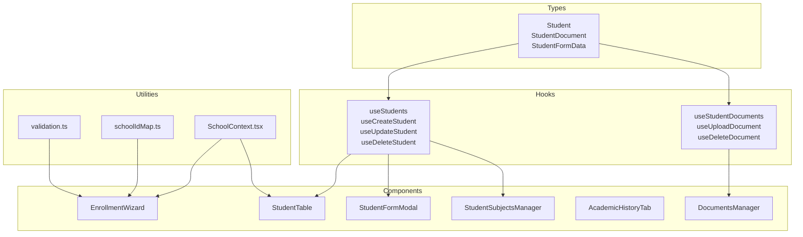
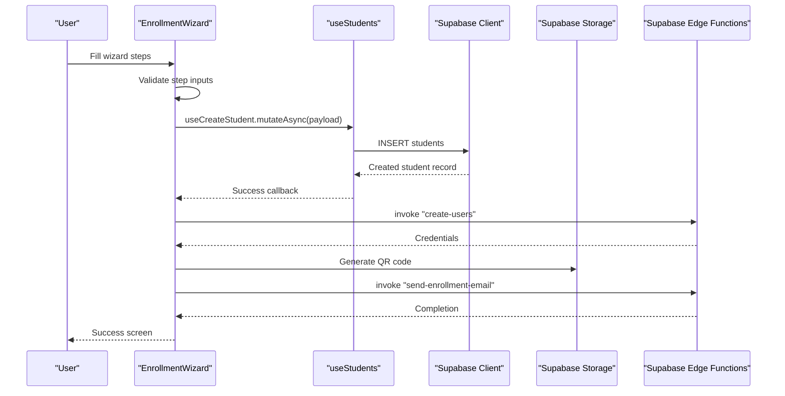
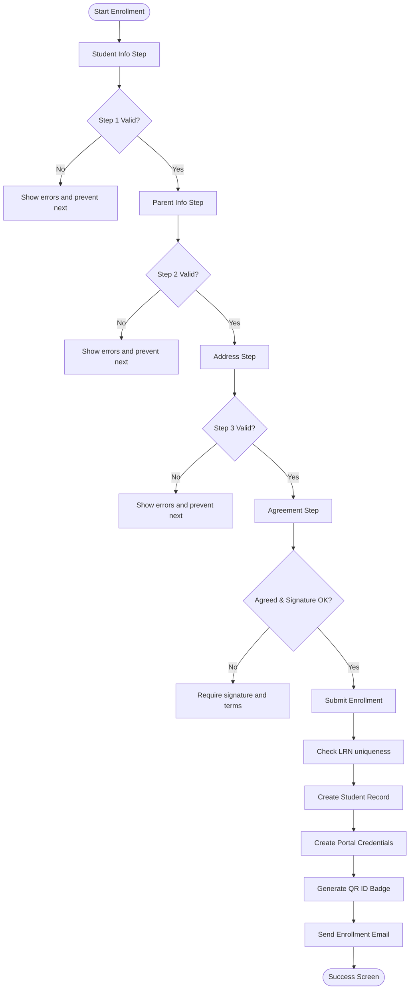
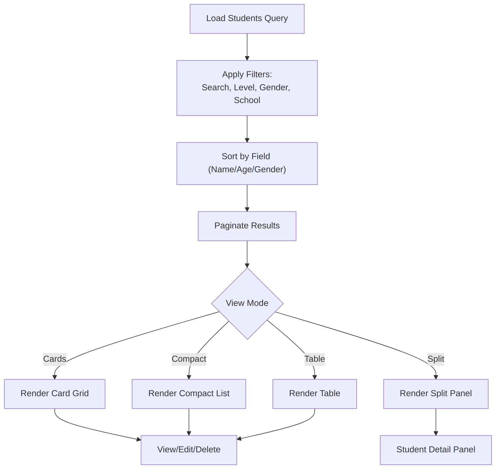
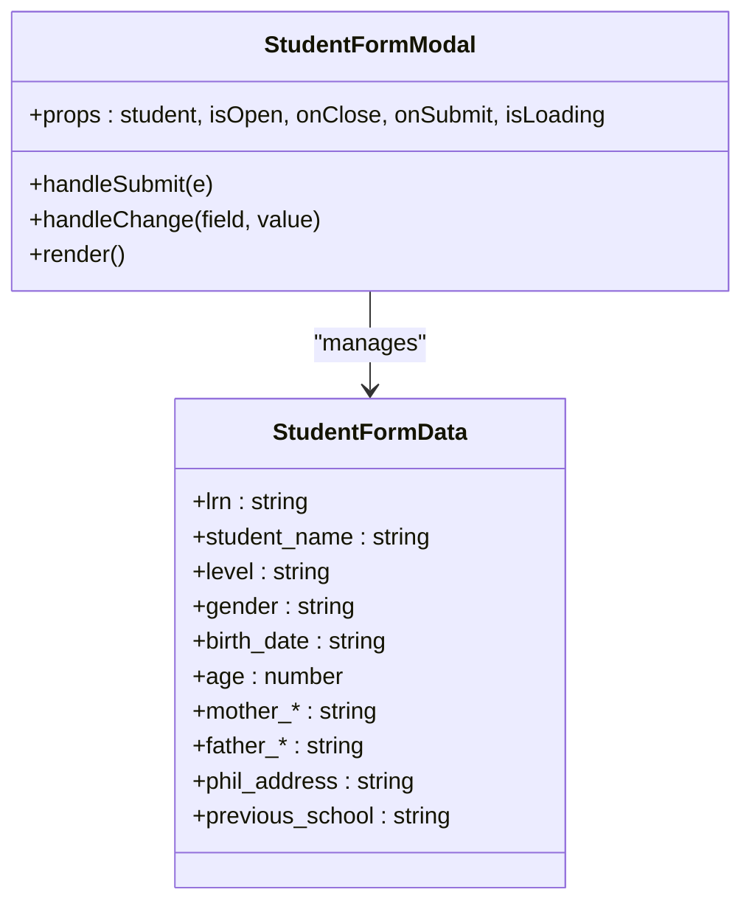
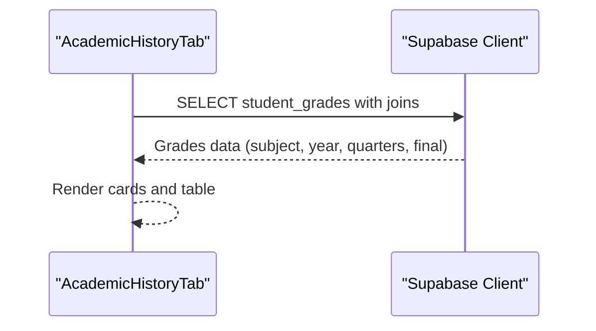
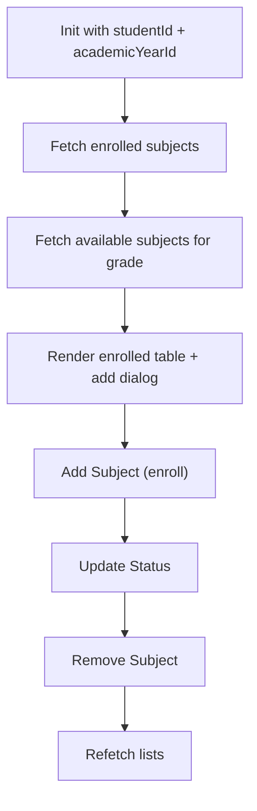
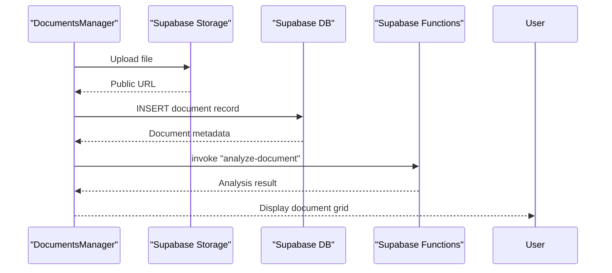
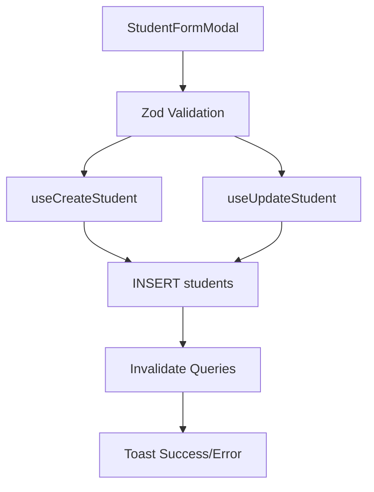
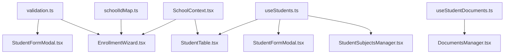

# Student Management System

<cite>
**Referenced Files in This Document**
- [student.ts](file://src/types/student.ts)
- [validation.ts](file://src/lib/validation.ts)
- [useStudents.ts](file://src/hooks/useStudents.ts)
- [useStudentDocuments.ts](file://src/hooks/useStudentDocuments.ts)
- [StudentTable.tsx](file://src/components/students/StudentTable.tsx)
- [StudentFormModal.tsx](file://src/components/students/StudentFormModal.tsx)
- [DocumentsManager.tsx](file://src/components/students/DocumentsManager.tsx)
- [AcademicHistoryTab.tsx](file://src/components/students/AcademicHistoryTab.tsx)
- [StudentSubjectsManager.tsx](file://src/components/students/StudentSubjectsManager.tsx)
- [EnrollmentWizard.tsx](file://src/components/enrollment/EnrollmentWizard.tsx)
- [schoolIdMap.ts](file://src/utils/schoolIdMap.ts)
- [SchoolContext.tsx](file://src/contexts/SchoolContext.tsx)
</cite>

## Table of Contents
1. [Introduction](#introduction)
2. [Project Structure](#project-structure)
3. [Core Components](#core-components)
4. [Architecture Overview](#architecture-overview)
5. [Detailed Component Analysis](#detailed-component-analysis)
6. [Dependency Analysis](#dependency-analysis)
7. [Performance Considerations](#performance-considerations)
8. [Troubleshooting Guide](#troubleshooting-guide)
9. [Conclusion](#conclusion)

## Introduction
This document describes the complete student lifecycle within the St. Francis Xavier Smart Academy Inc (SFXSAI) student management system. It covers the enrollment wizard, academic record management, student profile administration, and document storage capabilities. The documentation explains the enrollment process flow, student data validation, academic history tracking, the student table interface, search functionality, profile management features, student subjects management, academic year tracking, and data segregation between schools. It also provides examples of CRUD operations, form handling, and data validation patterns.

## Project Structure
The system is organized around feature-based components with shared hooks, types, and utilities:
- Types define the core data structures for students, documents, and forms.
- Hooks encapsulate Supabase data access and mutations for students and documents.
- Components implement UI for enrollment, profiles, tables, documents, and academic records.
- Utilities and contexts support validation, school mapping, and academic year scoping.

**Diagram sources**
- [student.ts](file://src/types/student.ts#L1-L82)
- [validation.ts](file://src/lib/validation.ts#L1-L293)
- [useStudents.ts](file://src/hooks/useStudents.ts#L1-L144)
- [useStudentDocuments.ts](file://src/hooks/useStudentDocuments.ts#L1-L230)
- [EnrollmentWizard.tsx](file://src/components/enrollment/EnrollmentWizard.tsx#L1-L508)
- [StudentTable.tsx](file://src/components/students/StudentTable.tsx#L1-L820)
- [StudentFormModal.tsx](file://src/components/students/StudentFormModal.tsx#L1-L300)
- [DocumentsManager.tsx](file://src/components/students/DocumentsManager.tsx#L1-L979)
- [AcademicHistoryTab.tsx](file://src/components/students/AcademicHistoryTab.tsx#L1-L193)
- [StudentSubjectsManager.tsx](file://src/components/students/StudentSubjectsManager.tsx#L1-L347)
- [schoolIdMap.ts](file://src/utils/schoolIdMap.ts#L1-L14)
- [SchoolContext.tsx](file://src/contexts/SchoolContext.tsx#L1-L79)

**Section sources**
- [student.ts](file://src/types/student.ts#L1-L82)
- [validation.ts](file://src/lib/validation.ts#L1-L293)
- [useStudents.ts](file://src/hooks/useStudents.ts#L1-L144)
- [useStudentDocuments.ts](file://src/hooks/useStudentDocuments.ts#L1-L230)
- [EnrollmentWizard.tsx](file://src/components/enrollment/EnrollmentWizard.tsx#L1-L508)
- [StudentTable.tsx](file://src/components/students/StudentTable.tsx#L1-L820)
- [StudentFormModal.tsx](file://src/components/students/StudentFormModal.tsx#L1-L300)
- [DocumentsManager.tsx](file://src/components/students/DocumentsManager.tsx#L1-L979)
- [AcademicHistoryTab.tsx](file://src/components/students/AcademicHistoryTab.tsx#L1-L193)
- [StudentSubjectsManager.tsx](file://src/components/students/StudentSubjectsManager.tsx#L1-L347)
- [schoolIdMap.ts](file://src/utils/schoolIdMap.ts#L1-L14)
- [SchoolContext.tsx](file://src/contexts/SchoolContext.tsx#L1-L79)

## Core Components
- Student data model and validation schemas define the canonical structure for student records, documents, and form submissions.
- Hooks provide centralized CRUD operations and document management with optimistic updates and error handling.
- Components implement the enrollment wizard, student table/search, profile modal, document manager, academic history, and subject enrollment.

Key responsibilities:
- Student lifecycle: create, update, delete, bulk import, and search/filter.
- Document lifecycle: upload, analyze, view, delete, and manage PDF pages.
- Academic records: view historical grades and academic background.
- Subjects management: enroll/unenroll per academic year with status tracking.

**Section sources**
- [student.ts](file://src/types/student.ts#L1-L82)
- [validation.ts](file://src/lib/validation.ts#L1-L293)
- [useStudents.ts](file://src/hooks/useStudents.ts#L1-L144)
- [useStudentDocuments.ts](file://src/hooks/useStudentDocuments.ts#L1-L230)

## Architecture Overview
The system follows a layered architecture:
- UI Layer: Components render views and collect user input.
- Hook Layer: React Query manages server state, caching, and mutations.
- Data Layer: Supabase client performs database operations and storage uploads.
- Validation Layer: Zod schemas ensure data integrity across forms and APIs.
- Context Layer: School and academic year contexts scope queries and operations.

**Diagram sources**
- [EnrollmentWizard.tsx](file://src/components/enrollment/EnrollmentWizard.tsx#L146-L315)
- [useStudents.ts](file://src/hooks/useStudents.ts#L43-L73)
- [useStudentDocuments.ts](file://src/hooks/useStudentDocuments.ts#L22-L91)

**Section sources**
- [EnrollmentWizard.tsx](file://src/components/enrollment/EnrollmentWizard.tsx#L1-L508)
- [useStudents.ts](file://src/hooks/useStudents.ts#L1-L144)
- [useStudentDocuments.ts](file://src/hooks/useStudentDocuments.ts#L1-L230)

## Detailed Component Analysis

### Enrollment Wizard
The enrollment wizard guides users through four steps: learner info, parent info, address, and agreement. It validates each step, prevents submission until agreements are accepted, and handles dual modes: enrollment and admission.

**Diagram sources**
- [EnrollmentWizard.tsx](file://src/components/enrollment/EnrollmentWizard.tsx#L76-L315)

**Section sources**
- [EnrollmentWizard.tsx](file://src/components/enrollment/EnrollmentWizard.tsx#L1-L508)
- [validation.ts](file://src/lib/validation.ts#L14-L96)
- [schoolIdMap.ts](file://src/utils/schoolIdMap.ts#L1-L14)

### Student Table Interface and Search
The student table provides multiple view modes (cards, compact, table, split panel), sorting, filtering, and export capabilities. It supports search by name or LRN, filter by school, level, and gender, and pagination.

**Diagram sources**
- [StudentTable.tsx](file://src/components/students/StudentTable.tsx#L95-L123)
- [StudentTable.tsx](file://src/components/students/StudentTable.tsx#L55-L142)

**Section sources**
- [StudentTable.tsx](file://src/components/students/StudentTable.tsx#L1-L820)

### Student Profile Administration
The student form modal supports adding and editing student records with controlled inputs for personal, parent/guardian, address, and academic information. It integrates with validation schemas and hooks for persistence.

**Diagram sources**
- [StudentFormModal.tsx](file://src/components/students/StudentFormModal.tsx#L17-L77)
- [student.ts](file://src/types/student.ts#L46-L64)

**Section sources**
- [StudentFormModal.tsx](file://src/components/students/StudentFormModal.tsx#L1-L300)
- [student.ts](file://src/types/student.ts#L1-L82)

### Academic Record Management
The academic history tab displays academic background, enrollment history, and a grade table with quarterly and final grades linked to subjects and academic years.

**Diagram sources**
- [AcademicHistoryTab.tsx](file://src/components/students/AcademicHistoryTab.tsx#L42-L73)

**Section sources**
- [AcademicHistoryTab.tsx](file://src/components/students/AcademicHistoryTab.tsx#L1-L193)

### Student Subjects Management
The subjects manager enables enrollment of subjects per academic year with status tracking (enrolled, completed, dropped, incomplete). It fetches available subjects for a grade level and supports adding/removing subjects and updating statuses.

**Diagram sources**
- [StudentSubjectsManager.tsx](file://src/components/students/StudentSubjectsManager.tsx#L80-L186)

**Section sources**
- [StudentSubjectsManager.tsx](file://src/components/students/StudentSubjectsManager.tsx#L1-L347)

### Document Storage and Management
The documents manager supports uploading files (PDFs and images), splitting PDFs into page images, AI-powered analysis, viewing, downloading, and deleting. It maintains document metadata and thumbnails.

**Diagram sources**
- [DocumentsManager.tsx](file://src/components/students/DocumentsManager.tsx#L236-L355)
- [useStudentDocuments.ts](file://src/hooks/useStudentDocuments.ts#L22-L91)

**Section sources**
- [DocumentsManager.tsx](file://src/components/students/DocumentsManager.tsx#L1-L979)
- [useStudentDocuments.ts](file://src/hooks/useStudentDocuments.ts#L1-L230)

### CRUD Operations and Form Handling
- Create: useCreateStudent inserts a new student with enrichment for school_id and academic_year_id.
- Update: useUpdateStudent updates existing student records.
- Delete: useDeleteStudent removes student records.
- Bulk Import: useBulkCreateStudents inserts multiple student records.
- Forms: Controlled inputs in StudentFormModal integrate with validation schemas and submit via hooks.

**Diagram sources**
- [StudentFormModal.tsx](file://src/components/students/StudentFormModal.tsx#L70-L77)
- [validation.ts](file://src/lib/validation.ts#L14-L96)
- [useStudents.ts](file://src/hooks/useStudents.ts#L43-L98)

**Section sources**
- [useStudents.ts](file://src/hooks/useStudents.ts#L1-L144)
- [validation.ts](file://src/lib/validation.ts#L1-L293)

## Dependency Analysis
- Hooks depend on Supabase client for database and storage operations.
- Components depend on hooks for state and mutations.
- Validation schemas are shared across forms and API requests.
- School and academic year contexts scope queries and operations.

**Diagram sources**
- [validation.ts](file://src/lib/validation.ts#L1-L293)
- [StudentFormModal.tsx](file://src/components/students/StudentFormModal.tsx#L1-L300)
- [EnrollmentWizard.tsx](file://src/components/enrollment/EnrollmentWizard.tsx#L1-L508)
- [useStudents.ts](file://src/hooks/useStudents.ts#L1-L144)
- [StudentTable.tsx](file://src/components/students/StudentTable.tsx#L1-L820)
- [StudentSubjectsManager.tsx](file://src/components/students/StudentSubjectsManager.tsx#L1-L347)
- [useStudentDocuments.ts](file://src/hooks/useStudentDocuments.ts#L1-L230)
- [DocumentsManager.tsx](file://src/components/students/DocumentsManager.tsx#L1-L979)
- [SchoolContext.tsx](file://src/contexts/SchoolContext.tsx#L1-L79)
- [schoolIdMap.ts](file://src/utils/schoolIdMap.ts#L1-L14)

**Section sources**
- [useStudents.ts](file://src/hooks/useStudents.ts#L1-L144)
- [useStudentDocuments.ts](file://src/hooks/useStudentDocuments.ts#L1-L230)
- [SchoolContext.tsx](file://src/contexts/SchoolContext.tsx#L1-L79)
- [schoolIdMap.ts](file://src/utils/schoolIdMap.ts#L1-L14)

## Performance Considerations
- Pagination and virtualization: StudentTable supports pagination and compact/scrollable views to reduce DOM size.
- Optimistic updates: React Query invalidates queries after mutations to keep UI consistent.
- Debounced search: Filtering is client-side on loaded datasets; consider server-side filtering for large datasets.
- Image optimization: Document thumbnails and PDF page previews should leverage lazy loading and responsive sizing.
- Batch operations: Bulk imports minimize network round-trips for CSV uploads.

## Troubleshooting Guide
Common issues and resolutions:
- Validation errors: Ensure form fields meet Zod constraints (e.g., LRN format, name length, phone numbers).
- Duplicate LRN: Enrollment checks for existing LRN per school before insertion.
- Missing school_id or academic_year_id: Enrollment pre-submits validation resolves IDs from context.
- Document upload failures: Verify storage permissions and file types; PDFs are converted to images before analysis.
- Toast notifications: Use success/error toasts for immediate feedback on CRUD operations.

**Section sources**
- [validation.ts](file://src/lib/validation.ts#L14-L96)
- [EnrollmentWizard.tsx](file://src/components/enrollment/EnrollmentWizard.tsx#L157-L167)
- [useStudents.ts](file://src/hooks/useStudents.ts#L65-L72)
- [useStudentDocuments.ts](file://src/hooks/useStudentDocuments.ts#L159-L191)

## Conclusion
The student management system provides a comprehensive, validated, and context-aware solution for managing student lifecycles at SFXSAI. It integrates enrollment, academic records, document storage, and subjects management with robust validation, separation of concerns, and scalable UI patterns. The modular architecture ensures maintainability and extensibility for future enhancements.