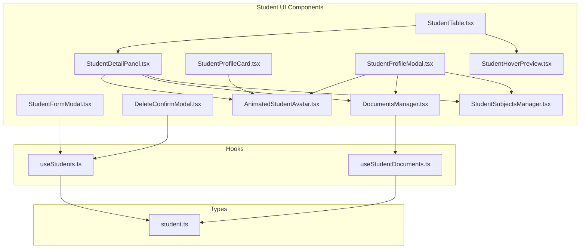
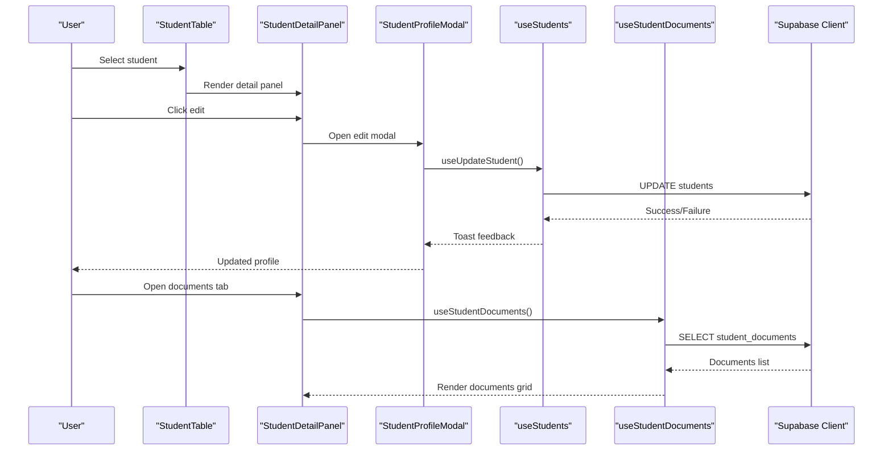
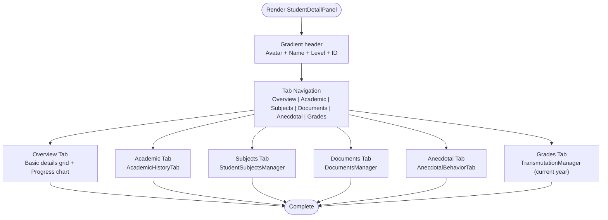
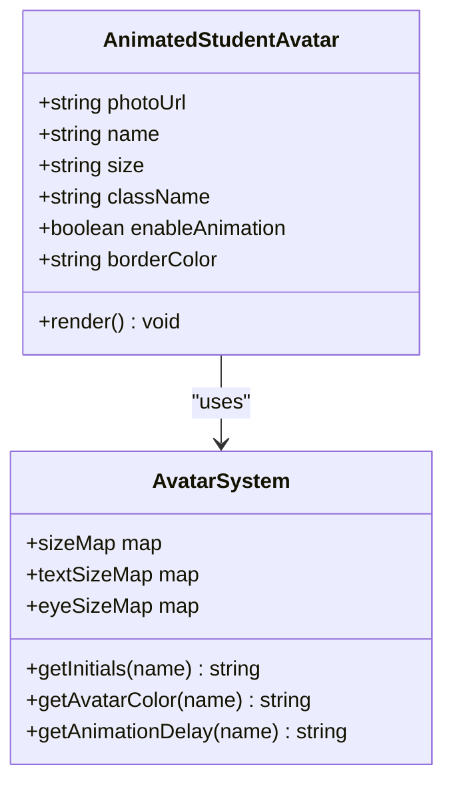
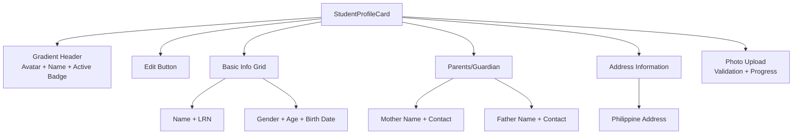
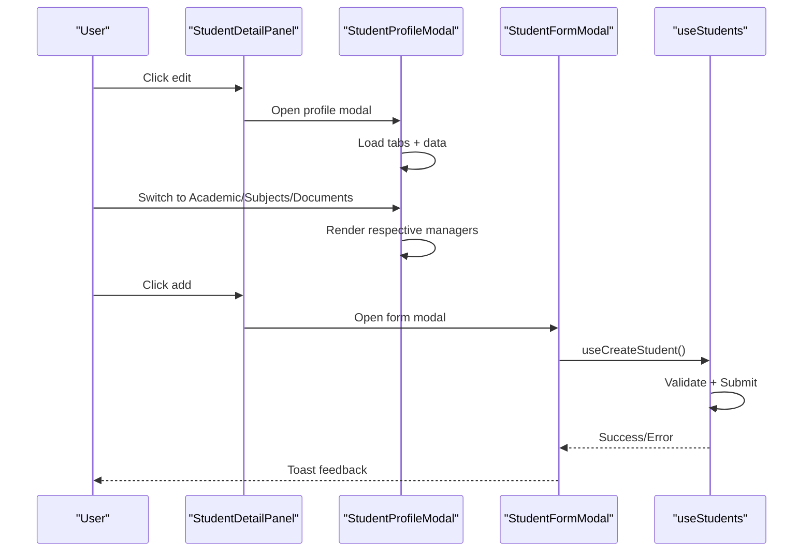
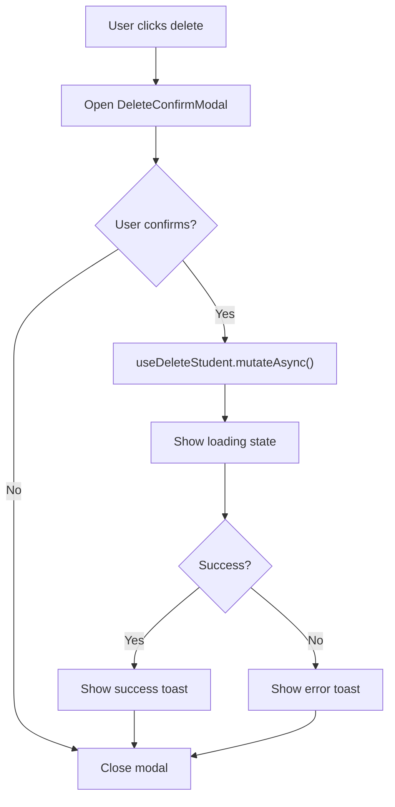
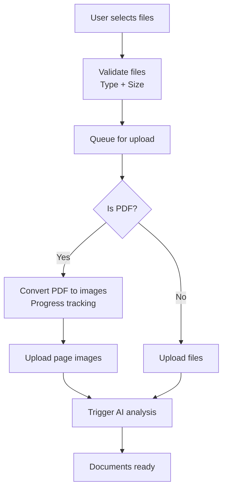
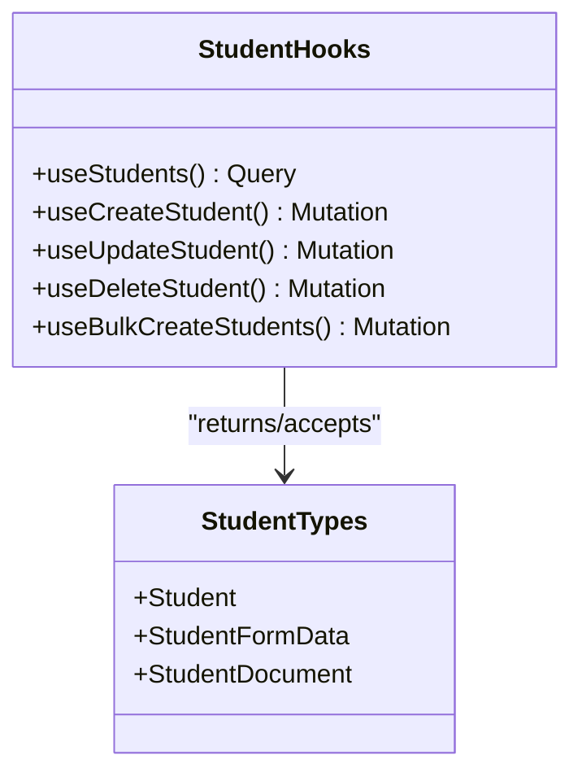
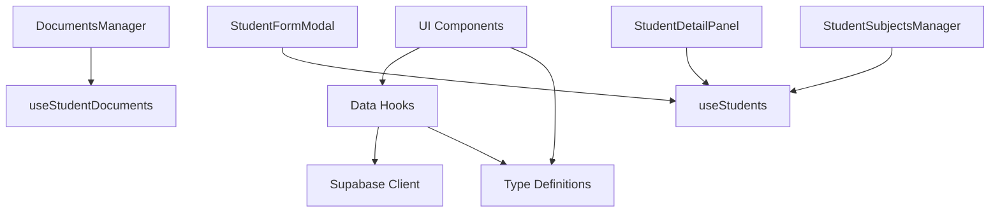

# Student Profile Administration

<cite>
**Referenced Files in This Document**
- [StudentDetailPanel.tsx](file://src/components/students/StudentDetailPanel.tsx)
- [StudentProfileCard.tsx](file://src/components/students/StudentProfileCard.tsx)
- [AnimatedStudentAvatar.tsx](file://src/components/students/AnimatedStudentAvatar.tsx)
- [StudentProfileModal.tsx](file://src/components/students/StudentProfileModal.tsx)
- [DeleteConfirmModal.tsx](file://src/components/students/DeleteConfirmModal.tsx)
- [StudentFormModal.tsx](file://src/components/students/StudentFormModal.tsx)
- [DocumentsManager.tsx](file://src/components/students/DocumentsManager.tsx)
- [StudentSubjectsManager.tsx](file://src/components/students/StudentSubjectsManager.tsx)
- [StudentTable.tsx](file://src/components/students/StudentTable.tsx)
- [StudentHoverPreview.tsx](file://src/components/students/StudentHoverPreview.tsx)
- [useStudentDocuments.ts](file://src/hooks/useStudentDocuments.ts)
- [useStudents.ts](file://src/hooks/useStudents.ts)
- [student.ts](file://src/types/student.ts)
</cite>

## Table of Contents
1. [Introduction](#introduction)
2. [Project Structure](#project-structure)
3. [Core Components](#core-components)
4. [Architecture Overview](#architecture-overview)
5. [Detailed Component Analysis](#detailed-component-analysis)
6. [Dependency Analysis](#dependency-analysis)
7. [Performance Considerations](#performance-considerations)
8. [Troubleshooting Guide](#troubleshooting-guide)
9. [Conclusion](#conclusion)

## Introduction
This document describes the student profile management functionality in the portal, focusing on the detail panel interface, profile card display, modal-based editing capabilities, animated avatar system, profile image handling, and delete confirmation workflows. It also covers CRUD operations for student profiles, data validation, update mechanisms, profile rendering, edit forms, bulk operations, integration with student data hooks, and the relationship with document management features.

## Project Structure
The student profile administration is implemented primarily under the students component folder with supporting hooks and types. Key areas include:
- Detail panels and cards for profile display
- Modal-based editing and viewing
- Animated avatar rendering
- Document management integration
- Subject enrollment management
- Bulk operations and table views

**Diagram sources**
- [StudentDetailPanel.tsx](file://src/components/students/StudentDetailPanel.tsx#L37-L267)
- [StudentProfileCard.tsx](file://src/components/students/StudentProfileCard.tsx#L36-L360)
- [StudentProfileModal.tsx](file://src/components/students/StudentProfileModal.tsx#L28-L367)
- [StudentFormModal.tsx](file://src/components/students/StudentFormModal.tsx#L28-L300)
- [DeleteConfirmModal.tsx](file://src/components/students/DeleteConfirmModal.tsx#L14-L86)
- [AnimatedStudentAvatar.tsx](file://src/components/students/AnimatedStudentAvatar.tsx#L80-L203)
- [DocumentsManager.tsx](file://src/components/students/DocumentsManager.tsx#L89-L979)
- [StudentSubjectsManager.tsx](file://src/components/students/StudentSubjectsManager.tsx#L67-L347)
- [StudentTable.tsx](file://src/components/students/StudentTable.tsx#L66-L820)
- [StudentHoverPreview.tsx](file://src/components/students/StudentHoverPreview.tsx#L11-L109)
- [useStudentDocuments.ts](file://src/hooks/useStudentDocuments.ts#L1-L230)
- [useStudents.ts](file://src/hooks/useStudents.ts#L8-L149)
- [student.ts](file://src/types/student.ts#L1-L82)

**Section sources**
- [StudentDetailPanel.tsx](file://src/components/students/StudentDetailPanel.tsx#L37-L267)
- [StudentProfileCard.tsx](file://src/components/students/StudentProfileCard.tsx#L36-L360)
- [StudentProfileModal.tsx](file://src/components/students/StudentProfileModal.tsx#L28-L367)
- [StudentFormModal.tsx](file://src/components/students/StudentFormModal.tsx#L28-L300)
- [DeleteConfirmModal.tsx](file://src/components/students/DeleteConfirmModal.tsx#L14-L86)
- [AnimatedStudentAvatar.tsx](file://src/components/students/AnimatedStudentAvatar.tsx#L80-L203)
- [DocumentsManager.tsx](file://src/components/students/DocumentsManager.tsx#L89-L979)
- [StudentSubjectsManager.tsx](file://src/components/students/StudentSubjectsManager.tsx#L67-L347)
- [StudentTable.tsx](file://src/components/students/StudentTable.tsx#L66-L820)
- [StudentHoverPreview.tsx](file://src/components/students/StudentHoverPreview.tsx#L11-L109)
- [useStudentDocuments.ts](file://src/hooks/useStudentDocuments.ts#L1-L230)
- [useStudents.ts](file://src/hooks/useStudents.ts#L8-L149)
- [student.ts](file://src/types/student.ts#L1-L82)

## Core Components
- StudentDetailPanel: Renders a comprehensive profile detail panel with tabs for overview, academic history, subjects, documents, anecdotal behavior, and grades. Integrates charts, QR code generation, and dynamic academic year selection.
- StudentProfileCard: Displays a responsive profile card with animated avatar, basic info, parents/guardian details, and address information. Supports photo upload and edit actions.
- AnimatedStudentAvatar: Provides animated character avatars with blinking eyes and optional photo fallback, with customizable sizes and colors.
- StudentProfileModal: Modal-based viewer/editing interface with tabs mirroring the detail panel, plus document management and subject enrollment.
- StudentFormModal: Modal for adding or editing student records with validation and controlled form fields.
- DeleteConfirmModal: Confirmation dialog for deleting student records with loading states.
- DocumentsManager: Centralized document management with upload, preview, deletion, AI analysis, and PDF page extraction.
- StudentSubjectsManager: Manages subject enrollment per academic year with status updates and enrollment controls.
- StudentTable: Aggregates list views with filtering, sorting, pagination, and split-panel detail view.
- StudentHoverPreview: Hover card preview for quick student details across lists.

**Section sources**
- [StudentDetailPanel.tsx](file://src/components/students/StudentDetailPanel.tsx#L37-L267)
- [StudentProfileCard.tsx](file://src/components/students/StudentProfileCard.tsx#L36-L360)
- [AnimatedStudentAvatar.tsx](file://src/components/students/AnimatedStudentAvatar.tsx#L80-L203)
- [StudentProfileModal.tsx](file://src/components/students/StudentProfileModal.tsx#L28-L367)
- [StudentFormModal.tsx](file://src/components/students/StudentFormModal.tsx#L28-L300)
- [DeleteConfirmModal.tsx](file://src/components/students/DeleteConfirmModal.tsx#L14-L86)
- [DocumentsManager.tsx](file://src/components/students/DocumentsManager.tsx#L89-L979)
- [StudentSubjectsManager.tsx](file://src/components/students/StudentSubjectsManager.tsx#L67-L347)
- [StudentTable.tsx](file://src/components/students/StudentTable.tsx#L66-L820)
- [StudentHoverPreview.tsx](file://src/components/students/StudentHoverPreview.tsx#L11-L109)

## Architecture Overview
The system follows a component-driven architecture with clear separation of concerns:
- UI components render data and orchestrate user interactions
- Hooks encapsulate data fetching, mutations, and caching
- Types define data contracts for strong typing
- Supabase client handles backend communication
- Framer Motion provides smooth transitions and animations

**Diagram sources**
- [StudentTable.tsx](file://src/components/students/StudentTable.tsx#L509-L520)
- [StudentDetailPanel.tsx](file://src/components/students/StudentDetailPanel.tsx#L184-L261)
- [StudentProfileModal.tsx](file://src/components/students/StudentProfileModal.tsx#L28-L367)
- [useStudents.ts](file://src/hooks/useStudents.ts#L80-L103)
- [useStudentDocuments.ts](file://src/hooks/useStudentDocuments.ts#L5-L20)

## Detailed Component Analysis

### Student Detail Panel
The detail panel serves as the primary view for student information with:
- Gradient header with animated avatar, name, level, ID, edit button, and QR code
- Tabbed interface for overview, academic history, subjects, documents, anecdotal behavior, and grades
- Overview tab displays basic details, progress chart, and QR code
- Academic tab integrates AcademicHistoryTab
- Subjects tab integrates StudentSubjectsManager
- Documents tab integrates DocumentsManager
- Anecdotal tab integrates AnecdotalBehaviorTab
- Grades tab integrates TransmutationManager with current academic year

**Diagram sources**
- [StudentDetailPanel.tsx](file://src/components/students/StudentDetailPanel.tsx#L37-L267)

**Section sources**
- [StudentDetailPanel.tsx](file://src/components/students/StudentDetailPanel.tsx#L37-L267)

### Animated Avatar System
The animated avatar system provides:
- Photo-based avatars with floating, breathing, and swaying animations
- Character avatars with animated blinking eyes and customizable colors
- Consistent color generation based on student name
- Configurable sizes from extra-small to extra-extra-extra-large
- Optional border colors and animation toggles

**Diagram sources**
- [AnimatedStudentAvatar.tsx](file://src/components/students/AnimatedStudentAvatar.tsx#L80-L203)

**Section sources**
- [AnimatedStudentAvatar.tsx](file://src/components/students/AnimatedStudentAvatar.tsx#L80-L203)

### Profile Card Display
The profile card renders:
- Gradient header with animated avatar and student information
- Edit button with hover effects
- Basic information grid (name, LRN, level, gender, age, birth date)
- Parents/guardian information with contact details
- Address information section
- Photo upload capability with validation and upload progress

**Diagram sources**
- [StudentProfileCard.tsx](file://src/components/students/StudentProfileCard.tsx#L134-L359)

**Section sources**
- [StudentProfileCard.tsx](file://src/components/students/StudentProfileCard.tsx#L36-L360)

### Modal-Based Editing Capabilities
Two modal interfaces support editing:
- StudentProfileModal: Comprehensive modal with tabs for profile, academic, subjects, documents, anecdotal, and grades
- StudentFormModal: Dedicated form modal for adding/editing student records with validation

**Diagram sources**
- [StudentProfileModal.tsx](file://src/components/students/StudentProfileModal.tsx#L28-L367)
- [StudentFormModal.tsx](file://src/components/students/StudentFormModal.tsx#L28-L300)
- [useStudents.ts](file://src/hooks/useStudents.ts#L48-L78)

**Section sources**
- [StudentProfileModal.tsx](file://src/components/students/StudentProfileModal.tsx#L28-L367)
- [StudentFormModal.tsx](file://src/components/students/StudentFormModal.tsx#L28-L300)
- [useStudents.ts](file://src/hooks/useStudents.ts#L48-L103)

### Delete Confirmation Workflow
The delete confirmation modal provides:
- Clear confirmation prompt with student name
- Loading state during deletion
- Success/error feedback via toast notifications
- Integration with useDeleteStudent hook

**Diagram sources**
- [DeleteConfirmModal.tsx](file://src/components/students/DeleteConfirmModal.tsx#L14-L86)
- [useStudents.ts](file://src/hooks/useStudents.ts#L105-L125)

**Section sources**
- [DeleteConfirmModal.tsx](file://src/components/students/DeleteConfirmModal.tsx#L14-L86)
- [useStudents.ts](file://src/hooks/useStudents.ts#L105-L125)

### Document Management Integration
DocumentsManager provides:
- Drag-and-drop upload area with file validation
- Multi-file upload with individual naming
- PDF conversion to images with progress tracking
- AI-powered analysis via Supabase functions
- Document preview, download, and deletion
- Parent PDF and page image management

**Diagram sources**
- [DocumentsManager.tsx](file://src/components/students/DocumentsManager.tsx#L151-L355)
- [useStudentDocuments.ts](file://src/hooks/useStudentDocuments.ts#L22-L92)

**Section sources**
- [DocumentsManager.tsx](file://src/components/students/DocumentsManager.tsx#L89-L979)
- [useStudentDocuments.ts](file://src/hooks/useStudentDocuments.ts#L1-L230)

### CRUD Operations and Validation
The system implements full CRUD operations:
- Create: useCreateStudent with enrichment of school_id
- Read: useStudents with caching and computed grade_quarters
- Update: useUpdateStudent with optimistic updates
- Delete: useDeleteStudent with cascade invalidation
- Bulk Import: useBulkCreateStudents for CSV imports

**Diagram sources**
- [useStudents.ts](file://src/hooks/useStudents.ts#L8-L149)
- [student.ts](file://src/types/student.ts#L1-L82)

**Section sources**
- [useStudents.ts](file://src/hooks/useStudents.ts#L8-L149)
- [student.ts](file://src/types/student.ts#L1-L82)

### Subject Enrollment Management
StudentSubjectsManager enables:
- Enrolling students in subjects per academic year
- Updating subject statuses (enrolled, completed, dropped, incomplete)
- Removing enrollments
- Filtering available subjects by grade level

**Section sources**
- [StudentSubjectsManager.tsx](file://src/components/students/StudentSubjectsManager.tsx#L67-L347)

### Table and Preview Views
StudentTable provides:
- Multiple view modes (cards, compact, table, split)
- Filtering by school, level, and gender
- Sorting by various fields
- Pagination and CSV export
- Split-panel detail view with StudentDetailPanel
- Hover previews with StudentHoverPreview

**Section sources**
- [StudentTable.tsx](file://src/components/students/StudentTable.tsx#L66-L820)
- [StudentHoverPreview.tsx](file://src/components/students/StudentHoverPreview.tsx#L11-L109)

## Dependency Analysis
The components exhibit clear dependency relationships:
- UI components depend on shared hooks for data operations
- Hooks depend on Supabase client for backend communication
- Types define contracts used across components and hooks
- Document management is decoupled but integrated via hooks
- Subject management is self-contained within its manager

**Diagram sources**
- [StudentDetailPanel.tsx](file://src/components/students/StudentDetailPanel.tsx#L14-L20)
- [StudentProfileCard.tsx](file://src/components/students/StudentProfileCard.tsx#L16-L18)
- [DocumentsManager.tsx](file://src/components/students/DocumentsManager.tsx#L49-L53)
- [StudentSubjectsManager.tsx](file://src/components/students/StudentSubjectsManager.tsx#L11-L39)
- [useStudents.ts](file://src/hooks/useStudents.ts#L2-L6)
- [useStudentDocuments.ts](file://src/hooks/useStudentDocuments.ts#L1-L4)

**Section sources**
- [StudentDetailPanel.tsx](file://src/components/students/StudentDetailPanel.tsx#L14-L20)
- [StudentProfileCard.tsx](file://src/components/students/StudentProfileCard.tsx#L16-L18)
- [DocumentsManager.tsx](file://src/components/students/DocumentsManager.tsx#L49-L53)
- [StudentSubjectsManager.tsx](file://src/components/students/StudentSubjectsManager.tsx#L11-L39)
- [useStudents.ts](file://src/hooks/useStudents.ts#L2-L6)
- [useStudentDocuments.ts](file://src/hooks/useStudentDocuments.ts#L1-L4)

## Performance Considerations
- React Query caching reduces redundant network requests for student data
- Animations are optimized with staggered delays to prevent synchronization
- PDF conversion uses progressive loading with visual progress indicators
- Infinite scrolling and pagination limit DOM nodes in large lists
- Memoization prevents unnecessary re-renders in tables and grids
- Debounced search filters improve responsiveness with large datasets

## Troubleshooting Guide
Common issues and resolutions:
- Upload failures: Verify file types (image/*, .pdf) and size limits (5MB)
- PDF processing errors: Check conversion progress and retry after resolution
- Animation glitches: Disable animations via enableAnimation prop for problematic devices
- Network timeouts: Use React Query's retry mechanism and check Supabase connectivity
- Document analysis failures: Verify Supabase functions are deployed and accessible
- Form validation errors: Ensure required fields are populated before submission

**Section sources**
- [StudentProfileCard.tsx](file://src/components/students/StudentProfileCard.tsx#L86-L109)
- [DocumentsManager.tsx](file://src/components/students/DocumentsManager.tsx#L236-L355)
- [AnimatedStudentAvatar.tsx](file://src/components/students/AnimatedStudentAvatar.tsx#L74-L78)

## Conclusion
The student profile administration system provides a comprehensive, modular solution for managing student data with modern UI patterns, robust data operations, and seamless document integration. The component architecture supports scalability, maintainability, and extensibility while delivering a smooth user experience across desktop and mobile platforms.