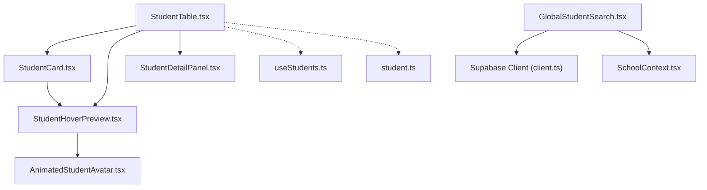
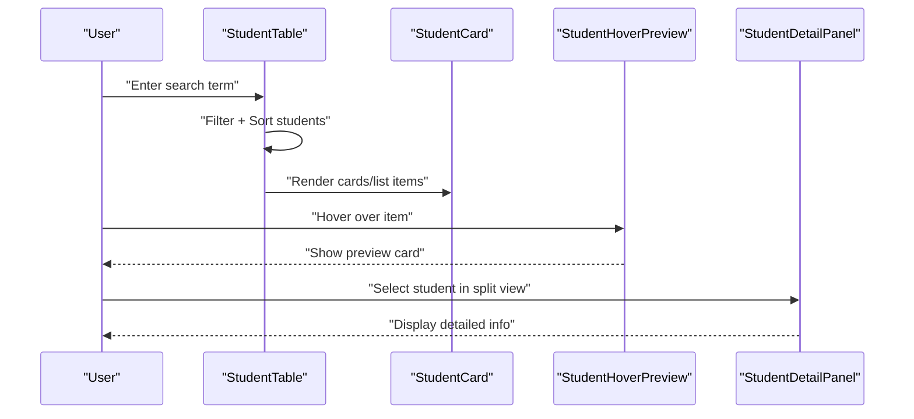
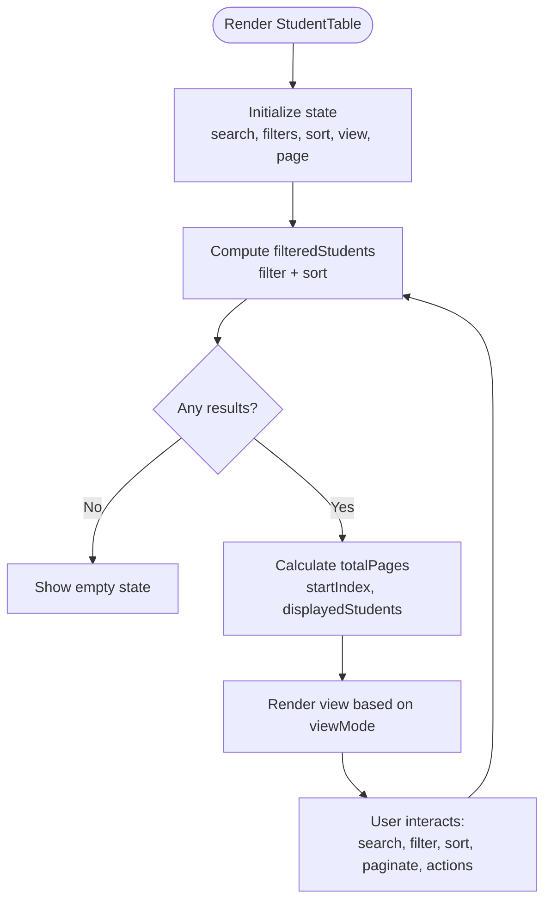
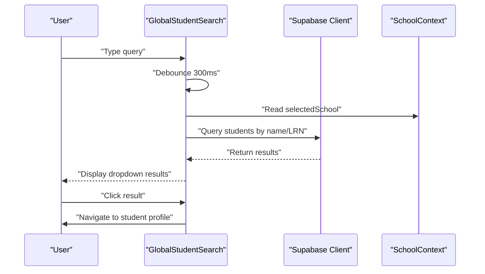
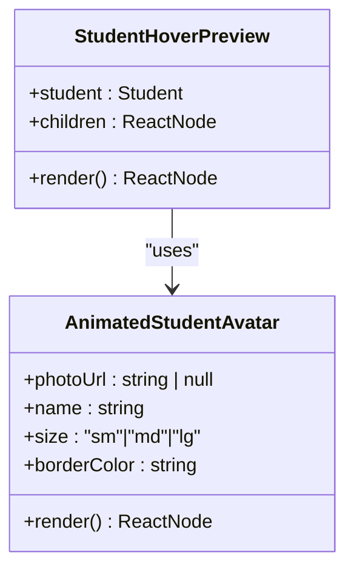
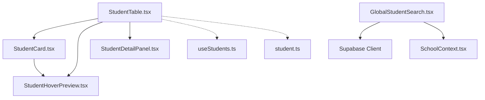

# Student Table & Search System

<cite>
**Referenced Files in This Document**
- [StudentTable.tsx](file://src/components/students/StudentTable.tsx)
- [GlobalStudentSearch.tsx](file://src/components/dashboard/GlobalStudentSearch.tsx)
- [StudentHoverPreview.tsx](file://src/components/students/StudentHoverPreview.tsx)
- [StudentCard.tsx](file://src/components/students/StudentCard.tsx)
- [AnimatedStudentAvatar.tsx](file://src/components/students/AnimatedStudentAvatar.tsx)
- [StudentDetailPanel.tsx](file://src/components/students/StudentDetailPanel.tsx)
- [useStudents.ts](file://src/hooks/useStudents.ts)
- [student.ts](file://src/types/student.ts)
- [client.ts](file://src/integrations/supabase/client.ts)
- [SchoolContext.tsx](file://src/contexts/SchoolContext.tsx)
</cite>

## Table of Contents
1. [Introduction](#introduction)
2. [Project Structure](#project-structure)
3. [Core Components](#core-components)
4. [Architecture Overview](#architecture-overview)
5. [Detailed Component Analysis](#detailed-component-analysis)
6. [Dependency Analysis](#dependency-analysis)
7. [Performance Considerations](#performance-considerations)
8. [Troubleshooting Guide](#troubleshooting-guide)
9. [Conclusion](#conclusion)

## Introduction
This document provides comprehensive documentation for the student table and search functionality within the portal. It covers the student table component with sorting, filtering, pagination, and multiple view modes (cards, compact list, table, split panel). It also explains the global search implementation, search algorithms, and result rendering. Additionally, it documents the hover preview system, teacher view modes, responsive design considerations, customization examples, search optimization techniques, performance considerations, and integration with student data hooks and related student management features.

## Project Structure
The student table and search system spans several components and hooks:
- StudentTable: Central table component with sorting, filtering, pagination, and view modes
- GlobalStudentSearch: Application-wide search bar for quick navigation to student profiles
- StudentHoverPreview: Hover card providing quick student details
- StudentCard: Individual student card used in card view
- StudentDetailPanel: Detailed view panel for selected student (in split mode)
- useStudents: Hook for fetching and managing student data
- Types and Integrations: Supabase client and student type definitions

**Diagram sources**
- [StudentTable.tsx](file://src/components/students/StudentTable.tsx#L66-L83)
- [GlobalStudentSearch.tsx](file://src/components/dashboard/GlobalStudentSearch.tsx#L20-L28)
- [StudentHoverPreview.tsx](file://src/components/students/StudentHoverPreview.tsx#L11-L16)
- [StudentCard.tsx](file://src/components/students/StudentCard.tsx#L70-L71)
- [StudentDetailPanel.tsx](file://src/components/students/StudentDetailPanel.tsx)
- [useStudents.ts](file://src/hooks/useStudents.ts)
- [student.ts](file://src/types/student.ts)
- [client.ts](file://src/integrations/supabase/client.ts)
- [SchoolContext.tsx](file://src/contexts/SchoolContext.tsx)

**Section sources**
- [StudentTable.tsx](file://src/components/students/StudentTable.tsx#L66-L83)
- [GlobalStudentSearch.tsx](file://src/components/dashboard/GlobalStudentSearch.tsx#L20-L28)
- [StudentHoverPreview.tsx](file://src/components/students/StudentHoverPreview.tsx#L11-L16)
- [StudentCard.tsx](file://src/components/students/StudentCard.tsx#L70-L71)
- [StudentDetailPanel.tsx](file://src/components/students/StudentDetailPanel.tsx)
- [useStudents.ts](file://src/hooks/useStudents.ts)
- [student.ts](file://src/types/student.ts)
- [client.ts](file://src/integrations/supabase/client.ts)
- [SchoolContext.tsx](file://src/contexts/SchoolContext.tsx)

## Core Components
- StudentTable: Provides comprehensive student listing with sorting, filtering, pagination, and multiple view modes. Supports split-panel mode for efficient browsing and detail viewing.
- GlobalStudentSearch: Implements a global search bar that queries the database and presents quick results with avatars and basic info.
- StudentHoverPreview: Offers contextual information on hover, including personal details, parent/guardian info, and contact numbers.
- StudentCard: Reusable card component used in card view mode, integrating hover previews and action buttons.
- StudentDetailPanel: Displays detailed student information in split-panel mode after selection.
- useStudents: Hook for fetching student data from Supabase and managing loading states.
- Types and Integrations: Strongly typed student interface and Supabase client integration.

**Section sources**
- [StudentTable.tsx](file://src/components/students/StudentTable.tsx#L46-L53)
- [GlobalStudentSearch.tsx](file://src/components/dashboard/GlobalStudentSearch.tsx#L11-L18)
- [StudentHoverPreview.tsx](file://src/components/students/StudentHoverPreview.tsx#L6-L9)
- [StudentCard.tsx](file://src/components/students/StudentCard.tsx#L64-L98)
- [StudentDetailPanel.tsx](file://src/components/students/StudentDetailPanel.tsx)
- [useStudents.ts](file://src/hooks/useStudents.ts)
- [student.ts](file://src/types/student.ts)
- [client.ts](file://src/integrations/supabase/client.ts)

## Architecture Overview
The system integrates local filtering and sorting within the StudentTable component with global search capabilities via Supabase. The split-panel view allows users to browse a filtered list and view detailed information concurrently. Hover previews enhance usability by providing contextual data without navigation.

**Diagram sources**
- [StudentTable.tsx](file://src/components/students/StudentTable.tsx#L95-L123)
- [StudentCard.tsx](file://src/components/students/StudentCard.tsx#L70-L71)
- [StudentHoverPreview.tsx](file://src/components/students/StudentHoverPreview.tsx#L11-L16)
- [StudentDetailPanel.tsx](file://src/components/students/StudentDetailPanel.tsx)

## Detailed Component Analysis

### StudentTable Component
The StudentTable component manages:
- State: search term, school filter, level filter, gender filter, sort field/direction, view mode, pagination, and selected student
- Filtering: Case-insensitive substring match on student name and LRN; level, gender, and school filters
- Sorting: Multi-field sort supporting ascending/descending order
- Pagination: Items per page constant with calculated total pages and slice-based display
- View Modes: Cards, compact list, table, and split panel layouts
- Actions: Edit, delete, export to CSV, and clear filters
- Responsive Design: Tailwind-based responsive classes and adaptive layouts

**Diagram sources**
- [StudentTable.tsx](file://src/components/students/StudentTable.tsx#L74-L133)
- [StudentTable.tsx](file://src/components/students/StudentTable.tsx#L135-L142)
- [StudentTable.tsx](file://src/components/students/StudentTable.tsx#L130-L133)

Key implementation highlights:
- Filtering and sorting are computed via memoization to minimize re-computation
- Pagination resets page when filters change to maintain UX consistency
- Export to CSV generates downloadable file with filtered dataset
- Split panel view enables concurrent browsing and detailed viewing

**Section sources**
- [StudentTable.tsx](file://src/components/students/StudentTable.tsx#L74-L133)
- [StudentTable.tsx](file://src/components/students/StudentTable.tsx#L135-L142)
- [StudentTable.tsx](file://src/components/students/StudentTable.tsx#L151-L174)
- [StudentTable.tsx](file://src/components/students/StudentTable.tsx#L176-L183)
- [StudentTable.tsx](file://src/components/students/StudentTable.tsx#L353-L520)
- [StudentTable.tsx](file://src/components/students/StudentTable.tsx#L521-L600)
- [StudentTable.tsx](file://src/components/students/StudentTable.tsx#L601-L666)
- [StudentTable.tsx](file://src/components/students/StudentTable.tsx#L667-L800)

### Global Student Search
The GlobalStudentSearch component provides:
- Debounced search with 300ms delay to reduce API calls
- Supabase query filtering by current school and name/LRN
- Results dropdown with avatars, names, LRNs, and levels
- Navigation to student profile on selection
- Outside click detection to close dropdown

**Diagram sources**
- [GlobalStudentSearch.tsx](file://src/components/dashboard/GlobalStudentSearch.tsx#L42-L71)
- [GlobalStudentSearch.tsx](file://src/components/dashboard/GlobalStudentSearch.tsx#L73-L77)
- [client.ts](file://src/integrations/supabase/client.ts)
- [SchoolContext.tsx](file://src/contexts/SchoolContext.tsx)

**Section sources**
- [GlobalStudentSearch.tsx](file://src/components/dashboard/GlobalStudentSearch.tsx#L20-L71)
- [GlobalStudentSearch.tsx](file://src/components/dashboard/GlobalStudentSearch.tsx#L73-L77)
- [client.ts](file://src/integrations/supabase/client.ts)
- [SchoolContext.tsx](file://src/contexts/SchoolContext.tsx)

### Hover Preview System
StudentHoverPreview enhances discoverability by displaying:
- Gradient header with avatar, name, level, and LRN
- Basic info: birth date and age/gender
- Parents/guardian names
- Contact numbers with distinct styling
- Previous school information
- Clickable hint to view full profile

**Diagram sources**
- [StudentHoverPreview.tsx](file://src/components/students/StudentHoverPreview.tsx#L6-L9)
- [AnimatedStudentAvatar.tsx](file://src/components/students/AnimatedStudentAvatar.tsx)

**Section sources**
- [StudentHoverPreview.tsx](file://src/components/students/StudentHoverPreview.tsx#L11-L109)
- [StudentCard.tsx](file://src/components/students/StudentCard.tsx#L70-L71)

### Teacher View Modes and Responsive Design
The StudentTable supports four view modes:
- Cards: Grid layout optimized for visual scanning
- Compact: Minimal list with hover actions
- Table: Traditional tabular view with sortable headers
- Split: Dual-pane layout for browsing and detailed viewing

Responsive design considerations:
- Adaptive grid columns for cards
- Collapsible filters and compact controls
- Scroll areas for long lists
- Tailwind utilities for spacing and typography scaling

**Section sources**
- [StudentTable.tsx](file://src/components/students/StudentTable.tsx#L57-L57)
- [StudentTable.tsx](file://src/components/students/StudentTable.tsx#L238-L288)
- [StudentTable.tsx](file://src/components/students/StudentTable.tsx#L521-L600)
- [StudentTable.tsx](file://src/components/students/StudentTable.tsx#L601-L666)
- [StudentTable.tsx](file://src/components/students/StudentTable.tsx#L667-L800)

### Search Algorithms and Result Highlighting
Local search algorithm:
- Case-insensitive substring matching on student name and LRN
- Real-time filtering as the user types
- Memoized computation to avoid unnecessary recalculations

Global search algorithm:
- Debounced Supabase query with ILIKE pattern matching
- OR condition for name and LRN fields
- Limit results to improve responsiveness

Result highlighting:
- Current implementation focuses on immediate filtering and selection
- Future enhancement could include highlighted matches in results

**Section sources**
- [StudentTable.tsx](file://src/components/students/StudentTable.tsx#L99-L107)
- [GlobalStudentSearch.tsx](file://src/components/dashboard/GlobalStudentSearch.tsx#L52-L57)
- [GlobalStudentSearch.tsx](file://src/components/dashboard/GlobalStudentSearch.tsx#L69-L71)

### Integration with Student Data Hooks
The StudentTable relies on:
- useStudents hook for fetching and caching student data
- Supabase client for database operations
- Student type definitions for type safety
- SchoolContext for scoping queries by selected school

**Section sources**
- [StudentTable.tsx](file://src/components/students/StudentTable.tsx#L66-L73)
- [useStudents.ts](file://src/hooks/useStudents.ts)
- [client.ts](file://src/integrations/supabase/client.ts)
- [student.ts](file://src/types/student.ts)
- [SchoolContext.tsx](file://src/contexts/SchoolContext.tsx)

## Dependency Analysis
The following diagram shows key dependencies among components and external systems:

**Diagram sources**
- [StudentTable.tsx](file://src/components/students/StudentTable.tsx#L23-L25)
- [StudentCard.tsx](file://src/components/students/StudentCard.tsx#L70-L71)
- [StudentHoverPreview.tsx](file://src/components/students/StudentHoverPreview.tsx#L11-L16)
- [StudentDetailPanel.tsx](file://src/components/students/StudentDetailPanel.tsx)
- [GlobalStudentSearch.tsx](file://src/components/dashboard/GlobalStudentSearch.tsx#L7-L8)
- [useStudents.ts](file://src/hooks/useStudents.ts)
- [student.ts](file://src/types/student.ts)
- [client.ts](file://src/integrations/supabase/client.ts)
- [SchoolContext.tsx](file://src/contexts/SchoolContext.tsx)

**Section sources**
- [StudentTable.tsx](file://src/components/students/StudentTable.tsx#L23-L25)
- [StudentCard.tsx](file://src/components/students/StudentCard.tsx#L70-L71)
- [StudentHoverPreview.tsx](file://src/components/students/StudentHoverPreview.tsx#L11-L16)
- [StudentDetailPanel.tsx](file://src/components/students/StudentDetailPanel.tsx)
- [GlobalStudentSearch.tsx](file://src/components/dashboard/GlobalStudentSearch.tsx#L7-L8)
- [useStudents.ts](file://src/hooks/useStudents.ts)
- [student.ts](file://src/types/student.ts)
- [client.ts](file://src/integrations/supabase/client.ts)
- [SchoolContext.tsx](file://src/contexts/SchoolContext.tsx)

## Performance Considerations
- Local filtering and sorting are memoized to prevent redundant computations
- Debounced global search reduces network requests during typing
- Pagination limits rendered items to improve scrolling performance
- Lazy loading of avatars and images minimizes initial payload
- Split panel view reduces repeated data fetching by maintaining state
- Consider adding virtualization for very large datasets
- Optimize Supabase queries with appropriate indexes on frequently searched columns

[No sources needed since this section provides general guidance]

## Troubleshooting Guide
Common issues and resolutions:
- Empty results: Verify filters and search terms; ensure data exists for selected school
- Slow search: Confirm debouncing is active; check network connectivity and Supabase performance
- Hover preview not appearing: Ensure StudentHoverPreview wraps interactive elements correctly
- Pagination errors: Validate total count calculation and page boundaries
- Split panel not updating: Confirm selected student state is properly managed

**Section sources**
- [StudentTable.tsx](file://src/components/students/StudentTable.tsx#L125-L128)
- [GlobalStudentSearch.tsx](file://src/components/dashboard/GlobalStudentSearch.tsx#L42-L71)
- [StudentHoverPreview.tsx](file://src/components/students/StudentHoverPreview.tsx#L11-L16)

## Conclusion
The student table and search system provides a robust, responsive, and extensible foundation for managing student data. Its modular design, strong typing, and thoughtful UX features enable efficient navigation, discovery, and administration of student records. The integration with Supabase and hooks ensures scalable data handling, while the multiple view modes accommodate diverse user preferences and screen sizes.