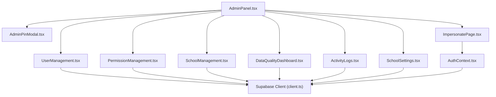
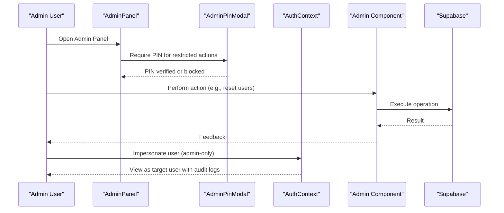
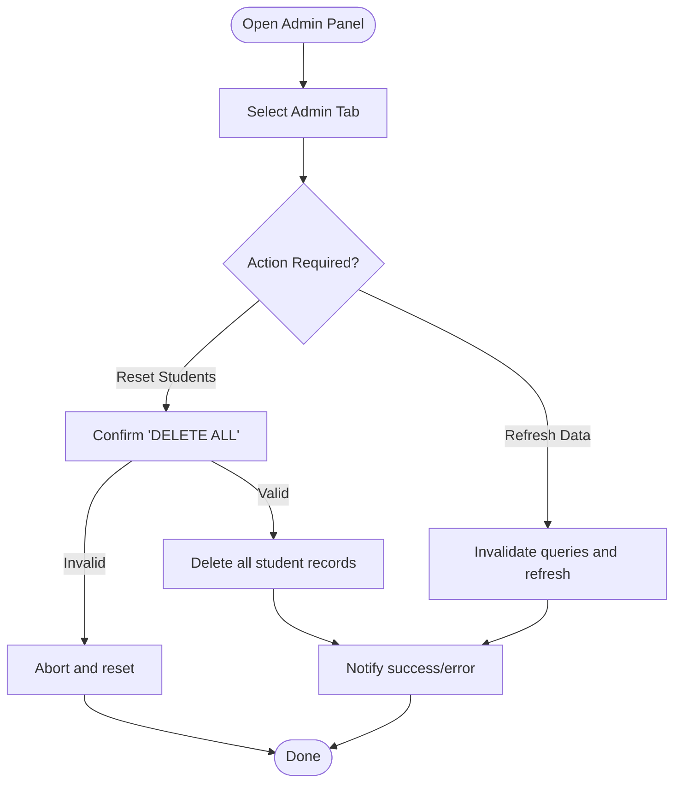
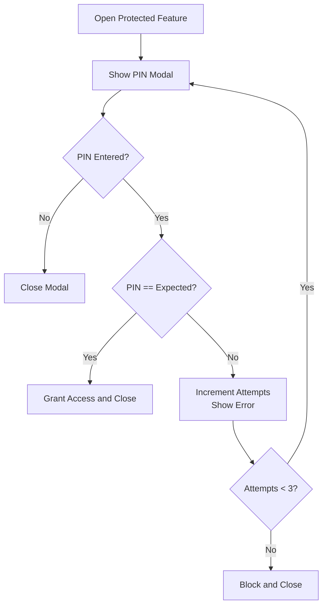
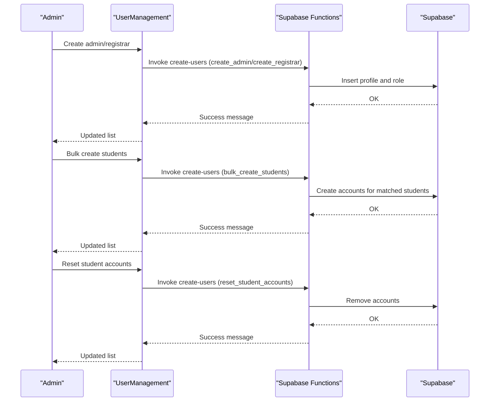
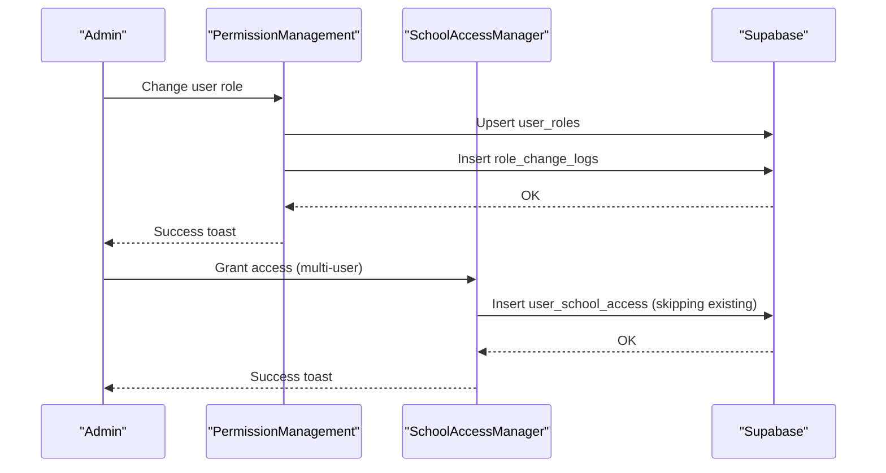
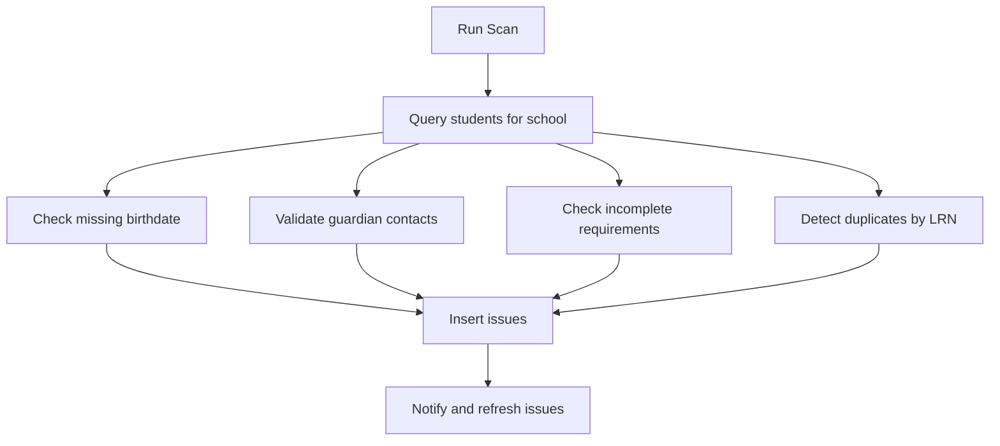
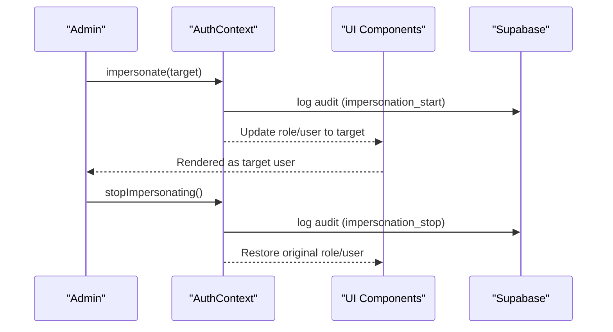
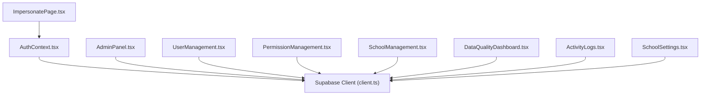

# Administrative Tools & Utilities

<cite>
**Referenced Files in This Document**
- [AdminPanel.tsx](file://src/components/admin/AdminPanel.tsx)
- [AdminPinModal.tsx](file://src/components/admin/AdminPinModal.tsx)
- [ImpersonatePage.tsx](file://src/components/admin/ImpersonatePage.tsx)
- [DataQualityDashboard.tsx](file://src/components/admin/DataQualityDashboard.tsx)
- [UserManagement.tsx](file://src/components/admin/UserManagement.tsx)
- [PermissionManagement.tsx](file://src/components/admin/PermissionManagement.tsx)
- [SchoolManagement.tsx](file://src/components/admin/SchoolManagement.tsx)
- [ActivityLogs.tsx](file://src/components/admin/ActivityLogs.tsx)
- [SchoolSettings.tsx](file://src/components/admin/SchoolSettings.tsx)
- [GrantAccessDialog.tsx](file://src/components/admin/GrantAccessDialog.tsx)
- [RoleAssignmentDialog.tsx](file://src/components/admin/RoleAssignmentDialog.tsx)
- [SchoolAccessManager.tsx](file://src/components/admin/SchoolAccessManager.tsx)
- [PrintableCredentialSlips.tsx](file://src/components/admin/PrintableCredentialSlips.tsx)
- [AuthContext.tsx](file://src/contexts/AuthContext.tsx)
- [client.ts](file://src/integrations/supabase/client.ts)
</cite>

## Table of Contents
1. [Introduction](#introduction)
2. [Project Structure](#project-structure)
3. [Core Components](#core-components)
4. [Architecture Overview](#architecture-overview)
5. [Detailed Component Analysis](#detailed-component-analysis)
6. [Dependency Analysis](#dependency-analysis)
7. [Performance Considerations](#performance-considerations)
8. [Troubleshooting Guide](#troubleshooting-guide)
9. [Conclusion](#conclusion)

## Introduction
This document describes the administrative tools and utilities available in the portal. It covers the admin panel interface, administrative PIN protection, user impersonation, data quality monitoring, administrative workflow automation, bulk operations, and system maintenance utilities. It also explains impersonation procedures, administrative security measures, audit trails, and administrative access controls.

## Project Structure
Administrative features are organized under the admin folder and integrated with Supabase for authentication, authorization, and data operations. The admin panel aggregates multiple specialized components for user management, permissions, schools, data quality, activity logs, and settings.

**Diagram sources**
- [AdminPanel.tsx](file://src/components/admin/AdminPanel.tsx#L1-L229)
- [AdminPinModal.tsx](file://src/components/admin/AdminPinModal.tsx#L1-L120)
- [ImpersonatePage.tsx](file://src/components/admin/ImpersonatePage.tsx#L1-L236)
- [UserManagement.tsx](file://src/components/admin/UserManagement.tsx#L1-L881)
- [PermissionManagement.tsx](file://src/components/admin/PermissionManagement.tsx#L1-L277)
- [SchoolManagement.tsx](file://src/components/admin/SchoolManagement.tsx#L1-L464)
- [DataQualityDashboard.tsx](file://src/components/admin/DataQualityDashboard.tsx#L1-L403)
- [ActivityLogs.tsx](file://src/components/admin/ActivityLogs.tsx#L1-L312)
- [SchoolSettings.tsx](file://src/components/admin/SchoolSettings.tsx#L1-L614)
- [AuthContext.tsx](file://src/contexts/AuthContext.tsx#L1-L216)
- [client.ts](file://src/integrations/supabase/client.ts#L1-L17)

**Section sources**
- [AdminPanel.tsx](file://src/components/admin/AdminPanel.tsx#L1-L229)
- [client.ts](file://src/integrations/supabase/client.ts#L1-L17)

## Core Components
- Admin Panel: Central hub with tabs for Users, Permissions, Schools, Data Quality, Logs, Settings, and System utilities.
- Administrative PIN Protection: Modal requiring a fixed PIN to unlock restricted admin features.
- User Management: Create, reset, and manage user accounts; bulk operations; credential printing and QR downloads.
- Permission Management: Assign and change user roles; manage school access; role change logging.
- School Management: CRUD for schools; activation/deactivation; search and filtering.
- Data Quality Dashboard: Scans for missing/invalid/incomplete data; duplicate detection; resolution tracking.
- Activity Logs: Monitor login/logout/failure events; export to CSV.
- School Settings: Manage branding, themes, and multiple school profiles.
- Impersonation: Admin-only ability to view the system as another user with audit logging.
- Access Control: Role-based access enforcement via AuthContext and dialogs.

**Section sources**
- [AdminPanel.tsx](file://src/components/admin/AdminPanel.tsx#L1-L229)
- [AdminPinModal.tsx](file://src/components/admin/AdminPinModal.tsx#L1-L120)
- [UserManagement.tsx](file://src/components/admin/UserManagement.tsx#L1-L881)
- [PermissionManagement.tsx](file://src/components/admin/PermissionManagement.tsx#L1-L277)
- [SchoolManagement.tsx](file://src/components/admin/SchoolManagement.tsx#L1-L464)
- [DataQualityDashboard.tsx](file://src/components/admin/DataQualityDashboard.tsx#L1-L403)
- [ActivityLogs.tsx](file://src/components/admin/ActivityLogs.tsx#L1-L312)
- [SchoolSettings.tsx](file://src/components/admin/SchoolSettings.tsx#L1-L614)
- [ImpersonatePage.tsx](file://src/components/admin/ImpersonatePage.tsx#L1-L236)
- [AuthContext.tsx](file://src/contexts/AuthContext.tsx#L1-L216)

## Architecture Overview
Administrative features rely on Supabase for authentication, authorization, and data persistence. The AuthContext centralizes role and impersonation state, while individual admin components coordinate with Supabase to perform operations and maintain audit trails.

**Diagram sources**
- [AdminPanel.tsx](file://src/components/admin/AdminPanel.tsx#L1-L229)
- [AdminPinModal.tsx](file://src/components/admin/AdminPinModal.tsx#L1-L120)
- [AuthContext.tsx](file://src/contexts/AuthContext.tsx#L1-L216)
- [client.ts](file://src/integrations/supabase/client.ts#L1-L17)

## Detailed Component Analysis

### Admin Panel
- Purpose: Unified administrative interface with tabbed navigation for core tasks.
- Key features:
  - Danger zone: Reset student records with confirmation.
  - System utilities: Refresh cached data across the app.
  - Tabbed sections: Users, Permissions, Schools, Data Quality, Logs, Settings, System.

**Diagram sources**
- [AdminPanel.tsx](file://src/components/admin/AdminPanel.tsx#L22-L46)

**Section sources**
- [AdminPanel.tsx](file://src/components/admin/AdminPanel.tsx#L1-L229)

### Administrative PIN Protection
- Purpose: Protect sensitive admin actions with a fixed PIN and attempt limits.
- Behavior:
  - Modal prompts for PIN input.
  - Enforces 6-digit PIN; rejects invalid entries.
  - Blocks after three failed attempts.
  - Success grants access to protected features.

**Diagram sources**
- [AdminPinModal.tsx](file://src/components/admin/AdminPinModal.tsx#L21-L41)

**Section sources**
- [AdminPinModal.tsx](file://src/components/admin/AdminPinModal.tsx#L1-L120)

### User Management
- Purpose: Create and manage user accounts, roles, and credentials.
- Key capabilities:
  - Quick creation of admin/registrar accounts.
  - Bulk student account creation from existing student records.
  - Reset all student accounts with confirmation.
  - Reset individual student passwords via serverless function.
  - Delete user accounts via serverless function.
  - Print credential slips and bulk QR downloads.
  - Filter and search across roles, schools, and grade levels.

**Diagram sources**
- [UserManagement.tsx](file://src/components/admin/UserManagement.tsx#L271-L337)

**Section sources**
- [UserManagement.tsx](file://src/components/admin/UserManagement.tsx#L1-L881)

### Permission Management
- Purpose: Manage user roles and school access.
- Features:
  - Role assignment with optional reason and audit logging.
  - Bulk grant access to users per school with role selection.
  - Toggle access enable/disable and revoke access.
  - Role reference guide and filtering by role.

**Diagram sources**
- [PermissionManagement.tsx](file://src/components/admin/PermissionManagement.tsx#L115-L118)
- [RoleAssignmentDialog.tsx](file://src/components/admin/RoleAssignmentDialog.tsx#L58-L104)
- [SchoolAccessManager.tsx](file://src/components/admin/SchoolAccessManager.tsx#L150-L190)

**Section sources**
- [PermissionManagement.tsx](file://src/components/admin/PermissionManagement.tsx#L1-L277)
- [RoleAssignmentDialog.tsx](file://src/components/admin/RoleAssignmentDialog.tsx#L1-L209)
- [SchoolAccessManager.tsx](file://src/components/admin/SchoolAccessManager.tsx#L1-L349)
- [GrantAccessDialog.tsx](file://src/components/admin/GrantAccessDialog.tsx#L1-L203)

### School Management
- Purpose: Manage school records and statuses.
- Features:
  - Create/edit/delete schools.
  - Activate/deactivate schools.
  - Search and filter by name/code/email.
  - Automatic cache invalidation after mutations.

**Section sources**
- [SchoolManagement.tsx](file://src/components/admin/SchoolManagement.tsx#L1-L464)

### Data Quality Dashboard
- Purpose: Detect and resolve data quality issues across student records.
- Features:
  - Scan for missing birthdates, invalid contacts, incomplete requirements, and duplicates.
  - Filter by issue type and resolution status.
  - Resolve issues with audit metadata.
  - Export scan results and resolutions.

**Diagram sources**
- [DataQualityDashboard.tsx](file://src/components/admin/DataQualityDashboard.tsx#L92-L219)

**Section sources**
- [DataQualityDashboard.tsx](file://src/components/admin/DataQualityDashboard.tsx#L1-L403)

### Activity Logs
- Purpose: Monitor authentication activity and export logs.
- Features:
  - Filter by action (login/logout/failed login).
  - Date range filtering.
  - Export to CSV with formatted timestamps.

**Section sources**
- [ActivityLogs.tsx](file://src/components/admin/ActivityLogs.tsx#L1-L312)

### School Settings
- Purpose: Configure branding and themes for multiple schools.
- Features:
  - Select school profile and update details.
  - Upload and preview school logo.
  - Apply color themes with persistent storage.
  - Create/delete school profiles.

**Section sources**
- [SchoolSettings.tsx](file://src/components/admin/SchoolSettings.tsx#L1-L614)

### Impersonation
- Purpose: Allow administrators to view the system as another user for support and troubleshooting.
- Security:
  - Admin-only capability enforced.
  - Session storage persists impersonation target.
  - Audit logs record impersonation start/stop.

**Diagram sources**
- [ImpersonatePage.tsx](file://src/components/admin/ImpersonatePage.tsx#L85-L97)
- [AuthContext.tsx](file://src/contexts/AuthContext.tsx#L163-L189)

**Section sources**
- [ImpersonatePage.tsx](file://src/components/admin/ImpersonatePage.tsx#L1-L236)
- [AuthContext.tsx](file://src/contexts/AuthContext.tsx#L1-L216)

### Administrative Access Controls and Session Management
- Role-based access:
  - Role checks via AuthContext.
  - Admin-only impersonation and access grant features.
- Session management:
  - Supabase client configured with local storage and token refresh.
  - Impersonation state persisted in sessionStorage.

**Section sources**
- [AuthContext.tsx](file://src/contexts/AuthContext.tsx#L1-L216)
- [client.ts](file://src/integrations/supabase/client.ts#L1-L17)

### Audit Trail for Administrative Actions
- Logged actions include:
  - Login attempts (success/failure).
  - Logout events.
  - Role changes with reasons.
  - Impersonation start/stop.
  - School access grants/revocations.

**Section sources**
- [ActivityLogs.tsx](file://src/components/admin/ActivityLogs.tsx#L1-L312)
- [RoleAssignmentDialog.tsx](file://src/components/admin/RoleAssignmentDialog.tsx#L79-L93)
- [AuthContext.tsx](file://src/contexts/AuthContext.tsx#L169-L188)

## Dependency Analysis
Administrative components depend on Supabase for authentication, authorization, and data operations. The AuthContext centralizes role and impersonation state, ensuring consistent access control across the admin suite.

**Diagram sources**
- [AuthContext.tsx](file://src/contexts/AuthContext.tsx#L1-L216)
- [AdminPanel.tsx](file://src/components/admin/AdminPanel.tsx#L1-L229)
- [client.ts](file://src/integrations/supabase/client.ts#L1-L17)

**Section sources**
- [AuthContext.tsx](file://src/contexts/AuthContext.tsx#L1-L216)
- [client.ts](file://src/integrations/supabase/client.ts#L1-L17)

## Performance Considerations
- Use caching and query invalidation judiciously to avoid stale data in admin views.
- Batch operations (e.g., bulk account creation) reduce repeated network calls.
- Limit log exports to reasonable date ranges to prevent large CSV generation.
- Debounce search inputs in admin dashboards to minimize unnecessary queries.

## Troubleshooting Guide
- PIN modal blocks repeated attempts: After three failures, the modal closes and further attempts are blocked until reopened.
- Reset actions require explicit confirmation: Type the exact confirmation text to proceed with destructive operations.
- Bulk operations may skip existing records: When granting access, existing grants are skipped to avoid duplicates.
- Audit logs not appearing: Ensure logging functions are invoked and Supabase tables exist for activity and role change logs.
- Impersonation not working: Verify the current user has admin role and that the impersonation target is valid.

**Section sources**
- [AdminPinModal.tsx](file://src/components/admin/AdminPinModal.tsx#L35-L39)
- [AdminPanel.tsx](file://src/components/admin/AdminPanel.tsx#L22-L46)
- [SchoolAccessManager.tsx](file://src/components/admin/SchoolAccessManager.tsx#L162-L164)
- [ActivityLogs.tsx](file://src/components/admin/ActivityLogs.tsx#L81-L84)
- [AuthContext.tsx](file://src/contexts/AuthContext.tsx#L163-L167)

## Conclusion
The administrative toolkit provides a comprehensive set of utilities for managing users, permissions, schools, data quality, and system settings. Built-in security measures, including PIN protection and impersonation logging, ensure accountability. Bulk operations and audit trails streamline administration while maintaining transparency and control.