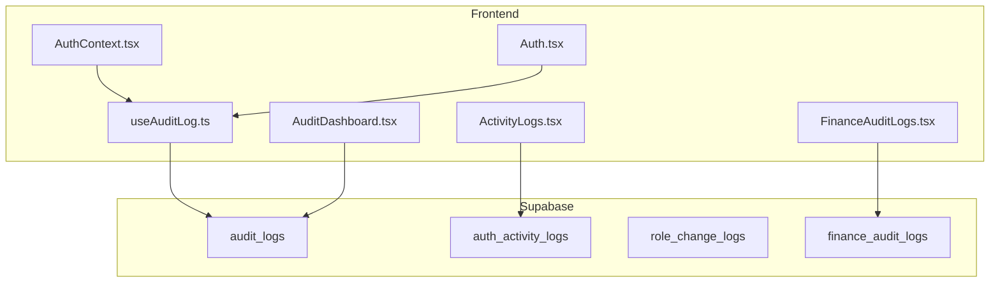
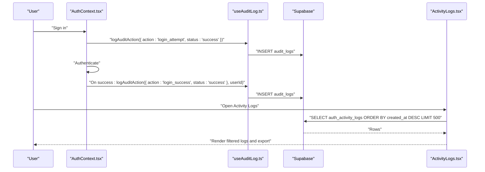
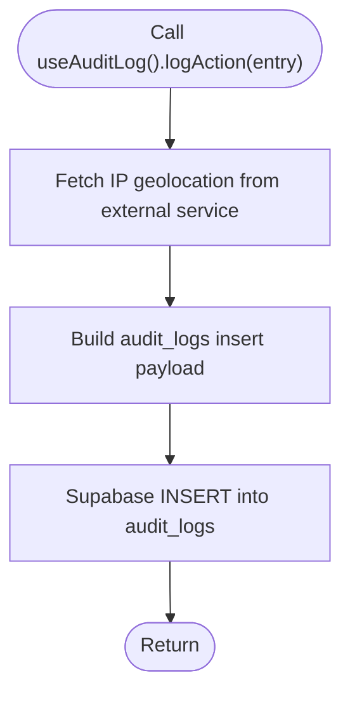
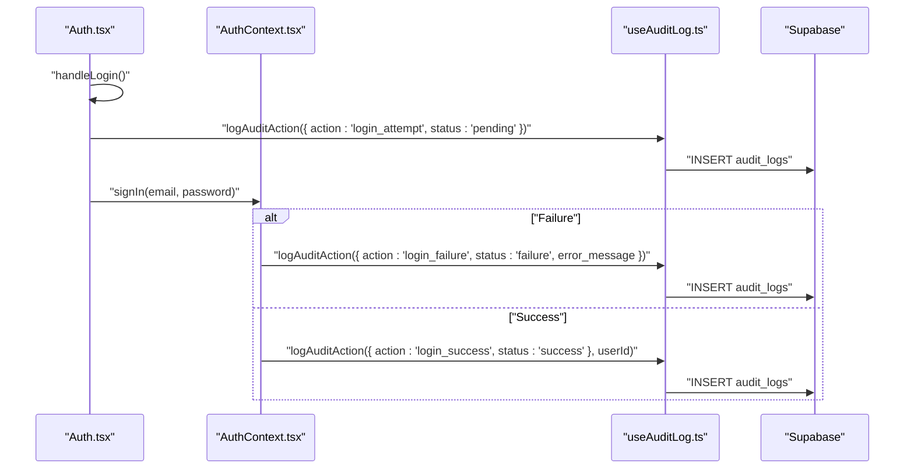
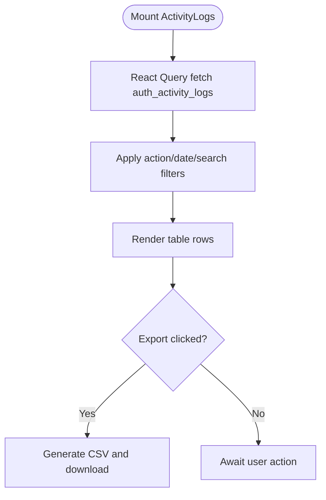
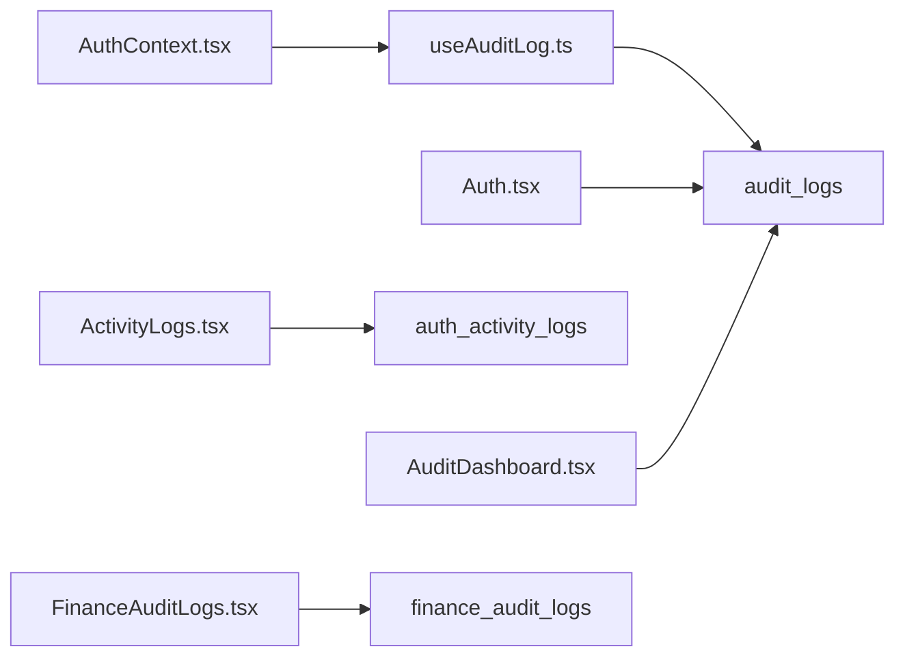
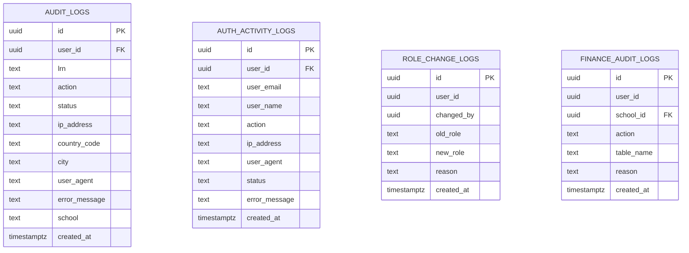

# Audit Logging & Activity Tracking

<cite>
**Referenced Files in This Document**
- [ActivityLogs.tsx](file://src/components/admin/ActivityLogs.tsx)
- [useAuditLog.ts](file://src/hooks/useAuditLog.ts)
- [AuditDashboard.tsx](file://src/components/management/AuditDashboard.tsx)
- [FinanceAuditLogs.tsx](file://src/components/finance/FinanceAuditLogs.tsx)
- [AuthContext.tsx](file://src/contexts/AuthContext.tsx)
- [Auth.tsx](file://src/pages/Auth.tsx)
- [create_audit_logs.sql](file://supabase/migrations/20260209100000_create_audit_logs.sql)
- [20260205175436_9782a261-cedc-492e-8661-d963b348e86e.sql](file://supabase/migrations/20260205175436_9782a261-cedc-492e-8661-d963b348e86e.sql)
</cite>

## Table of Contents
1. [Introduction](#introduction)
2. [Project Structure](#project-structure)
3. [Core Components](#core-components)
4. [Architecture Overview](#architecture-overview)
5. [Detailed Component Analysis](#detailed-component-analysis)
6. [Dependency Analysis](#dependency-analysis)
7. [Performance Considerations](#performance-considerations)
8. [Troubleshooting Guide](#troubleshooting-guide)
9. [Conclusion](#conclusion)
10. [Appendices](#appendices)

## Introduction
This document describes the audit logging and activity tracking system used to monitor authentication events, security-relevant actions, and financial transactions. It covers the audit log data model, collection mechanisms, storage and retrieval, filtering and export capabilities, compliance reporting workflows, and security monitoring procedures. It also documents access controls, privacy considerations, and retention policies.

## Project Structure
The audit logging system spans frontend components, hooks, Supabase database tables, and authentication flows:

- Frontend UI components for viewing and exporting audit logs
- A reusable hook for capturing and persisting audit events
- Supabase database tables for storing audit records
- Authentication context and page handlers that trigger audit events
- Finance-specific audit logs for transaction tracking

**Diagram sources**
- [AuthContext.tsx](file://src/contexts/AuthContext.tsx#L111-L156)
- [useAuditLog.ts](file://src/hooks/useAuditLog.ts#L23-L60)
- [ActivityLogs.tsx](file://src/components/admin/ActivityLogs.tsx#L58-L88)
- [AuditDashboard.tsx](file://src/components/management/AuditDashboard.tsx#L40-L52)
- [FinanceAuditLogs.tsx](file://src/components/finance/FinanceAuditLogs.tsx#L23-L30)
- [create_audit_logs.sql](file://supabase/migrations/20260209100000_create_audit_logs.sql#L1-L38)
- [20260205175436_9782a261-cedc-492e-8661-d963b348e86e.sql](file://supabase/migrations/20260205175436_9782a261-cedc-492e-8661-d963b348e86e.sql#L1-L46)

**Section sources**
- [ActivityLogs.tsx](file://src/components/admin/ActivityLogs.tsx#L1-L312)
- [useAuditLog.ts](file://src/hooks/useAuditLog.ts#L1-L69)
- [AuditDashboard.tsx](file://src/components/management/AuditDashboard.tsx#L1-L205)
- [FinanceAuditLogs.tsx](file://src/components/finance/FinanceAuditLogs.tsx#L1-L80)
- [AuthContext.tsx](file://src/contexts/AuthContext.tsx#L111-L156)
- [Auth.tsx](file://src/pages/Auth.tsx#L38-L100)
- [create_audit_logs.sql](file://supabase/migrations/20260209100000_create_audit_logs.sql#L1-L38)
- [20260205175436_9782a261-cedc-492e-8661-d963b348e86e.sql](file://supabase/migrations/20260205175436_9782a261-cedc-492e-8661-d963b348e86e.sql#L1-L64)

## Core Components
- Audit logging hook: Provides a typed interface to capture actions, statuses, optional error messages, LRN, and school context, and persists them to the audit_logs table.
- Authentication audit: Hooks into sign-in/sign-out flows to record login attempts, successes, failures, and impersonation events.
- Activity logs viewer: Displays auth_activity_logs with filtering by action, date range, and free-text search; supports CSV export.
- Security audit dashboard: Shows recent audit_logs with search and status filters.
- Finance audit logs: Lists finance-specific audit entries per school with search capability.
- Database tables: audit_logs, auth_activity_logs, role_change_logs, and finance_audit_logs with Row Level Security and indexes.

**Section sources**
- [useAuditLog.ts](file://src/hooks/useAuditLog.ts#L4-L21)
- [AuthContext.tsx](file://src/contexts/AuthContext.tsx#L111-L156)
- [ActivityLogs.tsx](file://src/components/admin/ActivityLogs.tsx#L58-L88)
- [AuditDashboard.tsx](file://src/components/management/AuditDashboard.tsx#L40-L52)
- [FinanceAuditLogs.tsx](file://src/components/finance/FinanceAuditLogs.tsx#L23-L30)
- [create_audit_logs.sql](file://supabase/migrations/20260209100000_create_audit_logs.sql#L1-L38)
- [20260205175436_9782a261-cedc-492e-8661-d963b348e86e.sql](file://supabase/migrations/20260205175436_9782a261-cedc-492e-8661-d963b348e86e.sql#L1-L46)

## Architecture Overview
The system captures events at the application boundary and persists them to Supabase. Authentication flows trigger audit events directly via the hook. The UI components query Supabase tables and present filtered, paginated results with export capabilities.

**Diagram sources**
- [AuthContext.tsx](file://src/contexts/AuthContext.tsx#L111-L156)
- [useAuditLog.ts](file://src/hooks/useAuditLog.ts#L23-L60)
- [ActivityLogs.tsx](file://src/components/admin/ActivityLogs.tsx#L58-L88)
- [create_audit_logs.sql](file://supabase/migrations/20260209100000_create_audit_logs.sql#L1-L38)

## Detailed Component Analysis

### Audit Logging Hook
The hook defines the AuditAction union and AuditLogEntry interface, and encapsulates event submission to the audit_logs table. It enriches events with IP geolocation and user agent, and handles errors silently to avoid breaking the app.

**Diagram sources**
- [useAuditLog.ts](file://src/hooks/useAuditLog.ts#L23-L60)

**Section sources**
- [useAuditLog.ts](file://src/hooks/useAuditLog.ts#L4-L21)
- [useAuditLog.ts](file://src/hooks/useAuditLog.ts#L23-L60)

### Authentication Audit Integration
The authentication context triggers audit events during sign-in attempts, failures, and successful logins, and during logout and impersonation actions. The Auth page also writes direct audit records for login attempts/failures.

**Diagram sources**
- [Auth.tsx](file://src/pages/Auth.tsx#L38-L100)
- [AuthContext.tsx](file://src/contexts/AuthContext.tsx#L111-L156)
- [useAuditLog.ts](file://src/hooks/useAuditLog.ts#L23-L60)

**Section sources**
- [Auth.tsx](file://src/pages/Auth.tsx#L38-L100)
- [AuthContext.tsx](file://src/contexts/AuthContext.tsx#L111-L156)

### Activity Logs Viewer (Admin)
The ActivityLogs component queries auth_activity_logs, applies filters (action, date range, free-text search), and exports visible results to CSV. It renders user identity, action, status, IP, and error message.

**Diagram sources**
- [ActivityLogs.tsx](file://src/components/admin/ActivityLogs.tsx#L58-L88)
- [ActivityLogs.tsx](file://src/components/admin/ActivityLogs.tsx#L90-L126)

**Section sources**
- [ActivityLogs.tsx](file://src/components/admin/ActivityLogs.tsx#L52-L312)

### Security Audit Dashboard
The AuditDashboard displays recent audit_logs with search and status filtering, showing action badges, timestamps, location, IP, and device info.

**Section sources**
- [AuditDashboard.tsx](file://src/components/management/AuditDashboard.tsx#L36-L205)

### Finance Audit Logs
The FinanceAuditLogs component filters finance_audit_logs by action or table name, scoped to the selected school.

**Section sources**
- [FinanceAuditLogs.tsx](file://src/components/finance/FinanceAuditLogs.tsx#L11-L80)

### Database Schema and Policies
- audit_logs: Stores generic audit events with user_id, lrn, action, status, ip, country, city, user_agent, error_message, school, created_at; RLS allows inserts from anon/authenticated and selects from authenticated users; indexes on user_id, created_at, lrn.
- auth_activity_logs: Tracks login/logout/failed_login with user_email, user_name, action, ip_address, user_agent, status, error_message; RLS restricts reads to admins and inserts to service role.
- role_change_logs: Records role changes with changed_by, old/new roles, and reason; admin-only access.
- finance_audit_logs: School-scoped finance actions with user profile joins.

**Section sources**
- [create_audit_logs.sql](file://supabase/migrations/20260209100000_create_audit_logs.sql#L1-L38)
- [20260205175436_9782a261-cedc-492e-8661-d963b348e86e.sql](file://supabase/migrations/20260205175436_9782a261-cedc-492e-8661-d963b348e86e.sql#L1-L64)

## Dependency Analysis
- Frontend components depend on Supabase client for queries and mutations.
- The audit hook depends on the authentication context for user identity and on an external IP geolocation service for location enrichment.
- Authentication flows depend on the audit hook to record lifecycle events.
- UI dashboards depend on database tables for display and filtering.

**Diagram sources**
- [useAuditLog.ts](file://src/hooks/useAuditLog.ts#L23-L60)
- [AuthContext.tsx](file://src/contexts/AuthContext.tsx#L111-L156)
- [Auth.tsx](file://src/pages/Auth.tsx#L38-L100)
- [ActivityLogs.tsx](file://src/components/admin/ActivityLogs.tsx#L58-L88)
- [AuditDashboard.tsx](file://src/components/management/AuditDashboard.tsx#L40-L52)
- [FinanceAuditLogs.tsx](file://src/components/finance/FinanceAuditLogs.tsx#L23-L30)
- [create_audit_logs.sql](file://supabase/migrations/20260209100000_create_audit_logs.sql#L1-L38)
- [20260205175436_9782a261-cedc-492e-8661-d963b348e86e.sql](file://supabase/migrations/20260205175436_9782a261-cedc-492e-8661-d963b348e86e.sql#L1-L46)

**Section sources**
- [useAuditLog.ts](file://src/hooks/useAuditLog.ts#L1-L69)
- [AuthContext.tsx](file://src/contexts/AuthContext.tsx#L111-L156)
- [Auth.tsx](file://src/pages/Auth.tsx#L38-L100)
- [ActivityLogs.tsx](file://src/components/admin/ActivityLogs.tsx#L52-L312)
- [AuditDashboard.tsx](file://src/components/management/AuditDashboard.tsx#L36-L205)
- [FinanceAuditLogs.tsx](file://src/components/finance/FinanceAuditLogs.tsx#L11-L80)
- [create_audit_logs.sql](file://supabase/migrations/20260209100000_create_audit_logs.sql#L1-L38)
- [20260205175436_9782a261-cedc-492e-8661-d963b348e86e.sql](file://supabase/migrations/20260205175436_9782a261-cedc-492e-8661-d963b348e86e.sql#L1-L64)

## Performance Considerations
- Database indexes: audit_logs has indexes on user_id, created_at, lrn; auth_activity_logs has indexes on user_id, created_at, action.
- Query limits: ActivityLogs limits to 500 rows; AuditDashboard limits to 100 rows; FinanceAuditLogs limits to 100 rows.
- Pagination: UI components should implement pagination for deeper historical views.
- Network resilience: IP geolocation fetch is best-effort; failures do not block audit insertion.

[No sources needed since this section provides general guidance]

## Troubleshooting Guide
- Audit events not appearing:
  - Verify Supabase policies allow inserts for the relevant roles.
  - Confirm the hook is invoked in authentication flows.
  - Check browser network requests for IP geolocation service failures.
- Export yields empty results:
  - Ensure filters are not overly restrictive.
  - Confirm the underlying table has recent entries.
- Access denied:
  - Auth activity logs require admin role for viewing.
  - Security audit logs require authenticated access with appropriate permissions.

**Section sources**
- [create_audit_logs.sql](file://supabase/migrations/20260209100000_create_audit_logs.sql#L17-L32)
- [20260205175436_9782a261-cedc-492e-8661-d963b348e86e.sql](file://supabase/migrations/20260205175436_9782a261-cedc-492e-8661-d963b348e86e.sql#L18-L30)
- [ActivityLogs.tsx](file://src/components/admin/ActivityLogs.tsx#L100-L126)

## Conclusion
The audit logging system provides comprehensive visibility into authentication and security-relevant actions, with robust UI for filtering, exporting, and reviewing events. Supabase’s RLS and indexes support secure, performant access and retrieval. Extending the system to include additional compliance workflows and retention policies is straightforward given the modular hook and table structure.

[No sources needed since this section summarizes without analyzing specific files]

## Appendices

### Audit Log Data Model

**Diagram sources**
- [create_audit_logs.sql](file://supabase/migrations/20260209100000_create_audit_logs.sql#L1-L15)
- [20260205175436_9782a261-cedc-492e-8661-d963b348e86e.sql](file://supabase/migrations/20260205175436_9782a261-cedc-492e-8661-d963b348e86e.sql#L1-L41)

### Compliance Reporting Workflows
- Define report templates for login trends, failed attempts, and impersonation events.
- Use the Activity Logs viewer to export CSV for periodic reviews.
- Aggregate by action, status, and location to identify anomalies.
- Integrate with finance audit logs for transaction oversight.

[No sources needed since this section provides general guidance]

### Security Monitoring Procedures
- Monitor failed login spikes and geographic anomalies.
- Alert on impersonation events and role changes.
- Review user agent patterns for suspicious devices.
- Enforce admin-only access to sensitive audit data.

[No sources needed since this section provides general guidance]

### Log Retention and Privacy
- Retention: Implement scheduled cleanup jobs to archive or purge older audit records based on institutional policy.
- Privacy: Avoid storing sensitive personally identifiable information beyond what is necessary for security investigations. Consider anonymizing or aggregating location data where feasible.
- Access: Maintain admin-only read policies for auth and role change logs; restrict finance logs by school context.

[No sources needed since this section provides general guidance]