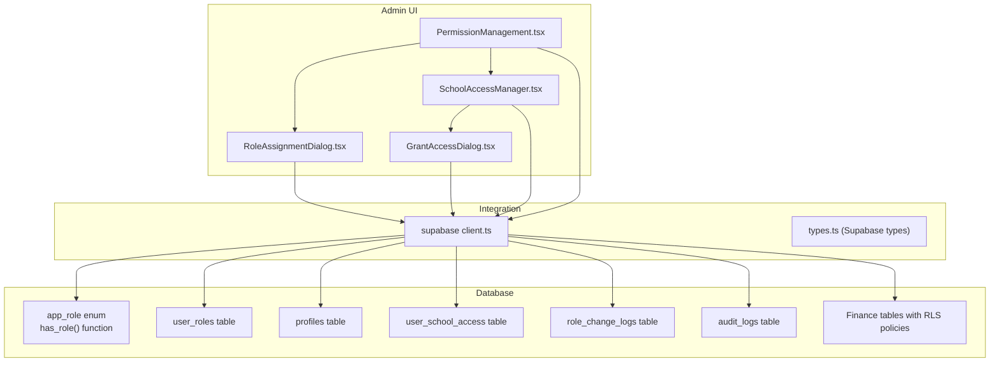
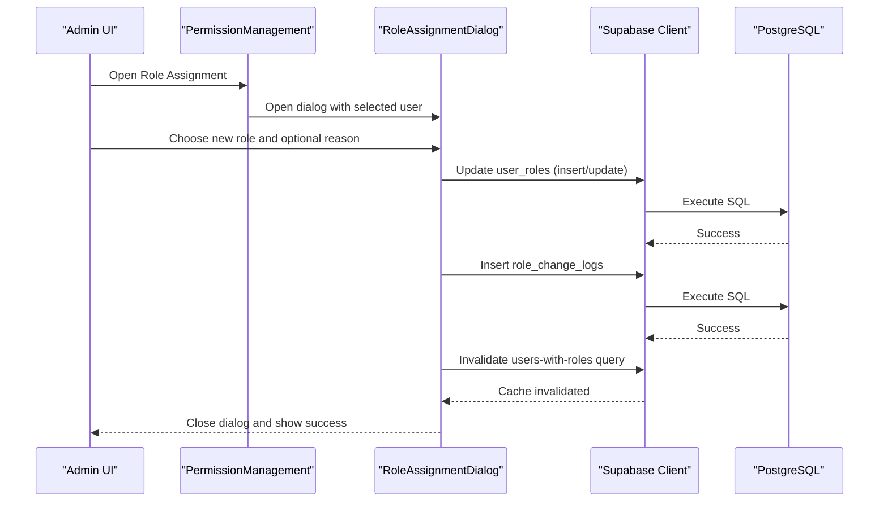
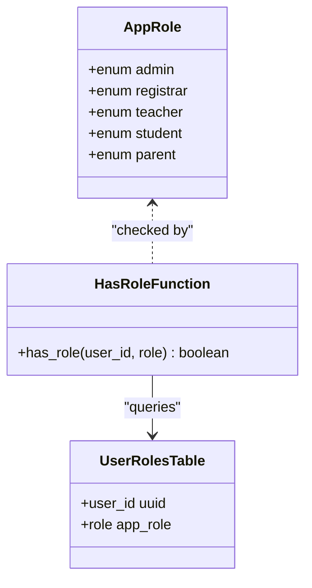
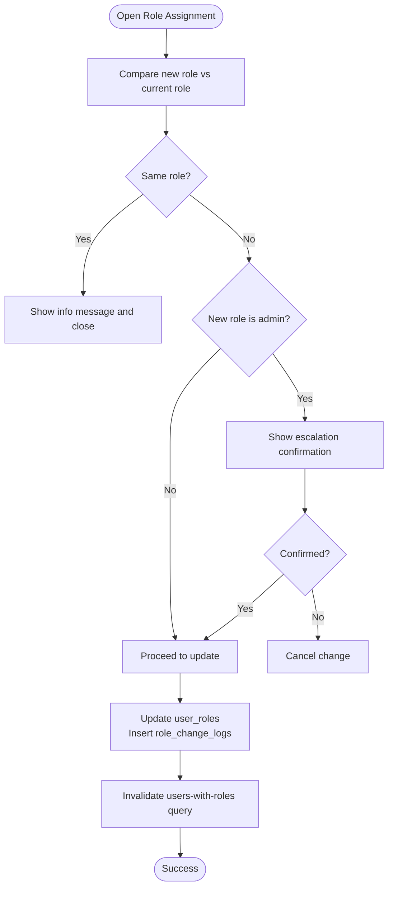
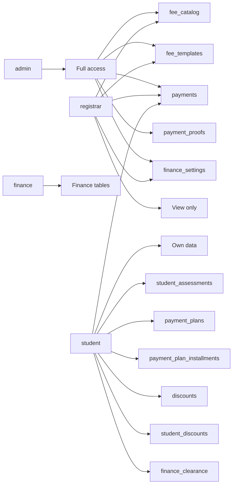
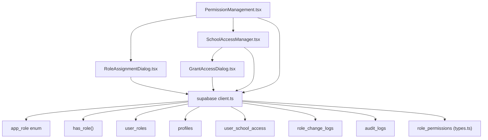

# Permission Management

<cite>
**Referenced Files in This Document**
- [PermissionManagement.tsx](file://src/components/admin/PermissionManagement.tsx)
- [RoleAssignmentDialog.tsx](file://src/components/admin/RoleAssignmentDialog.tsx)
- [SchoolAccessManager.tsx](file://src/components/admin/SchoolAccessManager.tsx)
- [GrantAccessDialog.tsx](file://src/components/admin/GrantAccessDialog.tsx)
- [client.ts](file://src/integrations/supabase/client.ts)
- [types.ts](file://src/integrations/supabase/types.ts)
- [20251217200033_03f3cae0-102d-45cf-9b2e-a9b257e4e2e4.sql](file://supabase/migrations/20251217200033_03f3cae0-102d-45cf-9b2e-a9b257e4e2e4.sql)
- [20260209103400_54926cd5-53f9-4511-855a-73c5808cff7a.sql](file://supabase/migrations/20260209103400_54926cd5-53f9-4511-855a-73c5808cff7a.sql)
- [20260209104034_edce6d0c-f158-4148-a2f9-00e214931442.sql](file://supabase/migrations/20260209104034_edce6d0c-f158-4148-a2f9-00e214931442.sql)
- [20260209100000_create_audit_logs.sql](file://supabase/migrations/20260209100000_create_audit_logs.sql)
- [20260209103502_b2a0d7e3-f02e-448d-aac8-5ea9b30a6314.sql](file://supabase/migrations/20260209103502_b2a0d7e3-f02e-448d-aac8-5ea9b30a6314.sql)
</cite>

## Table of Contents
1. [Introduction](#introduction)
2. [Project Structure](#project-structure)
3. [Core Components](#core-components)
4. [Architecture Overview](#architecture-overview)
5. [Detailed Component Analysis](#detailed-component-analysis)
6. [Dependency Analysis](#dependency-analysis)
7. [Performance Considerations](#performance-considerations)
8. [Troubleshooting Guide](#troubleshooting-guide)
9. [Conclusion](#conclusion)
10. [Appendices](#appendices)

## Introduction
This document describes the permission management system implemented in the portal. It covers role-based access control (RBAC), permission assignment workflows, access control policies, and administrative interfaces for managing roles and school-level access. It also documents privilege escalation controls, permission inheritance, granular access controls enforced via database row-level security (RLS), and security monitoring capabilities including auditing and compliance reporting.

## Project Structure
The permission management UI is organized under the admin components folder. The backend relies on Supabase authentication, a custom role enumeration, and row-level security policies to enforce access control at the database level.

**Diagram sources**
- [PermissionManagement.tsx](file://src/components/admin/PermissionManagement.tsx#L62-L277)
- [SchoolAccessManager.tsx](file://src/components/admin/SchoolAccessManager.tsx#L61-L349)
- [RoleAssignmentDialog.tsx](file://src/components/admin/RoleAssignmentDialog.tsx#L51-L209)
- [GrantAccessDialog.tsx](file://src/components/admin/GrantAccessDialog.tsx#L46-L203)
- [client.ts](file://src/integrations/supabase/client.ts)
- [types.ts](file://src/integrations/supabase/types.ts#L2613-L2658)
- [20251217200033_03f3cae0-102d-45cf-9b2e-a9b257e4e2e4.sql](file://supabase/migrations/20251217200033_03f3cae0-102d-45cf-9b2e-a9b257e4e2e4.sql#L1-L96)
- [20260209103502_b2a0d7e3-f02e-448d-aac8-5ea9b30a6314.sql](file://supabase/migrations/20260209103502_b2a0d7e3-f02e-448d-aac8-5ea9b30a6314.sql#L1-L350)

**Section sources**
- [PermissionManagement.tsx](file://src/components/admin/PermissionManagement.tsx#L62-L277)
- [SchoolAccessManager.tsx](file://src/components/admin/SchoolAccessManager.tsx#L61-L349)
- [RoleAssignmentDialog.tsx](file://src/components/admin/RoleAssignmentDialog.tsx#L51-L209)
- [GrantAccessDialog.tsx](file://src/components/admin/GrantAccessDialog.tsx#L46-L203)
- [client.ts](file://src/integrations/supabase/client.ts)
- [types.ts](file://src/integrations/supabase/types.ts#L2613-L2658)

## Core Components
- PermissionManagement: Central admin panel for viewing users, filtering by role, and changing roles. It displays a role reference and integrates with RoleAssignmentDialog and SchoolAccessManager.
- RoleAssignmentDialog: Handles role updates with confirmation for sensitive roles, logs changes, and invalidates queries.
- SchoolAccessManager: Manages per-school access grants, enables toggling activation, revocation, and bulk granting via GrantAccessDialog.
- GrantAccessDialog: Multi-select user picker, school selector, role selector, and submit handler for granting access.
- Supabase integration: Uses Supabase client for queries and mutations; relies on custom app_role enum and has_role function for policy checks.

**Section sources**
- [PermissionManagement.tsx](file://src/components/admin/PermissionManagement.tsx#L62-L277)
- [RoleAssignmentDialog.tsx](file://src/components/admin/RoleAssignmentDialog.tsx#L51-L209)
- [SchoolAccessManager.tsx](file://src/components/admin/SchoolAccessManager.tsx#L61-L349)
- [GrantAccessDialog.tsx](file://src/components/admin/GrantAccessDialog.tsx#L46-L203)

## Architecture Overview
The system enforces RBAC at two layers:
- Application UI layer: React components orchestrate role and access changes, with optimistic UX feedback and query invalidation.
- Database layer: Row-level security policies and a custom has_role function restrict data access based on user roles.

**Diagram sources**
- [PermissionManagement.tsx](file://src/components/admin/PermissionManagement.tsx#L115-L118)
- [RoleAssignmentDialog.tsx](file://src/components/admin/RoleAssignmentDialog.tsx#L58-L104)
- [client.ts](file://src/integrations/supabase/client.ts)

**Section sources**
- [PermissionManagement.tsx](file://src/components/admin/PermissionManagement.tsx#L62-L277)
- [RoleAssignmentDialog.tsx](file://src/components/admin/RoleAssignmentDialog.tsx#L51-L209)

## Detailed Component Analysis

### Role-Based Access Control (RBAC)
- Role model: A PostgreSQL enum app_role defines roles: admin, registrar, teacher, student, parent. A has_role function checks if a user possesses a given role.
- Default role: On user signup, a trigger assigns the default role student.
- Policy enforcement: RLS policies on tables use has_role to permit actions based on roles.

**Diagram sources**
- [20251217200033_03f3cae0-102d-45cf-9b2e-a9b257e4e2e4.sql](file://supabase/migrations/20251217200033_03f3cae0-102d-45cf-9b2e-a9b257e4e2e4.sql#L1-L96)
- [types.ts](file://src/integrations/supabase/types.ts#L2613-L2658)

**Section sources**
- [20251217200033_03f3cae0-102d-45cf-9b2e-a9b257e4e2e4.sql](file://supabase/migrations/20251217200033_03f3cae0-102d-45cf-9b2e-a9b257e4e2e4.sql#L1-L96)
- [types.ts](file://src/integrations/supabase/types.ts#L2613-L2658)

### Permission Assignment Workflows
- Role change process:
  - Admin selects a user and opens RoleAssignmentDialog.
  - The dialog validates that the new role differs from the current role.
  - For admin role changes, a confirmation step prevents accidental privilege escalation.
  - The mutation updates user_roles and inserts a record into role_change_logs.
  - Queries for users with roles are invalidated to refresh the UI.

**Diagram sources**
- [RoleAssignmentDialog.tsx](file://src/components/admin/RoleAssignmentDialog.tsx#L106-L118)
- [RoleAssignmentDialog.tsx](file://src/components/admin/RoleAssignmentDialog.tsx#L58-L104)

**Section sources**
- [RoleAssignmentDialog.tsx](file://src/components/admin/RoleAssignmentDialog.tsx#L51-L209)

### Access Control Policies
- Per-table RLS policies use has_role to control access. Examples include:
  - Finance and admin full access on fee_catalog, fee_templates, fee_template_items, student_assessments, assessment_items, payments, payment_proofs, payment_plans, payment_plan_installments, discounts, student_discounts, finance_clearance, clearance_rules, finance_settings.
  - Registrar can view certain finance-related tables.
  - Students can view their own assessments, payments, payment plans, and related items.
  - Storage buckets enforce upload/view/delete policies for payment proofs.
- Additional role support:
  - The app_role enum was extended to include finance.
  - user_school_access role constraint includes viewer and finance.

**Diagram sources**
- [20260209103502_b2a0d7e3-f02e-448d-aac8-5ea9b30a6314.sql](file://supabase/migrations/20260209103502_b2a0d7e3-f02e-448d-aac8-5ea9b30a6314.sql#L1-L350)
- [20260209103400_54926cd5-53f9-4511-855a-73c5808cff7a.sql](file://supabase/migrations/20260209103400_54926cd5-53f9-4511-855a-73c5808cff7a.sql#L1-L1)
- [20260209104034_edce6d0c-f158-4148-a2f9-00e214931442.sql](file://supabase/migrations/20260209104034_edce6d0c-f158-4148-a2f9-00e214931442.sql#L1-L2)

**Section sources**
- [20260209103502_b2a0d7e3-f02e-448d-aac8-5ea9b30a6314.sql](file://supabase/migrations/20260209103502_b2a0d7e3-f02e-448d-aac8-5ea9b30a6314.sql#L1-L350)
- [20260209103400_54926cd5-53f9-4511-855a-73c5808cff7a.sql](file://supabase/migrations/20260209103400_54926cd5-53f9-4511-855a-73c5808cff7a.sql#L1-L1)
- [20260209104034_edce6d0c-f158-4148-a2f9-00e214931442.sql](file://supabase/migrations/20260209104034_edce6d0c-f158-4148-a2f9-00e214931442.sql#L1-L2)

### Permission Management Interface
- Role Reference: Displays role names and descriptions for quick reference.
- Filtering: Filter users by role and search by name or email.
- Actions: Change Role button opens RoleAssignmentDialog; disabled for self-service to prevent privilege escalation.
- School Access Tab: Switches to SchoolAccessManager for per-school access management.

**Section sources**
- [PermissionManagement.tsx](file://src/components/admin/PermissionManagement.tsx#L144-L191)
- [PermissionManagement.tsx](file://src/components/admin/PermissionManagement.tsx#L233-L243)

### Role Assignment Procedures
- RoleAssignmentDialog:
  - Shows current role badge and allows selecting a new role from a predefined list.
  - Optional reason field for auditability.
  - Confirmation step for admin role changes.
  - Mutation updates user_roles and inserts role_change_logs.
  - Toast notifications provide user feedback.

**Section sources**
- [RoleAssignmentDialog.tsx](file://src/components/admin/RoleAssignmentDialog.tsx#L51-L209)

### Privilege Escalation Controls
- Admin role escalation requires explicit confirmation before proceeding.
- Self-role changes are disabled to prevent users from elevating their own privileges.
- Role change logs capture who changed roles, the reason, and the old/new roles.

**Section sources**
- [RoleAssignmentDialog.tsx](file://src/components/admin/RoleAssignmentDialog.tsx#L112-L118)
- [PermissionManagement.tsx](file://src/components/admin/PermissionManagement.tsx#L238-L242)
- [RoleAssignmentDialog.tsx](file://src/components/admin/RoleAssignmentDialog.tsx#L79-L93)

### Permission Inheritance and Granular Access Controls
- Inheritance: There is no explicit role hierarchy; access is granted per-policy using has_role checks.
- Granular controls: RLS policies define fine-grained permissions per table and operation (SELECT, INSERT, UPDATE, DELETE).
- School-level access: user_school_access table stores per-school roles and activation status.

**Section sources**
- [20260209103502_b2a0d7e3-f02e-448d-aac8-5ea9b30a6314.sql](file://supabase/migrations/20260209103502_b2a0d7e3-f02e-448d-aac8-5ea9b30a6314.sql#L1-L350)
- [SchoolAccessManager.tsx](file://src/components/admin/SchoolAccessManager.tsx#L61-L101)

### Security Policy Enforcement
- has_role function: Used by RLS policies to enforce access control.
- Storage policies: Payment proof bucket access restricted to finance and admin roles.
- Audit logs: General-purpose audit_logs table captures login attempts and other events.

**Section sources**
- [20251217200033_03f3cae0-102d-45cf-9b2e-a9b257e4e2e4.sql](file://supabase/migrations/20251217200033_03f3cae0-102d-45cf-9b2e-a9b257e4e2e4.sql#L27-L52)
- [20260209103502_b2a0d7e3-f02e-448d-aac8-5ea9b30a6314.sql](file://supabase/migrations/20260209103502_b2a0d7e3-f02e-448d-aac8-5ea9b30a6314.sql#L335-L340)
- [20260209100000_create_audit_logs.sql](file://supabase/migrations/20260209100000_create_audit_logs.sql#L1-L38)

### Examples of Permission Configuration
- Granting admin access: Use RoleAssignmentDialog to set role to admin with a reason; confirm escalation.
- Granting school access: Use GrantAccessDialog to select users, a school, and a role (admin, registrar, teacher), then submit.
- Revoking or disabling access: Use SchoolAccessManager to toggle activation or revoke access.

**Section sources**
- [RoleAssignmentDialog.tsx](file://src/components/admin/RoleAssignmentDialog.tsx#L106-L118)
- [GrantAccessDialog.tsx](file://src/components/admin/GrantAccessDialog.tsx#L190-L197)
- [SchoolAccessManager.tsx](file://src/components/admin/SchoolAccessManager.tsx#L192-L226)

### Role Hierarchy Management
- No explicit hierarchical role relationships exist. Access is determined by individual role membership checked via has_role.

**Section sources**
- [20251217200033_03f3cae0-102d-45cf-9b2e-a9b257e4e2e4.sql](file://supabase/migrations/20251217200033_03f3cae0-102d-45cf-9b2e-a9b257e4e2e4.sql#L27-L52)

### Access Control Testing Procedures
- Unit-level tests: Validate UI interactions (filtering, role change, confirmation).
- Integration tests: Verify Supabase mutations update user_roles and role_change_logs, and that RLS policies deny unauthorized access.
- End-to-end tests: Simulate admin granting access to users at a school and confirm visibility and actions align with assigned roles.

[No sources needed since this section provides general guidance]

## Dependency Analysis
The UI components depend on the Supabase client and rely on database-side policies for enforcement. The types file documents the role_permissions table, indicating potential future expansion for resource-level permissions.

**Diagram sources**
- [PermissionManagement.tsx](file://src/components/admin/PermissionManagement.tsx#L62-L277)
- [RoleAssignmentDialog.tsx](file://src/components/admin/RoleAssignmentDialog.tsx#L51-L209)
- [SchoolAccessManager.tsx](file://src/components/admin/SchoolAccessManager.tsx#L61-L349)
- [GrantAccessDialog.tsx](file://src/components/admin/GrantAccessDialog.tsx#L46-L203)
- [client.ts](file://src/integrations/supabase/client.ts)
- [types.ts](file://src/integrations/supabase/types.ts#L2613-L2658)

**Section sources**
- [types.ts](file://src/integrations/supabase/types.ts#L2613-L2658)

## Performance Considerations
- Query caching: React Query caches user lists and school access records; mutations invalidate relevant queries to keep the UI fresh.
- Indexes: Finance tables include indexes on foreign keys to improve query performance.
- RLS overhead: Policy checks occur server-side; minimize unnecessary queries and leverage selective column selection.

[No sources needed since this section provides general guidance]

## Troubleshooting Guide
- Role change fails:
  - Check for duplicate role entries and ensure the insert/update succeeds.
  - Verify role_change_logs insertion does not block the UI if it fails.
- Access denied errors:
  - Confirm the user has the required role via has_role checks.
  - Review RLS policies for the target table.
- School access not applying:
  - Ensure user_school_access records exist and are marked active.
  - Verify the selected role is permitted by the user_school_access role constraint.

**Section sources**
- [RoleAssignmentDialog.tsx](file://src/components/admin/RoleAssignmentDialog.tsx#L68-L93)
- [SchoolAccessManager.tsx](file://src/components/admin/SchoolAccessManager.tsx#L150-L190)
- [20260209104034_edce6d0c-f158-4148-a2f9-00e214931442.sql](file://supabase/migrations/20260209104034_edce6d0c-f158-4148-a2f9-00e214931442.sql#L1-L2)

## Conclusion
The permission management system combines a clear RBAC model with robust UI controls and strong database-level enforcement. Administrators can manage roles and per-school access with confirmation steps for sensitive changes, while RLS policies ensure granular access control across finance and other modules. Audit logs and role change logs support compliance and security monitoring.

## Appendices

### Appendix A: Database Schema Highlights
- app_role enum and has_role function define the RBAC foundation.
- user_roles table stores role assignments with uniqueness constraints.
- user_school_access table manages per-school roles and activation.
- role_change_logs tracks role modifications for auditability.
- audit_logs captures authentication and operational events.

**Section sources**
- [20251217200033_03f3cae0-102d-45cf-9b2e-a9b257e4e2e4.sql](file://supabase/migrations/20251217200033_03f3cae0-102d-45cf-9b2e-a9b257e4e2e4.sql#L1-L96)
- [20260209100000_create_audit_logs.sql](file://supabase/migrations/20260209100000_create_audit_logs.sql#L1-L38)
- [types.ts](file://src/integrations/supabase/types.ts#L2613-L2658)