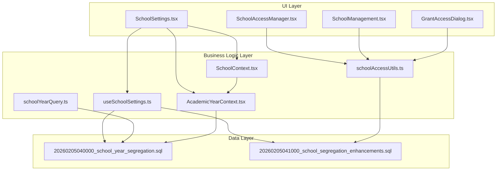
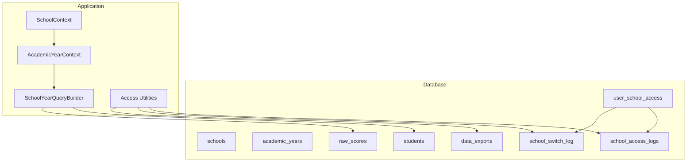
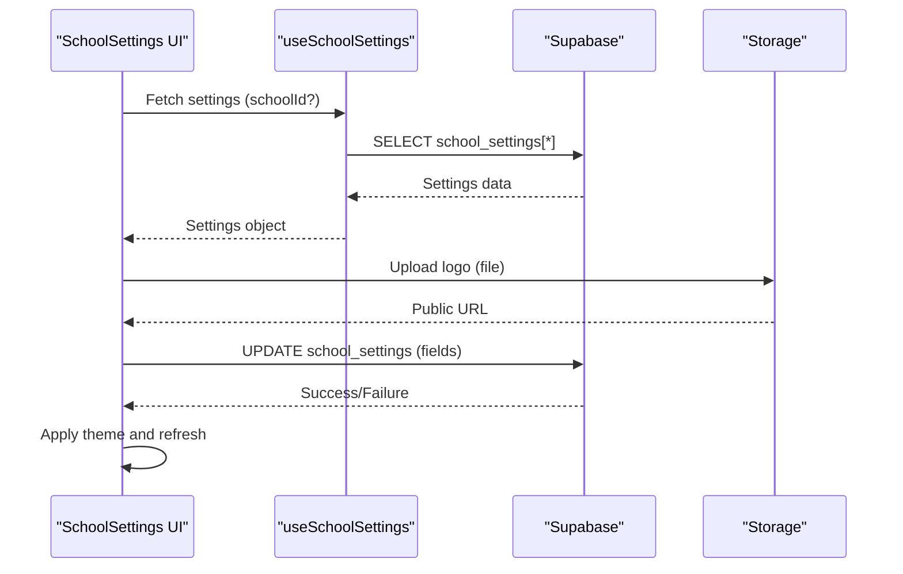
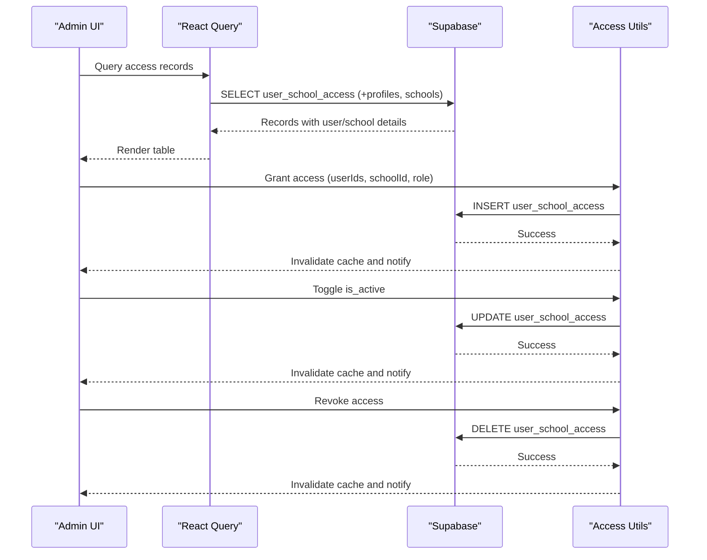
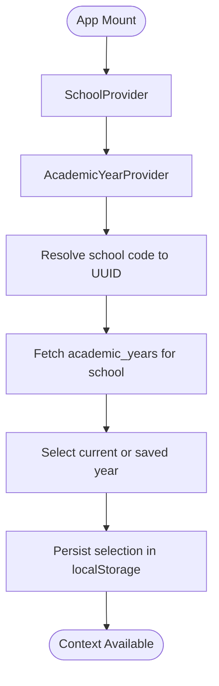
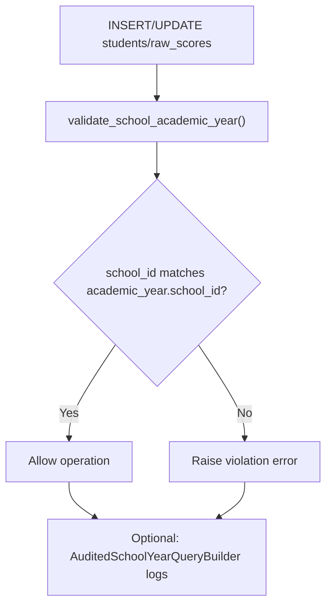
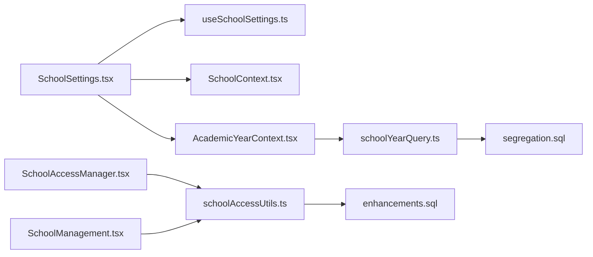

# School Settings & Configuration

<cite>
**Referenced Files in This Document**
- [SchoolSettings.tsx](file://src/components/admin/SchoolSettings.tsx)
- [SchoolAccessManager.tsx](file://src/components/admin/SchoolAccessManager.tsx)
- [SchoolManagement.tsx](file://src/components/admin/SchoolManagement.tsx)
- [GrantAccessDialog.tsx](file://src/components/admin/GrantAccessDialog.tsx)
- [SchoolContext.tsx](file://src/contexts/SchoolContext.tsx)
- [AcademicYearContext.tsx](file://src/contexts/AcademicYearContext.tsx)
- [useSchoolSettings.ts](file://src/hooks/useSchoolSettings.ts)
- [schoolAccessUtils.ts](file://src/utils/schoolAccessUtils.ts)
- [schoolYearQuery.ts](file://src/utils/schoolYearQuery.ts)
- [App.tsx](file://src/App.tsx)
- [20260205040000_school_year_segregation.sql](file://supabase/migrations/20260205040000_school_year_segregation.sql)
- [20260205041000_school_segregation_enhancements.sql](file://supabase/migrations/20260205041000_school_segregation_enhancements.sql)
- [SCHOOL_SEGREGATION.md](file://docs/SCHOOL_SEGREGATION.md)
- [SCHOOL_SEGREGATION_ENHANCEMENTS.md](file://docs/SCHOOL_SEGREGATION_ENHANCEMENTS.md)
</cite>

## Table of Contents
1. [Introduction](#introduction)
2. [Project Structure](#project-structure)
3. [Core Components](#core-components)
4. [Architecture Overview](#architecture-overview)
5. [Detailed Component Analysis](#detailed-component-analysis)
6. [Dependency Analysis](#dependency-analysis)
7. [Performance Considerations](#performance-considerations)
8. [Troubleshooting Guide](#troubleshooting-guide)
9. [Conclusion](#conclusion)
10. [Appendices](#appendices)

## Introduction
This document provides comprehensive documentation for school settings and configuration management within the portal. It explains how school-specific settings are configured, how access control is enforced across institutions, and how institutional data segregation is implemented. It also covers the school settings interface, access manager functionality, multi-school context handling, configuration options, data isolation mechanisms, institutional policy enforcement, validation and change tracking, and rollback considerations.

## Project Structure
The system is organized around three layers:
- UI Layer: Administrative components for managing schools, settings, and access.
- Business Logic Layer: Hooks, utilities, and contexts that enforce segregation and manage multi-school context.
- Data Layer: Supabase database with row-level security, audit logging, and segregation triggers.

**Diagram sources**
- [SchoolSettings.tsx](file://src/components/admin/SchoolSettings.tsx#L1-L614)
- [SchoolAccessManager.tsx](file://src/components/admin/SchoolAccessManager.tsx#L1-L349)
- [SchoolManagement.tsx](file://src/components/admin/SchoolManagement.tsx#L1-L464)
- [GrantAccessDialog.tsx](file://src/components/admin/GrantAccessDialog.tsx#L1-L203)
- [SchoolContext.tsx](file://src/contexts/SchoolContext.tsx#L1-L79)
- [AcademicYearContext.tsx](file://src/contexts/AcademicYearContext.tsx#L1-L116)
- [useSchoolSettings.ts](file://src/hooks/useSchoolSettings.ts#L1-L59)
- [schoolAccessUtils.ts](file://src/utils/schoolAccessUtils.ts#L1-L468)
- [schoolYearQuery.ts](file://src/utils/schoolYearQuery.ts#L1-L219)
- [20260205040000_school_year_segregation.sql](file://supabase/migrations/20260205040000_school_year_segregation.sql#L1-L264)
- [20260205041000_school_segregation_enhancements.sql](file://supabase/migrations/20260205041000_school_segregation_enhancements.sql#L1-L403)

**Section sources**
- [SchoolSettings.tsx](file://src/components/admin/SchoolSettings.tsx#L1-L614)
- [SchoolAccessManager.tsx](file://src/components/admin/SchoolAccessManager.tsx#L1-L349)
- [SchoolManagement.tsx](file://src/components/admin/SchoolManagement.tsx#L1-L464)
- [GrantAccessDialog.tsx](file://src/components/admin/GrantAccessDialog.tsx#L1-L203)
- [SchoolContext.tsx](file://src/contexts/SchoolContext.tsx#L1-L79)
- [AcademicYearContext.tsx](file://src/contexts/AcademicYearContext.tsx#L1-L116)
- [useSchoolSettings.ts](file://src/hooks/useSchoolSettings.ts#L1-L59)
- [schoolAccessUtils.ts](file://src/utils/schoolAccessUtils.ts#L1-L468)
- [schoolYearQuery.ts](file://src/utils/schoolYearQuery.ts#L1-L219)
- [20260205040000_school_year_segregation.sql](file://supabase/migrations/20260205040000_school_year_segregation.sql#L1-L264)
- [20260205041000_school_segregation_enhancements.sql](file://supabase/migrations/20260205041000_school_segregation_enhancements.sql#L1-L403)

## Core Components
- SchoolSettings: Manages school branding, themes, and metadata; supports creation and deletion of schools.
- SchoolAccessManager: Grants, enables/disables, and revokes access to schools for users; provides search and filtering.
- SchoolManagement: CRUD operations for schools with activation controls and search.
- Access Utilities: Helper functions for checking access, logging events, auditing operations, and tracking exports.
- Query Utilities: Enforces school-academic-year segregation via query builders and validation helpers.
- Context Providers: Manage selected school and academic year across the application.

**Section sources**
- [SchoolSettings.tsx](file://src/components/admin/SchoolSettings.tsx#L150-L315)
- [SchoolAccessManager.tsx](file://src/components/admin/SchoolAccessManager.tsx#L61-L227)
- [SchoolManagement.tsx](file://src/components/admin/SchoolManagement.tsx#L70-L179)
- [schoolAccessUtils.ts](file://src/utils/schoolAccessUtils.ts#L75-L154)
- [schoolYearQuery.ts](file://src/utils/schoolYearQuery.ts#L62-L148)
- [SchoolContext.tsx](file://src/contexts/SchoolContext.tsx#L51-L70)
- [AcademicYearContext.tsx](file://src/contexts/AcademicYearContext.tsx#L25-L107)

## Architecture Overview
The architecture enforces institutional data segregation at both the database and application levels:
- Database Level: Tables include school_id and academic_year_id; validation triggers prevent segregation violations; RLS policies restrict access based on user-school associations.
- Application Level: Context providers supply selected school and academic year; query builders automatically apply filters; access utilities centralize logging and auditing.

**Diagram sources**
- [20260205040000_school_year_segregation.sql](file://supabase/migrations/20260205040000_school_year_segregation.sql#L76-L171)
- [20260205041000_school_segregation_enhancements.sql](file://supabase/migrations/20260205041000_school_segregation_enhancements.sql#L8-L17)
- [AcademicYearContext.tsx](file://src/contexts/AcademicYearContext.tsx#L25-L107)
- [schoolYearQuery.ts](file://src/utils/schoolYearQuery.ts#L62-L148)
- [schoolAccessUtils.ts](file://src/utils/schoolAccessUtils.ts#L376-L467)

## Detailed Component Analysis

### School Settings Interface
The SchoolSettings component provides:
- Theme selection with live preview and persistence.
- Branding management (logo upload to storage, metadata editing).
- Multi-school support with creation and deletion workflows.
- Real-time feedback via toasts and loading states.

**Diagram sources**
- [SchoolSettings.tsx](file://src/components/admin/SchoolSettings.tsx#L180-L223)
- [useSchoolSettings.ts](file://src/hooks/useSchoolSettings.ts#L17-L39)

**Section sources**
- [SchoolSettings.tsx](file://src/components/admin/SchoolSettings.tsx#L150-L315)
- [useSchoolSettings.ts](file://src/hooks/useSchoolSettings.ts#L17-L59)

### Access Manager Functionality
The SchoolAccessManager enables administrators to:
- Grant access to users with role selection.
- Toggle active status of existing grants.
- Revoke access with confirmation.
- Search and filter access records.

**Diagram sources**
- [SchoolAccessManager.tsx](file://src/components/admin/SchoolAccessManager.tsx#L67-L227)
- [schoolAccessUtils.ts](file://src/utils/schoolAccessUtils.ts#L112-L154)

**Section sources**
- [SchoolAccessManager.tsx](file://src/components/admin/SchoolAccessManager.tsx#L61-L227)
- [GrantAccessDialog.tsx](file://src/components/admin/GrantAccessDialog.tsx#L46-L202)
- [schoolAccessUtils.ts](file://src/utils/schoolAccessUtils.ts#L112-L154)

### Multi-School Context Handling
Multi-school context is handled through:
- SchoolContext: Provides selected school and theme.
- AcademicYearContext: Resolves school code to UUID, loads academic years, and manages selection with persistence.

**Diagram sources**
- [App.tsx](file://src/App.tsx#L39-L84)
- [SchoolContext.tsx](file://src/contexts/SchoolContext.tsx#L51-L70)
- [AcademicYearContext.tsx](file://src/contexts/AcademicYearContext.tsx#L25-L107)

**Section sources**
- [App.tsx](file://src/App.tsx#L39-L84)
- [SchoolContext.tsx](file://src/contexts/SchoolContext.tsx#L1-L79)
- [AcademicYearContext.tsx](file://src/contexts/AcademicYearContext.tsx#L1-L116)

### Institutional Data Segregation
Data segregation is enforced by:
- Adding school_id and academic_year_id to all relevant tables.
- Creating validation triggers to prevent cross-school/year violations.
- Enabling RLS policies that filter data by user-school access.
- Logging access and changes for auditability.

**Diagram sources**
- [20260205040000_school_year_segregation.sql](file://supabase/migrations/20260205040000_school_year_segregation.sql#L206-L254)
- [schoolAccessUtils.ts](file://src/utils/schoolAccessUtils.ts#L376-L467)

**Section sources**
- [20260205040000_school_year_segregation.sql](file://supabase/migrations/20260205040000_school_year_segregation.sql#L76-L254)
- [20260205041000_school_segregation_enhancements.sql](file://supabase/migrations/20260205041000_school_segregation_enhancements.sql#L136-L241)
- [SCHOOL_SEGREGATION.md](file://docs/SCHOOL_SEGREGATION.md#L1-L260)
- [SCHOOL_SEGREGATION_ENHANCEMENTS.md](file://docs/SCHOOL_SEGREGATION_ENHANCEMENTS.md#L1-L471)

### Configuration Options and Customizations
- School branding: name, acronym, address, phone, email, website, logo upload.
- Theme customization: built-in palette applied to CSS variables and persisted locally.
- Multi-school administration: create, edit, activate/deactivate schools; delete with caution.
- Access roles: admin, registrar, teacher, viewer with granular permissions.

Examples of customizations:
- Adding a new school with default acronym derived from school ID.
- Uploading a school logo stored in Supabase storage with public URL retrieval.
- Switching themes and persisting preferences across sessions.

**Section sources**
- [SchoolSettings.tsx](file://src/components/admin/SchoolSettings.tsx#L27-L148)
- [SchoolSettings.tsx](file://src/components/admin/SchoolSettings.tsx#L262-L315)
- [SchoolManagement.tsx](file://src/components/admin/SchoolManagement.tsx#L105-L179)

### Access Control Workflows
- Grant access: Select users, school, and role; backend inserts into user_school_access.
- Toggle access: Enable/disable existing grants.
- Revoke access: Remove grants with confirmation.
- Search and filter: Find records by user email/name or school.

Operational notes:
- Existing grants are detected and skipped to avoid duplicates.
- RLS policies ensure users only see their own school’s data.

**Section sources**
- [SchoolAccessManager.tsx](file://src/components/admin/SchoolAccessManager.tsx#L150-L227)
- [GrantAccessDialog.tsx](file://src/components/admin/GrantAccessDialog.tsx#L46-L202)
- [20260205041000_school_segregation_enhancements.sql](file://supabase/migrations/20260205041000_school_segregation_enhancements.sql#L136-L241)

### Data Isolation Mechanisms
- Database-level: school_id and academic_year_id on all data tables; validation triggers; composite indexes; RLS policies.
- Application-level: query builders automatically filter by context; context validation throws errors if missing; access utilities centralize logging.

**Section sources**
- [schoolYearQuery.ts](file://src/utils/schoolYearQuery.ts#L62-L148)
- [20260205040000_school_year_segregation.sql](file://supabase/migrations/20260205040000_school_year_segregation.sql#L185-L201)
- [20260205041000_school_segregation_enhancements.sql](file://supabase/migrations/20260205041000_school_segregation_enhancements.sql#L136-L241)

### Institutional Policy Enforcement
- Access policies: Only users with active grants to a school can view or modify data; admins bypass restrictions.
- Audit logging: All SELECT/INSERT/UPDATE/DELETE/EXPORT actions are logged with context.
- Monitoring: Access statistics view aggregates recent activity.

**Section sources**
- [20260205041000_school_segregation_enhancements.sql](file://supabase/migrations/20260205041000_school_segregation_enhancements.sql#L136-L241)
- [schoolAccessUtils.ts](file://src/utils/schoolAccessUtils.ts#L163-L214)
- [SCHOOL_SEGREGATION_ENHANCEMENTS.md](file://docs/SCHOOL_SEGREGATION_ENHANCEMENTS.md#L360-L389)

### Settings Validation, Change Tracking, and Rollback
- Validation: Context validation throws errors if school or academic year is missing; segregation triggers prevent invalid combinations.
- Change tracking: Access logs capture all operations with timestamps and outcomes; export tracking records file metadata.
- Rollback: For destructive operations, use access logs to identify offending records and re-apply safe state; consider restoring from backups prior to migration.

**Section sources**
- [schoolYearQuery.ts](file://src/utils/schoolYearQuery.ts#L25-L35)
- [schoolAccessUtils.ts](file://src/utils/schoolAccessUtils.ts#L163-L214)
- [SCHOOL_SEGREGATION.md](file://docs/SCHOOL_SEGREGATION.md#L225-L260)

## Dependency Analysis
The following diagram shows key dependencies among components and utilities:

**Diagram sources**
- [SchoolSettings.tsx](file://src/components/admin/SchoolSettings.tsx#L1-L12)
- [useSchoolSettings.ts](file://src/hooks/useSchoolSettings.ts#L1-L3)
- [SchoolAccessManager.tsx](file://src/components/admin/SchoolAccessManager.tsx#L1-L11)
- [schoolAccessUtils.ts](file://src/utils/schoolAccessUtils.ts#L1-L9)
- [AcademicYearContext.tsx](file://src/contexts/AcademicYearContext.tsx#L1-L4)
- [schoolYearQuery.ts](file://src/utils/schoolYearQuery.ts#L1-L9)
- [20260205040000_school_year_segregation.sql](file://supabase/migrations/20260205040000_school_year_segregation.sql#L1-L264)
- [20260205041000_school_segregation_enhancements.sql](file://supabase/migrations/20260205041000_school_segregation_enhancements.sql#L1-L403)

**Section sources**
- [SchoolSettings.tsx](file://src/components/admin/SchoolSettings.tsx#L1-L12)
- [SchoolAccessManager.tsx](file://src/components/admin/SchoolAccessManager.tsx#L1-L11)
- [SchoolManagement.tsx](file://src/components/admin/SchoolManagement.tsx#L1-L13)
- [schoolAccessUtils.ts](file://src/utils/schoolAccessUtils.ts#L1-L9)
- [AcademicYearContext.tsx](file://src/contexts/AcademicYearContext.tsx#L1-L4)
- [schoolYearQuery.ts](file://src/utils/schoolYearQuery.ts#L1-L9)
- [20260205040000_school_year_segregation.sql](file://supabase/migrations/20260205040000_school_year_segregation.sql#L1-L264)
- [20260205041000_school_segregation_enhancements.sql](file://supabase/migrations/20260205041000_school_segregation_enhancements.sql#L1-L403)

## Performance Considerations
- Use composite indexes on (school_id, academic_year_id) to optimize queries.
- Prefer query builders that automatically apply filters to avoid scanning entire tables.
- Leverage RLS policies to reduce application-level filtering overhead.
- Monitor access statistics and export volumes to identify performance bottlenecks.

[No sources needed since this section provides general guidance]

## Troubleshooting Guide
Common issues and resolutions:
- School context errors: Ensure school and academic year are selected before performing operations.
- Data segregation violations: Verify academic year belongs to the selected school; check triggers and logs.
- RLS blocking access: Grant user access to the school or elevate role; confirm policies are active.
- Audit logs not appearing: Confirm RLS allows log insertion and that automatic logging is invoked.

**Section sources**
- [SCHOOL_SEGREGATION.md](file://docs/SCHOOL_SEGREGATION.md#L225-L260)
- [SCHOOL_SEGREGATION_ENHANCEMENTS.md](file://docs/SCHOOL_SEGREGATION_ENHANCEMENTS.md#L429-L456)

## Conclusion
The school settings and configuration system integrates robust data segregation, access control, and audit logging to ensure institutional compliance and operational safety. Administrators can manage schools, customize branding, and control access with confidence, knowing that database-level safeguards and application-level utilities enforce strict isolation and transparency.

[No sources needed since this section summarizes without analyzing specific files]

## Appendices

### Configuration Backup Procedures
- Back up database prior to applying segregation migrations.
- Maintain versioned backups of schema and data exports.
- Document access grants and recent changes for quick restoration.

**Section sources**
- [SCHOOL_SEGREGATION.md](file://docs/SCHOOL_SEGREGATION.md#L189-L208)

### Institutional Policy References
- Access policies and RLS definitions are documented in the enhancements migration.
- Audit logging and monitoring views are defined in the enhancements migration.

**Section sources**
- [20260205041000_school_segregation_enhancements.sql](file://supabase/migrations/20260205041000_school_segregation_enhancements.sql#L136-L241)
- [20260205041000_school_segregation_enhancements.sql](file://supabase/migrations/20260205041000_school_segregation_enhancements.sql#L330-L342)