# System Administration

<cite>
**Referenced Files in This Document**
- [AdminPanel.tsx](file://src/components/admin/AdminPanel.tsx)
- [UserManagement.tsx](file://src/components/admin/UserManagement.tsx)
- [PermissionManagement.tsx](file://src/components/admin/PermissionManagement.tsx)
- [SchoolAccessManager.tsx](file://src/components/admin/SchoolAccessManager.tsx)
- [ActivityLogs.tsx](file://src/components/admin/ActivityLogs.tsx)
- [SchoolSettings.tsx](file://src/components/admin/SchoolSettings.tsx)
- [DataQualityDashboard.tsx](file://src/components/admin/DataQualityDashboard.tsx)
- [RoleAssignmentDialog.tsx](file://src/components/admin/RoleAssignmentDialog.tsx)
- [GrantAccessDialog.tsx](file://src/components/admin/GrantAccessDialog.tsx)
- [useAuditLog.ts](file://src/hooks/useAuditLog.ts)
- [client.ts](file://src/integrations/supabase/client.ts)
- [20260205040000_school_year_segregation.sql](file://supabase/migrations/20260205040000_school_year_segregation.sql)
- [20260205041000_school_segregation_enhancements.sql](file://supabase/migrations/202602050410000_school_segregation_enhancements.sql)
- [20260209100000_create_audit_logs.sql](file://supabase/migrations/20260209100000_create_audit_logs.sql)
- [20260210120000_grant_stfxsa_finance_access.sql](file://supabase/migrations/20260210120000_grant_stfxsa_finance_access.sql)
</cite>

## Table of Contents
1. [Introduction](#introduction)
2. [Project Structure](#project-structure)
3. [Core Components](#core-components)
4. [Architecture Overview](#architecture-overview)
5. [Detailed Component Analysis](#detailed-component-analysis)
6. [Dependency Analysis](#dependency-analysis)
7. [Performance Considerations](#performance-considerations)
8. [Troubleshooting Guide](#troubleshooting-guide)
9. [Conclusion](#conclusion)
10. [Appendices](#appendices)

## Introduction
This document describes the system administration capabilities of the platform, focusing on user management, role and permission configuration, school-level data segregation, activity logging, audit trails, compliance reporting, monitoring, and operational workflows. It synthesizes the frontend administrative components with backend database policies and stored procedures to present a complete picture of how administrators interact with the system and how data isolation and security are enforced.

## Project Structure
Administrative functionality is organized under the admin namespace in the frontend and supported by Supabase Row Level Security (RLS) policies and PostgreSQL functions in the backend. The admin panel aggregates multiple specialized views: user management, permissions, school access, data quality, activity logs, and school settings.

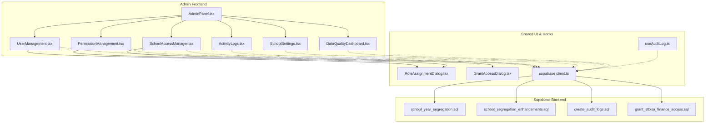

**Diagram sources**
- [AdminPanel.tsx](file://src/components/admin/AdminPanel.tsx#L1-L229)
- [UserManagement.tsx](file://src/components/admin/UserManagement.tsx#L1-L881)
- [PermissionManagement.tsx](file://src/components/admin/PermissionManagement.tsx#L1-L277)
- [SchoolAccessManager.tsx](file://src/components/admin/SchoolAccessManager.tsx#L1-L349)
- [ActivityLogs.tsx](file://src/components/admin/ActivityLogs.tsx#L1-L312)
- [SchoolSettings.tsx](file://src/components/admin/SchoolSettings.tsx#L1-L614)
- [DataQualityDashboard.tsx](file://src/components/admin/DataQualityDashboard.tsx#L1-L403)
- [RoleAssignmentDialog.tsx](file://src/components/admin/RoleAssignmentDialog.tsx#L1-L209)
- [GrantAccessDialog.tsx](file://src/components/admin/GrantAccessDialog.tsx#L1-L203)
- [useAuditLog.ts](file://src/hooks/useAuditLog.ts#L1-L69)
- [client.ts](file://src/integrations/supabase/client.ts#L1-L17)
- [20260205040000_school_year_segregation.sql](file://supabase/migrations/20260205040000_school_year_segregation.sql#L1-L264)
- [20260205041000_school_segregation_enhancements.sql](file://supabase/migrations/20260205041000_school_segregation_enhancements.sql#L1-L403)
- [20260209100000_create_audit_logs.sql](file://supabase/migrations/20260209100000_create_audit_logs.sql#L1-L38)
- [20260210120000_grant_stfxsa_finance_access.sql](file://supabase/migrations/20260210120000_grant_stfxsa_finance_access.sql#L1-L70)

**Section sources**
- [AdminPanel.tsx](file://src/components/admin/AdminPanel.tsx#L1-L229)
- [client.ts](file://src/integrations/supabase/client.ts#L1-L17)

## Core Components
- Admin Panel: Central hub organizing administrative tasks across users, permissions, schools, data quality, logs, settings, and system-level actions.
- User Management: Create and manage user accounts, bulk operations, credential generation, password resets, and account deletion.
- Permission Management: Role assignment and role change logging with administrative safeguards.
- School Access Manager: Grant, enable/disable, and revoke access to schools with role scoping.
- Activity Logs: Monitor authentication activity with filtering, export, and status indicators.
- School Settings: Manage branding, themes, and multiple school profiles.
- Data Quality Dashboard: Scan and resolve data validation issues with severity and resolution tracking.
- Audit Hook: Structured audit logging for critical actions with geolocation metadata.

**Section sources**
- [AdminPanel.tsx](file://src/components/admin/AdminPanel.tsx#L1-L229)
- [UserManagement.tsx](file://src/components/admin/UserManagement.tsx#L1-L881)
- [PermissionManagement.tsx](file://src/components/admin/PermissionManagement.tsx#L1-L277)
- [SchoolAccessManager.tsx](file://src/components/admin/SchoolAccessManager.tsx#L1-L349)
- [ActivityLogs.tsx](file://src/components/admin/ActivityLogs.tsx#L1-L312)
- [SchoolSettings.tsx](file://src/components/admin/SchoolSettings.tsx#L1-L614)
- [DataQualityDashboard.tsx](file://src/components/admin/DataQualityDashboard.tsx#L1-L403)
- [useAuditLog.ts](file://src/hooks/useAuditLog.ts#L1-L69)

## Architecture Overview
The admin system integrates frontend components with Supabase for data access and security. RLS policies enforce school-level segregation, while helper functions and triggers validate data consistency. Audit logs capture both authentication and school access events for compliance and monitoring.

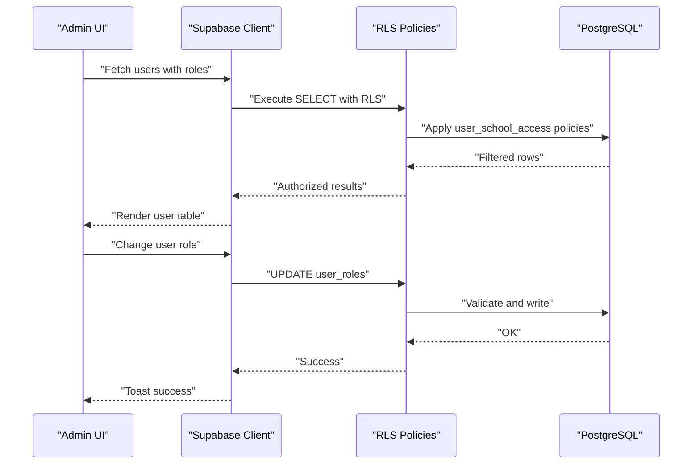

**Diagram sources**
- [PermissionManagement.tsx](file://src/components/admin/PermissionManagement.tsx#L69-L103)
- [20260205041000_school_segregation_enhancements.sql](file://supabase/migrations/20260205041000_school_segregation_enhancements.sql#L134-L188)
- [client.ts](file://src/integrations/supabase/client.ts#L1-L17)

## Detailed Component Analysis

### Admin Panel
- Purpose: Aggregates administrative functions in a tabbed interface.
- Key features:
  - User management, permissions, schools, data quality, logs, settings.
  - System-level actions: reset student records (with confirmation), refresh data cache.
- Security: Danger zone warnings and confirmation dialogs for destructive actions.

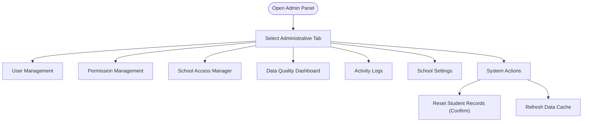

**Diagram sources**
- [AdminPanel.tsx](file://src/components/admin/AdminPanel.tsx#L59-L229)

**Section sources**
- [AdminPanel.tsx](file://src/components/admin/AdminPanel.tsx#L1-L229)

### User Management
- Capabilities:
  - Create admin/registrar accounts and bulk student accounts from existing student records.
  - Generate printable credential slips and bulk QR code downloads.
  - Reset student accounts, reset individual passwords, delete accounts.
  - Filter and search across school, role, and grade level.
- Integrations:
  - Uses Supabase functions for account creation and resets.
  - Real-time credential updates via React Query.

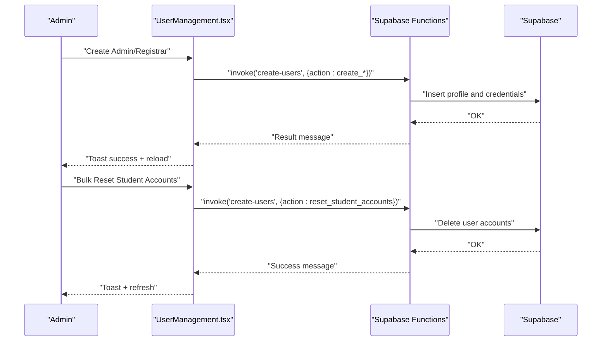

**Diagram sources**
- [UserManagement.tsx](file://src/components/admin/UserManagement.tsx#L271-L337)

**Section sources**
- [UserManagement.tsx](file://src/components/admin/UserManagement.tsx#L1-L881)

### Permission Management
- Capabilities:
  - View users with roles, search and filter by name/email/role.
  - Change roles with confirmation for admin grants and reason logging.
  - Manage school access via dedicated manager component.
- Security:
  - Role change logs track who changed roles and why.
  - Admin-only access to sensitive role changes.

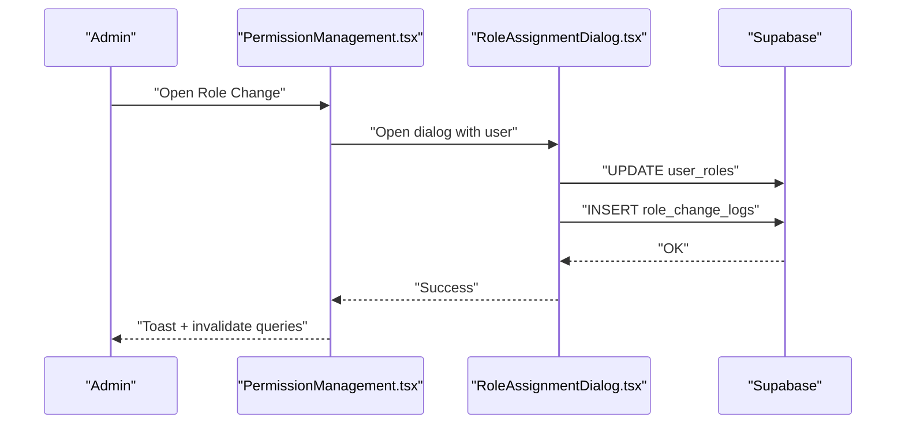

**Diagram sources**
- [PermissionManagement.tsx](file://src/components/admin/PermissionManagement.tsx#L115-L118)
- [RoleAssignmentDialog.tsx](file://src/components/admin/RoleAssignmentDialog.tsx#L58-L104)

**Section sources**
- [PermissionManagement.tsx](file://src/components/admin/PermissionManagement.tsx#L1-L277)
- [RoleAssignmentDialog.tsx](file://src/components/admin/RoleAssignmentDialog.tsx#L1-L209)

### School Access Manager
- Capabilities:
  - Grant access to users for specific schools with role selection.
  - Toggle activation/deactivation and revoke access.
  - Search and filter across users and schools.
- Security:
  - RLS policies restrict access based on user_school_access.
  - Admins can manage all access; users see own access only.

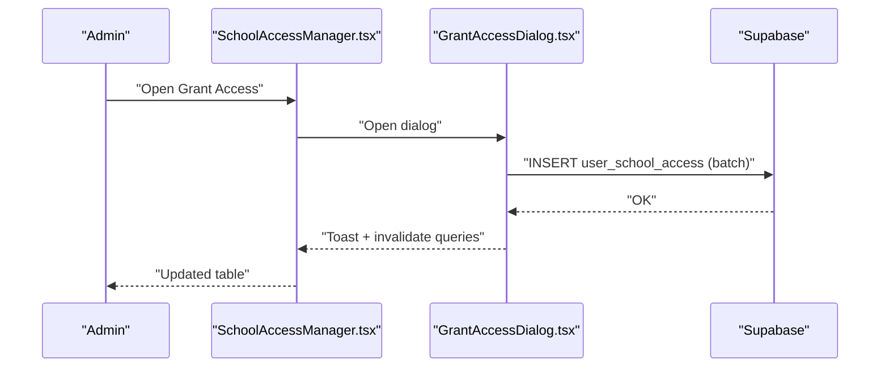

**Diagram sources**
- [SchoolAccessManager.tsx](file://src/components/admin/SchoolAccessManager.tsx#L150-L190)
- [GrantAccessDialog.tsx](file://src/components/admin/GrantAccessDialog.tsx#L1-L203)

**Section sources**
- [SchoolAccessManager.tsx](file://src/components/admin/SchoolAccessManager.tsx#L1-L349)
- [GrantAccessDialog.tsx](file://src/components/admin/GrantAccessDialog.tsx#L1-L203)

### Activity Logs
- Capabilities:
  - Filter by action type (login/logout/failed login), date range, and search term.
  - Export filtered logs to CSV.
  - Status badges and action icons for quick comprehension.
- Compliance:
  - Captures user identity, IP, user agent, and error messages for auditability.

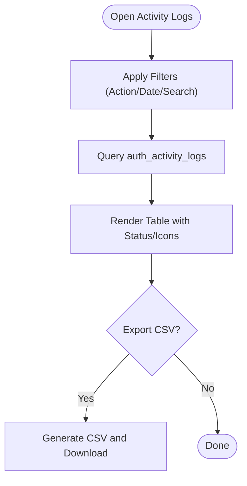

**Diagram sources**
- [ActivityLogs.tsx](file://src/components/admin/ActivityLogs.tsx#L58-L88)

**Section sources**
- [ActivityLogs.tsx](file://src/components/admin/ActivityLogs.tsx#L1-L312)

### School Settings
- Capabilities:
  - Manage multiple schools with unique identifiers and acronyms.
  - Upload and preview logos; apply color themes with live preview.
  - Persist settings to school_settings table.
- Operational:
  - Theme application writes CSS variables and saves preference locally.

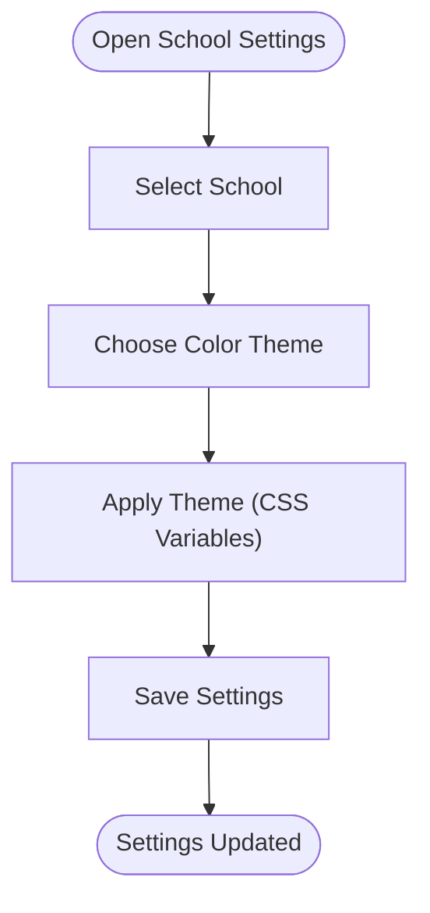

**Diagram sources**
- [SchoolSettings.tsx](file://src/components/admin/SchoolSettings.tsx#L150-L223)

**Section sources**
- [SchoolSettings.tsx](file://src/components/admin/SchoolSettings.tsx#L1-L614)

### Data Quality Dashboard
- Capabilities:
  - Run scans to detect missing birthdates, invalid contacts, incomplete requirements, and duplicates.
  - Resolve issues and track resolution timestamps.
  - Filter by type and status; search by student name/LRN.
- Data Segregation:
  - Scans operate within the selected school’s context using UUID mapping.

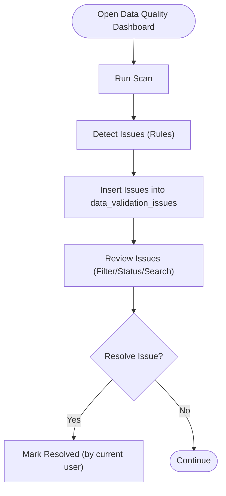

**Diagram sources**
- [DataQualityDashboard.tsx](file://src/components/admin/DataQualityDashboard.tsx#L92-L234)

**Section sources**
- [DataQualityDashboard.tsx](file://src/components/admin/DataQualityDashboard.tsx#L1-L403)

### Audit Logging Hook
- Purpose: Standardized audit logging for critical actions with optional geolocation metadata.
- Scope: Supports login attempts, successes/failures, impersonation, data exports, and grade changes.
- Persistence: Inserts into audit_logs with RLS allowing inserts from authenticated sessions.

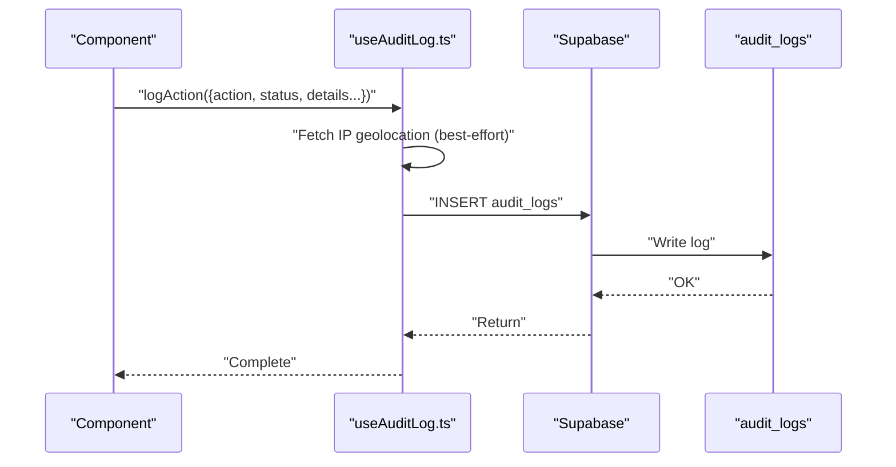

**Diagram sources**
- [useAuditLog.ts](file://src/hooks/useAuditLog.ts#L23-L60)

**Section sources**
- [useAuditLog.ts](file://src/hooks/useAuditLog.ts#L1-L69)
- [20260209100000_create_audit_logs.sql](file://supabase/migrations/20260209100000_create_audit_logs.sql#L1-L38)

## Dependency Analysis
Administrative components depend on Supabase for data access and rely on backend RLS policies and helper functions to enforce data segregation and access control.

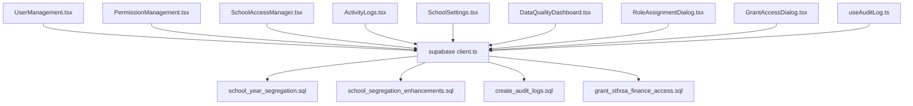

**Diagram sources**
- [client.ts](file://src/integrations/supabase/client.ts#L1-L17)
- [20260205040000_school_year_segregation.sql](file://supabase/migrations/20260205040000_school_year_segregation.sql#L1-L264)
- [20260205041000_school_segregation_enhancements.sql](file://supabase/migrations/20260205041000_school_segregation_enhancements.sql#L1-L403)
- [20260209100000_create_audit_logs.sql](file://supabase/migrations/20260209100000_create_audit_logs.sql#L1-L38)
- [20260210120000_grant_stfxsa_finance_access.sql](file://supabase/migrations/20260210120000_grant_stfxsa_finance_access.sql#L1-L70)

**Section sources**
- [client.ts](file://src/integrations/supabase/client.ts#L1-L17)
- [20260205040000_school_year_segregation.sql](file://supabase/migrations/20260205040000_school_year_segregation.sql#L1-L264)
- [20260205041000_school_segregation_enhancements.sql](file://supabase/migrations/20260205041000_school_segregation_enhancements.sql#L1-L403)
- [20260209100000_create_audit_logs.sql](file://supabase/migrations/20260209100000_create_audit_logs.sql#L1-L38)
- [20260210120000_grant_stfxsa_finance_access.sql](file://supabase/migrations/20260210120000_grant_stfxsa_finance_access.sql#L1-L70)

## Performance Considerations
- Database indexing:
  - Composite indexes on (school_id, academic_year_id) for students and raw scores improve segregation queries.
  - Dedicated indexes on access logs and audit logs support frequent filtering and sorting.
- RLS overhead:
  - Policies add minimal overhead but ensure correctness; keep filters selective.
- Client-side caching:
  - React Query invalidation refreshes data after mutations to maintain consistency.
- Batch operations:
  - Bulk user creation and access grants minimize round-trips.

[No sources needed since this section provides general guidance]

## Troubleshooting Guide
- Authentication and session:
  - Ensure Supabase client is configured with correct environment variables and persistent auth storage is enabled.
- Role changes:
  - Admin-only role changes require admin privileges; verify current user role and that role change logs were inserted.
- School access grants:
  - If granting access fails, verify the target users do not already have access; the system skips existing records.
- Data segregation violations:
  - If inserts/update violate academic year and school matching, the validation trigger raises an error; confirm academic year belongs to the same school.
- Audit logs:
  - IP geolocation fetch failures are handled gracefully; logs still insert without location data.

**Section sources**
- [client.ts](file://src/integrations/supabase/client.ts#L11-L17)
- [RoleAssignmentDialog.tsx](file://src/components/admin/RoleAssignmentDialog.tsx#L58-L104)
- [SchoolAccessManager.tsx](file://src/components/admin/SchoolAccessManager.tsx#L150-L190)
- [20260205040000_school_year_segregation.sql](file://supabase/migrations/20260205040000_school_year_segregation.sql#L206-L253)
- [useAuditLog.ts](file://src/hooks/useAuditLog.ts#L23-L60)

## Conclusion
The administrative suite provides a comprehensive toolkit for managing users, roles, and school access, enforcing strict data segregation through RLS and triggers, and maintaining robust audit trails. The modular frontend components integrate seamlessly with backend policies and functions to deliver a secure, auditable, and operable system.

[No sources needed since this section summarizes without analyzing specific files]

## Appendices

### Administrative Workflows

- User Onboarding Workflow
  - Create admin/registrar accounts via quick forms.
  - Bulk create student accounts from existing student records.
  - Generate credential slips and bulk QR codes for distribution.

- Role Assignment Workflow
  - Navigate to Permission Management.
  - Select user and open Role Assignment dialog.
  - Choose new role, optionally add reason, confirm admin changes.
  - Observe role change logs for auditability.

- School Access Workflow
  - Open School Access Manager.
  - Use Grant Access dialog to select users, school, and role.
  - Toggle activation or revoke access as needed.

- Data Quality Workflow
  - Run scan to detect issues across students.
  - Filter by type/status and resolve issues.
  - Track resolution timestamps and responsible users.

- Compliance Reporting Workflow
  - Export activity logs to CSV for review.
  - Use audit logs for login/logout and critical action tracking.
  - Monitor access logs for school data modifications.

[No sources needed since this section provides general guidance]