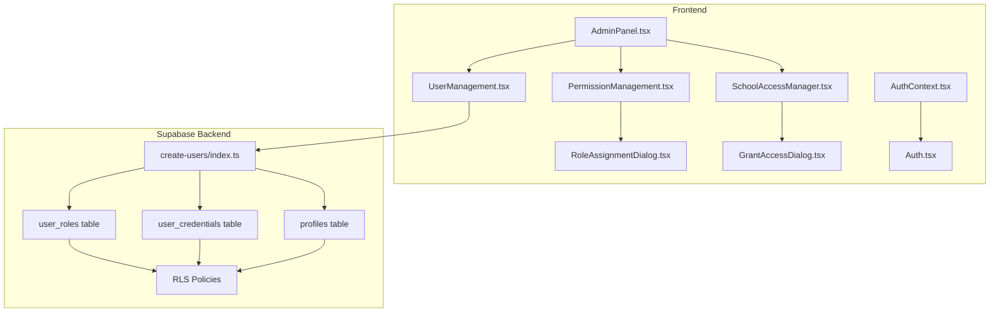
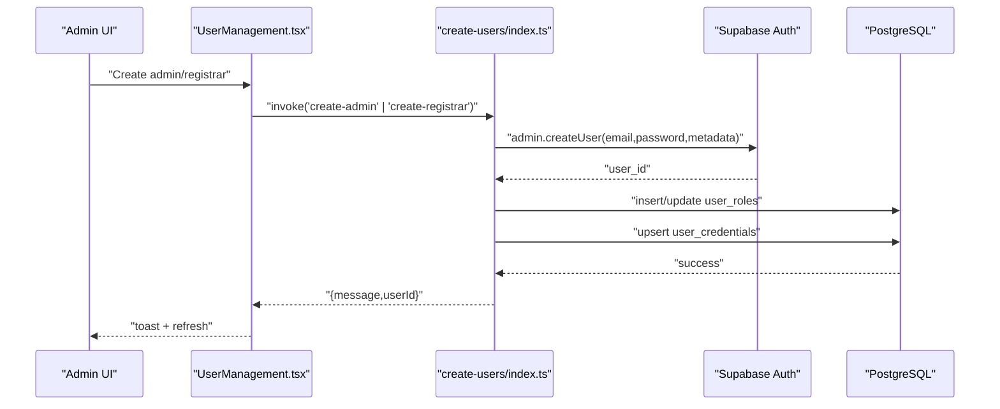
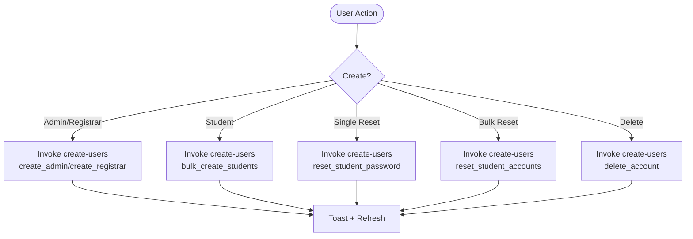
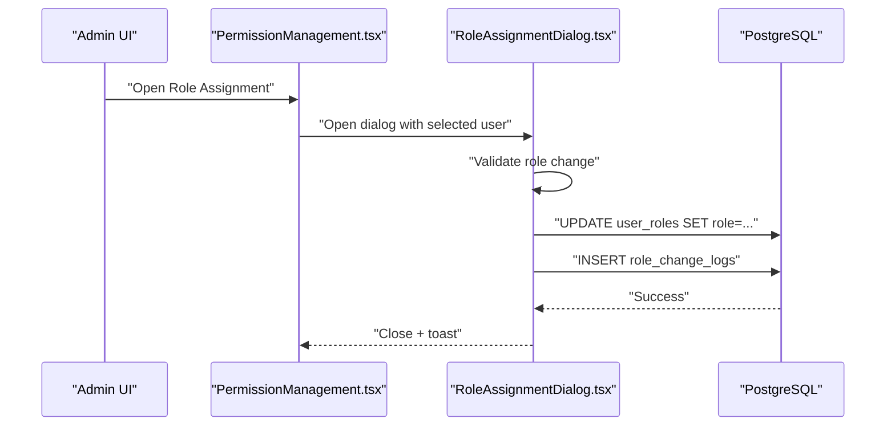
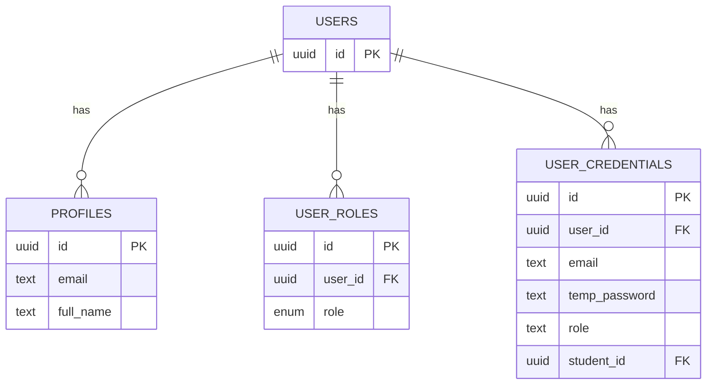
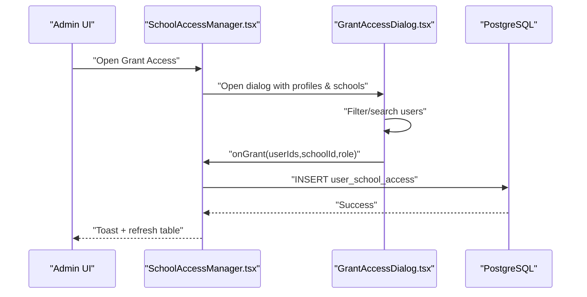
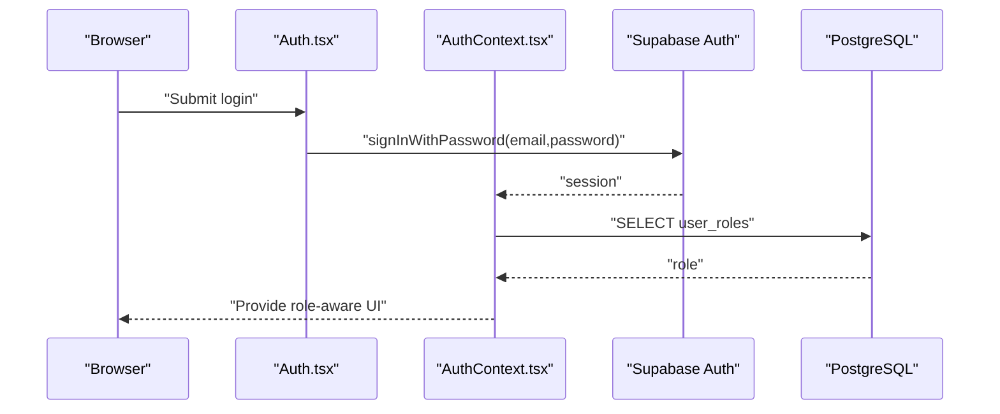
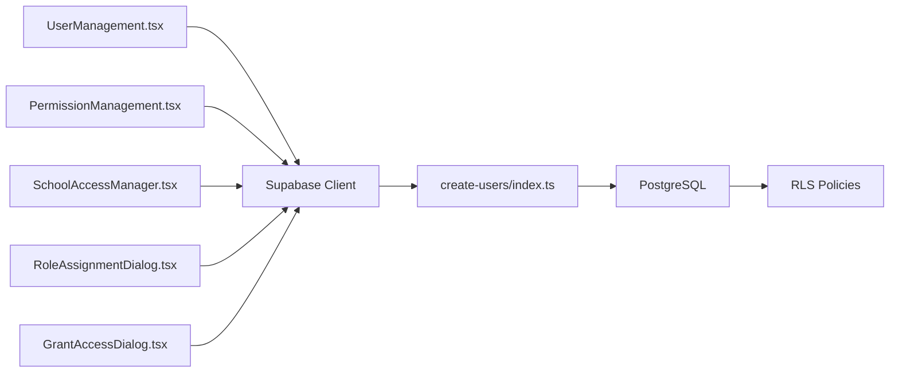

# User Management

<cite>
**Referenced Files in This Document**
- [UserManagement.tsx](file://src/components/admin/UserManagement.tsx)
- [PermissionManagement.tsx](file://src/components/admin/PermissionManagement.tsx)
- [RoleAssignmentDialog.tsx](file://src/components/admin/RoleAssignmentDialog.tsx)
- [GrantAccessDialog.tsx](file://src/components/admin/GrantAccessDialog.tsx)
- [SchoolAccessManager.tsx](file://src/components/admin/SchoolAccessManager.tsx)
- [create-users/index.ts](file://supabase/functions/create-users/index.ts)
- [user_credentials table migration](file://supabase/migrations/20251217201651_54362da4-5970-4c1e-bc12-9627b98a12f1.sql)
- [user_roles and profiles migration](file://supabase/migrations/20251217200033_03f3cae0-102d-45cf-9b2e-a9b257e4e2e4.sql)
- [AuthContext.tsx](file://src/contexts/AuthContext.tsx)
- [Auth.tsx](file://src/pages/Auth.tsx)
- [AdminPanel.tsx](file://src/components/admin/AdminPanel.tsx)
</cite>

## Table of Contents
1. [Introduction](#introduction)
2. [Project Structure](#project-structure)
3. [Core Components](#core-components)
4. [Architecture Overview](#architecture-overview)
5. [Detailed Component Analysis](#detailed-component-analysis)
6. [Dependency Analysis](#dependency-analysis)
7. [Performance Considerations](#performance-considerations)
8. [Troubleshooting Guide](#troubleshooting-guide)
9. [Conclusion](#conclusion)

## Introduction
This document describes the user management system for the portal, covering user account lifecycle (creation, modification, deletion), role assignment workflows, permission management, access control mechanisms, and administrative interfaces. It explains how the frontend integrates with Supabase authentication and serverless functions to manage users, and how role-based and school-based access control is enforced.

## Project Structure
The user management system spans frontend React components and backend Supabase functions and policies:
- Frontend admin panels and dialogs for user management, role assignment, and school access
- Supabase authentication and edge functions for secure user operations
- Database tables for profiles, roles, credentials, and school access with row-level security

**Diagram sources**
- [UserManagement.tsx](file://src/components/admin/UserManagement.tsx#L1-L881)
- [PermissionManagement.tsx](file://src/components/admin/PermissionManagement.tsx#L1-L277)
- [RoleAssignmentDialog.tsx](file://src/components/admin/RoleAssignmentDialog.tsx#L1-L209)
- [GrantAccessDialog.tsx](file://src/components/admin/GrantAccessDialog.tsx#L1-L203)
- [SchoolAccessManager.tsx](file://src/components/admin/SchoolAccessManager.tsx#L1-L349)
- [create-users/index.ts](file://supabase/functions/create-users/index.ts#L1-L545)
- [user_credentials table migration](file://supabase/migrations/20251217201651_54362da4-5970-4c1e-bc12-9627b98a12f1.sql#L1-L32)
- [user_roles and profiles migration](file://supabase/migrations/20251217200033_03f3cae0-102d-45cf-9b2e-a9b257e4e2e4.sql#L1-L96)
- [AuthContext.tsx](file://src/contexts/AuthContext.tsx#L1-L216)
- [Auth.tsx](file://src/pages/Auth.tsx#L1-L243)
- [AdminPanel.tsx](file://src/components/admin/AdminPanel.tsx#L1-L229)

**Section sources**
- [UserManagement.tsx](file://src/components/admin/UserManagement.tsx#L1-L881)
- [PermissionManagement.tsx](file://src/components/admin/PermissionManagement.tsx#L1-L277)
- [RoleAssignmentDialog.tsx](file://src/components/admin/RoleAssignmentDialog.tsx#L1-L209)
- [GrantAccessDialog.tsx](file://src/components/admin/GrantAccessDialog.tsx#L1-L203)
- [SchoolAccessManager.tsx](file://src/components/admin/SchoolAccessManager.tsx#L1-L349)
- [create-users/index.ts](file://supabase/functions/create-users/index.ts#L1-L545)
- [user_credentials table migration](file://supabase/migrations/20251217201651_54362da4-5970-4c1e-bc12-9627b98a12f1.sql#L1-L32)
- [user_roles and profiles migration](file://supabase/migrations/20251217200033_03f3cae0-102d-45cf-9b2e-a9b257e4e2e4.sql#L1-L96)
- [AuthContext.tsx](file://src/contexts/AuthContext.tsx#L1-L216)
- [Auth.tsx](file://src/pages/Auth.tsx#L1-L243)
- [AdminPanel.tsx](file://src/components/admin/AdminPanel.tsx#L1-L229)

## Core Components
- UserManagement: Creates admin/registrar accounts, bulk creates student accounts, resets student accounts, resets individual passwords, deletes accounts, prints credential slips, downloads QR codes.
- PermissionManagement: Lists users, filters by role, opens RoleAssignmentDialog for role changes.
- RoleAssignmentDialog: Updates user roles with audit logging and confirmation for sensitive roles.
- SchoolAccessManager: Manages per-school user access, grants/revokes toggles, integrates with GrantAccessDialog.
- GrantAccessDialog: Multi-select users, selects school and role, triggers batch grants.
- AuthContext and Auth: Authentication integration, role resolution, impersonation, audit logging for login/logout.

**Section sources**
- [UserManagement.tsx](file://src/components/admin/UserManagement.tsx#L271-L410)
- [PermissionManagement.tsx](file://src/components/admin/PermissionManagement.tsx#L62-L118)
- [RoleAssignmentDialog.tsx](file://src/components/admin/RoleAssignmentDialog.tsx#L51-L118)
- [SchoolAccessManager.tsx](file://src/components/admin/SchoolAccessManager.tsx#L61-L226)
- [GrantAccessDialog.tsx](file://src/components/admin/GrantAccessDialog.tsx#L46-L91)
- [AuthContext.tsx](file://src/contexts/AuthContext.tsx#L35-L110)
- [Auth.tsx](file://src/pages/Auth.tsx#L53-L100)

## Architecture Overview
The system uses Supabase Auth for identity and edge functions for privileged operations. Data integrity and access control are enforced via row-level security policies on user roles, profiles, and credentials.

**Diagram sources**
- [UserManagement.tsx](file://src/components/admin/UserManagement.tsx#L271-L288)
- [create-users/index.ts](file://supabase/functions/create-users/index.ts#L77-L155)
- [user_roles and profiles migration](file://supabase/migrations/20251217200033_03f3cae0-102d-45cf-9b2e-a9b257e4e2e4.sql#L71-L91)

**Section sources**
- [UserManagement.tsx](file://src/components/admin/UserManagement.tsx#L271-L288)
- [create-users/index.ts](file://supabase/functions/create-users/index.ts#L77-L155)
- [user_roles and profiles migration](file://supabase/migrations/20251217200033_03f3cae0-102d-45cf-9b2e-a9b257e4e2e4.sql#L71-L91)

## Detailed Component Analysis

### User Account Lifecycle
- Creation
  - Admin/registrar accounts: invoked via UserManagement to create users with generated secure passwords and assign roles.
  - Student accounts: bulk creation from existing student records; uses LRN as username and generates unique secure passwords; handles duplicates gracefully.
- Modification
  - Password reset: resets a single student’s password via edge function; updates credentials and notifies if account no longer exists.
  - Account deletion: deletes the Supabase Auth user (cascading to related tables) and removes credential records.
- Deletion
  - Reset all student accounts: deletes all student auth users and credential records in bulk.

**Diagram sources**
- [UserManagement.tsx](file://src/components/admin/UserManagement.tsx#L271-L410)
- [create-users/index.ts](file://supabase/functions/create-users/index.ts#L77-L529)

**Section sources**
- [UserManagement.tsx](file://src/components/admin/UserManagement.tsx#L271-L410)
- [create-users/index.ts](file://supabase/functions/create-users/index.ts#L77-L529)

### Role Assignment Workflows
- PermissionManagement lists users and roles, supports filtering and search.
- RoleAssignmentDialog allows changing roles with:
  - Optional reason for change
  - Confirmation for admin role changes
  - Audit logging via Supabase logs
  - Mutation invalidates queries to keep UI in sync

**Diagram sources**
- [PermissionManagement.tsx](file://src/components/admin/PermissionManagement.tsx#L115-L118)
- [RoleAssignmentDialog.tsx](file://src/components/admin/RoleAssignmentDialog.tsx#L58-L104)
- [user_roles and profiles migration](file://supabase/migrations/20251217200033_03f3cae0-102d-45cf-9b2e-a9b257e4e2e4.sql#L27-L52)

**Section sources**
- [PermissionManagement.tsx](file://src/components/admin/PermissionManagement.tsx#L62-L118)
- [RoleAssignmentDialog.tsx](file://src/components/admin/RoleAssignmentDialog.tsx#L51-L118)
- [user_roles and profiles migration](file://supabase/migrations/20251217200033_03f3cae0-102d-45cf-9b2e-a9b257e4e2e4.sql#L27-L52)

### Access Control Mechanisms
- Row-level security (RLS) policies restrict access to:
  - user_credentials: only admins can view and delete
  - user_roles: users can view own roles; admins can manage all
  - profiles: users can view/update own profile; admins can view all
- Role resolution and impersonation are handled by AuthContext, which reads the user’s role from user_roles and exposes helpers like hasRole.

**Diagram sources**
- [user_roles and profiles migration](file://supabase/migrations/20251217200033_03f3cae0-102d-45cf-9b2e-a9b257e4e2e4.sql#L4-L21)
- [user_credentials table migration](file://supabase/migrations/20251217201651_54362da4-5970-4c1e-bc12-9627b98a12f1.sql#L1-L11)

**Section sources**
- [user_roles and profiles migration](file://supabase/migrations/20251217200033_03f3cae0-102d-45cf-9b2e-a9b257e4e2e4.sql#L27-L69)
- [user_credentials table migration](file://supabase/migrations/20251217201651_54362da4-5970-4c1e-bc12-9627b98a12f1.sql#L13-L32)
- [AuthContext.tsx](file://src/contexts/AuthContext.tsx#L44-L64)

### Grant Access Dialog and Role Assignment Procedures
- GrantAccessDialog enables selecting multiple users, a school, and a role, then invokes SchoolAccessManager’s mutation to insert records into user_school_access.
- SchoolAccessManager displays records, supports enabling/disabling and revocation, and integrates with GrantAccessDialog.

**Diagram sources**
- [SchoolAccessManager.tsx](file://src/components/admin/SchoolAccessManager.tsx#L336-L345)
- [GrantAccessDialog.tsx](file://src/components/admin/GrantAccessDialog.tsx#L46-L91)
- [SchoolAccessManager.tsx](file://src/components/admin/SchoolAccessManager.tsx#L150-L190)

**Section sources**
- [SchoolAccessManager.tsx](file://src/components/admin/SchoolAccessManager.tsx#L61-L226)
- [GrantAccessDialog.tsx](file://src/components/admin/GrantAccessDialog.tsx#L46-L91)

### Administrative Interfaces and Authentication Integration
- AdminPanel organizes user management, permissions, schools, data quality, logs, settings, and system controls.
- AuthContext resolves current role from user_roles and supports impersonation with audit logging.
- Auth page normalizes login inputs (LRN or email) and enforces basic rate limiting and audit logging.

**Diagram sources**
- [Auth.tsx](file://src/pages/Auth.tsx#L53-L100)
- [AuthContext.tsx](file://src/contexts/AuthContext.tsx#L66-L110)
- [user_roles and profiles migration](file://supabase/migrations/20251217200033_03f3cae0-102d-45cf-9b2e-a9b257e4e2e4.sql#L44-L52)

**Section sources**
- [AdminPanel.tsx](file://src/components/admin/AdminPanel.tsx#L16-L229)
- [AuthContext.tsx](file://src/contexts/AuthContext.tsx#L35-L110)
- [Auth.tsx](file://src/pages/Auth.tsx#L53-L100)

## Dependency Analysis
- Frontend depends on Supabase client for queries and mutations; uses React Query for caching and invalidation.
- Edge functions depend on Supabase service role to bypass RLS for privileged operations.
- RLS policies enforce access control boundaries for user credentials, roles, and profiles.

**Diagram sources**
- [UserManagement.tsx](file://src/components/admin/UserManagement.tsx#L1-L50)
- [PermissionManagement.tsx](file://src/components/admin/PermissionManagement.tsx#L1-L36)
- [SchoolAccessManager.tsx](file://src/components/admin/SchoolAccessManager.tsx#L1-L34)
- [RoleAssignmentDialog.tsx](file://src/components/admin/RoleAssignmentDialog.tsx#L1-L25)
- [GrantAccessDialog.tsx](file://src/components/admin/GrantAccessDialog.tsx#L1-L24)
- [create-users/index.ts](file://supabase/functions/create-users/index.ts#L62-L74)
- [user_credentials table migration](file://supabase/migrations/20251217201651_54362da4-5970-4c1e-bc12-9627b98a12f1.sql#L13-L32)
- [user_roles and profiles migration](file://supabase/migrations/20251217200033_03f3cae0-102d-45cf-9b2e-a9b257e4e2e4.sql#L27-L69)

**Section sources**
- [UserManagement.tsx](file://src/components/admin/UserManagement.tsx#L1-L50)
- [PermissionManagement.tsx](file://src/components/admin/PermissionManagement.tsx#L1-L36)
- [SchoolAccessManager.tsx](file://src/components/admin/SchoolAccessManager.tsx#L1-L34)
- [RoleAssignmentDialog.tsx](file://src/components/admin/RoleAssignmentDialog.tsx#L1-L25)
- [GrantAccessDialog.tsx](file://src/components/admin/GrantAccessDialog.tsx#L1-L24)
- [create-users/index.ts](file://supabase/functions/create-users/index.ts#L62-L74)
- [user_credentials table migration](file://supabase/migrations/20251217201651_54362da4-5970-4c1e-bc12-9627b98a12f1.sql#L13-L32)
- [user_roles and profiles migration](file://supabase/migrations/20251217200033_03f3cae0-102d-45cf-9b2e-a9b257e4e2e4.sql#L27-L69)

## Performance Considerations
- Use server-side filtering and pagination for large datasets (already present in components).
- Batch operations for bulk student creation and access grants reduce round trips.
- RLS policies are efficient but ensure indexes on frequently filtered columns (e.g., user_id, role).
- Debounce search inputs to minimize unnecessary queries.

## Troubleshooting Guide
- Authentication failures: Check login normalization (LRN vs email) and rate limiting logic.
- Role not applied: Verify user_roles insertion/update in edge function and RLS policy for user_roles.
- Credential visibility: Only admins can view user_credentials; ensure current user has admin role.
- Orphaned credentials: Edge function cleans up credentials when auth users are missing during password reset or deletion.

**Section sources**
- [Auth.tsx](file://src/pages/Auth.tsx#L53-L100)
- [create-users/index.ts](file://supabase/functions/create-users/index.ts#L415-L479)
- [user_credentials table migration](file://supabase/migrations/20251217201651_54362da4-5970-4c1e-bc12-9627b98a12f1.sql#L16-L26)
- [user_roles and profiles migration](file://supabase/migrations/20251217200033_03f3cae0-102d-45cf-9b2e-a9b257e4e2e4.sql#L64-L69)

## Conclusion
The user management system combines a robust frontend admin interface with Supabase authentication and edge functions to securely manage user accounts, roles, and school access. RLS policies and role-based checks ensure least-privilege access, while edge functions centralize sensitive operations and maintain audit trails.