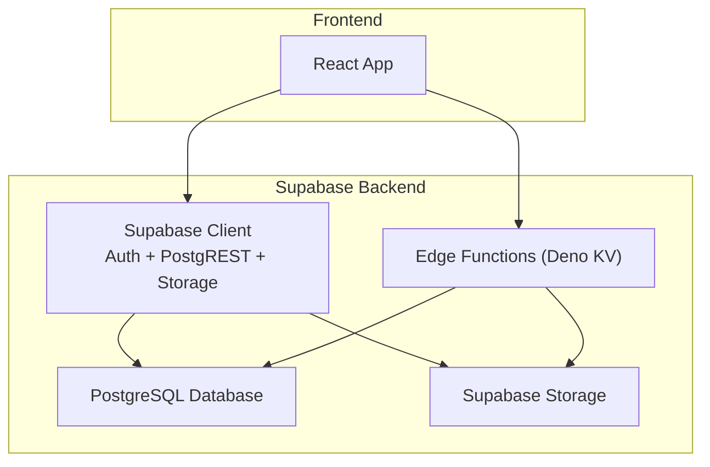
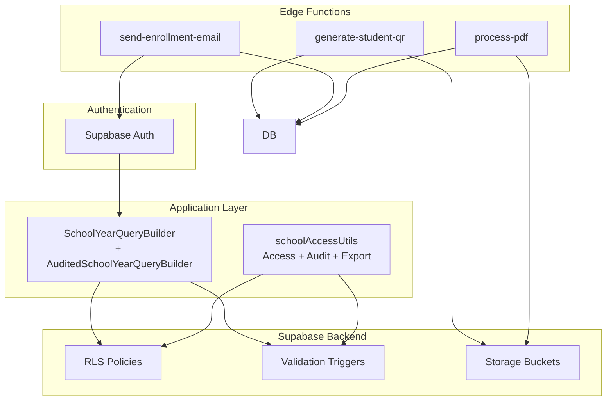
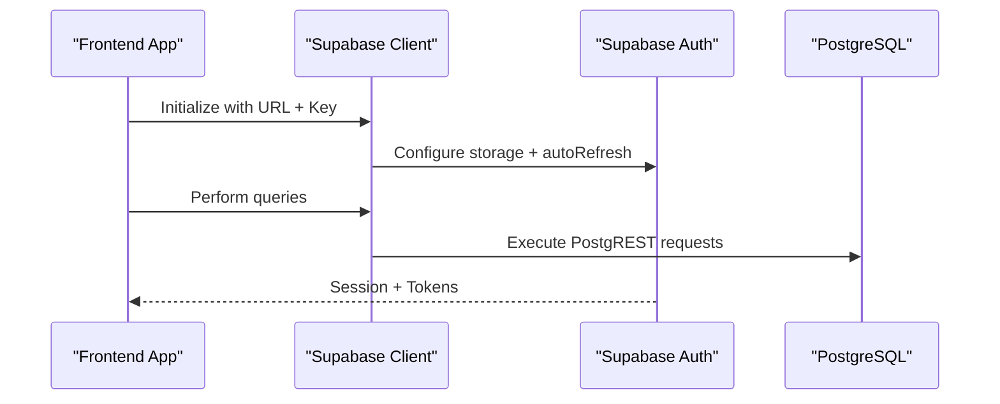
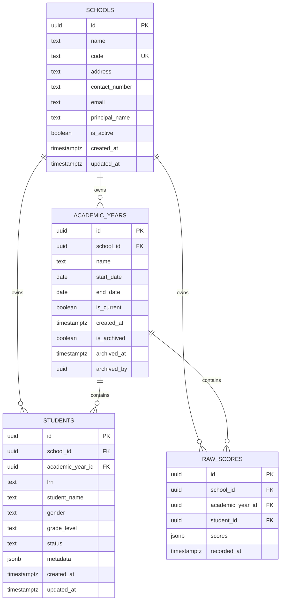
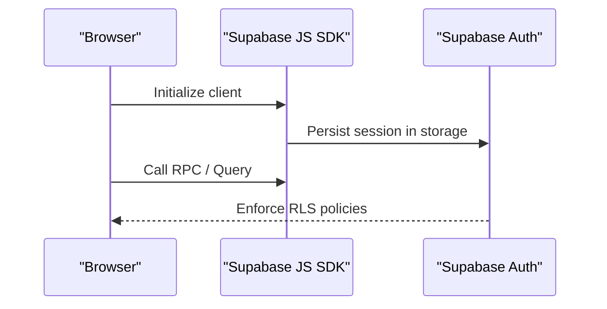
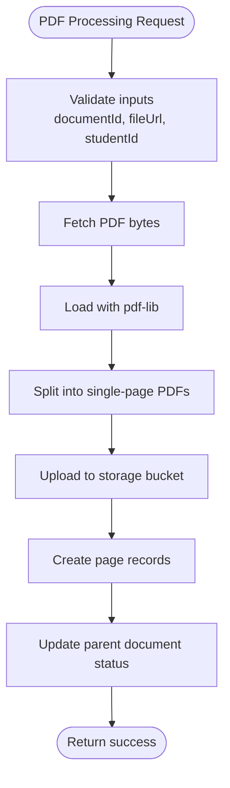
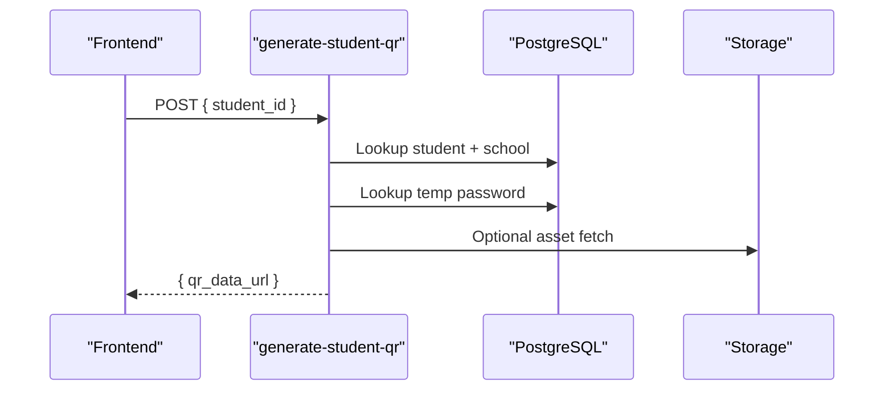
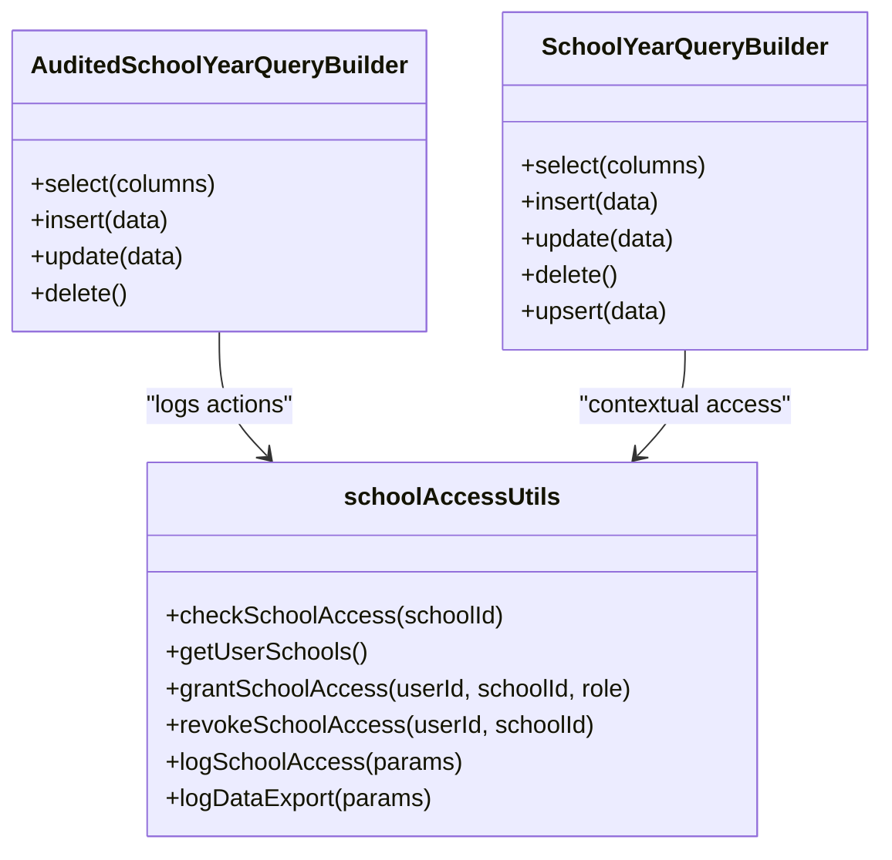
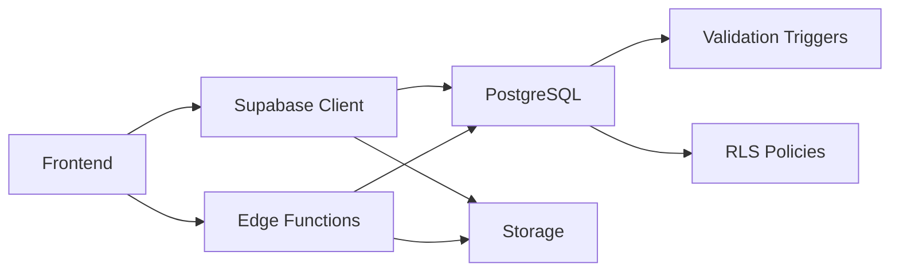

# Backend Services Architecture

<cite>
**Referenced Files in This Document**
- [config.toml](file://supabase/config.toml)
- [client.ts](file://src/integrations/supabase/client.ts)
- [types.ts](file://src/integrations/supabase/types.ts)
- [20260205040000_school_year_segregation.sql](file://supabase/migrations/20260205040000_school_year_segregation.sql)
- [20260205041000_school_segregation_enhancements.sql](file://supabase/migrations/20260205041000_school_segregation_enhancements.sql)
- [index.ts (generate-student-qr)](file://supabase/functions/generate-student-qr/index.ts)
- [index.ts (send-enrollment-email)](file://supabase/functions/send-enrollment-email/index.ts)
- [index.ts (process-pdf)](file://supabase/functions/process-pdf/index.ts)
- [schoolYearQuery.ts](file://src/utils/schoolYearQuery.ts)
- [schoolAccessUtils.ts](file://src/utils/schoolAccessUtils.ts)
- [SCHOOL_SEGREGATION.md](file://docs/SCHOOL_SEGREGATION.md)
- [SCHOOL_SEGREGATION_ENHANCEMENTS.md](file://docs/SCHOOL_SEGREGATION_ENHANCEMENTS.md)
</cite>

## Table of Contents
1. [Introduction](#introduction)
2. [Project Structure](#project-structure)
3. [Core Components](#core-components)
4. [Architecture Overview](#architecture-overview)
5. [Detailed Component Analysis](#detailed-component-analysis)
6. [Dependency Analysis](#dependency-analysis)
7. [Performance Considerations](#performance-considerations)
8. [Troubleshooting Guide](#troubleshooting-guide)
9. [Conclusion](#conclusion)

## Introduction
This document describes the backend services architecture for the St. Francis Portal Supabase-based system. It covers Supabase client configuration, database schema design, row-level security (RLS), edge functions, authentication integration, storage management, and the data segregation strategy between institutions. It also documents the edge functions ecosystem including QR code generation, email automation, document processing, and third-party integrations.

## Project Structure
The backend is organized around:
- Supabase configuration and runtime environment
- Supabase client initialization and typed database schema
- Database migrations implementing school and academic year segregation
- Edge functions for automation and integrations
- Application utilities for query segregation and audit/logging

**Diagram sources**
- [client.ts](file://src/integrations/supabase/client.ts#L1-L17)
- [config.toml](file://supabase/config.toml#L1-L1)

**Section sources**
- [client.ts](file://src/integrations/supabase/client.ts#L1-L17)
- [config.toml](file://supabase/config.toml#L1-L1)

## Core Components
- Supabase client configuration and authentication persistence
- Typed Supabase database schema for compile-time safety
- Database segregation via schools, academic years, and validation triggers
- RLS policies for access control and user-school association
- Edge functions for QR generation, email delivery, and document processing
- Application utilities for safe query building and audit logging

**Section sources**
- [client.ts](file://src/integrations/supabase/client.ts#L1-L17)
- [types.ts](file://src/integrations/supabase/types.ts#L1-L800)
- [20260205040000_school_year_segregation.sql](file://supabase/migrations/20260205040000_school_year_segregation.sql#L1-L264)
- [20260205041000_school_segregation_enhancements.sql](file://supabase/migrations/20260205041000_school_segregation_enhancements.sql#L1-L403)

## Architecture Overview
The system enforces strict data segregation between two institutions (STFXS and STFXSA) and isolates data by academic year. All database operations are filtered by school_id and academic_year_id, enforced both at the application level and at the database level via triggers and RLS. Edge functions provide serverless automation for QR generation, email delivery, and document processing.

**Diagram sources**
- [schoolYearQuery.ts](file://src/utils/schoolYearQuery.ts#L62-L148)
- [schoolAccessUtils.ts](file://src/utils/schoolAccessUtils.ts#L376-L467)
- [20260205040000_school_year_segregation.sql](file://supabase/migrations/20260205040000_school_year_segregation.sql#L206-L253)
- [20260205041000_school_segregation_enhancements.sql](file://supabase/migrations/20260205041000_school_segregation_enhancements.sql#L134-L241)
- [index.ts (generate-student-qr)](file://supabase/functions/generate-student-qr/index.ts#L1-L100)
- [index.ts (send-enrollment-email)](file://supabase/functions/send-enrollment-email/index.ts#L1-L104)
- [index.ts (process-pdf)](file://supabase/functions/process-pdf/index.ts#L1-L194)

## Detailed Component Analysis

### Supabase Client Configuration
- Initializes the Supabase client with URL and publishable key from environment variables.
- Configures auth persistence to localStorage with auto-refresh enabled.
- Provides a strongly-typed Database type for compile-time safety.

**Diagram sources**
- [client.ts](file://src/integrations/supabase/client.ts#L5-L17)

**Section sources**
- [client.ts](file://src/integrations/supabase/client.ts#L1-L17)
- [types.ts](file://src/integrations/supabase/types.ts#L1-L800)

### Database Schema Design and Data Segregation
- Schools table defines institutions with unique codes and RLS policies.
- Academic years are associated with schools and made mandatory for data tables.
- Validation triggers ensure academic_year_id belongs to the same school as school_id.
- Composite indexes optimize queries filtering by school_id and academic_year_id.
- RLS policies restrict access to users’ assigned schools and roles.

**Diagram sources**
- [20260205040000_school_year_segregation.sql](file://supabase/migrations/20260205040000_school_year_segregation.sql#L8-L194)

**Section sources**
- [20260205040000_school_year_segregation.sql](file://supabase/migrations/20260205040000_school_year_segregation.sql#L1-L264)
- [SCHOOL_SEGREGATION.md](file://docs/SCHOOL_SEGREGATION.md#L1-L260)

### Authentication Service Integration
- Supabase Auth manages sessions and persists them in localStorage.
- Application utilities expose RPC helpers for access checks and logging.
- RLS policies rely on auth.uid() to enforce per-user access.

**Diagram sources**
- [client.ts](file://src/integrations/supabase/client.ts#L12-L16)
- [schoolAccessUtils.ts](file://src/utils/schoolAccessUtils.ts#L78-L107)

**Section sources**
- [client.ts](file://src/integrations/supabase/client.ts#L1-L17)
- [schoolAccessUtils.ts](file://src/utils/schoolAccessUtils.ts#L78-L107)

### Real-Time Database Capabilities
- Supabase’s PostgREST and Realtime subscriptions enable reactive data updates.
- The client supports auth-aware subscriptions and streaming changes.
- Notably used in the frontend for live dashboards and collaborative views.

[No sources needed since this section provides general guidance]

### Storage Management
- Supabase Storage buckets host student documents and page images.
- Edge functions upload processed PDF pages and thumbnails.
- Access is controlled via bucket policies and signed URLs.

**Diagram sources**
- [index.ts (process-pdf)](file://supabase/functions/process-pdf/index.ts#L16-L194)

**Section sources**
- [index.ts (process-pdf)](file://supabase/functions/process-pdf/index.ts#L1-L194)

### Edge Functions Ecosystem
- generate-student-qr: Builds QR payloads with LRN, temporary password, and school code; returns a data URL for rendering.
- send-enrollment-email: Sends enrollment confirmation emails via Resend; gracefully handles missing API keys by mocking.
- process-pdf: Splits multi-page PDFs, uploads page assets, and creates child document records for AI analysis.

**Diagram sources**
- [index.ts (generate-student-qr)](file://supabase/functions/generate-student-qr/index.ts#L10-L99)

**Section sources**
- [index.ts (generate-student-qr)](file://supabase/functions/generate-student-qr/index.ts#L1-L100)
- [index.ts (send-enrollment-email)](file://supabase/functions/send-enrollment-email/index.ts#L1-L104)
- [index.ts (process-pdf)](file://supabase/functions/process-pdf/index.ts#L1-L194)

### Application Utilities: Query Builders and Audit
- SchoolYearQueryBuilder: Automatically filters queries by school_id and academic_year_id; inserts/upserts include context fields.
- AuditedSchoolYearQueryBuilder: Wraps CRUD operations with automatic audit logging.
- schoolAccessUtils: Provides access checks, grants, revocations, and logging/export utilities backed by database RPCs and tables.

**Diagram sources**
- [schoolYearQuery.ts](file://src/utils/schoolYearQuery.ts#L62-L148)
- [schoolAccessUtils.ts](file://src/utils/schoolAccessUtils.ts#L376-L467)

**Section sources**
- [schoolYearQuery.ts](file://src/utils/schoolYearQuery.ts#L1-L219)
- [schoolAccessUtils.ts](file://src/utils/schoolAccessUtils.ts#L1-L468)
- [SCHOOL_SEGREGATION_ENHANCEMENTS.md](file://docs/SCHOOL_SEGREGATION_ENHANCEMENTS.md#L1-L471)

## Dependency Analysis
- Frontend depends on the Supabase client and typed schema for database operations.
- Database segregation relies on triggers and RLS policies; application utilities add an extra layer of safety.
- Edge functions depend on Supabase service role keys and environment variables for external APIs.

**Diagram sources**
- [client.ts](file://src/integrations/supabase/client.ts#L1-L17)
- [20260205040000_school_year_segregation.sql](file://supabase/migrations/20260205040000_school_year_segregation.sql#L206-L253)
- [20260205041000_school_segregation_enhancements.sql](file://supabase/migrations/20260205041000_school_segregation_enhancements.sql#L134-L241)

**Section sources**
- [client.ts](file://src/integrations/supabase/client.ts#L1-L17)
- [20260205040000_school_year_segregation.sql](file://supabase/migrations/20260205040000_school_year_segregation.sql#L1-L264)
- [20260205041000_school_segregation_enhancements.sql](file://supabase/migrations/20260205041000_school_segregation_enhancements.sql#L1-L403)

## Performance Considerations
- Composite indexes on (school_id, academic_year_id) improve query performance for large datasets.
- Triggers prevent cross-school/year violations at write time.
- RLS policies are enforced at the database level for consistent performance and security.
- Edge functions should be stateless and leverage Supabase service role keys to minimize latency.

[No sources needed since this section provides general guidance]

## Troubleshooting Guide
Common issues and resolutions:
- Data segregation violation errors indicate mismatched academic year and school context during insert/update.
- RLS blocking legitimate access suggests missing user-school access grants.
- Logs not appearing may be due to RLS policy restrictions on log insertion.
- PDF processing failures often stem from missing environment variables (e.g., DEEPSEEK_API_KEY).

**Section sources**
- [SCHOOL_SEGREGATION.md](file://docs/SCHOOL_SEGREGATION.md#L225-L260)
- [SCHOOL_SEGREGATION_ENHANCEMENTS.md](file://docs/SCHOOL_SEGREGATION_ENHANCEMENTS.md#L429-L471)
- [index.ts (process-pdf)](file://supabase/functions/process-pdf/index.ts#L31-L37)

## Conclusion
The St. Francis Portal backend leverages Supabase to deliver a secure, scalable, and institutionally segregated platform. Through typed clients, robust RLS policies, validation triggers, and application utilities, it ensures data integrity and access control. The edge functions ecosystem automates QR generation, email delivery, and document processing, while storage integrates seamlessly with the rest of the backend.