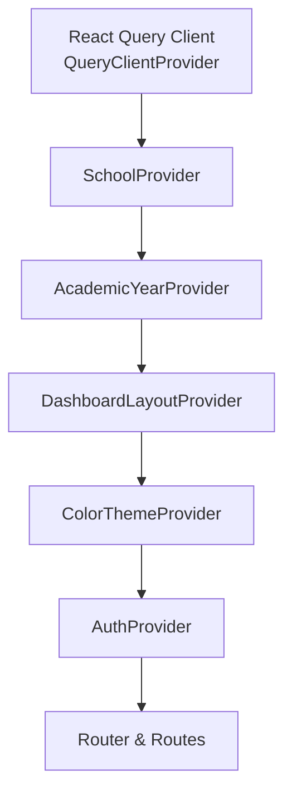
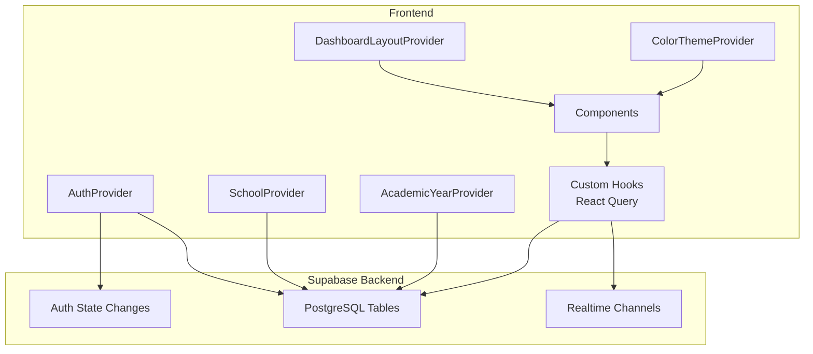
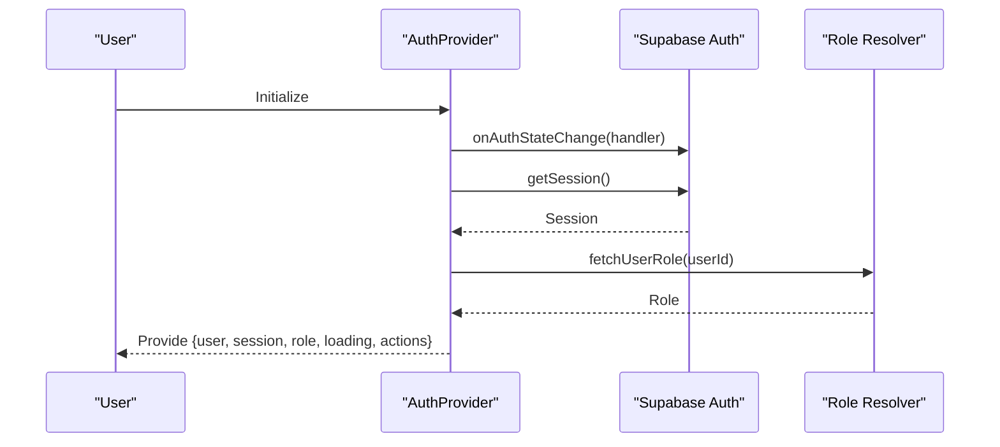
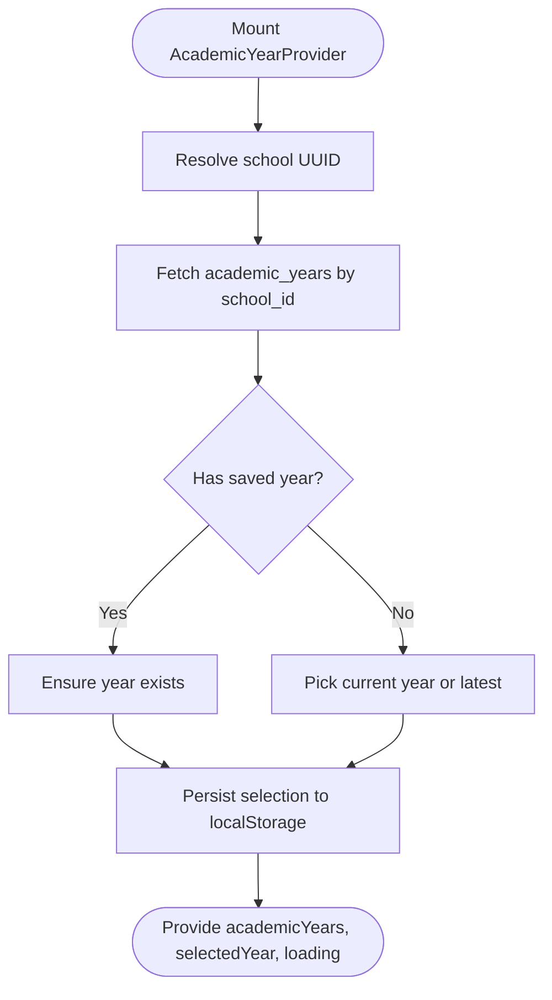
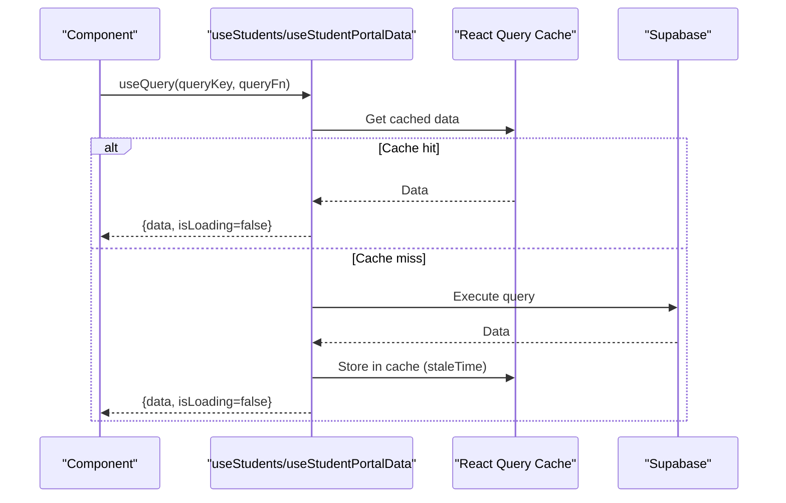
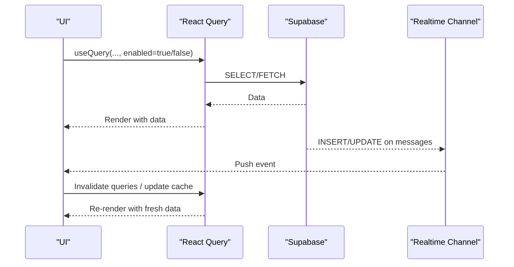
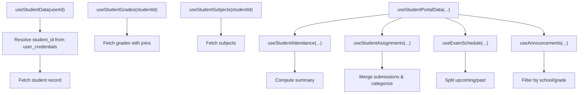
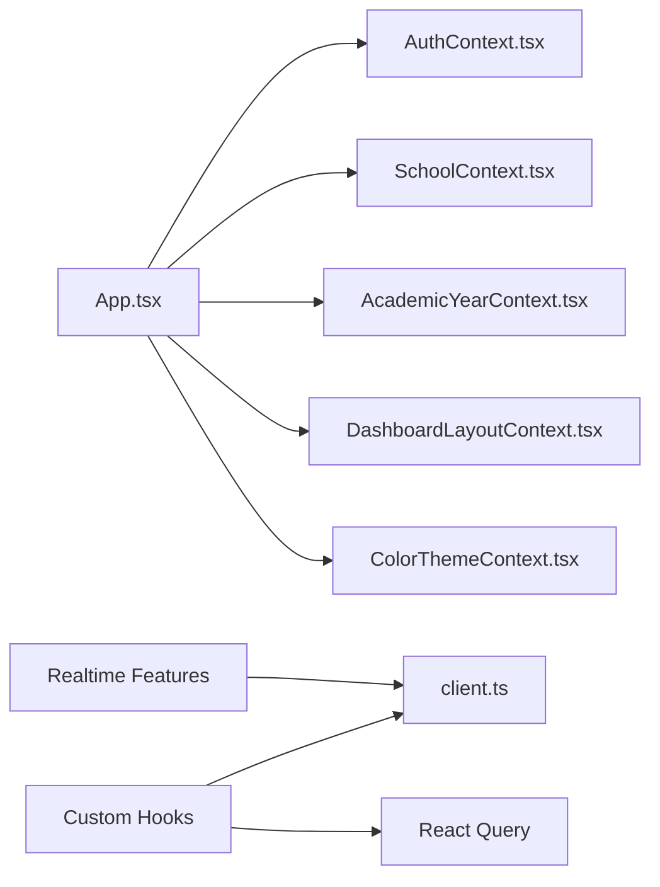

# Data Flow & State Management

<cite>
**Referenced Files in This Document**
- [App.tsx](file://src/App.tsx)
- [AuthContext.tsx](file://src/contexts/AuthContext.tsx)
- [SchoolContext.tsx](file://src/contexts/SchoolContext.tsx)
- [AcademicYearContext.tsx](file://src/contexts/AcademicYearContext.tsx)
- [DashboardLayoutContext.tsx](file://src/contexts/DashboardLayoutContext.tsx)
- [ColorThemeContext.tsx](file://src/contexts/ColorThemeContext.tsx)
- [client.ts](file://src/integrations/supabase/client.ts)
- [useStudents.ts](file://src/hooks/useStudents.ts)
- [useStudentPortalData.ts](file://src/hooks/useStudentPortalData.ts)
- [StudentPortal.tsx](file://src/components/portals/StudentPortal.tsx)
- [ErrorBoundary.tsx](file://src/components/ErrorBoundary.tsx)
- [20260208011932_28f8d2f4-1579-4159-8aa6-0c53262d92ea.sql](file://supabase/migrations/20260208011932_28f8d2f4-1579-4159-8aa6-0c53262d92ea.sql)
</cite>

## Table of Contents
1. [Introduction](#introduction)
2. [Project Structure](#project-structure)
3. [Core Components](#core-components)
4. [Architecture Overview](#architecture-overview)
5. [Detailed Component Analysis](#detailed-component-analysis)
6. [Dependency Analysis](#dependency-analysis)
7. [Performance Considerations](#performance-considerations)
8. [Troubleshooting Guide](#troubleshooting-guide)
9. [Conclusion](#conclusion)

## Introduction
This document explains the data flow and state management architecture of the St. Francis Portal system. It focuses on:
- Context providers for authentication, school selection, academic year scoping, layout themes, and color themes
- Custom hooks powered by React Query for data fetching, caching, invalidation, and synchronization
- Frontend state propagation through the component hierarchy
- Integration with the Supabase backend, including real-time channels
- Error handling, loading states, and optimistic updates
- Performance optimization via caching and data normalization

## Project Structure
The application initializes providers at the root and composes them to deliver global state to the routing tree. Providers encapsulate cross-cutting concerns and expose typed hooks for consumption.

**Diagram sources**
- [App.tsx](file://src/App.tsx#L51-L82)

**Section sources**
- [App.tsx](file://src/App.tsx#L1-L86)

## Core Components
- Authentication context manages user session, roles, impersonation, and audit logging integration.
- School context defines the selected school and theme metadata.
- Academic year context resolves the school code to a UUID, loads academic years, persists selection, and exposes loading states.
- Dashboard layout context stores layout preferences and applies CSS variables for theme customization.
- Color theme context manages preset color themes and persistence.

**Section sources**
- [AuthContext.tsx](file://src/contexts/AuthContext.tsx#L35-L215)
- [SchoolContext.tsx](file://src/contexts/SchoolContext.tsx#L51-L78)
- [AcademicYearContext.tsx](file://src/contexts/AcademicYearContext.tsx#L25-L115)
- [DashboardLayoutContext.tsx](file://src/contexts/DashboardLayoutContext.tsx#L151-L237)
- [ColorThemeContext.tsx](file://src/contexts/ColorThemeContext.tsx#L198-L231)

## Architecture Overview
The system integrates Supabase for authentication and data access, with React Query managing caching and synchronization. Real-time channels enable live updates for messaging.

**Diagram sources**
- [client.ts](file://src/integrations/supabase/client.ts#L11-L17)
- [useMessaging.ts](file://src/hooks/useMessaging.ts#L296-L385)
- [20260208011932_28f8d2f4-1579-4159-8aa6-0c53262d92ea.sql](file://supabase/migrations/20260208011932_28f8d2f4-1579-4159-8aa6-0c53262d92ea.sql#L1-L1)

## Detailed Component Analysis

### Authentication Context Provider
- Initializes Supabase auth listeners and session persistence.
- Loads role from a dedicated table and falls back to a default role on exceptions.
- Supports impersonation with session storage persistence and audit logging.
- Exposes sign-in/sign-up/sign-out, role checks, and impersonation controls.

**Diagram sources**
- [AuthContext.tsx](file://src/contexts/AuthContext.tsx#L66-L110)
- [AuthContext.tsx](file://src/contexts/AuthContext.tsx#L44-L64)

**Section sources**
- [AuthContext.tsx](file://src/contexts/AuthContext.tsx#L35-L215)

### School Context Provider
- Defines a single-school configuration with theme metadata.
- Exposes selected school, theme, and a no-op setter for future scalability.

**Section sources**
- [SchoolContext.tsx](file://src/contexts/SchoolContext.tsx#L51-L78)

### Academic Year Context Provider
- Resolves selected school code to a UUID from the schools table.
- Fetches academic years ordered by start date and selects a default current year if none is persisted.
- Persists selected year in local storage and exposes loading state and refetch capability.

**Diagram sources**
- [AcademicYearContext.tsx](file://src/contexts/AcademicYearContext.tsx#L34-L86)
- [AcademicYearContext.tsx](file://src/contexts/AcademicYearContext.tsx#L88-L93)

**Section sources**
- [AcademicYearContext.tsx](file://src/contexts/AcademicYearContext.tsx#L25-L115)

### Dashboard Layout Context Provider
- Manages layout style and theme presets, storing selections in local storage.
- Applies CSS variables to the document root for dynamic theming.

**Section sources**
- [DashboardLayoutContext.tsx](file://src/contexts/DashboardLayoutContext.tsx#L151-L237)

### Color Theme Context Provider
- Provides preset color themes and persists the current selection.

**Section sources**
- [ColorThemeContext.tsx](file://src/contexts/ColorThemeContext.tsx#L198-L231)

### Custom Hook Architecture with React Query
- Centralized data fetching, caching, and invalidation via useQuery/useMutation.
- Enforces scoping by school and academic year identifiers.
- Computes derived data in memory using useMemo to avoid unnecessary re-renders.

Examples:
- Students CRUD with automatic cache invalidation and toast notifications.
- Student portal data aggregation combining multiple datasets and categorizing results.

**Diagram sources**
- [useStudents.ts](file://src/hooks/useStudents.ts#L11-L46)
- [useStudentPortalData.ts](file://src/hooks/useStudentPortalData.ts#L21-L62)

**Section sources**
- [useStudents.ts](file://src/hooks/useStudents.ts#L8-L149)
- [useStudentPortalData.ts](file://src/hooks/useStudentPortalData.ts#L1-L350)

### Supabase Integration and Real-Time
- Supabase client configured with localStorage-backed auth persistence and auto-refresh.
- Real-time channels enable live messaging updates and presence tracking.
- Migration adds a publication table for real-time events.

**Diagram sources**
- [client.ts](file://src/integrations/supabase/client.ts#L11-L17)
- [useMessaging.ts](file://src/hooks/useMessaging.ts#L296-L385)
- [20260208011932_28f8d2f4-1579-4159-8aa6-0c53262d92ea.sql](file://supabase/migrations/20260208011932_28f8d2f4-1579-4159-8aa6-0c53262d92ea.sql#L1-L1)

**Section sources**
- [client.ts](file://src/integrations/supabase/client.ts#L1-L17)
- [useMessaging.ts](file://src/hooks/useMessaging.ts#L1-L393)

### Student Portal Data Aggregation
- Demonstrates scoped queries by student ID, school ID, and academic year ID.
- Computes summaries and categorizations in memory using useMemo.
- Integrates with the Auth context to derive student identity from user credentials.

**Diagram sources**
- [StudentPortal.tsx](file://src/components/portals/StudentPortal.tsx#L39-L80)
- [StudentPortal.tsx](file://src/components/portals/StudentPortal.tsx#L82-L142)
- [useStudentPortalData.ts](file://src/hooks/useStudentPortalData.ts#L21-L62)
- [useStudentPortalData.ts](file://src/hooks/useStudentPortalData.ts#L123-L216)
- [useStudentPortalData.ts](file://src/hooks/useStudentPortalData.ts#L222-L262)
- [useStudentPortalData.ts](file://src/hooks/useStudentPortalData.ts#L268-L321)

**Section sources**
- [StudentPortal.tsx](file://src/components/portals/StudentPortal.tsx#L39-L142)
- [useStudentPortalData.ts](file://src/hooks/useStudentPortalData.ts#L1-L350)

## Dependency Analysis
- App composes providers in a nested order to ensure downstream contexts can consume upstream providers.
- Custom hooks depend on Supabase client and React Query to manage data lifecycle.
- Real-time features rely on Supabase channels and presence.

**Diagram sources**
- [App.tsx](file://src/App.tsx#L51-L82)
- [client.ts](file://src/integrations/supabase/client.ts#L1-L17)

**Section sources**
- [App.tsx](file://src/App.tsx#L1-L86)
- [client.ts](file://src/integrations/supabase/client.ts#L1-L17)

## Performance Considerations
- Caching and staleness
  - React Query caches data and considers it fresh for a period defined by staleTime. This reduces redundant network requests and improves perceived performance.
  - Example: Students and student portal data use staleTime to balance freshness and performance.
- Cache invalidation
  - Mutations invalidate related query keys to keep views synchronized after create/update/delete operations.
- Derived data computation
  - useMemo is used to compute summaries and categorizations once per data change, avoiding repeated computations.
- Local persistence
  - Selected academic year and layout/theme preferences are persisted locally to reduce server round-trips on subsequent visits.
- Real-time updates
  - Subscriptions push updates to the UI instantly, minimizing polling and improving responsiveness.

**Section sources**
- [useStudents.ts](file://src/hooks/useStudents.ts#L43-L45)
- [StudentPortal.tsx](file://src/components/portals/StudentPortal.tsx#L77-L78)
- [StudentPortal.tsx](file://src/components/portals/StudentPortal.tsx#L111-L113)
- [useStudentPortalData.ts](file://src/hooks/useStudentPortalData.ts#L44-L56)
- [AcademicYearContext.tsx](file://src/contexts/AcademicYearContext.tsx#L28-L30)
- [DashboardLayoutContext.tsx](file://src/contexts/DashboardLayoutContext.tsx#L152-L175)

## Troubleshooting Guide
- Error boundaries
  - The ErrorBoundary component provides a fallback UI for unhandled errors, with options to retry, reload, or go home. AsyncErrorBoundary and SectionErrorBoundary tailor behavior for async operations and subsections respectively.
- Network and API errors
  - AsyncErrorBoundary detects network-related failures and surfaces a user-friendly message.
- Toast notifications
  - Hooks use toast to communicate success and failure outcomes for mutations, aiding user feedback.
- Audit logging
  - Auth actions and impersonation events are logged, supporting troubleshooting and compliance.

**Section sources**
- [ErrorBoundary.tsx](file://src/components/ErrorBoundary.tsx#L25-L136)
- [ErrorBoundary.tsx](file://src/components/ErrorBoundary.tsx#L158-L173)
- [ErrorBoundary.tsx](file://src/components/ErrorBoundary.tsx#L179-L205)
- [AuthContext.tsx](file://src/contexts/AuthContext.tsx#L112-L127)
- [AuthContext.tsx](file://src/contexts/AuthContext.tsx#L169-L188)

## Conclusion
The St. Francis Portal employs a layered state management strategy:
- Context providers supply foundational state and theme configuration.
- React Query handles data fetching, caching, and synchronization with the Supabase backend.
- Real-time channels keep the UI responsive and up-to-date.
- Error boundaries and toast notifications improve resilience and user experience.
- Derived computations and local persistence optimize performance and usability.