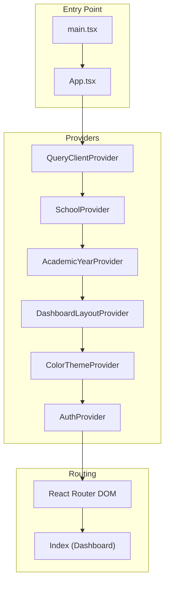
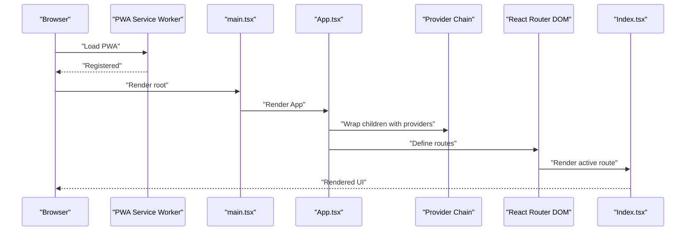
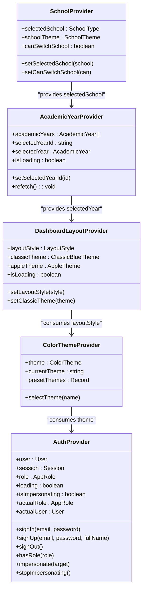
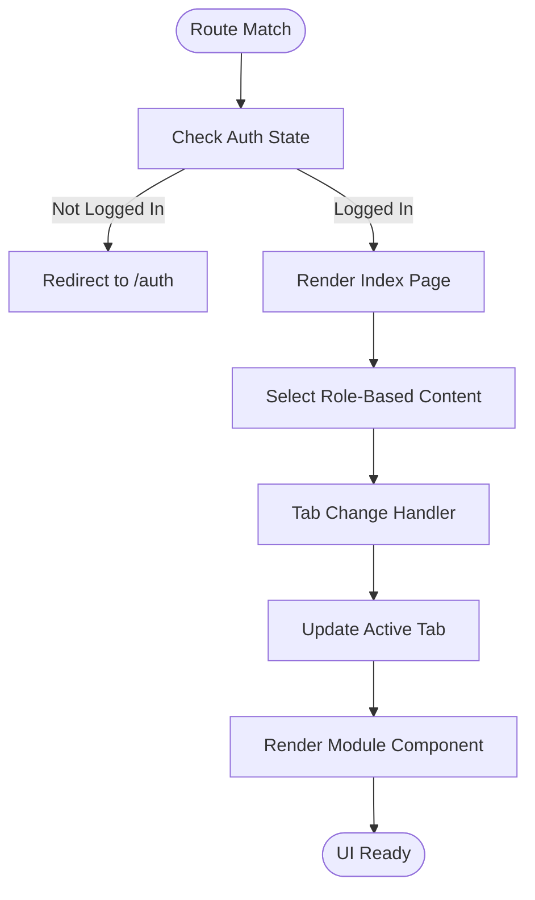
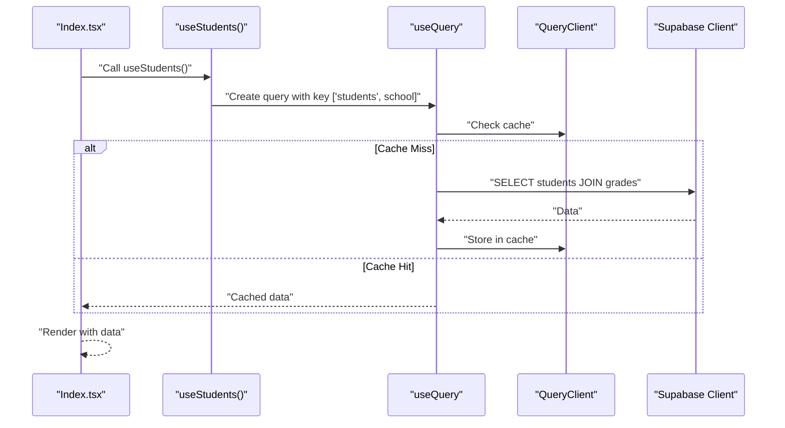
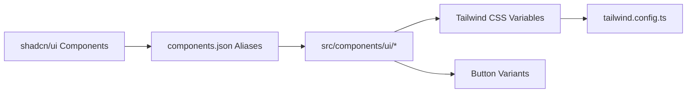
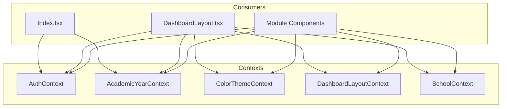
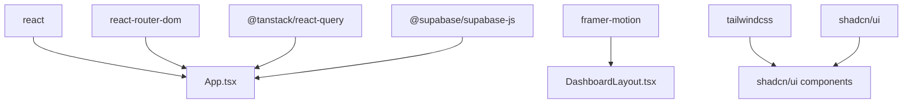

# Frontend Architecture

<cite>
**Referenced Files in This Document**
- [App.tsx](file://src/App.tsx)
- [main.tsx](file://src/main.tsx)
- [SchoolContext.tsx](file://src/contexts/SchoolContext.tsx)
- [AcademicYearContext.tsx](file://src/contexts/AcademicYearContext.tsx)
- [DashboardLayoutContext.tsx](file://src/contexts/DashboardLayoutContext.tsx)
- [ColorThemeContext.tsx](file://src/contexts/ColorThemeContext.tsx)
- [AuthContext.tsx](file://src/contexts/AuthContext.tsx)
- [Index.tsx](file://src/pages/Index.tsx)
- [DashboardLayout.tsx](file://src/components/layout/DashboardLayout.tsx)
- [button.tsx](file://src/components/ui/button.tsx)
- [package.json](file://package.json)
- [tailwind.config.ts](file://tailwind.config.ts)
- [components.json](file://components.json)
- [useStudents.ts](file://src/hooks/useStudents.ts)
</cite>

## Table of Contents
1. [Introduction](#introduction)
2. [Project Structure](#project-structure)
3. [Core Components](#core-components)
4. [Architecture Overview](#architecture-overview)
5. [Detailed Component Analysis](#detailed-component-analysis)
6. [Dependency Analysis](#dependency-analysis)
7. [Performance Considerations](#performance-considerations)
8. [Troubleshooting Guide](#troubleshooting-guide)
9. [Conclusion](#conclusion)

## Introduction
This document describes the frontend architecture of the St. Francis Portal React application. It focuses on the component hierarchy starting from the root App.tsx, the provider chain for state management, the routing system, and the integration with TanStack React Query for data fetching and caching. It also covers the usage of the shadcn/ui component library and Tailwind CSS styling approach, along with patterns for preventing prop drilling and architectural decisions.

## Project Structure
The application follows a feature-based structure with clear separation of concerns:
- Root entry point initializes the PWA service worker and renders the root App component.
- App.tsx composes the provider chain and defines routes.
- Pages (e.g., Index.tsx) orchestrate role-based views and integrate with hooks for data fetching.
- Components are organized under src/components, with a dedicated src/components/ui for shadcn/ui primitives.
- Contexts under src/contexts encapsulate cross-cutting concerns (authentication, color themes, layout styles, academic year, school).
- Hooks under src/hooks wrap TanStack React Query for data fetching and mutations.
- Styling is configured via Tailwind CSS with shadcn/ui customization.

**Diagram sources**
- [main.tsx](file://src/main.tsx#L1-L20)
- [App.tsx](file://src/App.tsx#L1-L86)
- [SchoolContext.tsx](file://src/contexts/SchoolContext.tsx#L1-L79)
- [AcademicYearContext.tsx](file://src/contexts/AcademicYearContext.tsx#L1-L115)
- [DashboardLayoutContext.tsx](file://src/contexts/DashboardLayoutContext.tsx#L1-L238)
- [ColorThemeContext.tsx](file://src/contexts/ColorThemeContext.tsx#L1-L232)
- [AuthContext.tsx](file://src/contexts/AuthContext.tsx#L1-L214)
- [Index.tsx](file://src/pages/Index.tsx#L1-L614)

**Section sources**
- [main.tsx](file://src/main.tsx#L1-L20)
- [App.tsx](file://src/App.tsx#L1-L86)
- [package.json](file://package.json#L1-L106)

## Core Components
- Provider Chain: App.tsx composes the provider chain from outermost to innermost:
  - QueryClientProvider (TanStack React Query)
  - SchoolProvider (school metadata and theme)
  - AcademicYearProvider (academic year selection and persistence)
  - DashboardLayoutProvider (layout style and theme variables)
  - ColorThemeProvider (color theme presets and selection)
  - AuthProvider (authentication state, roles, impersonation)
  - TooltipProvider (UI tooltip provider)
- Routing: React Router DOM routes define the application’s navigation surface.
- UI Library: shadcn/ui components are used via src/components/ui and configured through components.json and Tailwind configuration.
- Styling: Tailwind CSS provides a design system with CSS variables and animations.

**Section sources**
- [App.tsx](file://src/App.tsx#L51-L82)
- [SchoolContext.tsx](file://src/contexts/SchoolContext.tsx#L41-L78)
- [AcademicYearContext.tsx](file://src/contexts/AcademicYearContext.tsx#L14-L114)
- [DashboardLayoutContext.tsx](file://src/contexts/DashboardLayoutContext.tsx#L71-L237)
- [ColorThemeContext.tsx](file://src/contexts/ColorThemeContext.tsx#L189-L231)
- [AuthContext.tsx](file://src/contexts/AuthContext.tsx#L9-L33)
- [components.json](file://components.json#L1-L21)
- [tailwind.config.ts](file://tailwind.config.ts#L1-L125)

## Architecture Overview
The architecture centers on a layered provider pattern that exposes context values to deeply nested components without prop drilling. The routing layer delegates to role-aware pages that compose domain-specific components and hooks.

**Diagram sources**
- [main.tsx](file://src/main.tsx#L1-L20)
- [App.tsx](file://src/App.tsx#L61-L77)
- [Index.tsx](file://src/pages/Index.tsx#L97-L109)

## Detailed Component Analysis

### Provider Chain and Contexts
The provider chain establishes global state and theme systems:
- SchoolProvider: Defines the selected school, theme, and whether switching is allowed.
- AcademicYearProvider: Loads academic years for the selected school, persists selection in localStorage, and exposes loading state and refetch capability.
- DashboardLayoutProvider: Manages layout style (modern, classicBlue, apple), applies CSS variables for theme tokens, and persists preferences.
- ColorThemeProvider: Manages preset color themes and persists the current selection.
- AuthProvider: Handles Supabase authentication state, role resolution, impersonation, and audit logging.

**Diagram sources**
- [SchoolContext.tsx](file://src/contexts/SchoolContext.tsx#L41-L78)
- [AcademicYearContext.tsx](file://src/contexts/AcademicYearContext.tsx#L14-L114)
- [DashboardLayoutContext.tsx](file://src/contexts/DashboardLayoutContext.tsx#L71-L237)
- [ColorThemeContext.tsx](file://src/contexts/ColorThemeContext.tsx#L189-L231)
- [AuthContext.tsx](file://src/contexts/AuthContext.tsx#L9-L33)

**Section sources**
- [SchoolContext.tsx](file://src/contexts/SchoolContext.tsx#L1-L79)
- [AcademicYearContext.tsx](file://src/contexts/AcademicYearContext.tsx#L1-L115)
- [DashboardLayoutContext.tsx](file://src/contexts/DashboardLayoutContext.tsx#L1-L238)
- [ColorThemeContext.tsx](file://src/contexts/ColorThemeContext.tsx#L1-L232)
- [AuthContext.tsx](file://src/contexts/AuthContext.tsx#L1-L214)

### Routing and Navigation
React Router DOM defines routes and delegates rendering to page components. The Index page orchestrates role-based navigation and tabbed views, integrating with DashboardLayout for the sidebar and layout.

**Diagram sources**
- [App.tsx](file://src/App.tsx#L61-L77)
- [Index.tsx](file://src/pages/Index.tsx#L97-L178)
- [DashboardLayout.tsx](file://src/components/layout/DashboardLayout.tsx#L587-L787)

**Section sources**
- [App.tsx](file://src/App.tsx#L61-L77)
- [Index.tsx](file://src/pages/Index.tsx#L97-L178)
- [DashboardLayout.tsx](file://src/components/layout/DashboardLayout.tsx#L273-L551)

### Data Fetching with TanStack React Query
The application uses TanStack React Query for server state management:
- Queries: useStudents fetches student records with joined grades and orders results.
- Mutations: useCreateStudent, useUpdateStudent, useDeleteStudent, and useBulkCreateStudents manage record lifecycle.
- Caching: Queries are keyed by school to isolate data per institution; mutations invalidate queries to keep caches fresh.

**Diagram sources**
- [useStudents.ts](file://src/hooks/useStudents.ts#L8-L41)
- [useStudents.ts](file://src/hooks/useStudents.ts#L43-L120)

**Section sources**
- [useStudents.ts](file://src/hooks/useStudents.ts#L1-L144)

### UI Library and Styling
- shadcn/ui components are configured via components.json with aliases pointing to @/components, @/lib/utils, @/components/ui, @/lib, and @/hooks.
- Tailwind CSS is extended with CSS variables for theme tokens, custom animations, and semantic color scales.
- The button component demonstrates variant and size composition using class-variance-authority.

**Diagram sources**
- [components.json](file://components.json#L1-L21)
- [tailwind.config.ts](file://tailwind.config.ts#L15-L121)
- [button.tsx](file://src/components/ui/button.tsx#L7-L36)

**Section sources**
- [components.json](file://components.json#L1-L21)
- [tailwind.config.ts](file://tailwind.config.ts#L1-L125)
- [button.tsx](file://src/components/ui/button.tsx#L1-L59)

### Component Composition Patterns and Prop Drilling Prevention
- Provider Pattern: Each context exposes a provider and hook, enabling any component to consume state without passing props down the tree.
- Role-Based Rendering: Index.tsx selects role-specific portals and modules, minimizing prop drilling by centralizing navigation logic.
- Layout Abstraction: DashboardLayout.tsx manages sidebar, groups, and active states, consuming contexts for theme, year, and auth.

**Diagram sources**
- [Index.tsx](file://src/pages/Index.tsx#L19-L24)
- [DashboardLayout.tsx](file://src/components/layout/DashboardLayout.tsx#L43-L64)
- [AuthContext.tsx](file://src/contexts/AuthContext.tsx#L27-L33)
- [AcademicYearContext.tsx](file://src/contexts/AcademicYearContext.tsx#L108-L114)
- [ColorThemeContext.tsx](file://src/contexts/ColorThemeContext.tsx#L225-L231)
- [DashboardLayoutContext.tsx](file://src/contexts/DashboardLayoutContext.tsx#L231-L237)
- [SchoolContext.tsx](file://src/contexts/SchoolContext.tsx#L72-L78)

**Section sources**
- [Index.tsx](file://src/pages/Index.tsx#L19-L24)
- [DashboardLayout.tsx](file://src/components/layout/DashboardLayout.tsx#L43-L64)

## Dependency Analysis
External libraries and their roles:
- React and React Router DOM: Application shell and routing.
- TanStack React Query: Data fetching, caching, and synchronization.
- Supabase: Authentication and database access.
- Framer Motion: Animations for transitions.
- Tailwind CSS and shadcn/ui: Styling and UI primitives.

**Diagram sources**
- [package.json](file://package.json#L66-L84)
- [App.tsx](file://src/App.tsx#L1-L22)
- [DashboardLayout.tsx](file://src/components/layout/DashboardLayout.tsx#L1-L31)

**Section sources**
- [package.json](file://package.json#L1-L106)

## Performance Considerations
- Query Keys: useStudents keys queries by school to avoid cross-school cache collisions.
- Mutation Invalidation: Mutations invalidate the students query to keep cached data consistent.
- LocalStorage Persistence: Academic year and theme selections are persisted locally to reduce network requests on subsequent loads.
- CSS Variables: DashboardLayoutProvider applies theme tokens via CSS variables to minimize reflows and leverage GPU acceleration.
- PWA Registration: Service worker registration supports offline readiness and updates.

[No sources needed since this section provides general guidance]

## Troubleshooting Guide
- Authentication Issues: AuthProvider listens to Supabase auth state changes and logs audit actions; inspect logs for sign-in/sign-out failures.
- Theme Not Applying: Verify localStorage entries for theme and layout style; confirm CSS variables are set in the root element.
- Academic Year Not Selected: Ensure the selected year exists for the resolved school ID; check local storage and refetch logic.
- Query Errors: useStudents throws on errors; confirm network connectivity and Supabase permissions.

**Section sources**
- [AuthContext.tsx](file://src/contexts/AuthContext.tsx#L76-L108)
- [DashboardLayoutContext.tsx](file://src/contexts/DashboardLayoutContext.tsx#L182-L215)
- [AcademicYearContext.tsx](file://src/contexts/AcademicYearContext.tsx#L47-L85)
- [useStudents.ts](file://src/hooks/useStudents.ts#L13-L21)

## Conclusion
The St. Francis Portal frontend employs a robust provider chain, a clear routing model, and TanStack React Query for efficient data management. The integration with shadcn/ui and Tailwind CSS yields a consistent, themeable UI. The architecture minimizes prop drilling, supports role-based navigation, and leverages caching and persistence for performance and reliability.