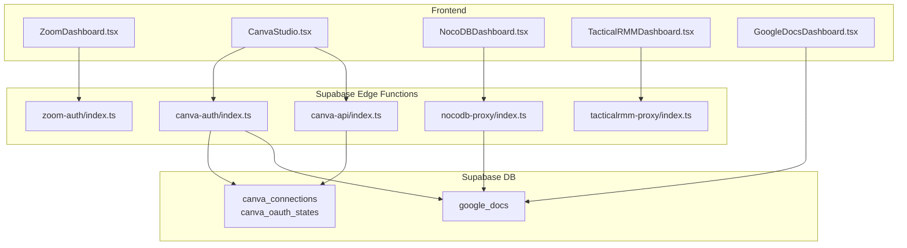
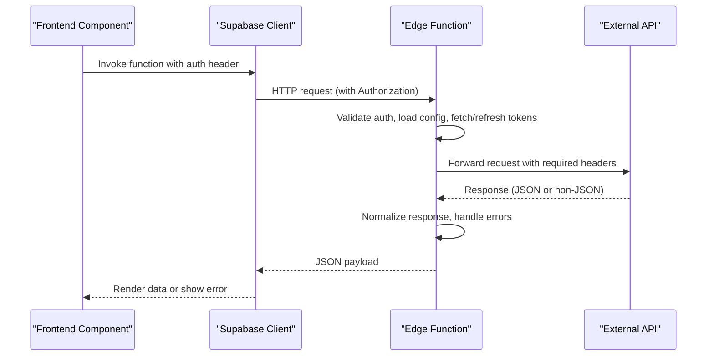
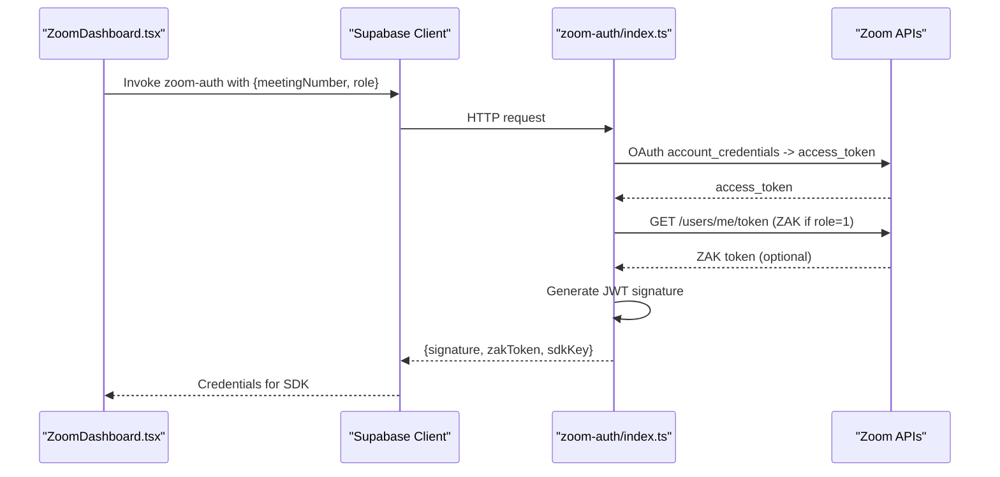
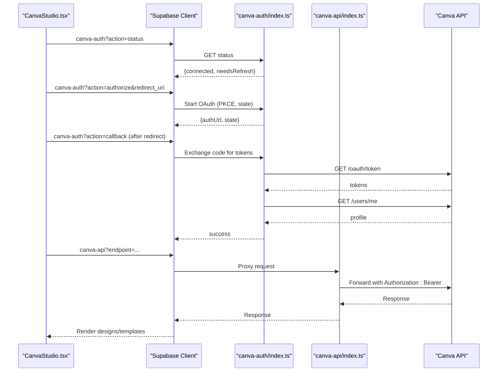
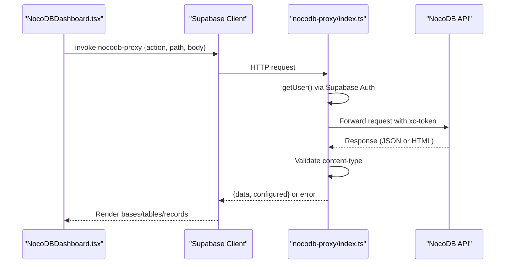
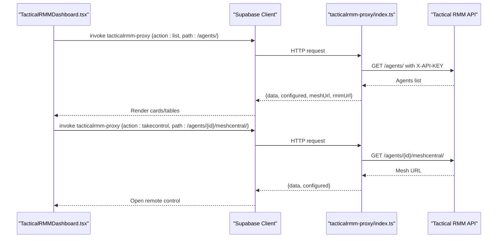
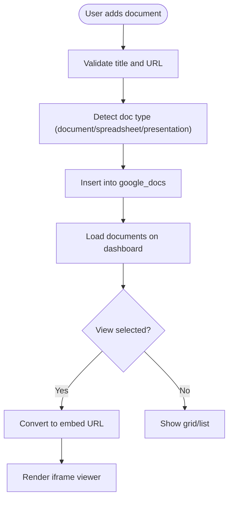
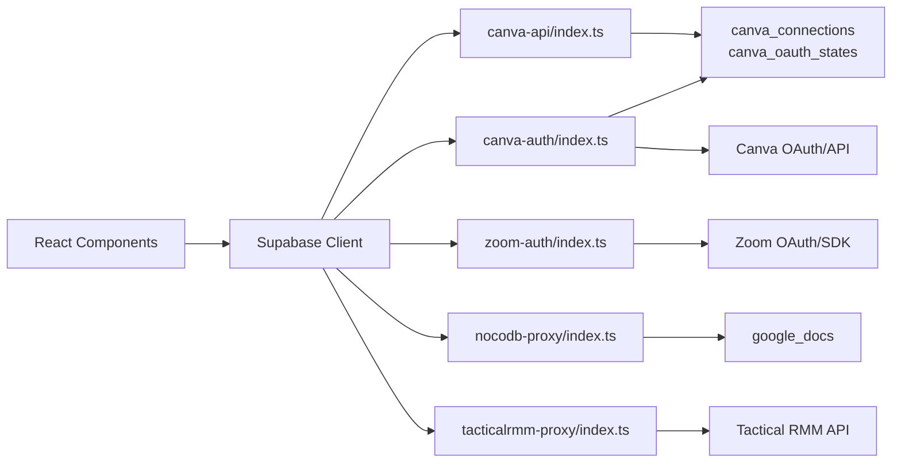
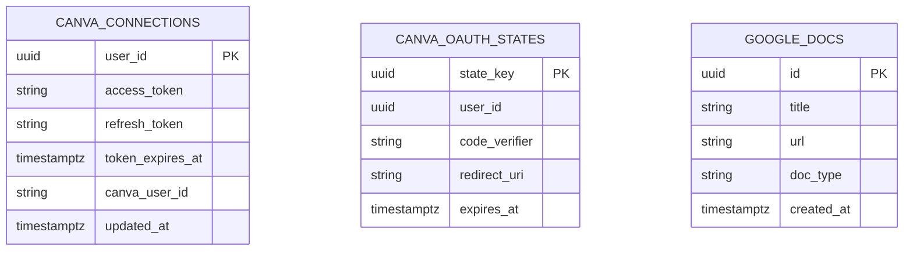

# Integration Patterns

<cite>
**Referenced Files in This Document**
- [index.ts](file://supabase/functions/canva-api/index.ts)
- [index.ts](file://supabase/functions/canva-auth/index.ts)
- [index.ts](file://supabase/functions/nocodb-proxy/index.ts)
- [index.ts](file://supabase/functions/tacticalrmm-proxy/index.ts)
- [index.ts](file://supabase/functions/zoom-auth/index.ts)
- [CanvaStudio.tsx](file://src/components/canva/CanvaStudio.tsx)
- [NocoDBDashboard.tsx](file://src/components/nocodb/NocoDBDashboard.tsx)
- [TacticalRMMDashboard.tsx](file://src/components/tacticalrmm/TacticalRMMDashboard.tsx)
- [ZoomDashboard.tsx](file://src/components/zoom/ZoomDashboard.tsx)
- [GoogleDocsDashboard.tsx](file://src/components/googledocs/GoogleDocsDashboard.tsx)
- [client.ts](file://src/integrations/supabase/client.ts)
- [20260205201205_b21fa2e1-664f-4a7e-a181-62d40fa90375.sql](file://supabase/migrations/20260205201205_b21fa2e1-664f-4a7e-a181-62d40fa90375.sql)
- [20260205202544_ed9e158e-1cb5-4d45-951e-ef0001dc7cef.sql](file://supabase/migrations/20260205202544_ed9e158e-1cb5-4d45-951e-ef0001dc7cef.sql)
- [20260208003659_39356598-c156-47f6-aa3d-4a829b37cb35.sql](file://supabase/migrations/20260208003659_39356598-c156-47f6-aa3d-4a829b37cb35.sql)
</cite>

## Table of Contents
1. [Introduction](#introduction)
2. [Project Structure](#project-structure)
3. [Core Components](#core-components)
4. [Architecture Overview](#architecture-overview)
5. [Detailed Component Analysis](#detailed-component-analysis)
6. [Dependency Analysis](#dependency-analysis)
7. [Performance Considerations](#performance-considerations)
8. [Troubleshooting Guide](#troubleshooting-guide)
9. [Conclusion](#conclusion)
10. [Appendices](#appendices)

## Introduction
This document describes the integration patterns used by the St. Francis Portal for third-party services. It focuses on how the system proxies external APIs, authenticates users, manages connections, synchronizes data, and handles errors. The covered integrations include:
- Zoom virtual classrooms
- Canva design collaboration
- NocoDB database management
- Tactical RMM system
- Google Docs integration

It also explains proxy patterns for secure third-party API access, authentication mechanisms, data synchronization strategies, error handling, configuration management, rate limiting considerations, and monitoring integration health.

## Project Structure
The integration architecture is split between:
- Frontend React components that orchestrate user actions and display data
- Supabase Edge Functions that act as secure proxies to external APIs and manage OAuth flows
- Supabase database tables and Row Level Security (RLS) policies to store connection metadata and enforce access controls

**Diagram sources**
- [ZoomDashboard.tsx](file://src/components/zoom/ZoomDashboard.tsx#L1-L308)
- [CanvaStudio.tsx](file://src/components/canva/CanvaStudio.tsx#L1-L199)
- [NocoDBDashboard.tsx](file://src/components/nocodb/NocoDBDashboard.tsx#L1-L233)
- [TacticalRMMDashboard.tsx](file://src/components/tacticalrmm/TacticalRMMDashboard.tsx#L1-L250)
- [GoogleDocsDashboard.tsx](file://src/components/googledocs/GoogleDocsDashboard.tsx#L1-L260)
- [index.ts](file://supabase/functions/zoom-auth/index.ts#L1-L120)
- [index.ts](file://supabase/functions/canva-auth/index.ts#L1-L336)
- [index.ts](file://supabase/functions/canva-api/index.ts#L1-L161)
- [index.ts](file://supabase/functions/nocodb-proxy/index.ts#L1-L72)
- [index.ts](file://supabase/functions/tacticalrmm-proxy/index.ts#L1-L116)
- [20260205201205_b21fa2e1-664f-4a7e-a181-62d40fa90375.sql](file://supabase/migrations/20260205201205_b21fa2e1-664f-4a7e-a181-62d40fa90375.sql#L1-L39)
- [20260205202544_ed9e158e-1cb5-4d45-951e-ef0001dc7cef.sql](file://supabase/migrations/20260205202544_ed9e158e-1cb5-4d45-951e-ef0001dc7cef.sql#L1-L18)
- [20260208003659_39356598-c156-47f6-aa3d-4a829b37cb35.sql](file://supabase/migrations/20260208003659_39356598-c156-47f6-aa3d-4a829b37cb35.sql#L1-L19)

**Section sources**
- [client.ts](file://src/integrations/supabase/client.ts#L1-L17)
- [index.ts](file://supabase/functions/canva-api/index.ts#L1-L161)
- [index.ts](file://supabase/functions/canva-auth/index.ts#L1-L336)
- [index.ts](file://supabase/functions/nocodb-proxy/index.ts#L1-L72)
- [index.ts](file://supabase/functions/tacticalrmm-proxy/index.ts#L1-L116)
- [index.ts](file://supabase/functions/zoom-auth/index.ts#L1-L120)
- [CanvaStudio.tsx](file://src/components/canva/CanvaStudio.tsx#L1-L199)
- [NocoDBDashboard.tsx](file://src/components/nocodb/NocoDBDashboard.tsx#L1-L233)
- [TacticalRMMDashboard.tsx](file://src/components/tacticalrmm/TacticalRMMDashboard.tsx#L1-L250)
- [ZoomDashboard.tsx](file://src/components/zoom/ZoomDashboard.tsx#L1-L308)
- [GoogleDocsDashboard.tsx](file://src/components/googledocs/GoogleDocsDashboard.tsx#L1-L260)

## Core Components
- Supabase Edge Functions: Secure, serverless proxies that:
  - Authenticate requests via Supabase Auth
  - Manage OAuth flows and token storage
  - Forward requests to external APIs with appropriate headers
  - Enforce configuration checks and return structured error responses
- Frontend dashboards: Orchestrate user actions, display data, and call Edge Functions for backend operations
- Supabase DB: Stores connection metadata and user-accessible documents with RLS policies

Key implementation patterns:
- Proxy pattern: Edge Functions forward HTTP requests/responses to external services
- OAuth 2.0 with PKCE: Secure authorization for Canva
- Token refresh and expiration handling: Automatic renewal for long-lived integrations
- Configuration gating: Proxies check environment variables and return explicit “not configured” responses
- Error normalization: Consistent error payloads and status codes

**Section sources**
- [index.ts](file://supabase/functions/canva-api/index.ts#L1-L161)
- [index.ts](file://supabase/functions/canva-auth/index.ts#L1-L336)
- [index.ts](file://supabase/functions/nocodb-proxy/index.ts#L1-L72)
- [index.ts](file://supabase/functions/tacticalrmm-proxy/index.ts#L1-L116)
- [index.ts](file://supabase/functions/zoom-auth/index.ts#L1-L120)
- [client.ts](file://src/integrations/supabase/client.ts#L1-L17)

## Architecture Overview
The integration architecture follows a consistent pattern:
- Frontend components call Supabase Edge Functions via the Supabase client
- Edge Functions validate authentication, optionally retrieve or refresh third-party tokens, and proxy requests to external APIs
- Responses are normalized and returned to the frontend
- Database tables store connection metadata and user-accessible resources with RLS policies

**Diagram sources**
- [client.ts](file://src/integrations/supabase/client.ts#L1-L17)
- [index.ts](file://supabase/functions/canva-api/index.ts#L73-L160)
- [index.ts](file://supabase/functions/canva-auth/index.ts#L44-L335)
- [index.ts](file://supabase/functions/nocodb-proxy/index.ts#L9-L71)
- [index.ts](file://supabase/functions/tacticalrmm-proxy/index.ts#L9-L115)
- [index.ts](file://supabase/functions/zoom-auth/index.ts#L81-L119)

## Detailed Component Analysis

### Zoom Virtual Classrooms
Zoom integration provides meeting credentials and bridging capabilities:
- Backend: Edge Function generates signatures and optional ZAK tokens for secure meetings
- Frontend: Dashboard displays schedule, live status, and controls to join main and breakout sessions

**Diagram sources**
- [ZoomDashboard.tsx](file://src/components/zoom/ZoomDashboard.tsx#L1-L308)
- [index.ts](file://supabase/functions/zoom-auth/index.ts#L1-L120)

**Section sources**
- [index.ts](file://supabase/functions/zoom-auth/index.ts#L1-L120)
- [ZoomDashboard.tsx](file://src/components/zoom/ZoomDashboard.tsx#L1-L308)

### Canva Design Collaboration
Canva integration supports OAuth 2.0 with PKCE, token refresh, and proxying API calls:
- Authentication flow:
  - Start OAuth with PKCE and state
  - Handle callback, exchange code for tokens, store securely
  - Refresh tokens when nearing expiry
- Proxy:
  - Forward requests to Canva REST API with bearer token
  - Pass-through query params and body for supported methods

**Diagram sources**
- [CanvaStudio.tsx](file://src/components/canva/CanvaStudio.tsx#L1-L199)
- [index.ts](file://supabase/functions/canva-auth/index.ts#L44-L335)
- [index.ts](file://supabase/functions/canva-api/index.ts#L73-L160)

**Section sources**
- [index.ts](file://supabase/functions/canva-auth/index.ts#L1-L336)
- [index.ts](file://supabase/functions/canva-api/index.ts#L1-L161)
- [CanvaStudio.tsx](file://src/components/canva/CanvaStudio.tsx#L1-L199)

### NocoDB Database Management
NocoDB integration is proxied through an Edge Function:
- Frontend calls the proxy with an action, path, and optional body
- Proxy validates auth, checks configuration, forwards request to NocoDB, and normalizes responses

**Diagram sources**
- [NocoDBDashboard.tsx](file://src/components/nocodb/NocoDBDashboard.tsx#L1-L233)
- [index.ts](file://supabase/functions/nocodb-proxy/index.ts#L1-L72)

**Section sources**
- [index.ts](file://supabase/functions/nocodb-proxy/index.ts#L1-L72)
- [NocoDBDashboard.tsx](file://src/components/nocodb/NocoDBDashboard.tsx#L1-L233)

### Tactical RMM System
Tactical RMM integration provides agent listing, status checks, and remote control:
- Frontend invokes proxy actions to list agents, get details, and obtain MeshCentral URLs
- Proxy validates configuration and returns structured responses with optional UI links

**Diagram sources**
- [TacticalRMMDashboard.tsx](file://src/components/tacticalrmm/TacticalRMMDashboard.tsx#L1-L250)
- [index.ts](file://supabase/functions/tacticalrmm-proxy/index.ts#L1-L116)

**Section sources**
- [index.ts](file://supabase/functions/tacticalrmm-proxy/index.ts#L1-L116)
- [TacticalRMMDashboard.tsx](file://src/components/tacticalrmm/TacticalRMMDashboard.tsx#L1-L250)

### Google Docs Integration
Google Docs integration stores user-configured links and renders embedded viewers:
- Frontend reads/writes from Supabase table google_docs
- Embed URLs are derived from canonical Google Docs/Sheets/Slides URLs

**Diagram sources**
- [GoogleDocsDashboard.tsx](file://src/components/googledocs/GoogleDocsDashboard.tsx#L1-L260)
- [20260208003659_39356598-c156-47f6-aa3d-4a829b37cb35.sql](file://supabase/migrations/20260208003659_39356598-c156-47f6-aa3d-4a829b37cb35.sql#L1-L19)

**Section sources**
- [GoogleDocsDashboard.tsx](file://src/components/googledocs/GoogleDocsDashboard.tsx#L1-L260)
- [20260208003659_39356598-c156-47f6-aa3d-4a829b37cb35.sql](file://supabase/migrations/20260208003659_39356598-c156-47f6-aa3d-4a829b37cb35.sql#L1-L19)

## Dependency Analysis
- Frontend depends on Supabase client for function invocation and database access
- Edge Functions depend on:
  - Supabase Auth for user validation
  - Environment variables for external service credentials
  - Database tables for persistent connection metadata
- External services are accessed via HTTPS proxies with minimal request shaping

**Diagram sources**
- [client.ts](file://src/integrations/supabase/client.ts#L1-L17)
- [index.ts](file://supabase/functions/canva-auth/index.ts#L1-L336)
- [index.ts](file://supabase/functions/canva-api/index.ts#L1-L161)
- [index.ts](file://supabase/functions/zoom-auth/index.ts#L1-L120)
- [index.ts](file://supabase/functions/nocodb-proxy/index.ts#L1-L72)
- [index.ts](file://supabase/functions/tacticalrmm-proxy/index.ts#L1-L116)
- [20260205201205_b21fa2e1-664f-4a7e-a181-62d40fa90375.sql](file://supabase/migrations/20260205201205_b21fa2e1-664f-4a7e-a181-62d40fa90375.sql#L1-L39)
- [20260205202544_ed9e158e-1cb5-4d45-951e-ef0001dc7cef.sql](file://supabase/migrations/20260205202544_ed9e158e-1cb5-4d45-951e-ef0001dc7cef.sql#L1-L18)
- [20260208003659_39356598-c156-47f6-aa3d-4a829b37cb35.sql](file://supabase/migrations/20260208003659_39356598-c156-47f6-aa3d-4a829b37cb35.sql#L1-L19)

**Section sources**
- [client.ts](file://src/integrations/supabase/client.ts#L1-L17)
- [index.ts](file://supabase/functions/canva-auth/index.ts#L1-L336)
- [index.ts](file://supabase/functions/canva-api/index.ts#L1-L161)
- [index.ts](file://supabase/functions/zoom-auth/index.ts#L1-L120)
- [index.ts](file://supabase/functions/nocodb-proxy/index.ts#L1-L72)
- [index.ts](file://supabase/functions/tacticalrmm-proxy/index.ts#L1-L116)
- [20260205201205_b21fa2e1-664f-4a7e-a181-62d40fa90375.sql](file://supabase/migrations/20260205201205_b21fa2e1-664f-4a7e-a181-62d40fa90375.sql#L1-L39)
- [20260205202544_ed9e158e-1cb5-4d45-951e-ef0001dc7cef.sql](file://supabase/migrations/20260205202544_ed9e158e-1cb5-4d45-951e-ef0001dc7cef.sql#L1-L18)
- [20260208003659_39356598-c156-47f6-aa3d-4a829b37cb35.sql](file://supabase/migrations/20260208003659_39356598-c156-47f6-aa3d-4a829b37cb35.sql#L1-L19)

## Performance Considerations
- Minimize round-trips: Batch related operations where possible (e.g., load bases, then tables, then records)
- Cache where feasible: Store frequently accessed lists (e.g., bases, tables) in component state
- Optimize rendering: Use virtualized lists for large datasets (e.g., records)
- Network efficiency: Use proxy functions to avoid CORS complexities and reduce client-side logic
- Rate limiting:
  - Respect external service limits; implement backoff and retry strategies in Edge Functions
  - Consider client-side throttling for frequent refreshes
- Latency reduction:
  - Pre-warm connections by fetching status on app load
  - Defer heavy operations until user interaction

[No sources needed since this section provides general guidance]

## Troubleshooting Guide
Common issues and resolutions:
- Authentication failures
  - Verify Supabase Auth is active and user is logged in
  - Check that Edge Functions receive a valid Authorization header
- Configuration not set
  - For NocoDB and Tactical RMM, functions return explicit “not configured” responses when environment variables are missing
  - Confirm environment variables are set in Supabase secrets
- Non-JSON responses
  - Proxies validate content-type and return structured errors when external services return HTML or non-JSON
- Token expiration (Canva)
  - Proxies automatically refresh tokens when nearing expiry; if refresh fails, users must reconnect
- Remote control failures (Tactical RMM)
  - Ensure API keys and URLs are correct; confirm external service availability

Operational checks:
- Monitor function logs for error payloads and status codes
- Validate RLS policies permit access to stored connection data
- Confirm CORS headers are applied consistently across functions

**Section sources**
- [index.ts](file://supabase/functions/nocodb-proxy/index.ts#L29-L60)
- [index.ts](file://supabase/functions/tacticalrmm-proxy/index.ts#L30-L54)
- [index.ts](file://supabase/functions/canva-api/index.ts#L23-L68)
- [index.ts](file://supabase/functions/canva-auth/index.ts#L244-L280)

## Conclusion
The St. Francis Portal integrates third-party services through a robust, secure, and maintainable pattern:
- Edge Functions encapsulate authentication, token management, and proxy logic
- Frontend dashboards remain thin and focused on UX
- Supabase DB enforces access control and persists connection metadata
- Clear error handling and configuration checks improve reliability

This architecture scales across integrations while preserving security and developer ergonomics.

[No sources needed since this section summarizes without analyzing specific files]

## Appendices

### Configuration Management
- Environment variables:
  - Canva: client ID/secret, Supabase service role key
  - NocoDB: base URL and API token
  - Tactical RMM: base URL, API key, Mesh and web URLs
  - Zoom: client ID/secret, account ID
- Supabase secrets: Managed centrally and injected into Edge Functions at runtime

**Section sources**
- [index.ts](file://supabase/functions/canva-api/index.ts#L9-L12)
- [index.ts](file://supabase/functions/canva-auth/index.ts#L9-L12)
- [index.ts](file://supabase/functions/nocodb-proxy/index.ts#L26-L31)
- [index.ts](file://supabase/functions/tacticalrmm-proxy/index.ts#L25-L32)
- [index.ts](file://supabase/functions/zoom-auth/index.ts#L10-L12)

### Data Models and Policies
- canva_connections and canva_oauth_states: Store OAuth tokens and state for PKCE
- google_docs: Stores user-configured document links with RLS policies

**Diagram sources**
- [20260205201205_b21fa2e1-664f-4a7e-a181-62d40fa90375.sql](file://supabase/migrations/20260205201205_b21fa2e1-664f-4a7e-a181-62d40fa90375.sql#L1-L39)
- [20260205202544_ed9e158e-1cb5-4d45-951e-ef0001dc7cef.sql](file://supabase/migrations/20260205202544_ed9e158e-1cb5-4d45-951e-ef0001dc7cef.sql#L1-L18)
- [20260208003659_39356598-c156-47f6-aa3d-4a829b37cb35.sql](file://supabase/migrations/20260208003659_39356598-c156-47f6-aa3d-4a829b37cb35.sql#L1-L19)