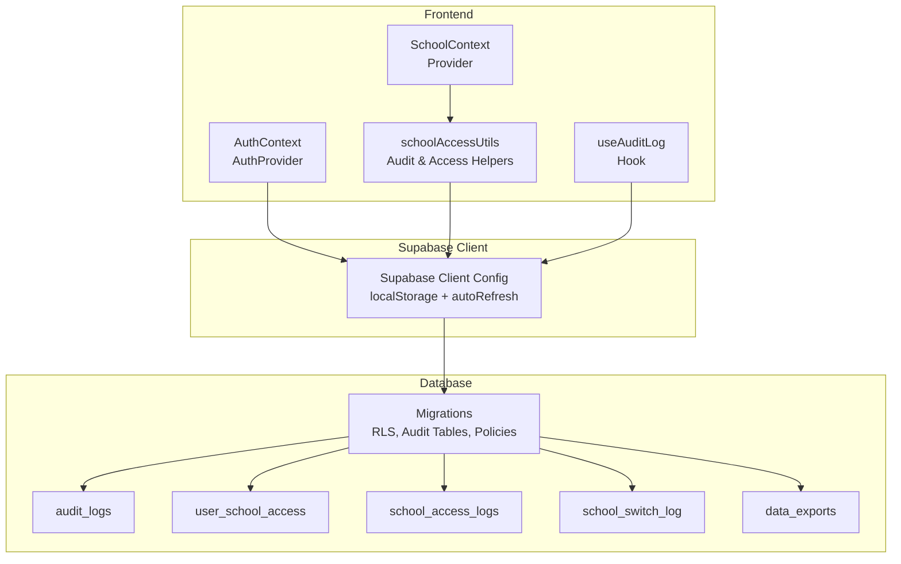
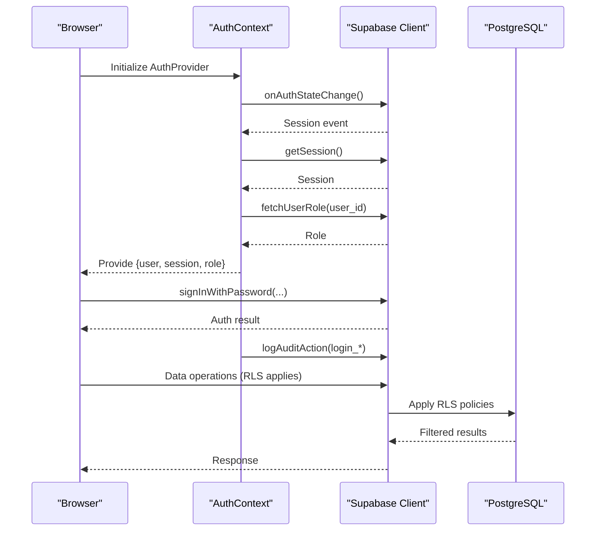
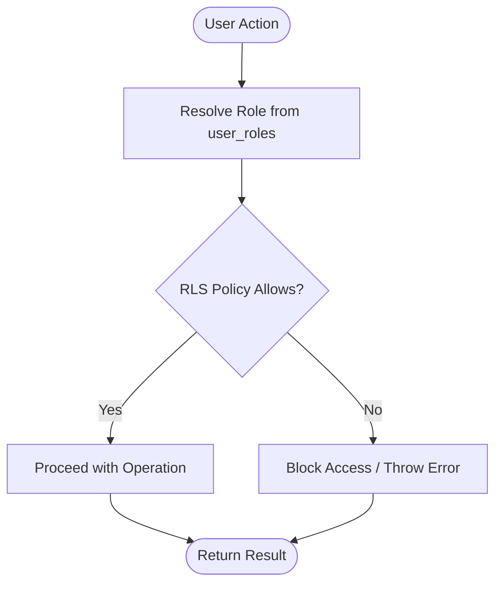
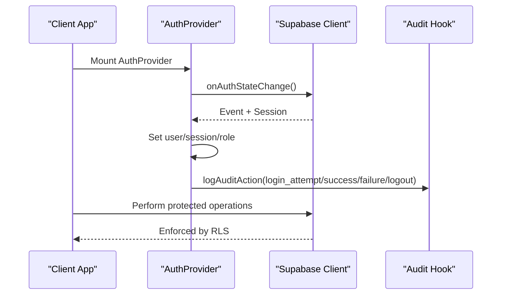
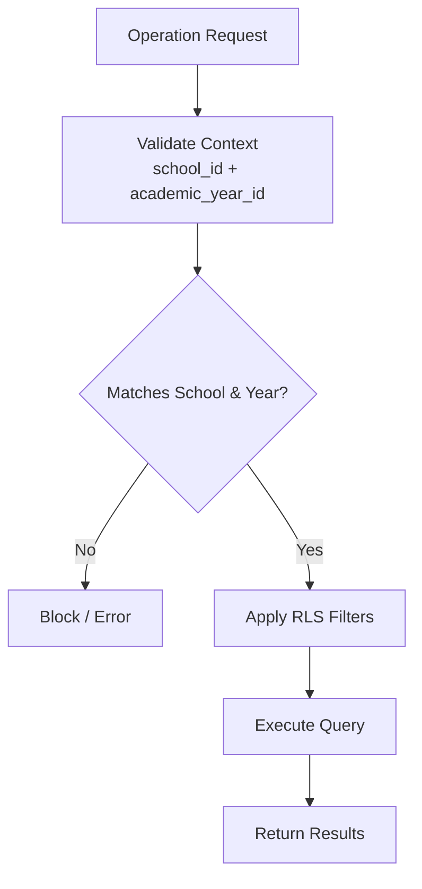
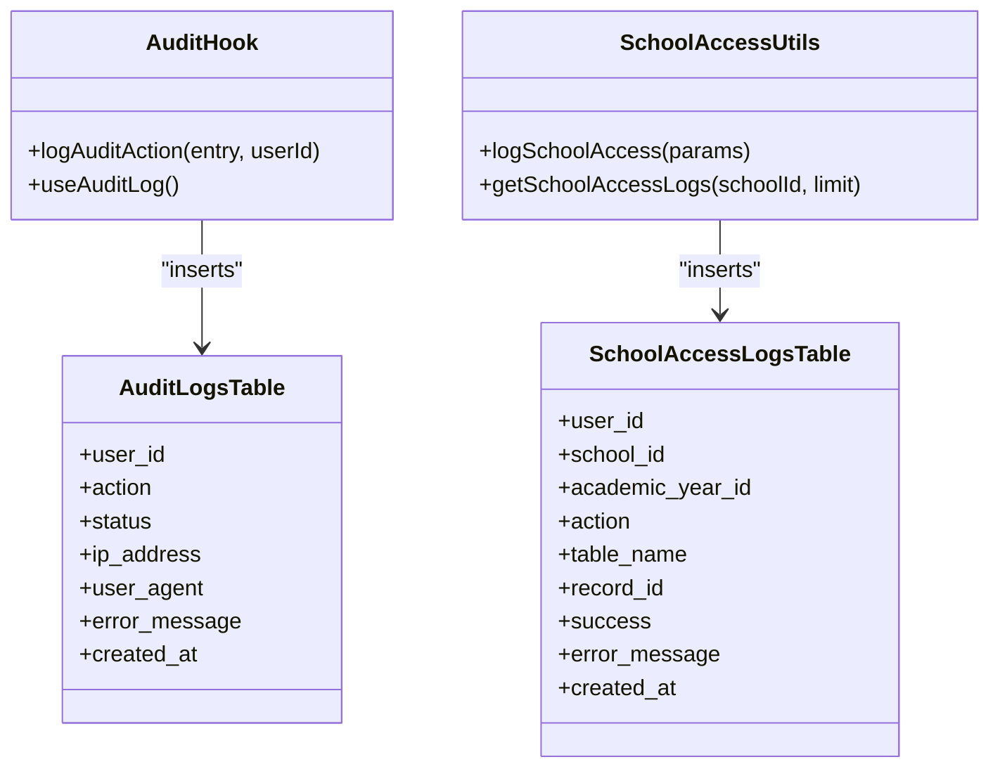
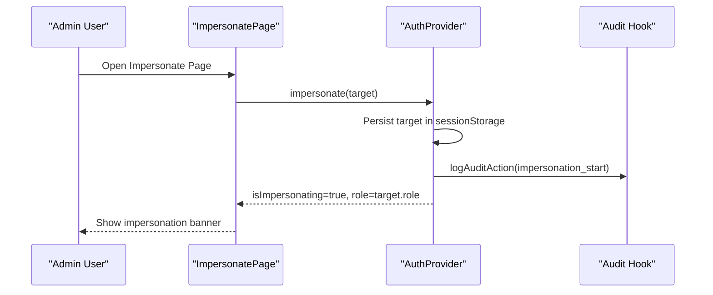
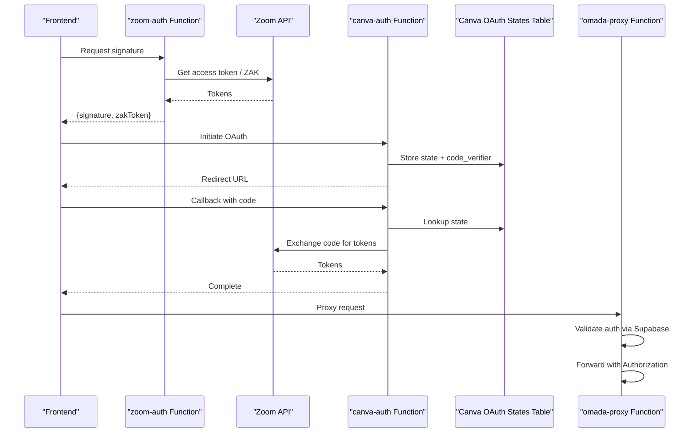
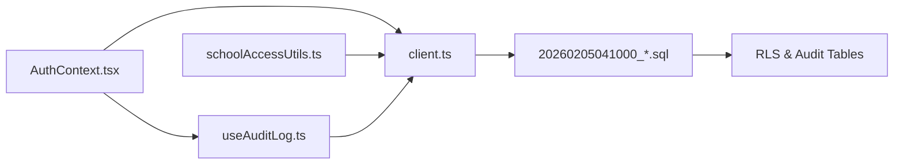

# Security Architecture

<cite>
**Referenced Files in This Document**
- [AuthContext.tsx](file://src/contexts/AuthContext.tsx)
- [client.ts](file://src/integrations/supabase/client.ts)
- [schoolAccessUtils.ts](file://src/utils/schoolAccessUtils.ts)
- [SCHOOL_SEGREGATION.md](file://docs/SCHOOL_SEGREGATION.md)
- [SCHOOL_SEGREGATION_ENHANCEMENTS.md](file://docs/SCHOOL_SEGREGATION_ENHANCEMENTS.md)
- [useAuditLog.ts](file://src/hooks/useAuditLog.ts)
- [SchoolContext.tsx](file://src/contexts/SchoolContext.tsx)
- [20260205041000_school_segregation_enhancements.sql](file://supabase/migrations/20260205041000_school_segregation_enhancements.sql)
- [20260209100000_create_audit_logs.sql](file://supabase/migrations/20260209100000_create_audit_logs.sql)
- [ImpersonatePage.tsx](file://src/components/admin/ImpersonatePage.tsx)
- [AdminPanel.tsx](file://src/components/admin/AdminPanel.tsx)
- [zoom-auth/index.ts](file://supabase/functions/zoom-auth/index.ts)
- [canva-auth/index.ts](file://supabase/functions/canva-auth/index.ts)
- [omada-proxy/index.ts](file://supabase/functions/omada-proxy/index.ts)
- [20260205202544_ed9e158e-1cb5-4d45-951e-ef0001dc7cef.sql](file://supabase/migrations/20260205202544_ed9e158e-1cb5-4d45-951e-ef0001dc7cef.sql)
</cite>

## Table of Contents
1. [Introduction](#introduction)
2. [Project Structure](#project-structure)
3. [Core Components](#core-components)
4. [Architecture Overview](#architecture-overview)
5. [Detailed Component Analysis](#detailed-component-analysis)
6. [Dependency Analysis](#dependency-analysis)
7. [Performance Considerations](#performance-considerations)
8. [Troubleshooting Guide](#troubleshooting-guide)
9. [Conclusion](#conclusion)
10. [Appendices](#appendices)

## Introduction
This document describes the security architecture of the St. Francis Portal system. It focuses on role-based access control (RBAC), session and authentication management, multi-school data segregation, audit logging, encryption practices, and third-party integration security. It also covers user impersonation controls, token management, and secure data transmission between the frontend and backend.

## Project Structure
The security architecture spans three layers:
- Frontend authentication and context providers
- Supabase client configuration and database-level protections
- Database migrations implementing RLS, audit tables, and helper functions

**Diagram sources**
- [AuthContext.tsx](file://src/contexts/AuthContext.tsx#L35-L215)
- [client.ts](file://src/integrations/supabase/client.ts#L11-L17)
- [schoolAccessUtils.ts](file://src/utils/schoolAccessUtils.ts#L75-L467)
- [useAuditLog.ts](file://src/hooks/useAuditLog.ts#L23-L69)
- [20260205041000_school_segregation_enhancements.sql](file://supabase/migrations/20260205041000_school_segregation_enhancements.sql#L8-L403)
- [20260209100000_create_audit_logs.sql](file://supabase/migrations/20260209100000_create_audit_logs.sql#L1-L38)

**Section sources**
- [AuthContext.tsx](file://src/contexts/AuthContext.tsx#L1-L216)
- [client.ts](file://src/integrations/supabase/client.ts#L1-L17)
- [schoolAccessUtils.ts](file://src/utils/schoolAccessUtils.ts#L1-L468)
- [useAuditLog.ts](file://src/hooks/useAuditLog.ts#L1-L69)
- [20260205041000_school_segregation_enhancements.sql](file://supabase/migrations/20260205041000_school_segregation_enhancements.sql#L1-L403)
- [20260209100000_create_audit_logs.sql](file://supabase/migrations/20260209100000_create_audit_logs.sql#L1-L38)

## Core Components
- Authentication and session management via Supabase Auth with persistent local storage and token auto-refresh.
- RBAC implemented with user roles and database-level RLS policies.
- Multi-school data segregation enforced by composite indexes, validation triggers, and RLS policies.
- Audit logging for authentication events and school data access/modification.
- User impersonation controlled by admin-only actions with explicit logging and session markers.

**Section sources**
- [AuthContext.tsx](file://src/contexts/AuthContext.tsx#L44-L64)
- [client.ts](file://src/integrations/supabase/client.ts#L11-L17)
- [20260205041000_school_segregation_enhancements.sql](file://supabase/migrations/20260205041000_school_segregation_enhancements.sql#L136-L241)
- [SCHOOL_SEGREGATION.md](file://docs/SCHOOL_SEGREGATION.md#L1-L260)
- [useAuditLog.ts](file://src/hooks/useAuditLog.ts#L23-L69)
- [ImpersonatePage.tsx](file://src/components/admin/ImpersonatePage.tsx#L85-L97)

## Architecture Overview
The system enforces security at multiple layers:
- Frontend: Auth provider manages session state, role resolution, and impersonation. Audit hook captures login/logout and impersonation events.
- Supabase client: Uses localStorage-backed persistence and auto token refresh.
- Database: RLS policies restrict access to school-specific data; helper functions and audit tables track access and exports.

**Diagram sources**
- [AuthContext.tsx](file://src/contexts/AuthContext.tsx#L66-L110)
- [client.ts](file://src/integrations/supabase/client.ts#L11-L17)
- [useAuditLog.ts](file://src/hooks/useAuditLog.ts#L23-L69)
- [20260205041000_school_segregation_enhancements.sql](file://supabase/migrations/20260205041000_school_segregation_enhancements.sql#L136-L188)

## Detailed Component Analysis

### Role-Based Access Control (RBAC)
- Roles are resolved from the user_roles table and exposed via the AuthContext.
- RLS policies on data tables enforce that users can only access records belonging to schools they are authorized for, with admin privileges elevated.
- Helper functions provide user-school access checks and retrieval of accessible schools.

**Diagram sources**
- [AuthContext.tsx](file://src/contexts/AuthContext.tsx#L44-L64)
- [20260205041000_school_segregation_enhancements.sql](file://supabase/migrations/20260205041000_school_segregation_enhancements.sql#L142-L188)
- [schoolAccessUtils.ts](file://src/utils/schoolAccessUtils.ts#L78-L107)

**Section sources**
- [AuthContext.tsx](file://src/contexts/AuthContext.tsx#L44-L64)
- [20260205041000_school_segregation_enhancements.sql](file://supabase/migrations/20260205041000_school_segregation_enhancements.sql#L136-L241)
- [schoolAccessUtils.ts](file://src/utils/schoolAccessUtils.ts#L75-L107)

### Session Management and Authentication Flow
- Supabase client persists sessions in localStorage and auto-refreshes tokens.
- Auth provider subscribes to auth state changes, hydrates user/session/role, and initializes impersonation state from sessionStorage.
- Audit logging records login attempts, successes/failures, logout, and impersonation lifecycle.

**Diagram sources**
- [client.ts](file://src/integrations/supabase/client.ts#L11-L17)
- [AuthContext.tsx](file://src/contexts/AuthContext.tsx#L66-L110)
- [useAuditLog.ts](file://src/hooks/useAuditLog.ts#L23-L69)

**Section sources**
- [client.ts](file://src/integrations/supabase/client.ts#L11-L17)
- [AuthContext.tsx](file://src/contexts/AuthContext.tsx#L66-L110)
- [useAuditLog.ts](file://src/hooks/useAuditLog.ts#L23-L69)

### Multi-School Data Segregation and Cross-Institutional Isolation
- Database-level safeguards:
  - Composite indexes on (school_id, academic_year_id) for efficient filtering.
  - Validation triggers ensuring academic_year_id belongs to the same school as specified.
  - RLS policies on data tables restricting access to authorized schools.
- Application-level safeguards:
  - Helper utilities and builders that automatically apply school and academic-year filters.
  - Context validation to ensure both identifiers are present before operations.

**Diagram sources**
- [SCHOOL_SEGREGATION.md](file://docs/SCHOOL_SEGREGATION.md#L11-L24)
- [20260205041000_school_segregation_enhancements.sql](file://supabase/migrations/20260205041000_school_segregation_enhancements.sql#L136-L188)
- [SCHOOL_SEGREGATION.md](file://docs/SCHOOL_SEGREGATION.md#L34-L48)

**Section sources**
- [SCHOOL_SEGREGATION.md](file://docs/SCHOOL_SEGREGATION.md#L1-L260)
- [20260205041000_school_segregation_enhancements.sql](file://supabase/migrations/20260205041000_school_segregation_enhancements.sql#L1-L403)

### Audit Logging Implementation
- Authentication events are captured with IP geolocation and user agent.
- School data access events are logged with action, table, record, success, and error metadata.
- Dedicated audit tables with RLS policies enable admin visibility and system insert permissions.

**Diagram sources**
- [useAuditLog.ts](file://src/hooks/useAuditLog.ts#L23-L69)
- [schoolAccessUtils.ts](file://src/utils/schoolAccessUtils.ts#L163-L192)
- [20260209100000_create_audit_logs.sql](file://supabase/migrations/20260209100000_create_audit_logs.sql#L1-L38)
- [20260205041000_school_segregation_enhancements.sql](file://supabase/migrations/20260205041000_school_segregation_enhancements.sql#L46-L85)

**Section sources**
- [useAuditLog.ts](file://src/hooks/useAuditLog.ts#L1-L69)
- [schoolAccessUtils.ts](file://src/utils/schoolAccessUtils.ts#L158-L214)
- [20260209100000_create_audit_logs.sql](file://supabase/migrations/20260209100000_create_audit_logs.sql#L1-L38)
- [20260205041000_school_segregation_enhancements.sql](file://supabase/migrations/20260205041000_school_segregation_enhancements.sql#L46-L85)

### User Impersonation Security
- Only admin users can impersonate; the action is logged and persisted in sessionStorage for session continuity.
- The impersonation state overrides the effective user ID and role for downstream operations while preserving the original admin identity for logging.

**Diagram sources**
- [ImpersonatePage.tsx](file://src/components/admin/ImpersonatePage.tsx#L85-L97)
- [AuthContext.tsx](file://src/contexts/AuthContext.tsx#L163-L189)
- [useAuditLog.ts](file://src/hooks/useAuditLog.ts#L23-L69)

**Section sources**
- [ImpersonatePage.tsx](file://src/components/admin/ImpersonatePage.tsx#L1-L236)
- [AuthContext.tsx](file://src/contexts/AuthContext.tsx#L163-L189)
- [useAuditLog.ts](file://src/hooks/useAuditLog.ts#L23-L69)

### Token Management and Secure Data Transmission
- Supabase client auto-refreshes tokens and stores sessions in localStorage.
- Third-party integrations use serverless functions with environment-secret management and signed JWT generation:
  - Zoom: generates meeting signatures and optional ZAK tokens.
  - Canva: implements PKCE with secure state storage in a dedicated table.
  - Omada: proxies requests with bearer token forwarding and TLS fallback logic.

**Diagram sources**
- [client.ts](file://src/integrations/supabase/client.ts#L11-L17)
- [zoom-auth/index.ts](file://supabase/functions/zoom-auth/index.ts#L81-L119)
- [canva-auth/index.ts](file://supabase/functions/canva-auth/index.ts#L124-L175)
- [20260205202544_ed9e158e-1cb5-4d45-951e-ef0001dc7cef.sql](file://supabase/migrations/20260205202544_ed9e158e-1cb5-4d45-951e-ef0001dc7cef.sql#L1-L22)
- [omada-proxy/index.ts](file://supabase/functions/omada-proxy/index.ts#L87-L106)

**Section sources**
- [client.ts](file://src/integrations/supabase/client.ts#L11-L17)
- [zoom-auth/index.ts](file://supabase/functions/zoom-auth/index.ts#L1-L120)
- [canva-auth/index.ts](file://supabase/functions/canva-auth/index.ts#L78-L175)
- [20260205202544_ed9e158e-1cb5-4d45-951e-ef0001dc7cef.sql](file://supabase/migrations/20260205202544_ed9e158e-1cb5-4d45-951e-ef0001dc7cef.sql#L1-L22)
- [omada-proxy/index.ts](file://supabase/functions/omada-proxy/index.ts#L1-L106)

## Dependency Analysis
- AuthContext depends on Supabase client for session state and role resolution.
- schoolAccessUtils depends on Supabase client and RPC functions for access checks and logging.
- Audit logging depends on Supabase client and external IP geolocation service.
- Database migrations define RLS policies and audit tables that underpin frontend protections.

**Diagram sources**
- [AuthContext.tsx](file://src/contexts/AuthContext.tsx#L1-L216)
- [client.ts](file://src/integrations/supabase/client.ts#L1-L17)
- [useAuditLog.ts](file://src/hooks/useAuditLog.ts#L1-L69)
- [schoolAccessUtils.ts](file://src/utils/schoolAccessUtils.ts#L1-L468)
- [20260205041000_school_segregation_enhancements.sql](file://supabase/migrations/20260205041000_school_segregation_enhancements.sql#L1-L403)

**Section sources**
- [AuthContext.tsx](file://src/contexts/AuthContext.tsx#L1-L216)
- [client.ts](file://src/integrations/supabase/client.ts#L1-L17)
- [schoolAccessUtils.ts](file://src/utils/schoolAccessUtils.ts#L1-L468)
- [useAuditLog.ts](file://src/hooks/useAuditLog.ts#L1-L69)
- [20260205041000_school_segregation_enhancements.sql](file://supabase/migrations/20260205041000_school_segregation_enhancements.sql#L1-L403)

## Performance Considerations
- Composite indexes on (school_id, academic_year_id) improve query performance for filtered operations.
- RLS policies are enforced at the database level and cannot be bypassed by application code.
- Audit logging is designed to be non-blocking; failures are handled gracefully to avoid impacting user experience.
- Third-party function calls include TLS fallback logic to maintain availability while preserving security posture.

[No sources needed since this section provides general guidance]

## Troubleshooting Guide
Common issues and resolutions:
- RLS blocking legitimate access: Ensure the user has active school access via the user_school_access table.
- Logs not appearing: Verify RLS policies allow inserts into audit and access logs tables.
- Performance degradation: Confirm composite indexes exist and are used by query plans.
- Impersonation not working: Confirm admin role and that impersonation state is persisted in sessionStorage.

**Section sources**
- [SCHOOL_SEGREGATION_ENHANCEMENTS.md](file://docs/SCHOOL_SEGREGATION_ENHANCEMENTS.md#L429-L446)
- [20260205041000_school_segregation_enhancements.sql](file://supabase/migrations/20260205041000_school_segregation_enhancements.sql#L74-L82)

## Conclusion
The St. Francis Portal employs a layered security model combining Supabase Auth, RBAC, database-level RLS, and comprehensive audit logging. Multi-school data segregation is enforced both at the database and application levels, with strict controls around user impersonation and third-party integrations. These measures collectively provide strong isolation, visibility, and resilience against unauthorized access.

[No sources needed since this section summarizes without analyzing specific files]

## Appendices

### Security Policies and Compliance Notes
- RLS policies are defined at the database level and cannot be bypassed by application code.
- Audit logs capture authentication and access events with IP geolocation and user agent metadata.
- Data exports are tracked with school and academic-year context for monitoring and compliance.
- Third-party integrations use secure token generation and PKCE with state storage in a dedicated table.

**Section sources**
- [20260205041000_school_segregation_enhancements.sql](file://supabase/migrations/20260205041000_school_segregation_enhancements.sql#L136-L241)
- [20260209100000_create_audit_logs.sql](file://supabase/migrations/20260209100000_create_audit_logs.sql#L1-L38)
- [SCHOOL_SEGREGATION_ENHANCEMENTS.md](file://docs/SCHOOL_SEGREGATION_ENHANCEMENTS.md#L390-L427)