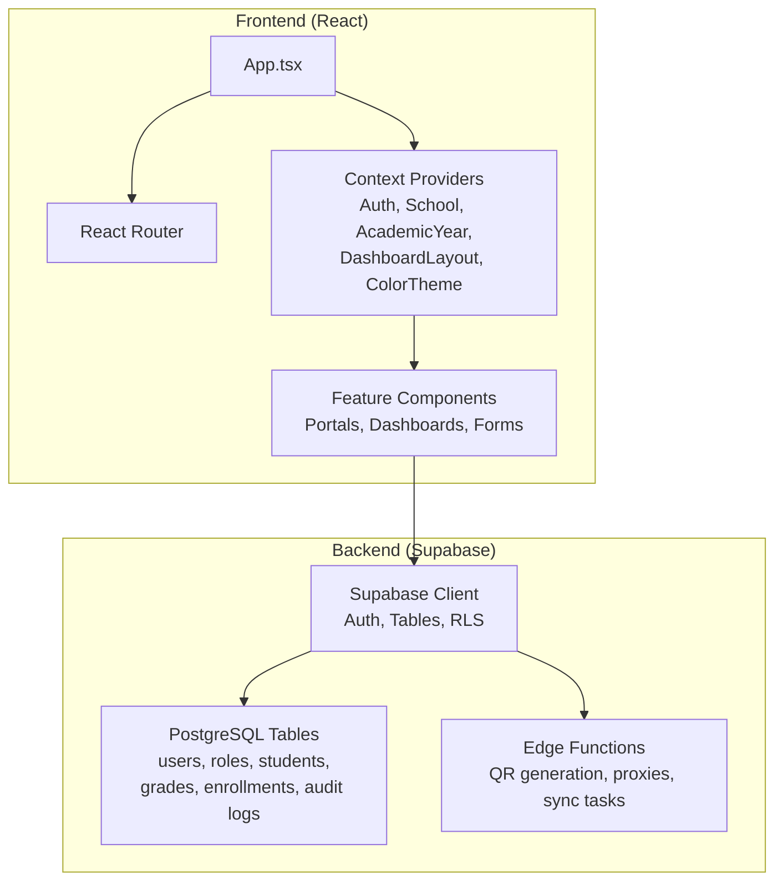
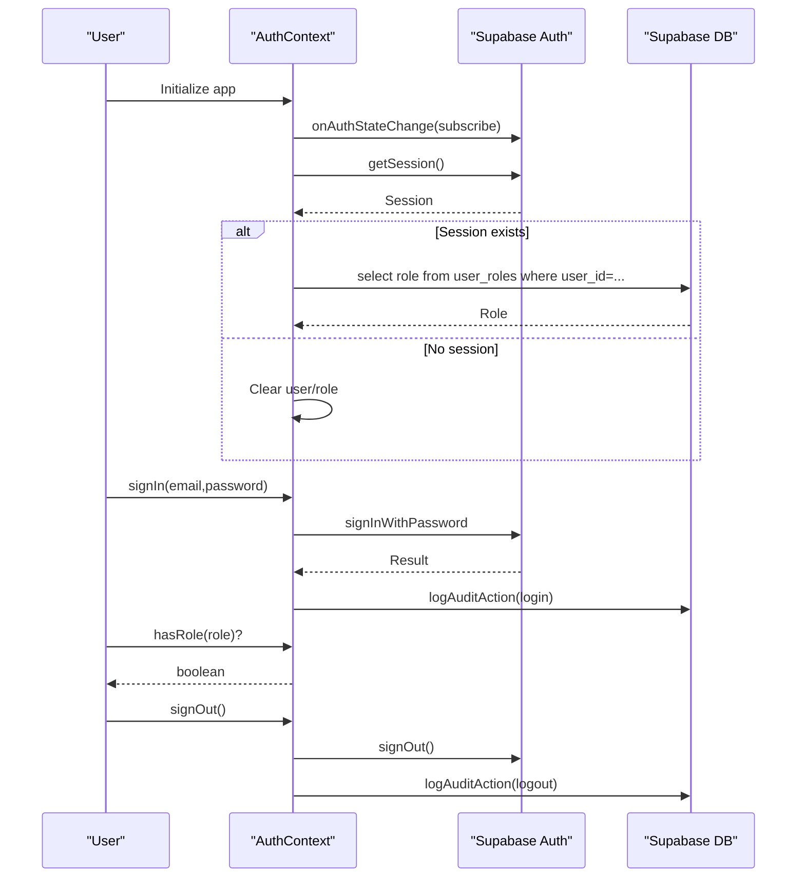
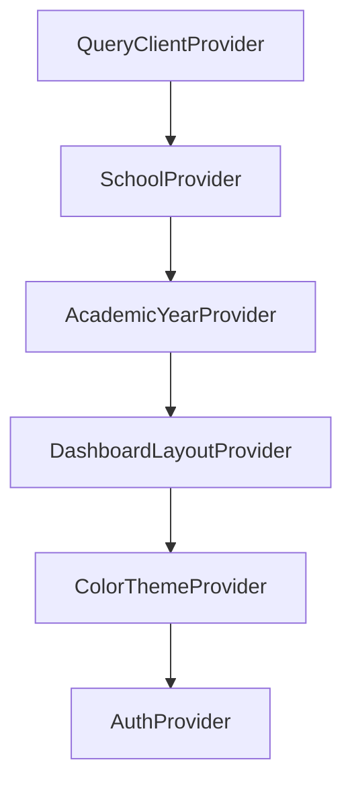
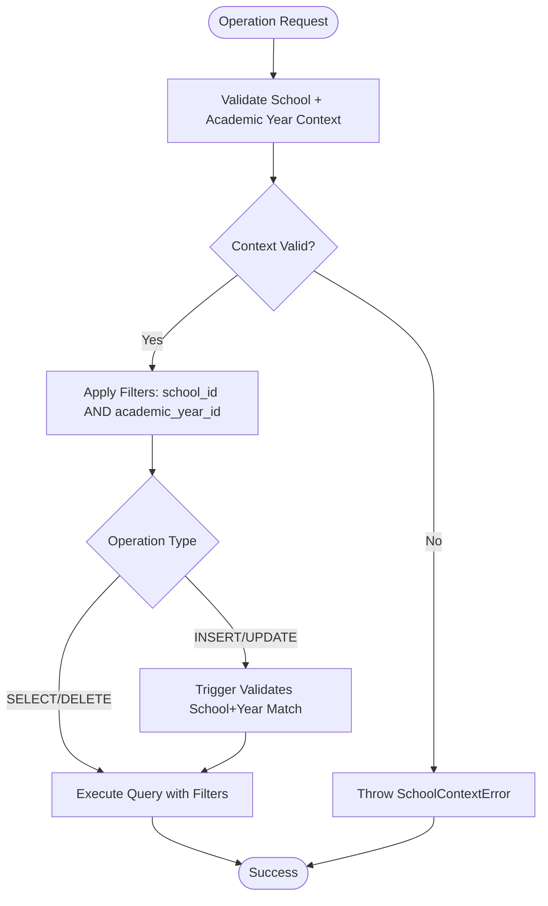
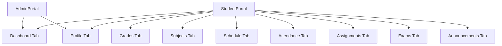
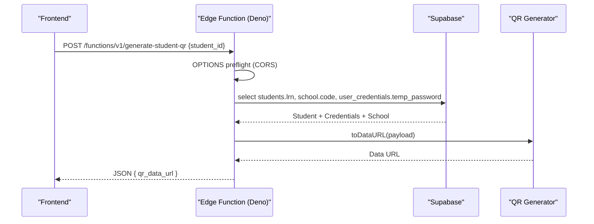
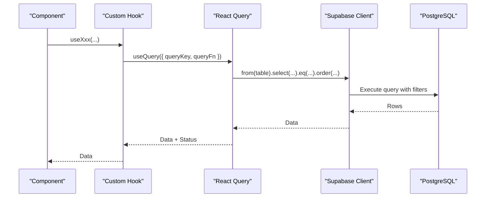
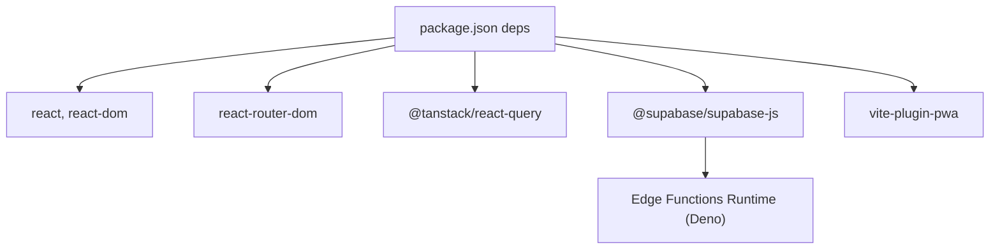

# System Architecture

<cite>
**Referenced Files in This Document**
- [README.md](file://README.md)
- [package.json](file://package.json)
- [src/main.tsx](file://src/main.tsx)
- [src/App.tsx](file://src/App.tsx)
- [src/contexts/AuthContext.tsx](file://src/contexts/AuthContext.tsx)
- [src/contexts/SchoolContext.tsx](file://src/contexts/SchoolContext.tsx)
- [src/integrations/supabase/client.ts](file://src/integrations/supabase/client.ts)
- [src/integrations/supabase/types.ts](file://src/integrations/supabase/types.ts)
- [docs/SCHOOL_SEGREGATION.md](file://docs/SCHOOL_SEGREGATION.md)
- [src/components/portals/AdminPortal.tsx](file://src/components/portals/AdminPortal.tsx)
- [src/components/portals/StudentPortal.tsx](file://src/components/portals/StudentPortal.tsx)
- [src/components/portals/index.ts](file://src/components/portals/index.ts)
- [supabase/config.toml](file://supabase/config.toml)
- [supabase/functions/generate-student-qr/index.ts](file://supabase/functions/generate-student-qr/index.ts)
</cite>

## Table of Contents
1. [Introduction](#introduction)
2. [Project Structure](#project-structure)
3. [Core Components](#core-components)
4. [Architecture Overview](#architecture-overview)
5. [Detailed Component Analysis](#detailed-component-analysis)
6. [Dependency Analysis](#dependency-analysis)
7. [Performance Considerations](#performance-considerations)
8. [Troubleshooting Guide](#troubleshooting-guide)
9. [Conclusion](#conclusion)
10. [Appendices](#appendices)

## Introduction
This document describes the St. Francis Portal system architecture. It covers the React frontend, Supabase backend services, and edge function integration. It documents the context provider pattern, role-based access control (RBAC), multi-school and academic-year data segregation, component hierarchy, state management, and data flow. It also addresses system boundaries, external service integrations, security architecture, scalability, performance optimization, and deployment topology.

## Project Structure
The project is a Vite + React + TypeScript application with Supabase as the backend and a set of edge functions. The frontend is organized by feature areas under src/components and uses React Router for navigation. Supabase is configured with a dedicated project identifier and a rich set of database tables and edge functions.



**Diagram sources**
- [src/App.tsx](file://src/App.tsx#L39-L84)
- [src/contexts/AuthContext.tsx](file://src/contexts/AuthContext.tsx#L35-L214)
- [src/contexts/SchoolContext.tsx](file://src/contexts/SchoolContext.tsx#L51-L79)
- [src/integrations/supabase/client.ts](file://src/integrations/supabase/client.ts#L1-L17)
- [supabase/config.toml](file://supabase/config.toml#L1-L1)

**Section sources**
- [README.md](file://README.md#L55-L76)
- [package.json](file://package.json#L1-L106)
- [src/main.tsx](file://src/main.tsx#L1-L20)
- [src/App.tsx](file://src/App.tsx#L39-L84)
- [supabase/config.toml](file://supabase/config.toml#L1-L1)

## Core Components
- Frontend bootstrap and PWA registration: The application initializes React, registers a service worker for PWA updates, and mounts the root component.
- Context providers: The application wraps the UI with providers for authentication, school selection, academic year, dashboard layout, and color theme. These providers centralize state and share it across components.
- Supabase client: A typed Supabase client is created with local storage-backed auth persistence and automatic token refresh.
- Portals: Role-specific dashboards (Admin, Registrar, Teacher, Student, Parent) compose reusable UI components and leverage hooks for data fetching.

**Section sources**
- [src/main.tsx](file://src/main.tsx#L6-L17)
- [src/App.tsx](file://src/App.tsx#L51-L82)
- [src/contexts/AuthContext.tsx](file://src/contexts/AuthContext.tsx#L35-L214)
- [src/contexts/SchoolContext.tsx](file://src/contexts/SchoolContext.tsx#L51-L79)
- [src/integrations/supabase/client.ts](file://src/integrations/supabase/client.ts#L11-L17)
- [src/components/portals/AdminPortal.tsx](file://src/components/portals/AdminPortal.tsx#L19-L112)
- [src/components/portals/StudentPortal.tsx](file://src/components/portals/StudentPortal.tsx#L148-L604)

## Architecture Overview
The system follows a client-server model with a React SPA frontend and a Supabase backend. Authentication is handled by Supabase Auth, while data access is mediated by Supabase client libraries and edge functions. Data segregation is enforced at the database level with validation triggers and composite indexes, and at the application level with a query helper and context validation.

```mermaid
graph TB
subgraph "Client"
FE_App["React App"]
FE_Ctx_Auth["AuthContext"]
FE_Ctx_School["SchoolContext"]
FE_Query["React Query"]
end
subgraph "Supabase"
SB_Client["Supabase JS Client"]
SB_Auth["Auth Service"]
SB_DB["PostgreSQL Tables + RLS"]
SB_Edge["Edge Functions (Deno)"
subgraph "Examples"
EF_QR["generate-student-qr"]
end
]
end
FE_App --> FE_Ctx_Auth
FE_App --> FE_Ctx_School
FE_App --> FE_Query
FE_Query --> SB_Client
FE_Ctx_Auth --> SB_Auth
SB_Client --> SB_DB
SB_Client --> SB_Edge
```

**Diagram sources**
- [src/App.tsx](file://src/App.tsx#L51-L82)
- [src/contexts/AuthContext.tsx](file://src/contexts/AuthContext.tsx#L35-L214)
- [src/contexts/SchoolContext.tsx](file://src/contexts/SchoolContext.tsx#L51-L79)
- [src/integrations/supabase/client.ts](file://src/integrations/supabase/client.ts#L11-L17)
- [supabase/functions/generate-student-qr/index.ts](file://supabase/functions/generate-student-qr/index.ts#L10-L99)

## Detailed Component Analysis

### Authentication and RBAC
The AuthContext manages session state, role resolution, impersonation, and sign-out. It subscribes to Supabase Auth state changes, resolves user roles from a dedicated table, and exposes helper methods for role checks and impersonation. The context also integrates audit logging for login/logout and impersonation actions.



**Diagram sources**
- [src/contexts/AuthContext.tsx](file://src/contexts/AuthContext.tsx#L64-L108)
- [src/contexts/AuthContext.tsx](file://src/contexts/AuthContext.tsx#L110-L159)
- [src/contexts/AuthContext.tsx](file://src/contexts/AuthContext.tsx#L192-L212)

**Section sources**
- [src/contexts/AuthContext.tsx](file://src/contexts/AuthContext.tsx#L35-L214)

### Context Provider Pattern
The application composes multiple context providers around the routing tree. The order establishes a hierarchy where higher-level contexts (School, AcademicYear, DashboardLayout, ColorTheme) are nested inside lower-level ones (Auth). This enables components to consume multiple pieces of global state consistently.



**Diagram sources**
- [src/App.tsx](file://src/App.tsx#L52-L81)

**Section sources**
- [src/App.tsx](file://src/App.tsx#L51-L82)

### Role-Based Access Control (RBAC)
Roles are resolved from the database and exposed via a simple hasRole method. Impersonation is supported for administrative users and is persisted in session storage. The portal components conditionally render content based on the resolved role.

- Roles include admin, registrar, teacher, student, parent, and finance.
- Impersonation allows admin users to act as another user for support or auditing purposes.
- Audit logs track authentication and impersonation events.

**Section sources**
- [src/contexts/AuthContext.tsx](file://src/contexts/AuthContext.tsx#L7-L23)
- [src/contexts/AuthContext.tsx](file://src/contexts/AuthContext.tsx#L161-L187)

### Multi-School and Academic-Year Data Segregation
The system enforces strict data isolation across schools and academic years. At the database level, validation triggers and composite indexes prevent cross-school/year contamination. At the application level, a query helper ensures automatic filtering and safe inserts.

- Composite indexes on common entities include both school_id and academic_year_id.
- Validation triggers enforce referential integrity between school_id and academic_year_id.
- Application-level helpers provide a type-safe interface for CRUD operations scoped to the current school and academic year.
- Context validation ensures that both school and academic year are present before allowing operations.



**Diagram sources**
- [docs/SCHOOL_SEGREGATION.md](file://docs/SCHOOL_SEGREGATION.md#L34-L95)
- [docs/SCHOOL_SEGREGATION.md](file://docs/SCHOOL_SEGREGATION.md#L19-L31)

**Section sources**
- [docs/SCHOOL_SEGREGATION.md](file://docs/SCHOOL_SEGREGATION.md#L1-L260)

### Component Hierarchy and Portals
The portal components encapsulate role-specific UI and data flows. The AdminPortal aggregates statistics and quick actions, while the StudentPortal organizes tabs for dashboard, profile, grades, subjects, schedule, attendance, assignments, exams, and announcements. Both rely on Supabase queries and React Query for data fetching.



**Diagram sources**
- [src/components/portals/AdminPortal.tsx](file://src/components/portals/AdminPortal.tsx#L19-L112)
- [src/components/portals/StudentPortal.tsx](file://src/components/portals/StudentPortal.tsx#L148-L604)

**Section sources**
- [src/components/portals/AdminPortal.tsx](file://src/components/portals/AdminPortal.tsx#L19-L112)
- [src/components/portals/StudentPortal.tsx](file://src/components/portals/StudentPortal.tsx#L148-L604)
- [src/components/portals/index.ts](file://src/components/portals/index.ts#L1-L6)

### Edge Function Integration
Edge functions run in a Deno runtime on the Supabase platform. They provide server-side capabilities such as QR code generation, proxying, and scheduled tasks. The generate-student-qr function demonstrates a typical flow: CORS handling, input validation, database reads via the service role client, payload assembly, QR generation, and response formatting.



**Diagram sources**
- [supabase/functions/generate-student-qr/index.ts](file://supabase/functions/generate-student-qr/index.ts#L10-L99)

**Section sources**
- [supabase/functions/generate-student-qr/index.ts](file://supabase/functions/generate-student-qr/index.ts#L1-L100)

### Data Flow Between Frontend and Backend
- Authentication: AuthContext subscribes to Supabase Auth state changes and resolves roles from the database. Sign-in/sign-out integrate with audit logging.
- Data fetching: Components use React Query to fetch data from Supabase tables. Hooks encapsulate queries for students, grades, subjects, and related entities.
- Data segregation: All queries are scoped to the current school and academic year via helper utilities and context validation.



**Diagram sources**
- [src/components/portals/StudentPortal.tsx](file://src/components/portals/StudentPortal.tsx#L40-L80)
- [src/components/portals/StudentPortal.tsx](file://src/components/portals/StudentPortal.tsx#L83-L142)

**Section sources**
- [src/components/portals/StudentPortal.tsx](file://src/components/portals/StudentPortal.tsx#L40-L142)
- [src/contexts/AuthContext.tsx](file://src/contexts/AuthContext.tsx#L44-L62)

## Dependency Analysis
The frontend depends on React, React Router, TanStack React Query, and Supabase JS client. Supabase provides the database, authentication, and edge functions runtime. The edge functions depend on the Supabase service role key and the QR code library.



**Diagram sources**
- [package.json](file://package.json#L13-L84)
- [src/integrations/supabase/client.ts](file://src/integrations/supabase/client.ts#L11-L17)

**Section sources**
- [package.json](file://package.json#L13-L84)
- [src/integrations/supabase/client.ts](file://src/integrations/supabase/client.ts#L11-L17)

## Performance Considerations
- Client-side caching: React Query’s query keys and stale times reduce redundant network requests.
- Lazy initialization: Auth state subscription defers role fetching until a session is available.
- Efficient queries: Database composite indexes on (school_id, academic_year_id) improve query performance and ensure segregation.
- Edge functions: Offload heavy computations (e.g., QR generation) to edge functions to keep the client responsive.
- PWA updates: Service worker handles app updates gracefully with user prompts.

[No sources needed since this section provides general guidance]

## Troubleshooting Guide
Common issues and resolutions:
- Authentication failures: Verify Supabase URL and publishable key environment variables and ensure auto-refresh is enabled.
- Role resolution errors: Confirm the user_roles table contains entries for users and that the select query succeeds.
- Data segregation violations: Check that validation triggers are active and that application-level helpers are used for all CRUD operations.
- Edge function errors: Inspect function logs for CORS mismatches, missing inputs, and database access errors.
- PWA update prompts: Ensure the service worker registration is active and confirm reload prompts.

**Section sources**
- [src/integrations/supabase/client.ts](file://src/integrations/supabase/client.ts#L5-L17)
- [src/contexts/AuthContext.tsx](file://src/contexts/AuthContext.tsx#L52-L61)
- [docs/SCHOOL_SEGREGATION.md](file://docs/SCHOOL_SEGREGATION.md#L225-L260)
- [supabase/functions/generate-student-qr/index.ts](file://supabase/functions/generate-student-qr/index.ts#L10-L23)

## Conclusion
The St. Francis Portal employs a clean separation of concerns: a React frontend powered by context providers and React Query, a Supabase backend with robust RBAC and data segregation, and edge functions for specialized server-side tasks. The architecture emphasizes security, scalability, and maintainability through typed Supabase clients, validation triggers, composite indexes, and modular component design.

[No sources needed since this section summarizes without analyzing specific files]

## Appendices

### System Boundaries and Integrations
- Internal boundaries: Context providers isolate concerns (auth, school, academic year, layout, theme).
- External integrations: Supabase Auth, PostgreSQL, and Deno edge functions. The Supabase project identifier is configured centrally.

**Section sources**
- [src/App.tsx](file://src/App.tsx#L51-L82)
- [supabase/config.toml](file://supabase/config.toml#L1-L1)

### Deployment Topology
- Frontend: Hosted via Vite build artifacts; PWA support via service worker.
- Backend: Supabase-managed PostgreSQL, Auth, and Edge Functions.
- Secrets: Supabase service role key and environment variables for Supabase URLs are loaded at runtime.

**Section sources**
- [README.md](file://README.md#L65-L76)
- [src/integrations/supabase/client.ts](file://src/integrations/supabase/client.ts#L5-L17)
- [supabase/functions/generate-student-qr/index.ts](file://supabase/functions/generate-student-qr/index.ts#L27-L30)