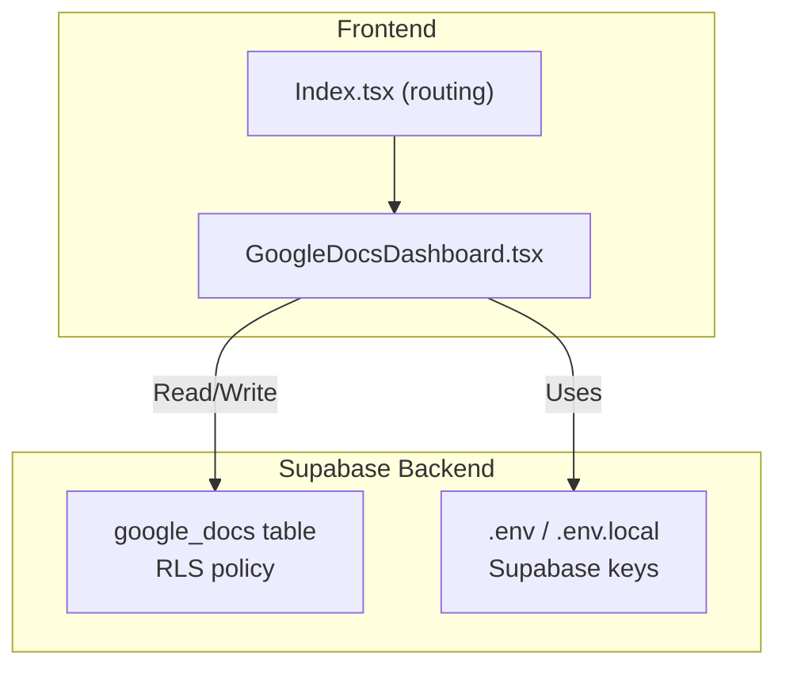
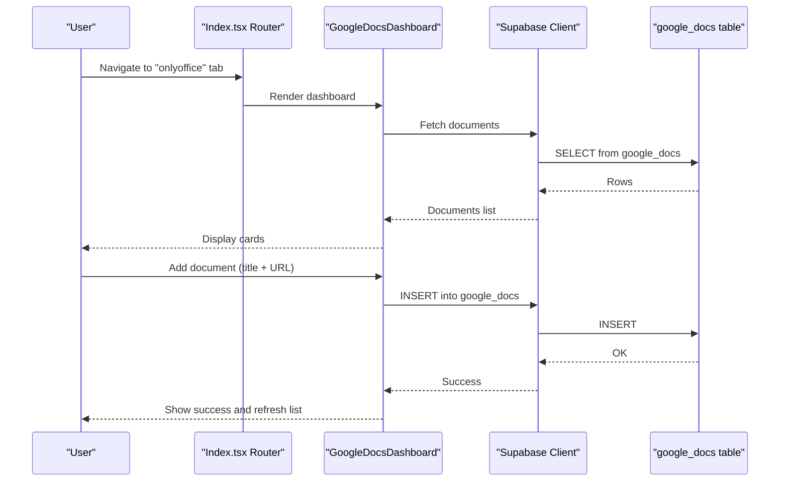
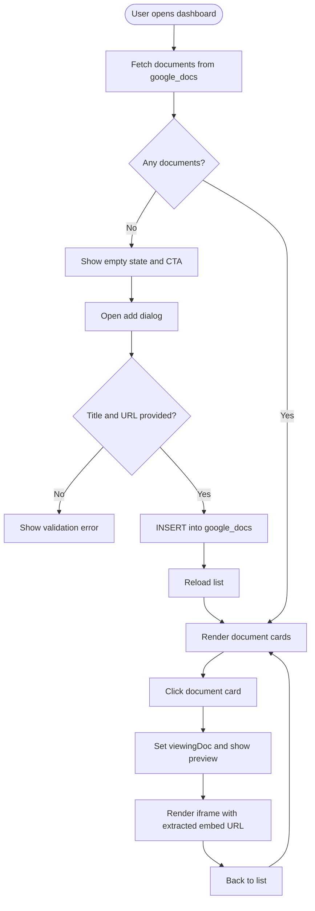
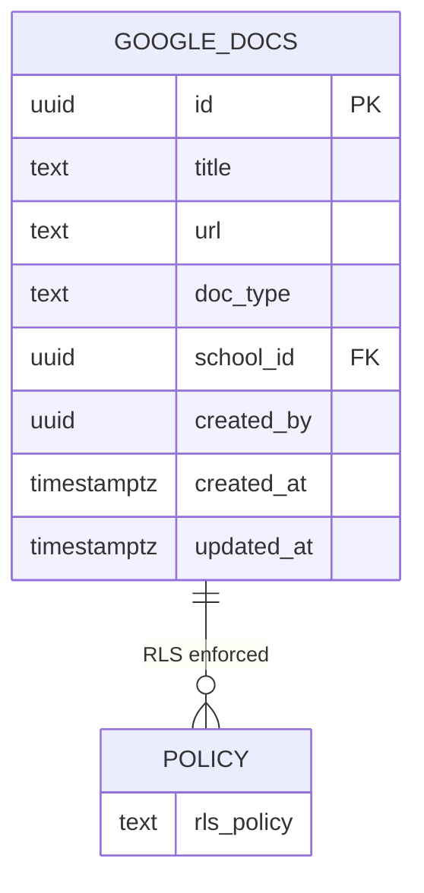
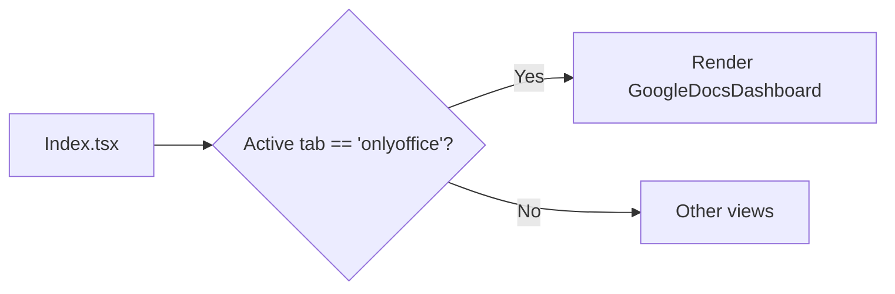
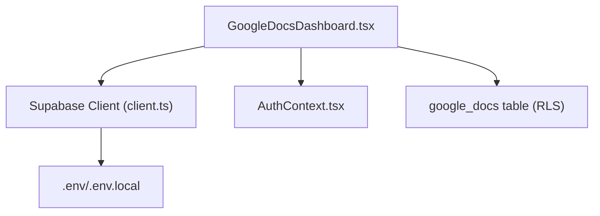

# Google Docs Integration

<cite>
**Referenced Files in This Document**
- [GoogleDocsDashboard.tsx](file://src/components/googledocs/GoogleDocsDashboard.tsx)
- [Index.tsx](file://src/pages/Index.tsx)
- [client.ts](file://src/integrations/supabase/client.ts)
- [20260208003659_39356598-c156-47f6-aa3d-4a829b37cb35.sql](file://supabase/migrations/20260208003659_39356598-c156-47f6-aa3d-4a829b37cb35.sql)
- [.env.example](file://.env.example)
- [.env](file://.env)
- [AuthContext.tsx](file://src/contexts/AuthContext.tsx)
</cite>

## Table of Contents
1. [Introduction](#introduction)
2. [Project Structure](#project-structure)
3. [Core Components](#core-components)
4. [Architecture Overview](#architecture-overview)
5. [Detailed Component Analysis](#detailed-component-analysis)
6. [Dependency Analysis](#dependency-analysis)
7. [Performance Considerations](#performance-considerations)
8. [Troubleshooting Guide](#troubleshooting-guide)
9. [Conclusion](#conclusion)

## Introduction
This document explains the Google Docs integration implemented in the portal. It covers the GoogleDocsDashboard component, the underlying Supabase data model, and the end-to-end workflow for embedding and managing Google Docs, Sheets, and Slides. It also clarifies the current implementation boundaries: the integration relies on embedding public links rather than direct Google APIs, so OAuth authentication, Drive API integration, real-time collaboration, and document versioning are not implemented in this codebase.

## Project Structure
The Google Docs integration spans three primary areas:
- Frontend dashboard component for adding, listing, and previewing embedded documents
- Supabase database schema and row-level security policy for storing document metadata
- Application routing that exposes the dashboard under the "onlyoffice" tab for admin users

**Diagram sources**
- [GoogleDocsDashboard.tsx](file://src/components/googledocs/GoogleDocsDashboard.tsx#L63-L109)
- [Index.tsx](file://src/pages/Index.tsx#L535-L540)
- [20260208003659_39356598-c156-47f6-aa3d-4a829b37cb35.sql](file://supabase/migrations/20260208003659_39356598-c156-47f6-aa3d-4a829b37cb35.sql#L1-L22)
- [.env.example](file://.env.example#L1-L9)
- [.env](file://.env#L1-L4)

**Section sources**
- [GoogleDocsDashboard.tsx](file://src/components/googledocs/GoogleDocsDashboard.tsx#L1-L260)
- [Index.tsx](file://src/pages/Index.tsx#L535-L540)
- [20260208003659_39356598-c156-47f6-aa3d-4a829b37cb35.sql](file://supabase/migrations/20260208003659_39356598-c156-47f6-aa3d-4a829b37cb35.sql#L1-L22)
- [.env.example](file://.env.example#L1-L9)
- [.env](file://.env#L1-L4)

## Core Components
- GoogleDocsDashboard: A React component that lists stored documents, allows adding new ones via URL, and previews them in an iframe. It uses Supabase to persist document metadata and applies row-level security policies.
- Supabase client: Provides authenticated access to Supabase for reads/writes to the google_docs table.
- Routing: The dashboard is exposed under the "onlyoffice" tab in the main application for admin users.

Key behaviors:
- Document types are inferred from the URL pattern (document, spreadsheet, presentation).
- Embed URLs are derived by converting shareable links to preview URLs.
- Admin-only access via Supabase RLS policy.

**Section sources**
- [GoogleDocsDashboard.tsx](file://src/components/googledocs/GoogleDocsDashboard.tsx#L53-L140)
- [client.ts](file://src/integrations/supabase/client.ts#L1-L17)
- [Index.tsx](file://src/pages/Index.tsx#L535-L540)

## Architecture Overview
The integration follows a simple client-server pattern:
- The frontend component queries and mutates the google_docs table through the Supabase client.
- Supabase enforces row-level security so only authenticated users with the admin role can manage documents.
- The dashboard renders documents in an iframe using a preview URL derived from the original shareable link.

**Diagram sources**
- [Index.tsx](file://src/pages/Index.tsx#L535-L540)
- [GoogleDocsDashboard.tsx](file://src/components/googledocs/GoogleDocsDashboard.tsx#L63-L109)
- [20260208003659_39356598-c156-47f6-aa3d-4a829b37cb35.sql](file://supabase/migrations/20260208003659_39356598-c156-47f6-aa3d-4a829b37cb35.sql#L14-L17)

## Detailed Component Analysis

### GoogleDocsDashboard Implementation
Responsibilities:
- Load documents from the google_docs table
- Add new documents by storing title, URL, and inferred type
- Delete documents
- Preview documents in a dedicated view using an embedded iframe
- Convert shareable Google URLs to embeddable preview URLs

Processing logic highlights:
- URL detection infers document type based on path segments.
- Embed URL conversion ensures the URL points to a preview endpoint suitable for an iframe.
- Row-level security restricts management operations to authenticated users with the admin role.

**Diagram sources**
- [GoogleDocsDashboard.tsx](file://src/components/googledocs/GoogleDocsDashboard.tsx#L63-L140)
- [GoogleDocsDashboard.tsx](file://src/components/googledocs/GoogleDocsDashboard.tsx#L28-L51)

**Section sources**
- [GoogleDocsDashboard.tsx](file://src/components/googledocs/GoogleDocsDashboard.tsx#L53-L140)
- [GoogleDocsDashboard.tsx](file://src/components/googledocs/GoogleDocsDashboard.tsx#L28-L51)

### Data Model and Access Control
The google_docs table stores:
- id, title, url, doc_type
- school_id and created_by for scoping and ownership
- timestamps for created_at and updated_at
- Row-level security policy allowing authenticated users with the admin role to manage entries

**Diagram sources**
- [20260208003659_39356598-c156-47f6-aa3d-4a829b37cb35.sql](file://supabase/migrations/20260208003659_39356598-c156-47f6-aa3d-4a829b37cb35.sql#L1-L22)

**Section sources**
- [20260208003659_39356598-c156-47f6-aa3d-4a829b37cb35.sql](file://supabase/migrations/20260208003659_39356598-c156-47f6-aa3d-4a829b37cb35.sql#L1-L22)

### Routing and Access
The dashboard is integrated into the main application under the "onlyoffice" tab and is visible to admin users only.

**Diagram sources**
- [Index.tsx](file://src/pages/Index.tsx#L535-L540)

**Section sources**
- [Index.tsx](file://src/pages/Index.tsx#L535-L540)

## Dependency Analysis
- Frontend depends on:
  - Supabase client for authenticated database operations
  - Environment variables for Supabase project configuration
  - Authentication context for role checks
- Backend depends on:
  - Supabase database and row-level security policies
  - Environment variables for Supabase credentials

**Diagram sources**
- [GoogleDocsDashboard.tsx](file://src/components/googledocs/GoogleDocsDashboard.tsx#L11-L12)
- [client.ts](file://src/integrations/supabase/client.ts#L1-L17)
- [.env.example](file://.env.example#L1-L9)
- [.env](file://.env#L1-L4)
- [AuthContext.tsx](file://src/contexts/AuthContext.tsx#L78-L96)
- [20260208003659_39356598-c156-47f6-aa3d-4a829b37cb35.sql](file://supabase/migrations/20260208003659_39356598-c156-47f6-aa3d-4a829b37cb35.sql#L12-L17)

**Section sources**
- [GoogleDocsDashboard.tsx](file://src/components/googledocs/GoogleDocsDashboard.tsx#L11-L12)
- [client.ts](file://src/integrations/supabase/client.ts#L1-L17)
- [AuthContext.tsx](file://src/contexts/AuthContext.tsx#L78-L96)
- [20260208003659_39356598-c156-47f6-aa3d-4a829b37cb35.sql](file://supabase/migrations/20260208003659_39356598-c156-47f6-aa3d-4a829b37cb35.sql#L12-L17)

## Performance Considerations
- Network efficiency: The dashboard performs a single paginated read on mount and minimal writes on add/delete operations.
- Rendering: Uses a grid layout optimized for small to medium document catalogs.
- Security: Relies on Supabase RLS to prevent unauthorized access, eliminating client-side filtering overhead.

[No sources needed since this section provides general guidance]

## Troubleshooting Guide
Common issues and resolutions:
- Documents not appearing:
  - Ensure the URL uses the "Anyone with the link" sharing setting as required by the embed mechanism.
  - Confirm the URL points to a valid Google Docs/Sheets/Slides resource.
- Add operation fails:
  - Verify both title and URL are provided.
  - Check backend logs for Supabase errors.
- Access denied:
  - Confirm the user has the admin role; only admins can manage documents due to RLS policy.
- Environment configuration:
  - Ensure VITE_SUPABASE_PROJECT_ID, VITE_SUPABASE_PUBLISHABLE_KEY, and VITE_SUPABASE_URL are set in .env.local.

**Section sources**
- [GoogleDocsDashboard.tsx](file://src/components/googledocs/GoogleDocsDashboard.tsx#L76-L99)
- [20260208003659_39356598-c156-47f6-aa3d-4a829b37cb35.sql](file://supabase/migrations/20260208003659_39356598-c156-47f6-aa3d-4a829b37cb35.sql#L14-L17)
- [.env.example](file://.env.example#L1-L9)
- [.env](file://.env#L1-L4)

## Conclusion
The Google Docs integration provides a straightforward way to catalog and embed Google Docs, Sheets, and Slides resources within the portal. It leverages Supabase for persistence and access control, and uses public share links for embedding. The current implementation does not include OAuth authentication, Google Drive API integration, real-time collaboration, or document versioning. Administrators can manage documents securely through the dashboard, and users can preview them directly in-context.