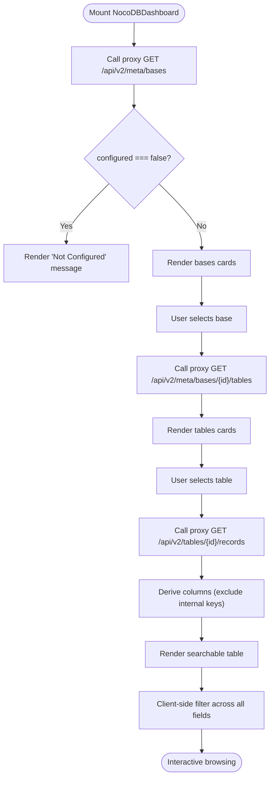

# NocoDB Database Management Integration

<cite>
**Referenced Files in This Document**
- [NocoDBDashboard.tsx](file://src/components/nocodb/NocoDBDashboard.tsx)
- [index.ts](file://supabase/functions/nocodb-proxy/index.ts)
- [client.ts](file://src/integrations/supabase/client.ts)
- [Index.tsx](file://src/pages/Index.tsx)
- [.env.example](file://.env.example)
</cite>

## Table of Contents
1. [Introduction](#introduction)
2. [Project Structure](#project-structure)
3. [Core Components](#core-components)
4. [Architecture Overview](#architecture-overview)
5. [Detailed Component Analysis](#detailed-component-analysis)
6. [Dependency Analysis](#dependency-analysis)
7. [Performance Considerations](#performance-considerations)
8. [Troubleshooting Guide](#troubleshooting-guide)
9. [Conclusion](#conclusion)
10. [Appendices](#appendices)

## Introduction
This document explains the NocoDB database management integration within the portal. It covers the NocoDBDashboard component, the database proxy functionality, authentication with the NocoDB API, data synchronization patterns, CRUD operation support, real-time update considerations, error handling, configuration, API endpoint mappings, and security/access control patterns. The integration leverages a Supabase Edge Function proxy to securely bridge the frontend to NocoDB while enforcing user authentication and validating configuration.

## Project Structure
The NocoDB integration consists of:
- Frontend dashboard component that renders NocoDB bases, tables, and records
- Supabase Edge Function proxy that authenticates requests and forwards them to NocoDB
- Supabase client configuration used by the frontend to invoke the proxy
- Routing integration to expose the dashboard to authorized users

**Diagram sources**
- [NocoDBDashboard.tsx](file://src/components/nocodb/NocoDBDashboard.tsx#L1-L233)
- [client.ts](file://src/integrations/supabase/client.ts#L1-L17)
- [index.ts](file://supabase/functions/nocodb-proxy/index.ts#L1-L72)
- [Index.tsx](file://src/pages/Index.tsx#L534-L535)

**Section sources**
- [NocoDBDashboard.tsx](file://src/components/nocodb/NocoDBDashboard.tsx#L1-L233)
- [client.ts](file://src/integrations/supabase/client.ts#L1-L17)
- [index.ts](file://supabase/functions/nocodb-proxy/index.ts#L1-L72)
- [Index.tsx](file://src/pages/Index.tsx#L534-L535)

## Core Components
- NocoDBDashboard: A React component that lists NocoDB bases, tables, and displays records in a searchable table. It invokes the proxy via Supabase functions.
- nocodb-proxy: A Deno-based Edge Function that validates user authentication, checks configuration, and proxies requests to NocoDB.
- Supabase Client: Provides the runtime client used by the frontend to call Edge Functions.
- Routing: Exposes the dashboard under the "nocodb" tab for admin users.

Key responsibilities:
- Authentication enforcement and user session validation
- Configuration validation for NocoDB base URL and API token
- Request forwarding to NocoDB with appropriate headers
- Response sanitization and error propagation
- Frontend UX for browsing metadata and records

**Section sources**
- [NocoDBDashboard.tsx](file://src/components/nocodb/NocoDBDashboard.tsx#L29-L98)
- [index.ts](file://supabase/functions/nocodb-proxy/index.ts#L14-L31)
- [client.ts](file://src/integrations/supabase/client.ts#L5-L17)
- [Index.tsx](file://src/pages/Index.tsx#L534-L535)

## Architecture Overview
The integration follows a secure, authenticated proxy pattern:
- The frontend calls a Supabase Edge Function named "nocodb-proxy".
- The proxy verifies the caller’s identity against Supabase Auth.
- The proxy validates required environment variables for NocoDB connectivity.
- The proxy forwards the request to NocoDB with the xc-token header.
- Responses are validated for JSON content and returned to the frontend.

**Diagram sources**
- [NocoDBDashboard.tsx](file://src/components/nocodb/NocoDBDashboard.tsx#L40-L46)
- [client.ts](file://src/integrations/supabase/client.ts#L5-L17)
- [index.ts](file://supabase/functions/nocodb-proxy/index.ts#L14-L66)

## Detailed Component Analysis

### NocoDBDashboard Component
Responsibilities:
- Manage UI state for bases, tables, records, and column discovery
- Invoke the proxy with GET actions for metadata and records
- Apply client-side filtering on record content
- Render loading skeletons and error feedback

Processing logic:
- Initial load fetches bases via the proxy
- Selecting a base fetches tables for that base
- Selecting a table fetches records and derives visible columns
- Search filters records client-side across all fields

**Diagram sources**
- [NocoDBDashboard.tsx](file://src/components/nocodb/NocoDBDashboard.tsx#L48-L98)

**Section sources**
- [NocoDBDashboard.tsx](file://src/components/nocodb/NocoDBDashboard.tsx#L29-L102)

### Proxy Function (nocodb-proxy)
Responsibilities:
- Authenticate the caller using Supabase Auth
- Validate presence of NOCODB_BASE_URL and NOCODB_API_TOKEN
- Forward HTTP requests to NocoDB with xc-token header
- Validate JSON responses and sanitize errors
- Return structured responses to the frontend

**Diagram sources**
- [index.ts](file://supabase/functions/nocodb-proxy/index.ts#L9-L71)

**Section sources**
- [index.ts](file://supabase/functions/nocodb-proxy/index.ts#L14-L66)

### Frontend Supabase Client
The frontend client is configured to use Vite environment variables for Supabase project identifiers and enables local storage persistence for sessions. It is used to invoke Edge Functions such as "nocodb-proxy".

**Section sources**
- [client.ts](file://src/integrations/supabase/client.ts#L5-L17)

### Routing Integration
The dashboard is exposed under the "nocodb" tab and is restricted to admin users. This ensures access control at the routing level.

**Section sources**
- [Index.tsx](file://src/pages/Index.tsx#L534-L535)

## Dependency Analysis
- NocoDBDashboard depends on:
  - Supabase client for invoking Edge Functions
  - UI primitives for cards, inputs, buttons, and toasts
- nocodb-proxy depends on:
  - Supabase client for user authentication
  - Environment variables for NocoDB configuration
  - HTTP fetch to forward requests to NocoDB
- Runtime dependencies:
  - Supabase Auth for session validation
  - NocoDB API for metadata and records

**Diagram sources**
- [NocoDBDashboard.tsx](file://src/components/nocodb/NocoDBDashboard.tsx#L9-L10)
- [client.ts](file://src/integrations/supabase/client.ts#L11-L17)
- [index.ts](file://supabase/functions/nocodb-proxy/index.ts#L16-L24)

**Section sources**
- [NocoDBDashboard.tsx](file://src/components/nocodb/NocoDBDashboard.tsx#L9-L10)
- [client.ts](file://src/integrations/supabase/client.ts#L11-L17)
- [index.ts](file://supabase/functions/nocodb-proxy/index.ts#L16-L24)

## Performance Considerations
- Client-side filtering: The dashboard filters records locally. For large datasets, consider server-side filtering or pagination to reduce payload sizes.
- Request batching: The proxy currently forwards individual requests. Consolidating calls could reduce latency.
- Caching: Intermittent caching of metadata (bases/tables) could improve UX during navigation.
- Network reliability: The proxy returns structured errors; consider retry/backoff strategies in the UI for transient failures.

## Troubleshooting Guide
Common issues and resolutions:
- Unauthorized access
  - Symptom: Immediate 401 response from the proxy.
  - Cause: Missing or invalid Authorization header/session.
  - Resolution: Ensure the user is logged in and the session is valid.
  - Section sources
    - [index.ts](file://supabase/functions/nocodb-proxy/index.ts#L21-L24)

- NocoDB not configured
  - Symptom: Response indicates configured=false.
  - Cause: Missing NOCODB_BASE_URL or NOCODB_API_TOKEN.
  - Resolution: Set the environment variables in the Supabase Edge Functions configuration.
  - Section sources
    - [index.ts](file://supabase/functions/nocodb-proxy/index.ts#L26-L31)

- Non-JSON response from NocoDB
  - Symptom: 502 error indicating non-JSON response.
  - Cause: NocoDB returned HTML or an unexpected status.
  - Resolution: Verify NOCODB_BASE_URL and NOCODB_API_TOKEN; check NocoDB service health.
  - Section sources
    - [index.ts](file://supabase/functions/nocodb-proxy/index.ts#L48-L60)

- Frontend errors and toasts
  - Symptom: Error notifications for failed loads.
  - Cause: Proxy errors propagated to the UI.
  - Resolution: Inspect browser network logs and console for detailed messages.
  - Section sources
    - [NocoDBDashboard.tsx](file://src/components/nocodb/NocoDBDashboard.tsx#L58-L62)
    - [NocoDBDashboard.tsx](file://src/components/nocodb/NocoDBDashboard.tsx#L74-L76)
    - [NocoDBDashboard.tsx](file://src/components/nocodb/NocoDBDashboard.tsx#L91-L93)

## Conclusion
The NocoDB integration provides a secure, authenticated pathway from the frontend to NocoDB via a Supabase Edge Function. It supports browsing metadata (bases and tables) and rendering records with client-side filtering. The proxy enforces authentication, validates configuration, and forwards requests with proper headers. Extending the integration to support write operations would require adding POST/PUT/DELETE actions to the proxy and corresponding UI controls in the dashboard.

## Appendices

### API Endpoint Mappings
- Base listing
  - Action: GET
  - Path: /api/v2/meta/bases
  - Purpose: Retrieve available NocoDB bases
  - Section sources
    - [NocoDBDashboard.tsx](file://src/components/nocodb/NocoDBDashboard.tsx#L50-L57)
    - [index.ts](file://supabase/functions/nocodb-proxy/index.ts#L33-L35)

- Table listing per base
  - Action: GET
  - Path: /api/v2/meta/bases/{baseId}/tables
  - Purpose: Retrieve tables within a selected base
  - Section sources
    - [NocoDBDashboard.tsx](file://src/components/nocodb/NocoDBDashboard.tsx#L68-L78)
    - [index.ts](file://supabase/functions/nocodb-proxy/index.ts#L33-L35)

- Records listing per table
  - Action: GET
  - Path: /api/v2/tables/{tableId}/records
  - Purpose: Retrieve records for display and column discovery
  - Section sources
    - [NocoDBDashboard.tsx](file://src/components/nocodb/NocoDBDashboard.tsx#L81-L96)
    - [index.ts](file://supabase/functions/nocodb-proxy/index.ts#L33-L35)

### Configuration Examples
- Frontend environment variables
  - VITE_SUPABASE_URL: Supabase project URL
  - VITE_SUPABASE_PUBLISHABLE_KEY: Supabase publishable key
  - Section sources
    - [.env.example](file://.env.example#L3-L6)

- Edge Function environment variables
  - NOCODB_BASE_URL: NocoDB server URL
  - NOCODB_API_TOKEN: NocoDB API token
  - Section sources
    - [index.ts](file://supabase/functions/nocodb-proxy/index.ts#L26-L27)

### Access Control Patterns
- Role-based visibility: The "nocodb" tab is only rendered for admin users.
  - Section sources
    - [Index.tsx](file://src/pages/Index.tsx#L534-L535)

- Session-based authentication: The proxy validates the Authorization header against Supabase Auth.
  - Section sources
    - [index.ts](file://supabase/functions/nocodb-proxy/index.ts#L16-L24)

### Security Considerations
- Token exposure: The proxy adds the xc-token header to requests to NocoDB. Ensure tokens are stored securely in environment variables and not logged.
- CORS: The proxy sets broad CORS headers; ensure the Supabase project origin is properly managed.
- Input validation: The proxy forwards raw bodies for non-GET requests; validate inputs at the NocoDB level.
- Least privilege: Use scoped API tokens and restrict NocoDB endpoints to required access.