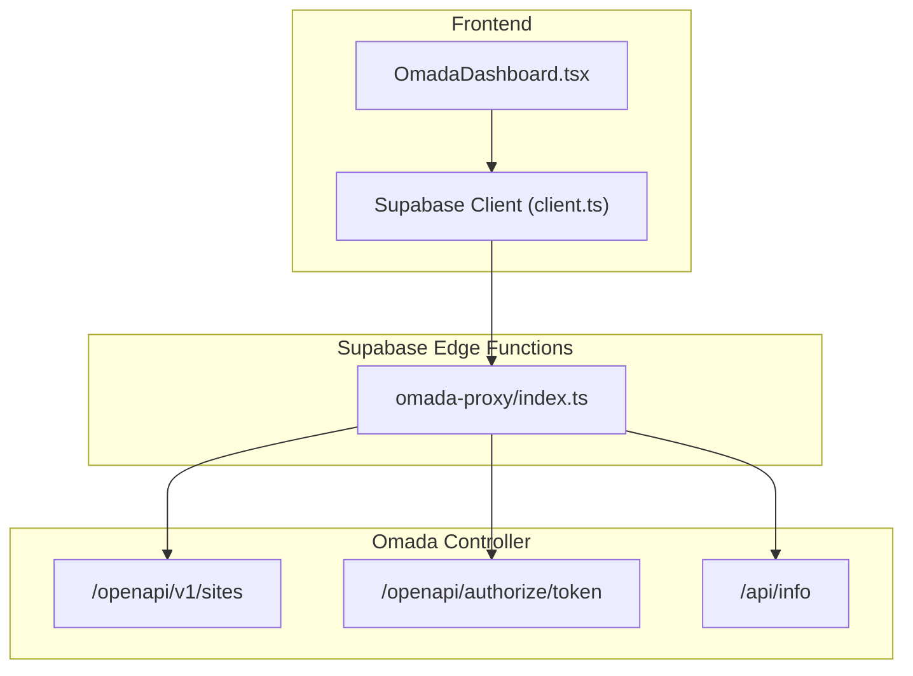
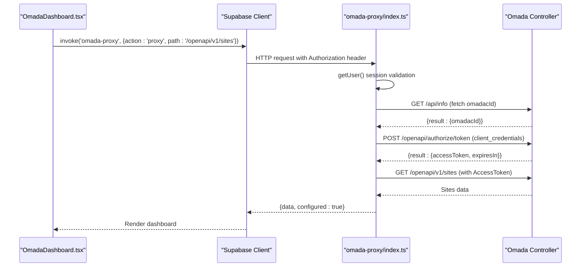
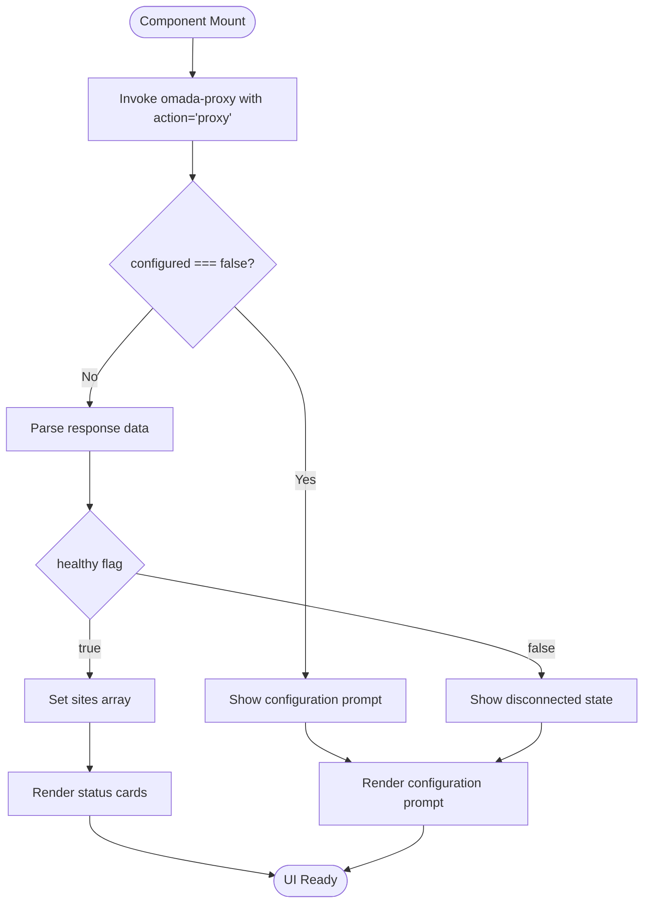
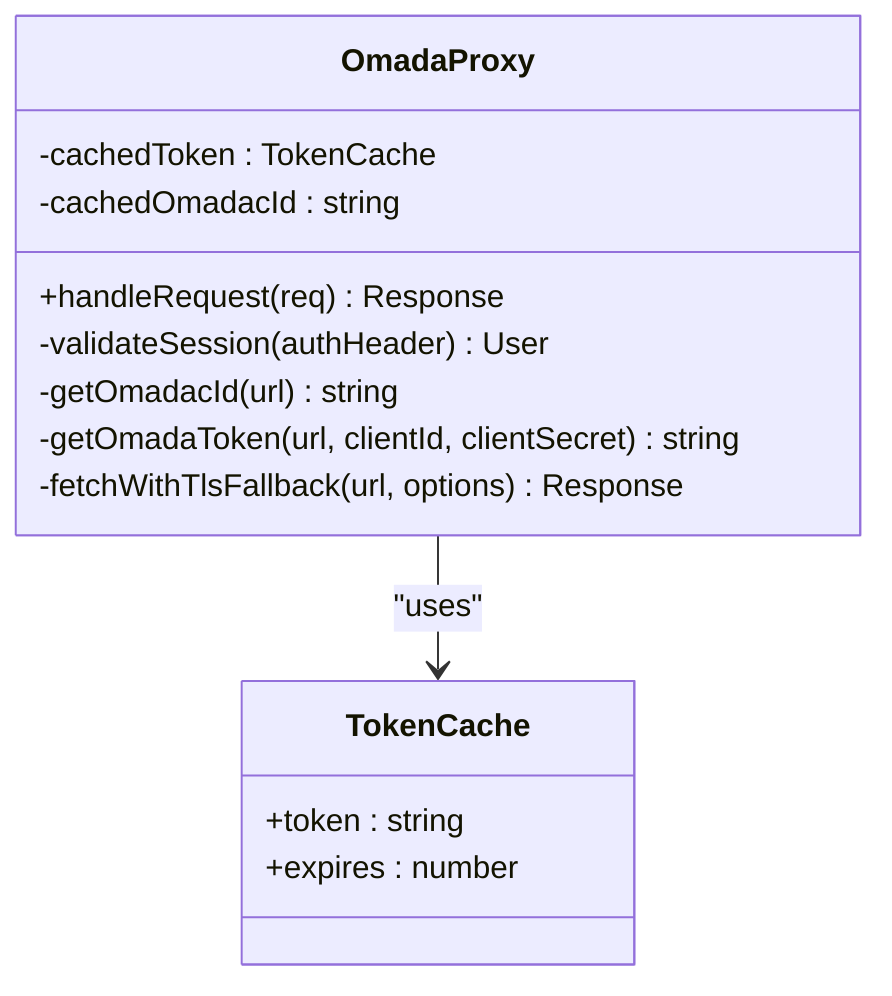
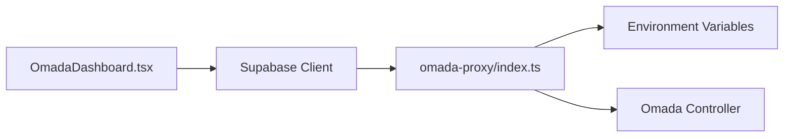

# Omada Network Monitoring Integration

<cite>
**Referenced Files in This Document**
- [OmadaDashboard.tsx](file://src/components/omada/OmadaDashboard.tsx)
- [index.ts](file://supabase/functions/omada-proxy/index.ts)
- [client.ts](file://src/integrations/supabase/client.ts)
- [.env.example](file://.env.example)
- [.env](file://.env)
</cite>

## Table of Contents
1. [Introduction](#introduction)
2. [Project Structure](#project-structure)
3. [Core Components](#core-components)
4. [Architecture Overview](#architecture-overview)
5. [Detailed Component Analysis](#detailed-component-analysis)
6. [Dependency Analysis](#dependency-analysis)
7. [Performance Considerations](#performance-considerations)
8. [Security Considerations](#security-considerations)
9. [Configuration Guide](#configuration-guide)
10. [API Endpoint Reference](#api-endpoint-reference)
11. [Troubleshooting Guide](#troubleshooting-guide)
12. [Conclusion](#conclusion)

## Introduction
This document provides comprehensive documentation for the Omada network monitoring integration within the portal. It explains how the system authenticates with the Omada API, discovers network devices, and displays network analytics through the OmadaDashboard component. The integration leverages a Supabase Edge Function (omada-proxy) to securely communicate with the Omada Controller while maintaining separation of concerns between frontend and backend logic.

## Project Structure
The Omada integration spans three primary areas:
- Frontend dashboard component that renders controller status and site information
- Supabase Edge Function that handles authentication and API proxying
- Supabase client configuration for frontend function invocation

**Diagram sources**
- [OmadaDashboard.tsx](file://src/components/omada/OmadaDashboard.tsx#L17-L41)
- [client.ts](file://src/integrations/supabase/client.ts#L11-L16)
- [index.ts](file://supabase/functions/omada-proxy/index.ts#L87-L144)

**Section sources**
- [OmadaDashboard.tsx](file://src/components/omada/OmadaDashboard.tsx#L1-L143)
- [index.ts](file://supabase/functions/omada-proxy/index.ts#L1-L145)
- [client.ts](file://src/integrations/supabase/client.ts#L1-L17)

## Core Components
The integration consists of two core components:
- OmadaDashboard: A React component that fetches and displays controller connectivity status, site counts, and basic network health indicators.
- omada-proxy: A Deno-powered Supabase Edge Function that authenticates with the Omada Controller and proxies API requests.

Key responsibilities:
- Authentication: Uses client credentials grant to obtain an access token from the Omada Controller
- API Proxying: Routes requests to Omada's OpenAPI endpoints with proper authorization headers
- TLS Fallback: Implements automatic HTTP fallback when TLS certificate issues are detected
- Caching: Maintains token and controller ID caches to minimize repeated authentication overhead

**Section sources**
- [OmadaDashboard.tsx](file://src/components/omada/OmadaDashboard.tsx#L12-L43)
- [index.ts](file://supabase/functions/omada-proxy/index.ts#L58-L85)

## Architecture Overview
The integration follows a secure, server-side authentication pattern:
1. Frontend invokes Supabase Edge Function with a standardized payload
2. Edge Function validates user session and loads environment secrets
3. Authentication flow obtains access token using omadacId and client credentials
4. API requests are proxied with proper authorization headers
5. Responses are returned to the frontend with configuration status

**Diagram sources**
- [OmadaDashboard.tsx](file://src/components/omada/OmadaDashboard.tsx#L17-L41)
- [index.ts](file://supabase/functions/omada-proxy/index.ts#L87-L144)

## Detailed Component Analysis

### OmadaDashboard Component
The dashboard component manages state for controller health, site listings, and loading states. It performs the following operations:
- Fetches controller status on mount and refresh
- Handles configuration state when secrets are missing
- Displays site overview with AP counts
- Provides user feedback for connectivity issues

**Diagram sources**
- [OmadaDashboard.tsx](file://src/components/omada/OmadaDashboard.tsx#L17-L43)

**Section sources**
- [OmadaDashboard.tsx](file://src/components/omada/OmadaDashboard.tsx#L12-L143)

### omada-proxy Edge Function
The Edge Function implements robust authentication and proxying logic:
- Session validation via Supabase auth
- Environment variable loading for controller configuration
- Token caching with expiration handling
- TLS certificate error detection with HTTP fallback
- Standardized response format with configuration status

**Diagram sources**
- [index.ts](file://supabase/functions/omada-proxy/index.ts#L87-L144)

**Section sources**
- [index.ts](file://supabase/functions/omada-proxy/index.ts#L1-L145)

## Dependency Analysis
The integration has minimal external dependencies and clear boundaries:
- Frontend depends on Supabase client for function invocation
- Edge Function depends on Supabase runtime for auth and environment access
- No circular dependencies exist between components

**Diagram sources**
- [OmadaDashboard.tsx](file://src/components/omada/OmadaDashboard.tsx#L1-L10)
- [client.ts](file://src/integrations/supabase/client.ts#L1-L17)
- [index.ts](file://supabase/functions/omada-proxy/index.ts#L92-L109)

**Section sources**
- [OmadaDashboard.tsx](file://src/components/omada/OmadaDashboard.tsx#L1-L10)
- [client.ts](file://src/integrations/supabase/client.ts#L1-L17)
- [index.ts](file://supabase/functions/omada-proxy/index.ts#L92-L109)

## Performance Considerations
- Token caching reduces authentication overhead across requests
- TLS fallback prevents unnecessary failures during certificate issues
- Minimal frontend logic ensures responsive UI updates
- Consider implementing polling intervals for live updates in future enhancements

## Security Considerations
- All communication with the Omada Controller occurs server-side via Edge Functions
- Sensitive credentials are stored as Supabase environment variables, not in client code
- User sessions are validated before processing any Omada API requests
- Access tokens are scoped to the client credentials and cached with expiration
- CORS headers are configured for safe cross-origin requests

## Configuration Guide
Configure the Omada integration by setting the following Supabase environment variables:

### Required Environment Variables
- `OMADA_URL`: Base URL of the Omada Controller (without trailing slash)
- `OMADA_CLIENT_ID`: Client ID for Omada API authentication
- `OMADA_CLIENT_SECRET`: Client secret for Omada API authentication

### Frontend Configuration
The frontend reads Supabase configuration from environment variables:
- `VITE_SUPABASE_URL`: Supabase project URL
- `VITE_SUPABASE_PUBLISHABLE_KEY`: Supabase publishable key

**Section sources**
- [index.ts](file://supabase/functions/omada-proxy/index.ts#L103-L105)
- [.env.example](file://.env.example#L1-L9)
- [.env](file://.env#L1-L4)
- [client.ts](file://src/integrations/supabase/client.ts#L5-L6)

## API Endpoint Reference
The integration currently supports the following Omada API endpoints:

### Authentication
- Endpoint: `/openapi/authorize/token`
- Method: POST
- Purpose: Obtain access token using client credentials
- Required parameters: `grant_type=client_credentials`, `omadac_id`

### Discovery
- Endpoint: `/openapi/v1/sites`
- Method: GET
- Purpose: Retrieve all controller sites and connected AP counts

### Controller Information
- Endpoint: `/api/info`
- Method: GET
- Purpose: Fetch controller metadata including `omadacId`

**Section sources**
- [index.ts](file://supabase/functions/omada-proxy/index.ts#L63-L64)
- [index.ts](file://supabase/functions/omada-proxy/index.ts#L129-L136)

## Troubleshooting Guide

### Common Issues and Solutions

#### Controller Unreachable
**Symptoms**: Dashboard shows "Controller unreachable" or "Disconnected"
**Causes**:
- Incorrect OMADA_URL configuration
- Network connectivity issues
- TLS certificate problems

**Solutions**:
- Verify OMADA_URL is accessible from Supabase Edge Functions
- Check firewall and network policies
- Review TLS fallback logs for certificate errors

#### Authentication Failures
**Symptoms**: "Omada not configured" message appears
**Causes**:
- Missing environment variables
- Incorrect client credentials
- Expired or invalid omadacId

**Solutions**:
- Confirm OMADA_CLIENT_ID and OMADA_CLIENT_SECRET are set
- Verify client credentials have appropriate permissions
- Check `/api/info` endpoint accessibility

#### API Response Issues
**Symptoms**: HTML responses instead of JSON from Omada endpoints
**Causes**:
- Wrong base URL pointing to web UI instead of API
- Port misconfiguration

**Solutions**:
- Ensure OMADA_URL points to the API base, not the web interface
- Verify port forwarding and SSL termination settings

#### Rate Limiting and Performance
**Symptoms**: Slow responses or intermittent failures
**Causes**:
- Frequent token refreshes
- High request volume

**Solutions**:
- Leverage built-in token caching (expiresIn - 60 seconds buffer)
- Implement client-side throttling for manual refreshes
- Monitor Edge Function execution logs

**Section sources**
- [OmadaDashboard.tsx](file://src/components/omada/OmadaDashboard.tsx#L129-L139)
- [index.ts](file://supabase/functions/omada-proxy/index.ts#L46-L48)
- [index.ts](file://supabase/functions/omada-proxy/index.ts#L76-L78)

## Conclusion
The Omada network monitoring integration provides a secure, maintainable solution for accessing Omada Controller data within the portal. By leveraging Supabase Edge Functions for authentication and proxying, the system maintains strong security boundaries while delivering real-time network insights through the OmadaDashboard component. The modular architecture allows for easy extension to additional Omada endpoints and enhanced monitoring capabilities.