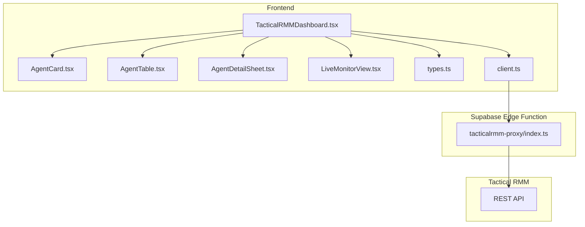
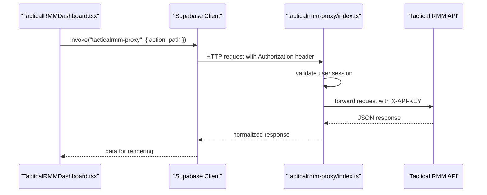
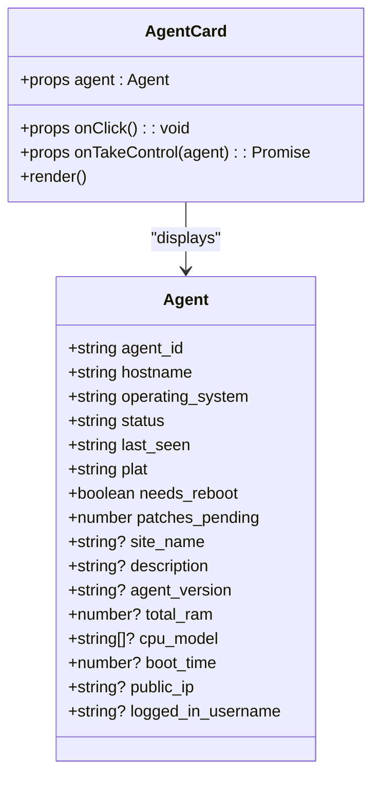
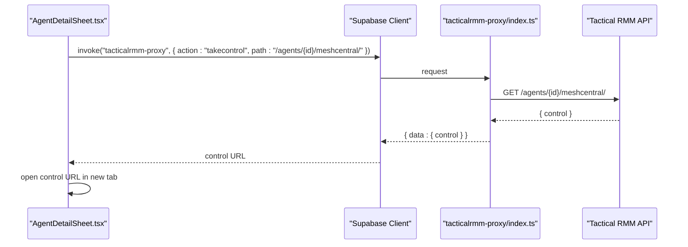
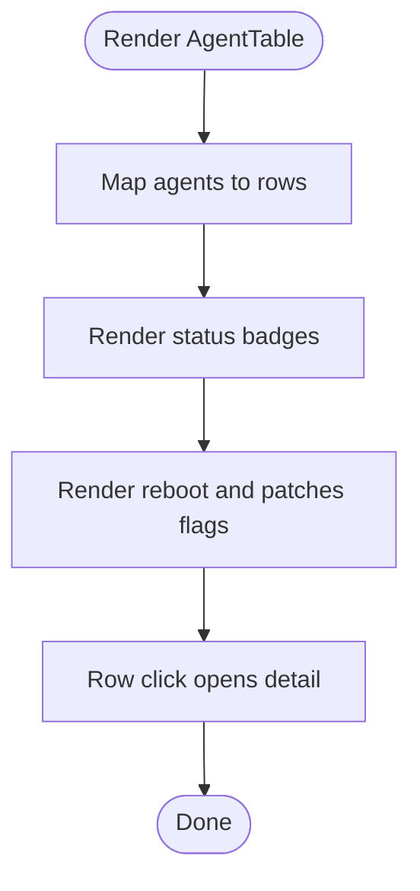
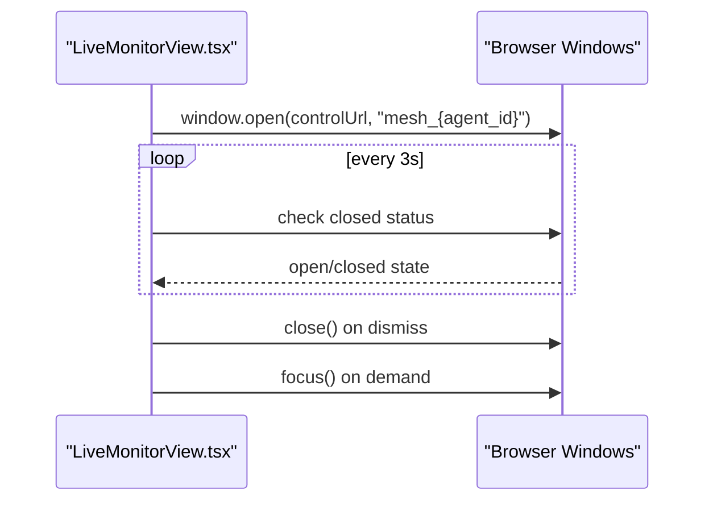
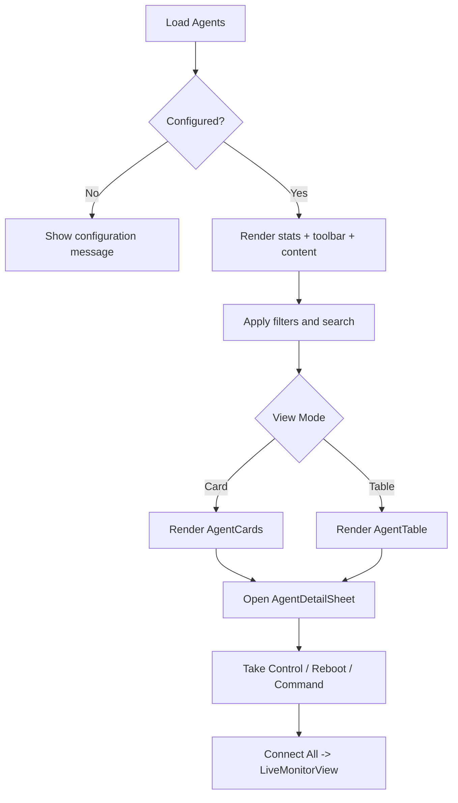
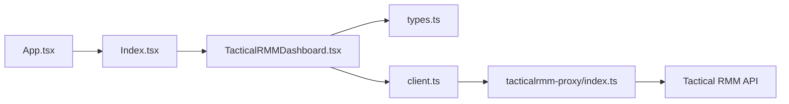

# Tactical RMM System Integration

<cite>
**Referenced Files in This Document**
- [AgentCard.tsx](file://src/components/tacticalrmm/AgentCard.tsx)
- [AgentDetailSheet.tsx](file://src/components/tacticalrmm/AgentDetailSheet.tsx)
- [AgentTable.tsx](file://src/components/tacticalrmm/AgentTable.tsx)
- [LiveMonitorView.tsx](file://src/components/tacticalrmm/LiveMonitorView.tsx)
- [TacticalRMMDashboard.tsx](file://src/components/tacticalrmm/TacticalRMMDashboard.tsx)
- [types.ts](file://src/components/tacticalrmm/types.ts)
- [index.ts](file://supabase/functions/tacticalrmm-proxy/index.ts)
- [client.ts](file://src/integrations/supabase/client.ts)
- [App.tsx](file://src/App.tsx)
- [Index.tsx](file://src/pages/Index.tsx)
- [package.json](file://package.json)
</cite>

## Table of Contents
1. [Introduction](#introduction)
2. [Project Structure](#project-structure)
3. [Core Components](#core-components)
4. [Architecture Overview](#architecture-overview)
5. [Detailed Component Analysis](#detailed-component-analysis)
6. [Dependency Analysis](#dependency-analysis)
7. [Performance Considerations](#performance-considerations)
8. [Troubleshooting Guide](#troubleshooting-guide)
9. [Conclusion](#conclusion)
10. [Appendices](#appendices)

## Introduction
This document provides comprehensive documentation for the Tactical RMM system integration within the st.francis-portal application. It explains the agent management ecosystem centered around four key frontend components: AgentCard, AgentDetailSheet, AgentTable, and LiveMonitorView. It also details the backend integration via a Supabase Edge Function proxy that communicates with Tactical RMM’s REST API, covering agent registration discovery, monitoring workflows, real-time status updates, health monitoring, performance metrics collection, alert management, authentication setup, webhook configurations, and data synchronization patterns. Finally, it includes troubleshooting guidance for common RMM integration issues, agent connectivity problems, and performance monitoring best practices.

## Project Structure
The Tactical RMM integration is organized into:
- Frontend components under src/components/tacticalrmm implementing the UI and workflows for agent management.
- A Supabase Edge Function proxy under supabase/functions/tacticalrmm-proxy that securely bridges the frontend to Tactical RMM.
- Integration utilities for Supabase client initialization.
- Routing and page integration within the application.

**Diagram sources**
- [TacticalRMMDashboard.tsx](file://src/components/tacticalrmm/TacticalRMMDashboard.tsx#L1-L250)
- [AgentCard.tsx](file://src/components/tacticalrmm/AgentCard.tsx#L1-L66)
- [AgentTable.tsx](file://src/components/tacticalrmm/AgentTable.tsx#L1-L49)
- [AgentDetailSheet.tsx](file://src/components/tacticalrmm/AgentDetailSheet.tsx#L1-L213)
- [LiveMonitorView.tsx](file://src/components/tacticalrmm/LiveMonitorView.tsx#L1-L172)
- [types.ts](file://src/components/tacticalrmm/types.ts#L1-L32)
- [client.ts](file://src/integrations/supabase/client.ts#L1-L17)
- [index.ts](file://supabase/functions/tacticalrmm-proxy/index.ts#L1-L116)

**Section sources**
- [TacticalRMMDashboard.tsx](file://src/components/tacticalrmm/TacticalRMMDashboard.tsx#L1-L250)
- [AgentCard.tsx](file://src/components/tacticalrmm/AgentCard.tsx#L1-L66)
- [AgentTable.tsx](file://src/components/tacticalrmm/AgentTable.tsx#L1-L49)
- [AgentDetailSheet.tsx](file://src/components/tacticalrmm/AgentDetailSheet.tsx#L1-L213)
- [LiveMonitorView.tsx](file://src/components/tacticalrmm/LiveMonitorView.tsx#L1-L172)
- [types.ts](file://src/components/tacticalrmm/types.ts#L1-L32)
- [client.ts](file://src/integrations/supabase/client.ts#L1-L17)
- [index.ts](file://supabase/functions/tacticalrmm-proxy/index.ts#L1-L116)

## Core Components
This section outlines the primary components and their responsibilities in the agent management ecosystem.

- AgentCard: Displays individual agent cards with status indicators, OS icon, hostname, operating system, site, reboot and patch flags, last seen timestamp, and optional “Take Control” action for online agents.
- AgentDetailSheet: Provides a detailed view of an agent with system information, actions (Take Control, open MeshCentral, reboot), and a command execution interface.
- AgentTable: Presents agents in a tabular format with filtering and sorting capabilities, status badges, and flags.
- LiveMonitorView: Manages live monitoring windows for connected agents, supports opening, focusing, closing, and refreshing multiple remote control sessions.
- TacticalRMMDashboard: Orchestrates the entire workflow, including agent listing, filtering, detail loading, bulk “Take Control,” and navigation to the live monitor view.

Key data model types define agent attributes and connected agent properties used across components.

**Section sources**
- [AgentCard.tsx](file://src/components/tacticalrmm/AgentCard.tsx#L1-L66)
- [AgentDetailSheet.tsx](file://src/components/tacticalrmm/AgentDetailSheet.tsx#L1-L213)
- [AgentTable.tsx](file://src/components/tacticalrmm/AgentTable.tsx#L1-L49)
- [LiveMonitorView.tsx](file://src/components/tacticalrmm/LiveMonitorView.tsx#L1-L172)
- [TacticalRMMDashboard.tsx](file://src/components/tacticalrmm/TacticalRMMDashboard.tsx#L1-L250)
- [types.ts](file://src/components/tacticalrmm/types.ts#L1-L32)

## Architecture Overview
The integration follows a secure, authenticated flow:
- The frontend initializes a Supabase client and invokes the tacticalrmm-proxy Edge Function.
- The Edge Function validates the user session, checks environment variables for Tactical RMM configuration, and forwards requests to Tactical RMM’s REST API.
- Responses are parsed and returned to the frontend, which updates UI components accordingly.

**Diagram sources**
- [TacticalRMMDashboard.tsx](file://src/components/tacticalrmm/TacticalRMMDashboard.tsx#L32-L47)
- [client.ts](file://src/integrations/supabase/client.ts#L11-L17)
- [index.ts](file://supabase/functions/tacticalrmm-proxy/index.ts#L9-L38)
- [index.ts](file://supabase/functions/tacticalrmm-proxy/index.ts#L94-L110)

**Section sources**
- [TacticalRMMDashboard.tsx](file://src/components/tacticalrmm/TacticalRMMDashboard.tsx#L32-L47)
- [client.ts](file://src/integrations/supabase/client.ts#L11-L17)
- [index.ts](file://supabase/functions/tacticalrmm-proxy/index.ts#L9-L38)
- [index.ts](file://supabase/functions/tacticalrmm-proxy/index.ts#L94-L110)

## Detailed Component Analysis

### AgentCard Component
AgentCard renders a single agent’s summary with:
- OS-specific icon and online/offline indicator.
- Description and hostname display.
- Operating system and site information.
- Status badges for reboot and pending patches.
- Last seen timestamp.
- “Take Control” action for online agents with loading state.

**Diagram sources**
- [AgentCard.tsx](file://src/components/tacticalrmm/AgentCard.tsx#L14-L66)
- [types.ts](file://src/components/tacticalrmm/types.ts#L1-L23)

**Section sources**
- [AgentCard.tsx](file://src/components/tacticalrmm/AgentCard.tsx#L1-L66)
- [types.ts](file://src/components/tacticalrmm/types.ts#L1-L23)

### AgentDetailSheet Component
AgentDetailSheet provides:
- Detailed agent information (CPU, RAM, public IP, logged-in user, uptime).
- Action buttons: Take Control, open MeshCentral, reboot.
- Command execution interface with shell detection and output display.
- Loading states and error notifications.

**Diagram sources**
- [AgentDetailSheet.tsx](file://src/components/tacticalrmm/AgentDetailSheet.tsx#L75-L96)
- [index.ts](file://supabase/functions/tacticalrmm-proxy/index.ts#L56-L82)

**Section sources**
- [AgentDetailSheet.tsx](file://src/components/tacticalrmm/AgentDetailSheet.tsx#L1-L213)
- [index.ts](file://supabase/functions/tacticalrmm-proxy/index.ts#L56-L82)

### AgentTable Component
AgentTable presents agents in a sortable, filterable table with:
- Status badges.
- Name, site, OS, last seen, and flags columns.
- Row selection to open the detail sheet.

**Diagram sources**
- [AgentTable.tsx](file://src/components/tacticalrmm/AgentTable.tsx#L4-L49)

**Section sources**
- [AgentTable.tsx](file://src/components/tacticalrmm/AgentTable.tsx#L1-L49)

### LiveMonitorView Component
LiveMonitorView manages:
- Automatic opening of control windows for connected agents on mount.
- Periodic polling to detect closed windows.
- Dismissal of agents and reopening controls.
- Bulk actions: open all and refresh all.
- Visual status indicators per agent.

**Diagram sources**
- [LiveMonitorView.tsx](file://src/components/tacticalrmm/LiveMonitorView.tsx#L23-L59)
- [LiveMonitorView.tsx](file://src/components/tacticalrmm/LiveMonitorView.tsx#L61-L74)

**Section sources**
- [LiveMonitorView.tsx](file://src/components/tacticalrmm/LiveMonitorView.tsx#L1-L172)

### TacticalRMMDashboard Component
TacticalRMMDashboard orchestrates:
- Initial agent listing and configuration check.
- Filtering by status, site, and search term.
- Detail loading for selected agents.
- Bulk “Take Control” to connect multiple agents and navigate to LiveMonitorView.
- Statistics cards for total devices, online, offline, and reboot alerts.
- View mode switching between card and table layouts.

**Diagram sources**
- [TacticalRMMDashboard.tsx](file://src/components/tacticalrmm/TacticalRMMDashboard.tsx#L32-L47)
- [TacticalRMMDashboard.tsx](file://src/components/tacticalrmm/TacticalRMMDashboard.tsx#L112-L122)
- [TacticalRMMDashboard.tsx](file://src/components/tacticalrmm/TacticalRMMDashboard.tsx#L124-L135)
- [TacticalRMMDashboard.tsx](file://src/components/tacticalrmm/TacticalRMMDashboard.tsx#L157-L249)

**Section sources**
- [TacticalRMMDashboard.tsx](file://src/components/tacticalrmm/TacticalRMMDashboard.tsx#L1-L250)

## Dependency Analysis
The integration relies on:
- Supabase client for authenticated function invocation.
- Edge Function proxy for secure API bridging and environment variable access.
- React components for UI rendering and state management.
- TanStack React Query for caching and refetching (as configured in the application bootstrap).

**Diagram sources**
- [App.tsx](file://src/App.tsx#L39-L83)
- [Index.tsx](file://src/pages/Index.tsx#L538-L539)
- [TacticalRMMDashboard.tsx](file://src/components/tacticalrmm/TacticalRMMDashboard.tsx#L1-L16)
- [client.ts](file://src/integrations/supabase/client.ts#L1-L17)
- [index.ts](file://supabase/functions/tacticalrmm-proxy/index.ts#L1-L116)

**Section sources**
- [App.tsx](file://src/App.tsx#L39-L83)
- [Index.tsx](file://src/pages/Index.tsx#L538-L539)
- [TacticalRMMDashboard.tsx](file://src/components/tacticalrmm/TacticalRMMDashboard.tsx#L1-L16)
- [client.ts](file://src/integrations/supabase/client.ts#L1-L17)
- [index.ts](file://supabase/functions/tacticalrmm-proxy/index.ts#L1-L116)
- [package.json](file://package.json#L42-L43)

## Performance Considerations
- Minimize concurrent network requests: The dashboard uses Promise.allSettled for bulk “Take Control” operations to avoid blocking and to surface partial failures.
- Debounce or throttle search/filter operations to reduce re-renders.
- Use virtualized lists for large agent datasets if performance becomes an issue.
- Cache agent details and images where appropriate to reduce repeated fetches.
- Monitor Edge Function cold starts and consider keeping the function warm if high-frequency calls are expected.
- Optimize image/icon rendering and avoid unnecessary re-computations in render-heavy components.

[No sources needed since this section provides general guidance]

## Troubleshooting Guide
Common integration issues and resolutions:

- Tactical RMM not configured:
  - Symptom: A configuration message appears indicating missing environment variables.
  - Resolution: Set TACTICALRMM_URL, TACTICALRMM_API_KEY, and optionally TACTICALRMM_MESH_URL and TACTICALRMM_WEB_URL in the Supabase Edge Function environment.

- Unauthorized or invalid credentials:
  - Symptom: 401 responses or generic errors when invoking the proxy.
  - Resolution: Ensure the user is authenticated and the Authorization header is present. Verify Supabase service role keys and environment variables.

- Non-JSON responses from Tactical RMM:
  - Symptom: Errors indicating non-JSON responses or HTML responses.
  - Resolution: Confirm TACTICALRMM_URL points to the correct base URL and TACTICALRMM_API_KEY is valid. Check firewall and CORS settings.

- MeshCentral URL retrieval failures:
  - Symptom: “Take Control” fails with MeshCentral URL errors.
  - Resolution: Verify agent exists, agent is online, and Tactical RMM MeshCentral integration is properly configured. Check proxy logs for detailed error messages.

- Bulk connection failures:
  - Symptom: Some agents fail to connect during “Connect All.”
  - Resolution: Review individual agent connectionError values and retry selectively. Investigate network connectivity and MeshCentral permissions.

- Live monitor window management:
  - Symptom: Windows not opening or not detected as closed.
  - Resolution: Ensure pop-ups are allowed. The component polls every 3 seconds; wait for the status to update. Use “Focus” or “Reopen” actions as needed.

**Section sources**
- [index.ts](file://supabase/functions/tacticalrmm-proxy/index.ts#L30-L32)
- [index.ts](file://supabase/functions/tacticalrmm-proxy/index.ts#L49-L53)
- [index.ts](file://supabase/functions/tacticalrmm-proxy/index.ts#L99-L104)
- [index.ts](file://supabase/functions/tacticalrmm-proxy/index.ts#L78-L81)
- [LiveMonitorView.tsx](file://src/components/tacticalrmm/LiveMonitorView.tsx#L49-L59)

## Conclusion
The Tactical RMM integration leverages a clean separation of concerns: frontend components manage user interactions and state, while a Supabase Edge Function proxy handles authentication, configuration validation, and secure API forwarding. Together, they provide a robust foundation for agent discovery, monitoring, and remote control, with support for filtering, bulk operations, and live monitoring. Proper configuration of environment variables, attention to error handling, and adherence to performance best practices ensure reliable operation in production environments.

[No sources needed since this section summarizes without analyzing specific files]

## Appendices

### Authentication Setup
- Supabase client initialization includes automatic token refresh and persistent sessions.
- The Edge Function validates the user session and forwards the Authorization header to Tactical RMM.

**Section sources**
- [client.ts](file://src/integrations/supabase/client.ts#L11-L17)
- [index.ts](file://supabase/functions/tacticalrmm-proxy/index.ts#L20-L23)

### Environment Variables
- Required: TACTICALRMM_URL, TACTICALRMM_API_KEY
- Optional: TACTICALRMM_MESH_URL, TACTICALRMM_WEB_URL

**Section sources**
- [index.ts](file://supabase/functions/tacticalrmm-proxy/index.ts#L25-L28)

### Webhook Configurations
- The current implementation focuses on REST API integration via the proxy. No explicit webhook handlers are present in the referenced files. For webhook-driven updates, implement a dedicated Edge Function endpoint and configure Tactical RMM to send events to that endpoint.

[No sources needed since this section provides general guidance]

### Data Synchronization Patterns
- The dashboard loads agents on mount and supports manual refresh.
- Bulk “Take Control” operations use Promise.allSettled to synchronize multiple connections concurrently while capturing individual failures.
- Detail sheets augment basic agent data with additional system information upon selection.

**Section sources**
- [TacticalRMMDashboard.tsx](file://src/components/tacticalrmm/TacticalRMMDashboard.tsx#L104-L104)
- [TacticalRMMDashboard.tsx](file://src/components/tacticalrmm/TacticalRMMDashboard.tsx#L84-L102)
- [TacticalRMMDashboard.tsx](file://src/components/tacticalrmm/TacticalRMMDashboard.tsx#L49-L61)