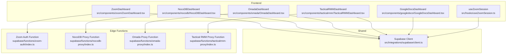
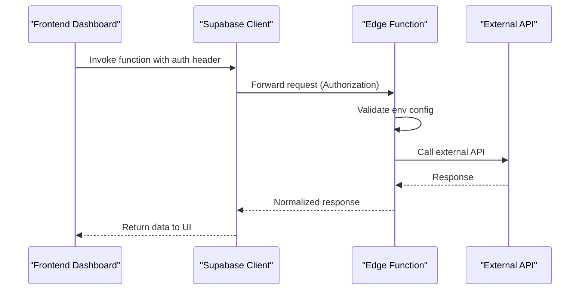
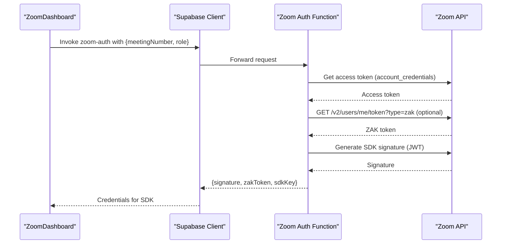
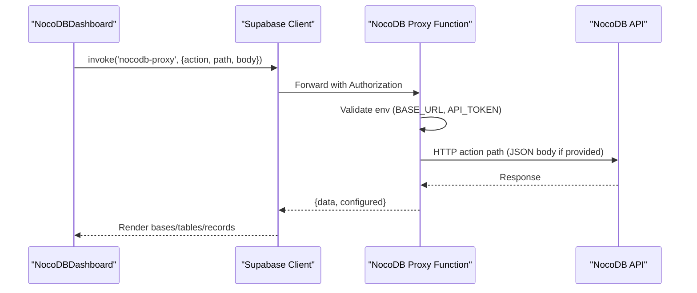
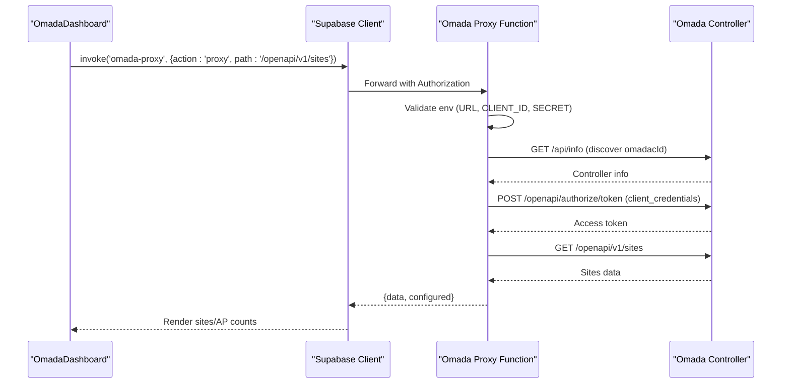
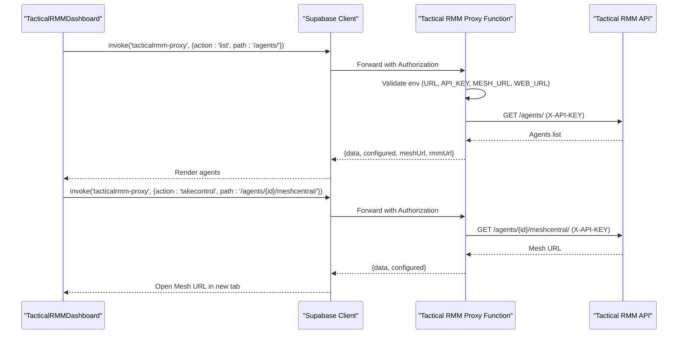
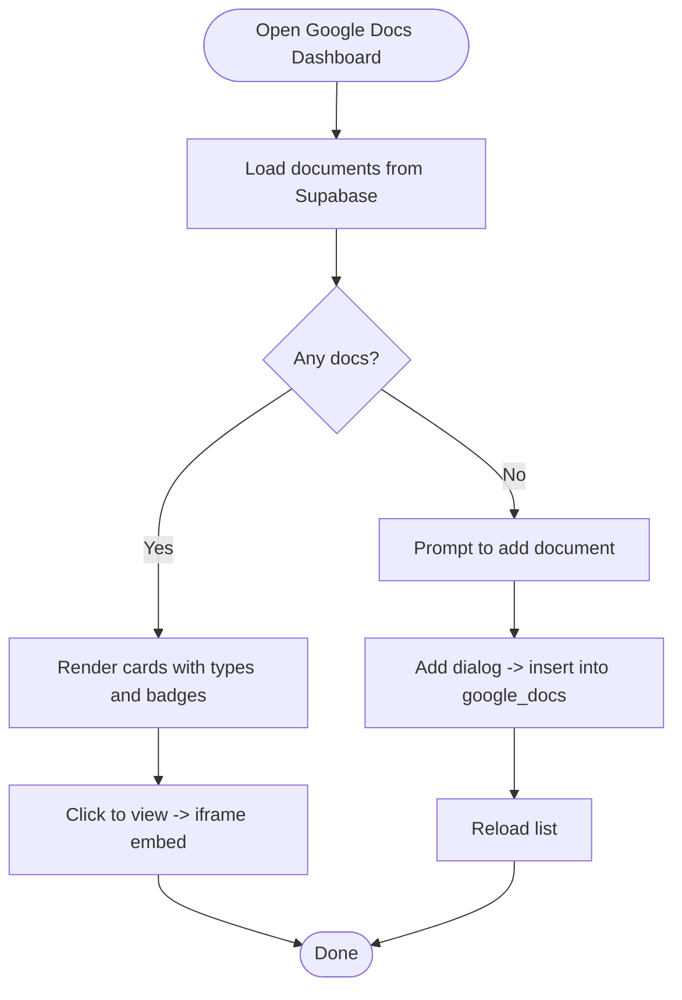
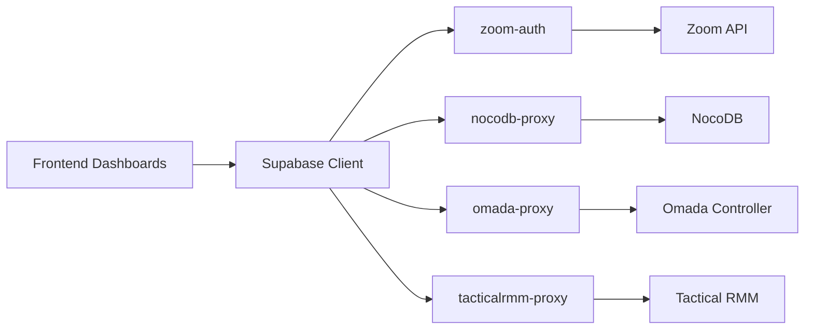

# Third-Party Integrations

<cite>
**Referenced Files in This Document**
- [Zoom Auth Function](file://supabase/functions/zoom-auth/index.ts)
- [NocoDB Proxy Function](file://supabase/functions/nocodb-proxy/index.ts)
- [Omada Proxy Function](file://supabase/functions/omada-proxy/index.ts)
- [Tactical RMM Proxy Function](file://supabase/functions/tacticalrmm-proxy/index.ts)
- [Supabase Client](file://src/integrations/supabase/client.ts)
- [Zoom Dashboard](file://src/components/zoom/ZoomDashboard.tsx)
- [NocoDB Dashboard](file://src/components/nocodb/NocoDBDashboard.tsx)
- [Omada Dashboard](file://src/components/omada/OmadaDashboard.tsx)
- [Tactical RMM Dashboard](file://src/components/tacticalrmm/TacticalRMMDashboard.tsx)
- [Google Docs Dashboard](file://src/components/googledocs/GoogleDocsDashboard.tsx)
- [Zoom Session Hook](file://src/hooks/useZoomSession.ts)
- [Tactical RMM Types](file://src/components/tacticalrmm/types.ts)
- [.env.example](file://.env.example)
</cite>

## Table of Contents
1. [Introduction](#introduction)
2. [Project Structure](#project-structure)
3. [Core Components](#core-components)
4. [Architecture Overview](#architecture-overview)
5. [Detailed Component Analysis](#detailed-component-analysis)
6. [Dependency Analysis](#dependency-analysis)
7. [Performance Considerations](#performance-considerations)
8. [Troubleshooting Guide](#troubleshooting-guide)
9. [Conclusion](#conclusion)

## Introduction
This document explains the third-party integrations implemented in the portal, focusing on Zoom virtual classroom, NocoDB database management, Google Docs connectivity, Omada network monitoring, and Tactical RMM system integration. It covers authentication flows, API communication patterns, data synchronization mechanisms, webhooks, real-time updates, and troubleshooting strategies. Where applicable, OAuth flows, API rate limiting, and error handling are detailed.

## Project Structure
The integrations are implemented as:
- Frontend dashboards and UI components under src/components
- Shared Supabase client under src/integrations/supabase
- Supabase Edge Functions (proxies and auth helpers) under supabase/functions
- Hooks for reusable logic under src/hooks
- Environment configuration under .env.example

**Diagram sources**
- [Zoom Dashboard](file://src/components/zoom/ZoomDashboard.tsx#L1-L308)
- [NocoDB Dashboard](file://src/components/nocodb/NocoDBDashboard.tsx#L1-L233)
- [Omada Dashboard](file://src/components/omada/OmadaDashboard.tsx#L1-L143)
- [Tactical RMM Dashboard](file://src/components/tacticalrmm/TacticalRMMDashboard.tsx#L1-L250)
- [Google Docs Dashboard](file://src/components/googledocs/GoogleDocsDashboard.tsx#L1-L260)
- [Zoom Auth Function](file://supabase/functions/zoom-auth/index.ts#L1-L120)
- [NocoDB Proxy Function](file://supabase/functions/nocodb-proxy/index.ts#L1-L72)
- [Omada Proxy Function](file://supabase/functions/omada-proxy/index.ts#L1-L145)
- [Tactical RMM Proxy Function](file://supabase/functions/tacticalrmm-proxy/index.ts#L1-L116)
- [Supabase Client](file://src/integrations/supabase/client.ts#L1-L17)

**Section sources**
- [Supabase Client](file://src/integrations/supabase/client.ts#L1-L17)
- [Zoom Dashboard](file://src/components/zoom/ZoomDashboard.tsx#L1-L308)
- [NocoDB Dashboard](file://src/components/nocodb/NocoDBDashboard.tsx#L1-L233)
- [Omada Dashboard](file://src/components/omada/OmadaDashboard.tsx#L1-L143)
- [Tactical RMM Dashboard](file://src/components/tacticalrmm/TacticalRMMDashboard.tsx#L1-L250)
- [Google Docs Dashboard](file://src/components/googledocs/GoogleDocsDashboard.tsx#L1-L260)
- [Zoom Auth Function](file://supabase/functions/zoom-auth/index.ts#L1-L120)
- [NocoDB Proxy Function](file://supabase/functions/nocodb-proxy/index.ts#L1-L72)
- [Omada Proxy Function](file://supabase/functions/omada-proxy/index.ts#L1-L145)
- [Tactical RMM Proxy Function](file://supabase/functions/tacticalrmm-proxy/index.ts#L1-L116)

## Core Components
- Supabase client: Provides authenticated access to Supabase and invokes Edge Functions.
- Zoom integration: Uses a dedicated Edge Function to generate Meeting SDK signatures and optional ZAK tokens for secure meetings.
- NocoDB integration: Proxies requests through a Supabase Edge Function with bearer token authentication.
- Omada integration: Proxies controller API calls with token caching and TLS fallback.
- Tactical RMM integration: Proxies agent listing, details, and MeshCentral take-control URLs with API key authentication.
- Google Docs integration: Stores document metadata in Supabase and renders embedded viewers.

**Section sources**
- [Supabase Client](file://src/integrations/supabase/client.ts#L1-L17)
- [Zoom Auth Function](file://supabase/functions/zoom-auth/index.ts#L1-L120)
- [NocoDB Proxy Function](file://supabase/functions/nocodb-proxy/index.ts#L1-L72)
- [Omada Proxy Function](file://supabase/functions/omada-proxy/index.ts#L1-L145)
- [Tactical RMM Proxy Function](file://supabase/functions/tacticalrmm-proxy/index.ts#L1-L116)
- [Google Docs Dashboard](file://src/components/googledocs/GoogleDocsDashboard.tsx#L1-L260)

## Architecture Overview
The system uses Supabase Edge Functions as secure proxies to external APIs. Frontend dashboards call Supabase functions, which authenticate the caller, validate configuration, and forward requests to third-party services. Responses are normalized and returned to the UI.

**Diagram sources**
- [Supabase Client](file://src/integrations/supabase/client.ts#L1-L17)
- [NocoDB Proxy Function](file://supabase/functions/nocodb-proxy/index.ts#L1-L72)
- [Omada Proxy Function](file://supabase/functions/omada-proxy/index.ts#L1-L145)
- [Tactical RMM Proxy Function](file://supabase/functions/tacticalrmm-proxy/index.ts#L1-L116)

## Detailed Component Analysis

### Zoom Virtual Classroom Integration
- Authentication and credentials:
  - The Zoom Auth Function obtains an account-level access token and optional ZAK token, then generates a Meeting SDK signature (JWT) signed with the client secret.
  - The frontend dashboard retrieves meeting settings from Supabase and determines session status based on schedule and active days.
- API communication pattern:
  - Frontend calls Supabase functions to obtain signature/ZAK and meeting URL.
  - The dashboard displays join buttons and breakout room links when in-session.
- Data synchronization:
  - Meeting settings are stored in Supabase and fetched via a React hook.
- Webhooks and real-time updates:
  - No explicit webhook implementation is present in the codebase for Zoom.
- OAuth and rate limiting:
  - Uses account credentials grant for service-to-service access. Rate limits are governed by Zoom’s platform policies.
- Error handling:
  - Edge Function validates environment variables and returns structured errors.

**Diagram sources**
- [Zoom Auth Function](file://supabase/functions/zoom-auth/index.ts#L1-L120)
- [Zoom Dashboard](file://src/components/zoom/ZoomDashboard.tsx#L1-L308)
- [Zoom Session Hook](file://src/hooks/useZoomSession.ts#L1-L113)

**Section sources**
- [Zoom Auth Function](file://supabase/functions/zoom-auth/index.ts#L1-L120)
- [Zoom Dashboard](file://src/components/zoom/ZoomDashboard.tsx#L1-L308)
- [Zoom Session Hook](file://src/hooks/useZoomSession.ts#L1-L113)

### NocoDB Database Management Integration
- Authentication and configuration:
  - The proxy validates Supabase user authentication and checks for required environment variables.
- API communication pattern:
  - Accepts action, path, and optional body; forwards HTTP method and JSON payload to NocoDB.
- Data synchronization:
  - UI lists bases, tables, and records; supports search and refresh.
- Webhooks and real-time updates:
  - No webhook implementation observed in the codebase.
- OAuth and rate limiting:
  - Uses API token authentication. Rate limits governed by NocoDB.
- Error handling:
  - Validates JSON responses and returns structured errors for non-JSON or HTML responses.

**Diagram sources**
- [NocoDB Proxy Function](file://supabase/functions/nocodb-proxy/index.ts#L1-L72)
- [NocoDB Dashboard](file://src/components/nocodb/NocoDBDashboard.tsx#L1-L233)

**Section sources**
- [NocoDB Proxy Function](file://supabase/functions/nocodb-proxy/index.ts#L1-L72)
- [NocoDB Dashboard](file://src/components/nocodb/NocoDBDashboard.tsx#L1-L233)

### Omada Network Monitoring Integration
- Authentication and configuration:
  - The proxy authenticates via client credentials with omadacId discovery and caches tokens with expiry.
- API communication pattern:
  - Supports status checks and generic proxy actions; includes TLS fallback to HTTP for certificate issues.
- Data synchronization:
  - UI lists sites and AP counts; refreshes via proxy.
- Webhooks and real-time updates:
  - No webhook implementation observed in the codebase.
- OAuth and rate limiting:
  - Uses OpenAPI client credentials flow. Rate limits governed by Omada.
- Error handling:
  - Detects HTML responses and logs TLS fallback attempts.

**Diagram sources**
- [Omada Proxy Function](file://supabase/functions/omada-proxy/index.ts#L1-L145)
- [Omada Dashboard](file://src/components/omada/OmadaDashboard.tsx#L1-L143)

**Section sources**
- [Omada Proxy Function](file://supabase/functions/omada-proxy/index.ts#L1-L145)
- [Omada Dashboard](file://src/components/omada/OmadaDashboard.tsx#L1-L143)

### Tactical RMM System Integration
- Authentication and configuration:
  - Uses API key header for controller access; supports status checks and MeshCentral URL retrieval.
- API communication pattern:
  - Supports listing agents, fetching agent details, and taking control via MeshCentral.
- Data synchronization:
  - UI displays agents with filtering, search, and view modes; supports connecting to multiple agents.
- Webhooks and real-time updates:
  - No webhook implementation observed in the codebase.
- OAuth and rate limiting:
  - Uses API key authentication. Rate limits governed by Tactical RMM.
- Error handling:
  - Validates JSON responses and returns structured errors for non-JSON or HTML responses.

**Diagram sources**
- [Tactical RMM Proxy Function](file://supabase/functions/tacticalrmm-proxy/index.ts#L1-L116)
- [Tactical RMM Dashboard](file://src/components/tacticalrmm/TacticalRMMDashboard.tsx#L1-L250)
- [Tactical RMM Types](file://src/components/tacticalrmm/types.ts#L1-L32)

**Section sources**
- [Tactical RMM Proxy Function](file://supabase/functions/tacticalrmm-proxy/index.ts#L1-L116)
- [Tactical RMM Dashboard](file://src/components/tacticalrmm/TacticalRMMDashboard.tsx#L1-L250)
- [Tactical RMM Types](file://src/components/tacticalrmm/types.ts#L1-L32)

### Google Docs Connectivity
- Authentication and configuration:
  - Uses Supabase row-level security and stored procedures to manage documents.
- API communication pattern:
  - Stores document metadata (title, URL, type) in Supabase; renders embedded viewers using Google’s preview URLs.
- Data synchronization:
  - CRUD operations on google_docs table; reloads on add/delete.
- Webhooks and real-time updates:
  - No webhook implementation observed in the codebase.
- OAuth and rate limiting:
  - Embeds public/shared documents; no API rate limiting applies to viewer embedding.
- Error handling:
  - Displays friendly messages for failures and requires “anyone with the link” sharing for embedding.

**Diagram sources**
- [Google Docs Dashboard](file://src/components/googledocs/GoogleDocsDashboard.tsx#L1-L260)

**Section sources**
- [Google Docs Dashboard](file://src/components/googledocs/GoogleDocsDashboard.tsx#L1-L260)

## Dependency Analysis
- Frontend dashboards depend on the Supabase client for invoking Edge Functions and accessing Supabase tables.
- Edge Functions depend on environment variables for external service credentials.
- Token caching and TLS fallback reduce repeated authentication overhead and improve resilience.

**Diagram sources**
- [Supabase Client](file://src/integrations/supabase/client.ts#L1-L17)
- [Zoom Auth Function](file://supabase/functions/zoom-auth/index.ts#L1-L120)
- [NocoDB Proxy Function](file://supabase/functions/nocodb-proxy/index.ts#L1-L72)
- [Omada Proxy Function](file://supabase/functions/omada-proxy/index.ts#L1-L145)
- [Tactical RMM Proxy Function](file://supabase/functions/tacticalrmm-proxy/index.ts#L1-L116)

**Section sources**
- [Supabase Client](file://src/integrations/supabase/client.ts#L1-L17)
- [Zoom Auth Function](file://supabase/functions/zoom-auth/index.ts#L1-L120)
- [NocoDB Proxy Function](file://supabase/functions/nocodb-proxy/index.ts#L1-L72)
- [Omada Proxy Function](file://supabase/functions/omada-proxy/index.ts#L1-L145)
- [Tactical RMM Proxy Function](file://supabase/functions/tacticalrmm-proxy/index.ts#L1-L116)

## Performance Considerations
- Token caching: Omada proxy caches access tokens with expiry to minimize repeated auth calls.
- TLS fallback: Omada proxy attempts HTTP fallback when TLS errors occur, reducing downtime.
- JSON validation: Proxy functions validate content-type and reject HTML responses to fail fast.
- UI responsiveness: Dashboards use loading states and skeleton loaders while fetching data.

[No sources needed since this section provides general guidance]

## Troubleshooting Guide
- Zoom
  - Verify environment variables for Zoom client credentials and account ID in the Edge Function.
  - Ensure meetingNumber and role are provided when requesting credentials.
  - Check that the meeting is scheduled and active according to the hook logic.
- NocoDB
  - Confirm BASE_URL and API token are set; the proxy returns configured:false when missing.
  - Inspect non-JSON responses and adjust URL/token accordingly.
- Omada
  - Ensure URL, Client ID, and Client Secret are configured; the proxy returns configured:false when missing.
  - Review TLS fallback logs if certificate errors occur.
  - Validate that the controller returns JSON for /api/info and token endpoints.
- Tactical RMM
  - Confirm URL and API key are set; the proxy returns configured:false when missing.
  - Validate Mesh URL and Web URL for UI integration.
  - Inspect non-JSON responses and adjust URL/API key accordingly.
- Google Docs
  - Ensure documents are shared as “anyone with the link”; otherwise embedding fails.
  - Verify document types are correctly detected or selected during add.

**Section sources**
- [Zoom Auth Function](file://supabase/functions/zoom-auth/index.ts#L1-L120)
- [NocoDB Proxy Function](file://supabase/functions/nocodb-proxy/index.ts#L1-L72)
- [Omada Proxy Function](file://supabase/functions/omada-proxy/index.ts#L1-L145)
- [Tactical RMM Proxy Function](file://supabase/functions/tacticalrmm-proxy/index.ts#L1-L116)
- [Google Docs Dashboard](file://src/components/googledocs/GoogleDocsDashboard.tsx#L1-L260)

## Conclusion
The portal integrates multiple third-party services through secure Supabase Edge Functions, providing authenticated access, robust error handling, and resilient communication patterns. While none of the integrations implement webhooks, the dashboards offer real-time-like experiences via periodic refresh and cached tokens where applicable. Administrators should configure environment variables per service and monitor proxy responses for troubleshooting.