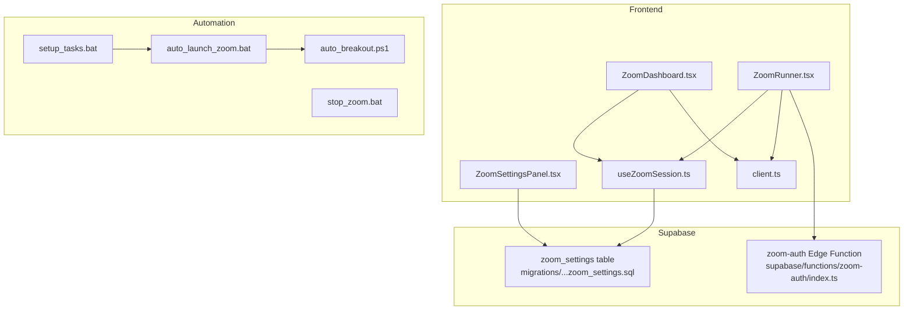
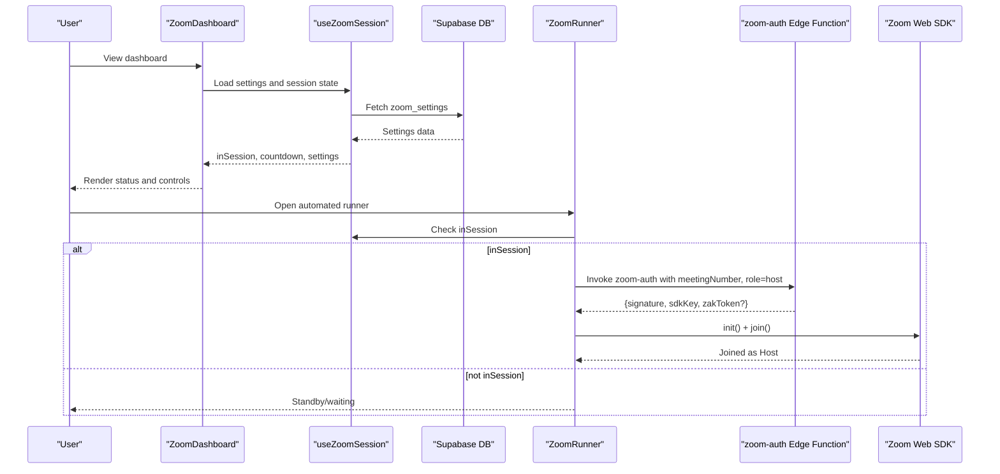
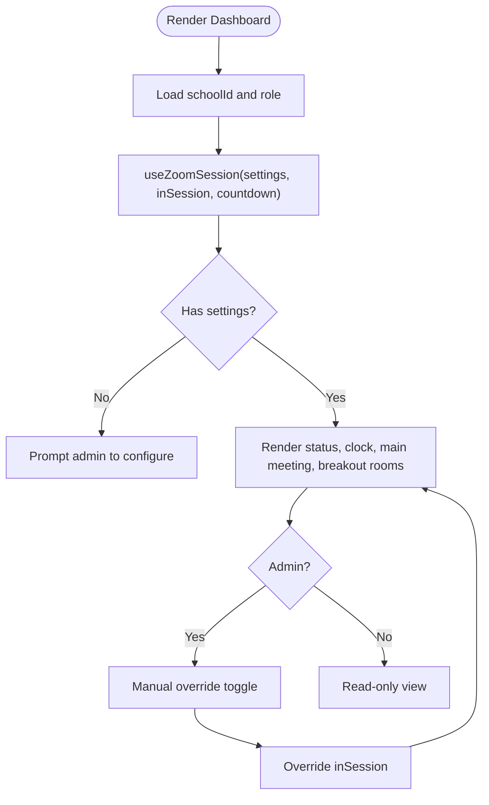
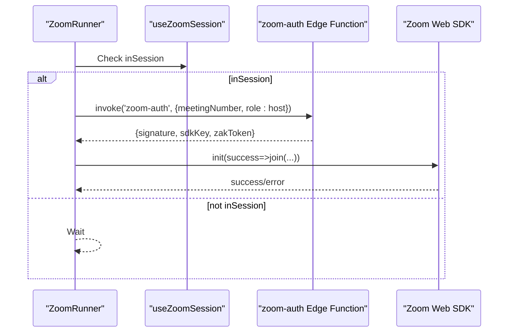
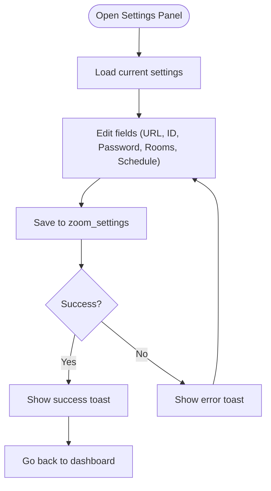
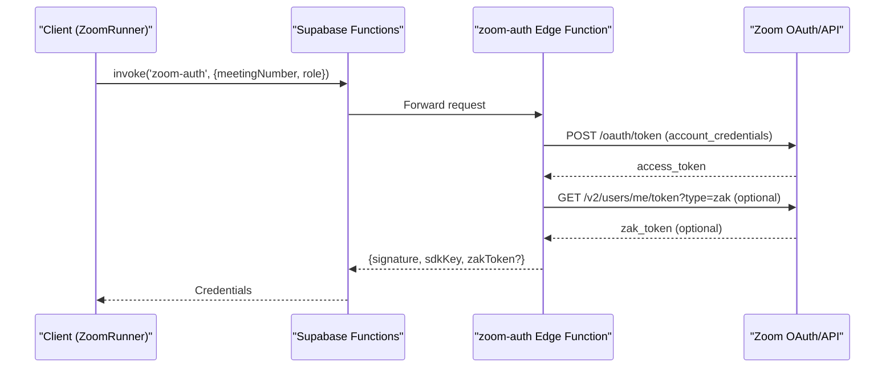
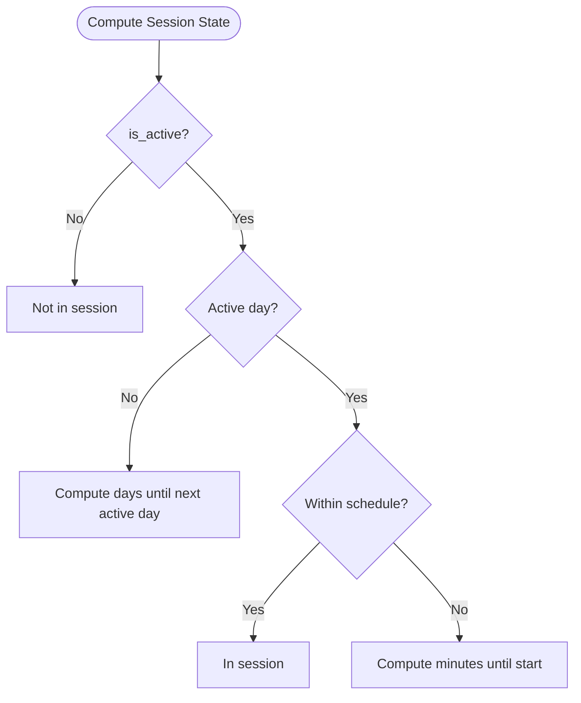
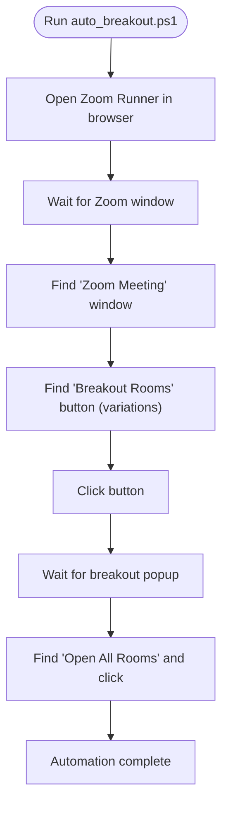
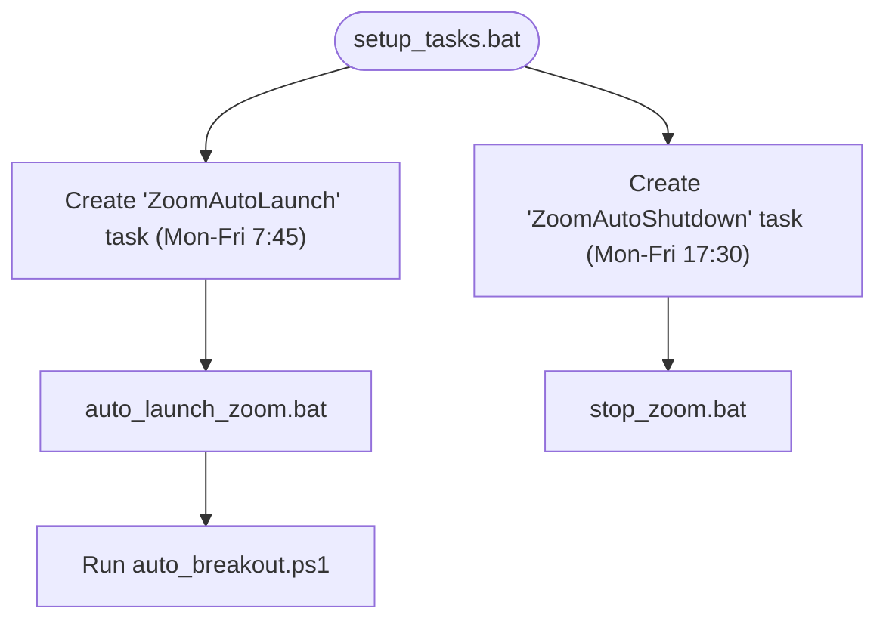
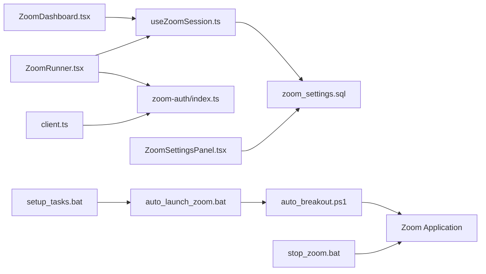

# Zoom Virtual Classroom Integration

<cite>
**Referenced Files in This Document**
- [ZoomDashboard.tsx](file://src/components/zoom/ZoomDashboard.tsx)
- [ZoomRunner.tsx](file://src/components/zoom/ZoomRunner.tsx)
- [ZoomSettingsPanel.tsx](file://src/components/zoom/ZoomSettingsPanel.tsx)
- [useZoomSession.ts](file://src/hooks/useZoomSession.ts)
- [zoom-auth/index.ts](file://supabase/functions/zoom-auth/index.ts)
- [zoom_settings.sql](file://supabase/migrations/20260207182053_fa2e94aa-a202-48af-a991-a827efc574f4.sql)
- [Index.tsx](file://src/pages/Index.tsx)
- [client.ts](file://src/integrations/supabase/client.ts)
- [.env.example](file://.env.example)
- [auto_breakout.ps1](file://bin/zoom-automation/auto_breakout.ps1)
- [auto_launch_zoom.bat](file://bin/zoom-automation/auto_launch_zoom.bat)
- [setup_tasks.bat](file://bin/zoom-automation/setup_tasks.bat)
- [stop_zoom.bat](file://bin/zoom-automation/stop_zoom.bat)
</cite>

## Table of Contents
1. [Introduction](#introduction)
2. [Project Structure](#project-structure)
3. [Core Components](#core-components)
4. [Architecture Overview](#architecture-overview)
5. [Detailed Component Analysis](#detailed-component-analysis)
6. [Dependency Analysis](#dependency-analysis)
7. [Performance Considerations](#performance-considerations)
8. [Troubleshooting Guide](#troubleshooting-guide)
9. [Conclusion](#conclusion)
10. [Appendices](#appendices)

## Introduction
This document explains the Zoom virtual classroom integration built into the portal. It covers the ZoomDashboard for real-time meeting controls, the ZoomRunner for automated host sessions, ZoomSettings configuration, OAuth and Zoom API credential flows, meeting scheduling logic, breakout room automation, batch meeting launching, and session management. It also provides setup instructions, credential configuration, troubleshooting guidance, and examples of automated workflows integrated with the academic calendar system.

## Project Structure
The Zoom integration spans React components, a Supabase Edge Function for Zoom credentials, a Supabase database table for settings, and Windows automation scripts for batch launch and shutdown.

**Diagram sources**
- [ZoomDashboard.tsx](file://src/components/zoom/ZoomDashboard.tsx#L1-L308)
- [ZoomRunner.tsx](file://src/components/zoom/ZoomRunner.tsx#L1-L207)
- [ZoomSettingsPanel.tsx](file://src/components/zoom/ZoomSettingsPanel.tsx#L1-L274)
- [useZoomSession.ts](file://src/hooks/useZoomSession.ts#L1-L113)
- [client.ts](file://src/integrations/supabase/client.ts#L1-L17)
- [zoom-auth/index.ts](file://supabase/functions/zoom-auth/index.ts#L1-L120)
- [zoom_settings.sql](file://supabase/migrations/20260207182053_fa2e94aa-a202-48af-a991-a827efc574f4.sql#L1-L51)
- [auto_breakout.ps1](file://bin/zoom-automation/auto_breakout.ps1#L1-L168)
- [auto_launch_zoom.bat](file://bin/zoom-automation/auto_launch_zoom.bat#L1-L11)
- [setup_tasks.bat](file://bin/zoom-automation/setup_tasks.bat#L1-L16)
- [stop_zoom.bat](file://bin/zoom-automation/stop_zoom.bat#L1-L6)

**Section sources**
- [ZoomDashboard.tsx](file://src/components/zoom/ZoomDashboard.tsx#L1-L308)
- [ZoomRunner.tsx](file://src/components/zoom/ZoomRunner.tsx#L1-L207)
- [ZoomSettingsPanel.tsx](file://src/components/zoom/ZoomSettingsPanel.tsx#L1-L274)
- [useZoomSession.ts](file://src/hooks/useZoomSession.ts#L1-L113)
- [client.ts](file://src/integrations/supabase/client.ts#L1-L17)
- [zoom-auth/index.ts](file://supabase/functions/zoom-auth/index.ts#L1-L120)
- [zoom_settings.sql](file://supabase/migrations/20260207182053_fa2e94aa-a202-48af-a991-a827efc574f4.sql#L1-L51)
- [auto_breakout.ps1](file://bin/zoom-automation/auto_breakout.ps1#L1-L168)
- [auto_launch_zoom.bat](file://bin/zoom-automation/auto_launch_zoom.bat#L1-L11)
- [setup_tasks.bat](file://bin/zoom-automation/setup_tasks.bat#L1-L16)
- [stop_zoom.bat](file://bin/zoom-automation/stop_zoom.bat#L1-L6)

## Core Components
- ZoomDashboard: Presents meeting status, join buttons, breakout rooms, and schedule info. Provides manual override and settings access.
- ZoomRunner: Automatically initializes the Zoom Web SDK, obtains signed credentials via the Edge Function, and joins the meeting as host.
- ZoomSettingsPanel: Admin-only configuration panel for meeting URL, ID, password, breakout rooms, schedule, and active days.
- useZoomSession: Central hook that loads settings, computes session state, and provides countdown logic.
- zoom-auth Edge Function: Generates Zoom SDK signatures and optionally ZAK tokens using account credentials.
- zoom_settings table: Stores per-school meeting configuration and schedule.
- Automation Scripts: PowerShell and batch scripts to launch/stop Zoom and open breakout rooms.

**Section sources**
- [ZoomDashboard.tsx](file://src/components/zoom/ZoomDashboard.tsx#L14-L307)
- [ZoomRunner.tsx](file://src/components/zoom/ZoomRunner.tsx#L15-L206)
- [ZoomSettingsPanel.tsx](file://src/components/zoom/ZoomSettingsPanel.tsx#L48-L273)
- [useZoomSession.ts](file://src/hooks/useZoomSession.ts#L22-L112)
- [zoom-auth/index.ts](file://supabase/functions/zoom-auth/index.ts#L81-L119)
- [zoom_settings.sql](file://supabase/migrations/20260207182053_fa2e94aa-a202-48af-a991-a827efc574f4.sql#L2-L19)

## Architecture Overview
The system integrates frontend components with Supabase for configuration and an Edge Function for Zoom credential generation. Automation scripts support batch launching and breakout room opening.

**Diagram sources**
- [ZoomDashboard.tsx](file://src/components/zoom/ZoomDashboard.tsx#L17-L307)
- [useZoomSession.ts](file://src/hooks/useZoomSession.ts#L34-L112)
- [ZoomRunner.tsx](file://src/components/zoom/ZoomRunner.tsx#L72-L126)
- [zoom-auth/index.ts](file://supabase/functions/zoom-auth/index.ts#L81-L119)

## Detailed Component Analysis

### ZoomDashboard Implementation
- Loads school context and user role.
- Uses useZoomSession to compute session state and display countdown.
- Renders main meeting controls, breakout rooms, and schedule info.
- Provides manual override to start a meeting outside schedule.
- Links to the ZoomRunner for automated host session.

**Diagram sources**
- [ZoomDashboard.tsx](file://src/components/zoom/ZoomDashboard.tsx#L14-L307)
- [useZoomSession.ts](file://src/hooks/useZoomSession.ts#L59-L102)

**Section sources**
- [ZoomDashboard.tsx](file://src/components/zoom/ZoomDashboard.tsx#L14-L307)
- [Index.tsx](file://src/pages/Index.tsx#L483-L486)

### ZoomRunner Functionality
- Dynamically loads Zoom Web SDK dependencies and initializes the SDK.
- Waits for session to become active, then invokes the zoom-auth Edge Function to obtain credentials.
- Joins the meeting as host using signature and optional ZAK token.
- Handles initialization and join errors, displays status.

**Diagram sources**
- [ZoomRunner.tsx](file://src/components/zoom/ZoomRunner.tsx#L72-L126)
- [zoom-auth/index.ts](file://supabase/functions/zoom-auth/index.ts#L81-L119)

**Section sources**
- [ZoomRunner.tsx](file://src/components/zoom/ZoomRunner.tsx#L15-L206)

### ZoomSettingsPanel and Meeting Configuration
- Admin-only panel to configure meeting URL, ID, password, breakout rooms, schedule, and active days.
- Persists settings to the zoom_settings table via Supabase.
- Enforces saving only when schoolId is present.

**Diagram sources**
- [ZoomSettingsPanel.tsx](file://src/components/zoom/ZoomSettingsPanel.tsx#L82-L119)
- [zoom_settings.sql](file://supabase/migrations/20260207182053_fa2e94aa-a202-48af-a991-a827efc574f4.sql#L2-L19)

**Section sources**
- [ZoomSettingsPanel.tsx](file://src/components/zoom/ZoomSettingsPanel.tsx#L48-L273)
- [zoom_settings.sql](file://supabase/migrations/20260207182053_fa2e94aa-a202-48af-a991-a827efc574f4.sql#L2-L19)

### OAuth Authentication Flow and Zoom API Integration
- The zoom-auth Edge Function performs account credentials OAuth to obtain an access token.
- Generates a Zoom SDK signature (JWT) for the meeting and optionally retrieves a ZAK token for host context.
- Frontend invokes the function via Supabase Functions to receive credentials.

**Diagram sources**
- [ZoomRunner.tsx](file://src/components/zoom/ZoomRunner.tsx#L86-L101)
- [zoom-auth/index.ts](file://supabase/functions/zoom-auth/index.ts#L14-L43)
- [zoom-auth/index.ts](file://supabase/functions/zoom-auth/index.ts#L46-L79)

**Section sources**
- [zoom-auth/index.ts](file://supabase/functions/zoom-auth/index.ts#L14-L79)
- [ZoomRunner.tsx](file://src/components/zoom/ZoomRunner.tsx#L86-L101)

### Meeting Scheduling Mechanisms
- useZoomSession determines if a session is currently in progress based on active days, schedule range, and UAE timezone.
- Computes a human-readable countdown to the next session start or days until next active day.

**Diagram sources**
- [useZoomSession.ts](file://src/hooks/useZoomSession.ts#L59-L102)

**Section sources**
- [useZoomSession.ts](file://src/hooks/useZoomSession.ts#L59-L102)

### Breakout Room Automation
- PowerShell script locates the Zoom Meeting window and clicks "Breakout Rooms".
- Opens the breakout rooms popup and triggers "Open All Rooms".
- Includes robust element discovery and logging for debugging.

**Diagram sources**
- [auto_breakout.ps1](file://bin/zoom-automation/auto_breakout.ps1#L1-L168)

**Section sources**
- [auto_breakout.ps1](file://bin/zoom-automation/auto_breakout.ps1#L1-L168)

### Batch Meeting Launching and Session Management
- Scheduled tasks launch Zoom at 7:45 AM and close it at 5:30 PM on weekdays.
- The launcher script runs the PowerShell automation to open breakout rooms.

**Diagram sources**
- [setup_tasks.bat](file://bin/zoom-automation/setup_tasks.bat#L4-L8)
- [auto_launch_zoom.bat](file://bin/zoom-automation/auto_launch_zoom.bat#L1-L11)
- [auto_breakout.ps1](file://bin/zoom-automation/auto_breakout.ps1#L1-L168)
- [stop_zoom.bat](file://bin/zoom-automation/stop_zoom.bat#L1-L6)

**Section sources**
- [setup_tasks.bat](file://bin/zoom-automation/setup_tasks.bat#L1-L16)
- [auto_launch_zoom.bat](file://bin/zoom-automation/auto_launch_zoom.bat#L1-L11)
- [stop_zoom.bat](file://bin/zoom-automation/stop_zoom.bat#L1-L6)

### Integration with Academic Calendar System
- The dashboard reads schedule_start, schedule_end, active_days, and timezone from zoom_settings to align with academic calendar days and times.
- The session state logic ensures meetings only start during configured hours and days.

**Section sources**
- [useZoomSession.ts](file://src/hooks/useZoomSession.ts#L59-L102)
- [zoom_settings.sql](file://supabase/migrations/20260207182053_fa2e94aa-a202-48af-a991-a827efc574f4.sql#L10-L13)

## Dependency Analysis
- Frontend components depend on Supabase client for function invocation and data fetching.
- useZoomSession depends on the zoom_settings table and local time conversion to UAE timezone.
- ZoomRunner depends on the zoom-auth Edge Function and the Zoom Web SDK.
- Automation scripts depend on Windows Task Scheduler and UI Automation to control Zoom.

**Diagram sources**
- [ZoomDashboard.tsx](file://src/components/zoom/ZoomDashboard.tsx#L1-L307)
- [ZoomRunner.tsx](file://src/components/zoom/ZoomRunner.tsx#L1-L207)
- [useZoomSession.ts](file://src/hooks/useZoomSession.ts#L1-L113)
- [zoom-auth/index.ts](file://supabase/functions/zoom-auth/index.ts#L1-L120)
- [zoom_settings.sql](file://supabase/migrations/20260207182053_fa2e94aa-a202-48af-a991-a827efc574f4.sql#L1-L51)
- [client.ts](file://src/integrations/supabase/client.ts#L1-L17)
- [auto_breakout.ps1](file://bin/zoom-automation/auto_breakout.ps1#L1-L168)
- [auto_launch_zoom.bat](file://bin/zoom-automation/auto_launch_zoom.bat#L1-L11)
- [setup_tasks.bat](file://bin/zoom-automation/setup_tasks.bat#L1-L16)
- [stop_zoom.bat](file://bin/zoom-automation/stop_zoom.bat#L1-L6)

**Section sources**
- [client.ts](file://src/integrations/supabase/client.ts#L1-L17)
- [useZoomSession.ts](file://src/hooks/useZoomSession.ts#L1-L113)
- [zoom-auth/index.ts](file://supabase/functions/zoom-auth/index.ts#L1-L120)
- [zoom_settings.sql](file://supabase/migrations/20260207182053_fa2e94aa-a202-48af-a991-a827efc574f4.sql#L1-L51)

## Performance Considerations
- SDK Initialization: Loading multiple Zoom SDK dependencies can be slow; ensure caching and preloading strategies are considered.
- Function Invocation: Minimize repeated invocations of the zoom-auth function by reusing credentials within the session lifecycle.
- UI Responsiveness: Debounce schedule computations and avoid unnecessary re-renders in the dashboard.
- Automation Reliability: The PowerShell automation relies on UI element names; slight UI changes may require updates to element detection logic.

## Troubleshooting Guide
- Zoom SDK fails to load:
  - Verify network access to Zoom CDN URLs and that the scripts are appended to the DOM.
  - Check browser console for CORS or mixed-content errors.
- Authentication failures:
  - Confirm ZOOM_CLIENT_ID, ZOOM_CLIENT_SECRET, and ZOOM_ACCOUNT_ID are set in the Edge Function environment.
  - Ensure the meetingNumber is provided and valid.
- Meeting join errors:
  - Validate meeting ID and password.
  - Confirm the meeting exists and is scheduled within the configured timeframe.
- Automation script errors:
  - Review debug logs printed by the PowerShell script for missing UI elements.
  - Adjust timing delays if the Zoom window takes longer to appear.
- Scheduled tasks not running:
  - Verify Task Scheduler permissions and that the paths in setup_tasks.bat match the actual script locations.

**Section sources**
- [ZoomRunner.tsx](file://src/components/zoom/ZoomRunner.tsx#L63-L66)
- [zoom-auth/index.ts](file://supabase/functions/zoom-auth/index.ts#L87-L89)
- [auto_breakout.ps1](file://bin/zoom-automation/auto_breakout.ps1#L36-L39)
- [setup_tasks.bat](file://bin/zoom-automation/setup_tasks.bat#L4-L8)

## Conclusion
The Zoom virtual classroom integration provides a complete solution for managing virtual classes, including configuration, scheduling, automated host sessions, breakout room automation, and batch launching. By leveraging Supabase for configuration and credential generation, and Windows automation for operational tasks, the system streamlines classroom delivery while maintaining flexibility for administrative control.

## Appendices

### Setup Procedures
- Configure environment variables:
  - Copy .env.example to .env.local and set VITE_SUPABASE_PROJECT_ID, VITE_SUPABASE_PUBLISHABLE_KEY, and VITE_SUPABASE_URL.
- Deploy Supabase Edge Function:
  - Ensure the zoom-auth function is deployed with ZOOM_CLIENT_ID, ZOOM_CLIENT_SECRET, and ZOOM_ACCOUNT_ID configured.
- Configure Zoom Settings:
  - Use the ZoomSettingsPanel to set meeting URL, ID, password, breakout rooms, schedule, and active days.
- Schedule Automation:
  - Run setup_tasks.bat to create scheduled tasks for launching and stopping Zoom on weekdays.

**Section sources**
- [.env.example](file://.env.example#L1-L9)
- [client.ts](file://src/integrations/supabase/client.ts#L5-L6)
- [zoom-auth/index.ts](file://supabase/functions/zoom-auth/index.ts#L10-L12)
- [ZoomSettingsPanel.tsx](file://src/components/zoom/ZoomSettingsPanel.tsx#L82-L119)
- [setup_tasks.bat](file://bin/zoom-automation/setup_tasks.bat#L4-L8)

### Credential Configuration
- Supabase:
  - Configure VITE_SUPABASE_URL and keys in .env.local.
- Zoom:
  - Set ZOOM_CLIENT_ID, ZOOM_CLIENT_SECRET, and ZOOM_ACCOUNT_ID in the Edge Function environment.
- ZoomRunner:
  - Uses Supabase Functions to obtain Zoom credentials securely.

**Section sources**
- [.env.example](file://.env.example#L3-L6)
- [client.ts](file://src/integrations/supabase/client.ts#L5-L6)
- [zoom-auth/index.ts](file://supabase/functions/zoom-auth/index.ts#L10-L12)
- [ZoomRunner.tsx](file://src/components/zoom/ZoomRunner.tsx#L86-L101)

### Example Automated Workflows
- Daily Launch:
  - Task Scheduler triggers auto_launch_zoom.bat at 7:45 AM, which runs auto_breakout.ps1 to open breakout rooms.
- End-of-Day Shutdown:
  - Task Scheduler triggers stop_zoom.bat at 5:30 PM to close Zoom.
- Manual Override:
  - Admins can start a meeting immediately from the dashboard when needed.

**Section sources**
- [setup_tasks.bat](file://bin/zoom-automation/setup_tasks.bat#L4-L8)
- [auto_launch_zoom.bat](file://bin/zoom-automation/auto_launch_zoom.bat#L1-L11)
- [auto_breakout.ps1](file://bin/zoom-automation/auto_breakout.ps1#L1-L168)
- [stop_zoom.bat](file://bin/zoom-automation/stop_zoom.bat#L1-L6)
- [ZoomDashboard.tsx](file://src/components/zoom/ZoomDashboard.tsx#L132-L143)